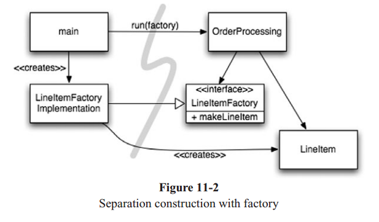

### CLEAN CODE - Robert C. Martin

#### Ch 2: Using Meaningful Names
```
1. Use Intention-Revealing Names
    It should tell you why it exists, what it does and how it is used.
2. Avoid Disinformation
	Don't name a variable accountList if it is not actually a List.
3. Make Meaningful Distinctions  
	Distinguish names in such a way that the reader knows that the differences offer.
4. Use Pronounceable Names  
	Please.
5. Use Searchable Names  
	Instead of var days = 7, perhaps use var DAYS_IN_WEEK = 7;
6. Avoid Encodings and Member Prefixes  
	Like IClassName in Interfaces. Use ClassNameImpl instead in the Implementation class.
7. Avoid Mental Mapping  
	Avoid using single letter variables.
8. Class Names  
	Should have noun / noun phrase names. Should not be a verb.
9. Method Names  
	Should have verb / verb phrase. Accessors, mutators and predicates should be prefixed with get, set, and is, according to the JavaBean standard
10. Don't Be Cute  
	Say what you mean. Mean what you say.
11. Pick One Word per Concept  
	Fetch, retrieve, get; just use one and stick to it.
12. Don't Pun  
13. Use Solution Domain Names  
	Use AccountVisitor if you are using the VISITOR pattern.
14. Use Problem Domain Names  
15. Add Meaningful Context  
	If a name belongs to an account, name it accountName instead.
16. Don't Add Gratuitous Context
```

#### Ch 3: Functions
```
1. Short  
2. Should not be large enough to hold nested structures
3. Should only do one thing. They should do it well. They should to it only.
4. Functions that do one thing cannot be reasonably divided into sections
5. One level of abstraction per function
6. Reading code from top to bottom
  1. If A calls B, B should be directly below A.
7. The ideal number of arguments for a function is 0.
8. Instead of using Flag Arguments (passing boolean into a function), split the function into two: functionIfTrue() and functionIfFalse()
9. Don't Repeat Yourself
Every function and every block within a function should only have 1 entry and 1 ext, no break or continue, and never goto.
```
#### Ch 4: Comments
```
	• Explain yourself in code instead of in comments.
	• Good Comments:
		○ Informative comments
		○ Explanation of Intent
			§ Sometimes a comment goes beyond just useful information about the implementation and provides the intent behind a decision
		○ Clarification
			§ Sometimes it is just helpful to translate the meaning of some obscure argument or return value into something that’s readable
		○ Warning of Consequences
		○ TODO Comments
		○ Amplification
		○ Javadoc in Public APIs
	• Bad Comments:
		○ Mumbling
		○ Redundant Comments
		○ Misleading Comments
		○ Mandated Comments
		○ Journal Comments
		○ Noise Comments
		○ Position Markers
			§ // Actions ////////////
		○ Commented-Out Code
			§ Use source code control instead
		○ Not obvious Connection
		○ Javadoc in Non-Public APIs
```
#### Ch 5: Formatting
```
	• Vertical Openness Between Concepts
		○ Blank line between different concepts
	• Vertical Density
		○ Tightly related codes should appear vertically close
	• Variable Declarations
		○ Variables should be declared as close to their usage as possible
	• Instance variable
		○ Should be declared on top of the class
	• Depended Functions
		○ Caller should be above the called
	• Indentation
```

#### Ch 6: Objects and Data Structures
```
	• Data Abstraction
		○ Hide implementations (a.k.a abstraction)
		○ Variables are private
		○ Getters and Setters are public
	• Data/Object Anti-Symmetry
		○ Objects hide their data behind abstractions and expose functions that operate on that data
		○ Data structure expose their data and have no meaningful functions
		○ They are virtual opposites
	• Law of Demeter (Principle of Least Knowledge)
		○ An object should not expose its internal structure through accessors
		○ The following code3 appears to violate the Law of Demeter (among other things) because it calls the getScratchDir() function on the return value of getOptions() and then calls getAbsolutePath() on the return value of getScratchDir().

		final String outputDir = ctxt.getOptions().getScratchDir().getAbsolutePath();

		○ JavaBean standard
			§ All properties private
			§ A public, no-argument constructor
			§ Implements Serializable
		○ Data Transfer Objects
			§ The quintessential form of a data structure is a class with public variables and no functions
			§ DTOs are very useful when communicating with databases
			§ They often become the first in a series of translation stages that convert raw data in a database into objects in the application code
```
#### Ch 7: Error Handling
```
	• Use Exceptions instead of Return Codes
	• Use Unchecked Exceptions
	• Do Not Return Null
	• Do Not Pass Null
```
#### Ch 9: Unit Tests
```
	• Three Laws of TDD:
		○ You may not write production code until you have written a failing unit test
		○ You may not write more of a unit test than is sufficient to fail, and not compiling is failing
		○ You may not write production code than is sufficient to pass the currently failing test
	• Keep Tests Clean
	• Single Concept Per Test
	• (No need to strictly follow) One Assert Per Test
	• F.I.R.S.T
	• FAST. Tests have to be fast otherwise no one would run them
	• INDEPENDENT. Tests should not depend on the result of another test
	• REPEATABLE. Repeatable in any environment
	• SELF-VALIDATING. Should have a boolean output, either pass or fail.
	• TIMELY.  Unit tests should be written just before the production code that makes them pass
```
#### Ch 10: Classes
	• We prefer to keep our variables and utility functions private, but sometimes we need to set them as protected so that it can be accessed by a test
	• Should be small
	• Single Responsibility Principle (every module or class should have responsibility over a single part of the functionality provided by the software, and that responsibility should be entirely encapsulated by the class)
	• Cohesion
		○ Classes should have a small number of instance variables
		○ Each of the methods of a class should manipulate one or more of those variables
		○ The more variables a method manipulates the more cohesive that method is to its class.
		○ Maintaining cohesion results in many smaller classes
			§ Gives our program a much better organization and more transparent

#### Ch 11: Systems

```
	• Separation of concerns
		○ Software systems should separate the startup process, when the application objects are constructed and the dependencies are “wired” together, from the runtime logic that takes over after startup.
	• Separation of Main
		○ One way to separate construction from use is simply to move all aspects of construction to main, or modules called by main, and to design the rest of the system assuming that all objects have been constructed and wired up appropriately.
		○ The main function builds the objects necessary for the system, then passes them to the application, which simply uses them.
```

```
	• Separation of Factory
		○ The building a LineItem capability is only being held by LineItemFactoryImplementation class. (Notice that the Implementation class is on the Main side).
		○ However, the application is in control of when to create a LineItem instance
```

```
	• Dependency Injection
		○ Good way to separate construction and decoupling (Inversion of Control (IOC) of dependency management)
		○ In the context of dependency management and the Single Responsibility Principle, an object should not take responsibilities for instantiating dependencies itself
		○ Instead, another "authoritative" mechanism should do this. (Thereby, inverting the control)
		○ Since setup is a global concern, normally the "main" routine does this, or another special-purpose container.
		○ The Spring Framework provides the best known DI container for Java.
		○ You define which objects to wire together in an XML configuration file, then you ask for particular objects by name in Java code.

	• Scaling Up
		○ If you can write your application's domain logic using POJOs, decoupled from any architecture concerns at the code level, then it is possible to test drive your architecture.
		○ An optimal system architecture consists of modularized domains of concern, each of which is implemented with Plain Old Java (or other) Objects. The different domains are integrated together with minimally invasive Aspects or Aspect-like tools. This architecture can be test-driven, just like the code.
	• Domain-Specific Languages (DSLs), when used effectively and appropriately, raise the abstraction level above code idioms and design patterns. They allow the developer to reveal the intent of the code at the appropriate level of abstraction.
	• Conclusion
		○ Invasive architecture overwhelms the domain logic and impacts agility.
		○ When domain logic is obscured, quality suffers because it is harder to find bugs and to implement stories
		○ When agility is compromised, productivity suffers and benefits of TDD are lost.
		○ At all levels of abstraction, the intent should be clear.
			§ -> Write POJOs and use aspect-like mechanisms to incorporate other implementation concerns non-invasively.
		○ Never forget to use the simplest thing that can possibly work.
```
#### Ch12: Emergence

    • A design is "simple" if it follows these 4 rules (in order of importance):
		1. Runs all the tests
			i. Making our systems testable pushes us toward a design where our classes are small and do a single purpose.
			ii. Easier to test classes that conform to the Single Responsibility Principle (SRP)
			iii. Easier to test classes that are decoupled (We use more principles like DIP and tools like Dependency Injection, interfaces and abstraction to minimize coupling)
			iv. Writing tests leads to better designs
		2. Contains no duplication
			i. Duplication represents additional work, additional risk, and additional unnecessary complexity.
		3. Expresses the intent of the programmer
			i. Choose good names
			ii. Keep functions and classes small
			iii. Use standard nomenclatures (Design patterns, such as Command or Visitor)
		4. Minimizes the number of classes and methods

#### Ch13: Concurrency
```
  • Concurrency is a decoupling strategy that decouples what gets done from when it gets done.
  • In single-threaded applications, these are strongly coupled that the state of the entire application can be determined by looking at the stack backtrace.
  • Design of the system structure will change when you are writing concurrent programs
  • Concurrency incurs some overhead both in performance and writing additional code.
  • It is hard to implement concurrency correctly.
Concurrency Defense Principles
  • Single Responsibility Principle
		○ Keep your concurrency-related code separate from other code.
  • Limit the Scope of Data
		○ To protect a critical section in the code that uses shared object, use the keyword synchronized.
		○ However, we have to limit the number of such sections to minimize error
  • Use Copies of Data
		○ In cases where it is possible to copy objects and treat them as read-only.
		○ Or copy objects, collect results from multiple threads and merge the results in a single thread.
  • Threads Should Be as Independent as Possible
```
**Some keywords**:


```
Execution Models
	• Producer-Consumer
		○ Producer threads create work and place it in a queue. Consumer threads acquire work from the queue and complete it.
		○ The queue is a bound resource.
	• Readers-Writers
		○ A shared resource that primarily serves as a source of information for readers, but is occasionally updated by writers causes throughput issues.
		○ Challenge: to balance the needs of both readers and writers to satisfy correct operations, provide reasonable throughput and avoiding starvation.
	• Dining Philosophers
		○ Combinations of Deadlock, Livelock, and throughput and efficiency degradation
Dangers of Dependencies between Synchronized Methods
	• Avoid using more than 1 method on a shared object
	• At times where you NEED to use more than 1 method on a shared object:
		○ Client-based locking: Have the client lock the server before calling the first method and make sure the lock's extent includes code calling the last method.
		○ Server-based locking: Within the server create a method that locks the server, calls all the methods, and then unlocks. Have the client call the new method.
		○ Adapted Server: Create an intermediary that performs the locking.
	• Keep Synchronized Section as Small as Possible
	• Write tests that have the potential to expose problems and then run them frequently, with different programmatic configurations and system configurations and load. If tests ever fail, track down the failure. Don’t ignore a failure just because the tests pass on a subsequent run.
	• Test your non-threaded codes first.
	• Make Threaded Code Pluggable
		○ Write concurrency-supporting code such that it can be run on several configurations:
			§ One thread, several threads, varied as it executes
			§ Threaded code interacts with something that can be both real or test double
			§ Execute with test doubles that run quickly, slowly, varied.
			§ Configure tests so that they can run a number of iterations.
	• Make Threaded Code Tuneable
		○ To get the right balance of threads typically requires trial and error.
```

#### Ch 14: Successive Refinement
```
• Continuously keep your code simple and clean.
• Use TDD to ensure that code refactoring doesn't break the code.
```
#### Ch 15: Junit & Ch 16: Refactoring SerialDate
	• See book for details
#### Ch 17: Smells & Heuristics
Comments
	1. Inappropriate Information (e.g. authors, last-modified-date, etc)
		• Comments should be reserved for technical notes about the code and design
	2. Obsolete Comment
	3. Redundant Comment
	4. Poorly Written Comment
	5. Commented-Out Code
Environment
	1. Build Requires More Than One Step
		• You should be able to check out the system with one simple command, and then issue one other simple command to build it.
	2. Tests Require More Than One Step
		• You should be able to run all the unit tests with just one command.
Functions
	1. Too Many Arguments
		• Functions should have a small number of arguments. No argument is best.
	2. Output Arguments
		• If your function must change the state of something, have it change the state of the object it is called on.
	3. Flag Arguments
		• Boolean arguments loudly declare that the function does more than one thing.
		• They should be eliminated
	4. Dead Function
		• Delete methods that are never called.
General
	1. Multiple Languages in One Source File
		• Just… no.
	2. Obvious Behaviour Is Unimplemented
		• Any function/class should implement the behaviours that another programmer could reasonably expect.
		• Also known as Principle of Least Surprises
	3. Incorrect Behaviour at the Boundaries
		• Look for every corner cases and write a test for it
	4. Overridden Safeties
		• Don't turn off failing tests.
	5. Duplication
		• Don't Repeat Yourself
		• Every time you see duplication, it represents a missed opportunity for abstraction.
	6. Code at Wrong Level of Abstraction
		• Create abstractions that separate higher level general concepts from lower level detailed concepts.
	7. Base Classes Depending on Their Derivatives
		• Wrong. Base classes should know nothing about their derivatives.
		• In general, we deploy derivatives and bases in different JAR files.
	8. Too Much Information
		• Limit what gets exposed at the interfaces of their classes and modules.
		• Keep interfaces very tight and very small. This will limit coupling.
	9. Dead Code
		• Remove dead code. Bury it. Cremate it.
	10. Vertical Separation
		• Variables and functions should be defined close to where they are used.
	11. Inconsistency
		• Be consistent with naming, variable functions.
	12. Clutter
		•  
	13. Artificial Coupling
		• e.g. since static functions can't be referenced by non-static elements, don't make functions static where it doesn't need to be
	14. Feature Envy
		• The methods of a class should only be interested in the variables and functions of the class they belong to, not those of other classes.
		Instead of:


Refactor it this way:


	15. Selector Arguments
		• Having boolean type arguments is confusing
	16. Obscured Intent
		• Make sure your code is easily understandable by readers.
	17. Misplaced Responsibility
		• Functions/constants should be declared at places that does not violate the principle of least surprise.
	18. Inappropriate Static
		• In general you should prefer non-static methods to static methods. If you really want a function to be static, make sure there is no chance that you'll want it to behave polymorphically.
	19. Use Explanatory Variables
	20. Function Names Should Say What They Do
		• Be verbose but succinct
	21. Understand the Algorithm
		• Make sure you understand how a function works. It is not good enough that it passes all the tests.
		• Often the best way to gain this knowledge and understanding is to refactor the function into something that is so clean and expressive that it is obvious how it works.
	22. Make Logical Dependencies Physical
		• It should explicitly ask the depended module for all the information it depends upon.
	23. Prefer Polymorphism to If/Else or Switch/Case
	24. Follow Standard Conventions
	25. Replace Magic Numbers with Named Constants
	26. Be Precise
		• Ambiguities and imprecision in code are either a result of disagreements or laziness. Eliminate them
	27. Structure over Convention
		• e.g. switch cases with nicely named enumerations are inferior to base classes with abstract methods. (base classes enforce that concrete classes have all abstract methods implemented)
	28. Encapsulate Conditionals
		• Boolean logic is hard to understand without having to see it in context of an if statement. Extract functions that explain the intent of the conditional
	29. Avoid Negative Conditionals
		• If (please.doThis()) instead of if (!please.notDoThis())
	30. Functions Should Do One Thing
		• Many, smaller functions are better than one, big function
	31. Hidden Temporal Couplings
		• When the order of execution is important, try to make it such that the second function takes in the result of the first function as an argument
		• Might increase the complexity of the functions. Use with care
	32. Don't Be Arbitrary
		• Have a reason for the way you structure your code, and make sure that reason is communicated by the structure of the code.
	33. Encapsulate Boundary Conditions
	34. Functions Should Descend Only One Level of Abstraction
	35. Keep Configurable Data at High Levels
		• Like in arguments, or config files for example
	36. Avoid Transitive Navigation
		• If A collaborates with B, and B collaborates with C, we don't want modules that use A to know about C. (e.g. a.getB().getC().doSomething())
Java
	1. Avoid Long Import Lists. Use Wildcards Instead.
	2. Don't Inherit Constants
		• Use static import for this case
	3. Use Enums instead of Constants Where Applicable
Names
	1. Choose Descriptive Names
	2. Choose Names at the Appropriate Level of Abstraction
	3. Use Standard Nomenclature Where Possible
		• e.g. If you're using the Decorate Pattern, use the word 'Decorator' in the decorating classes' names
	4. Choose Unambiguous Names
		• It is better for names to be lengthy than to be wrong
	5. Use Long Names for Long Scopes
		• Variable names like I and j are just fine if their scope is just a few lines long
	6. Avoid Encodings
		• Prefixes such as m_ or f are useless in today's environments.
	7. Names Should Describe Side-Effects
		• Names should describe everything that a function, variable or class is or does.
Tests
	1. Insufficient Tests
		• A test suite should test everything that could possibly break.
	2. Use a Coverage Tool
		• Coverage tools report gaps in your testing strategy.
		• IDEs can catch mistakes in compile/running time.
	3. Don't Skip Trivial Tests
	4. An Ignored Test Is A Question about an Ambiguity
		• Sometimes we are uncertain about a behavioural detail because the requirements are unclear
		• We can annotate using @Ignore in the test
	5. Test Boundary Conditions (Corner Cases)
	6. Exhaustively Test Nearby Bugs
		• Bugs tend to congregate. When you find a bug in a function, do an exhaustive test of that function
	7. Patterns of Failure Are Revealing
		• Sometimes you can diagnose a problem by finding patterns in the way test cases fail
	8. Test Coverage Patterns Can Be Revealing
	9. Tests Should Be Fast
