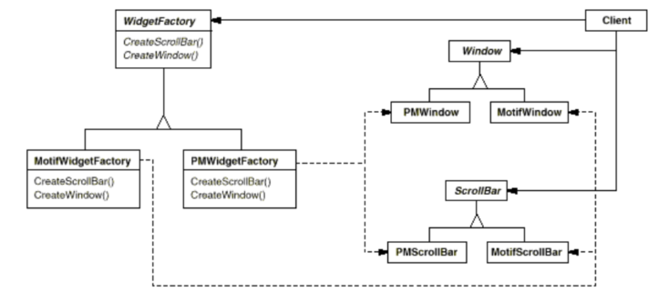
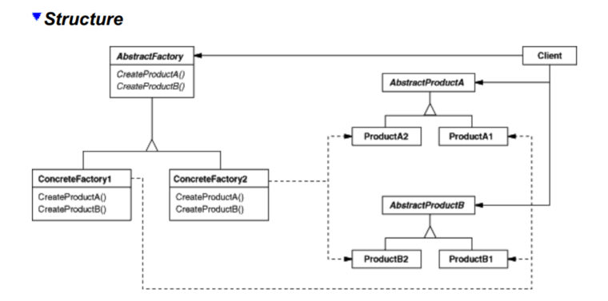

### Abstract Factory
#### Intent
Provide an interface for creating families of *related* or *dependent objects* without specifying their concrete classes.

#### Motivation
Consider a user interface toolkit that supports multiple look-and-feel standards. Different look-and-feels define different appearances and behaviors for user interface widgets, such as scroll bars, windows and buttons. To be portable across look-and-feel standards, an app should not hardcode its widgets for a particular look and feel.

We can solve this problem by defining an abstract WidgetFactory class that declares an interface for creating each basic kind of widget. There's also an abstract class for each kind of widget, and concrete subclasses implement widgets for specific look-and-feel standards.  
WidgetFactory's interface has an operation that returns a new widget object for each abstract widget class. Clients call these operations to obtain widget instances, but clients aren't aware of the concrete classes they're using.

There is a concrete subclass for EACH look and feel standard. Each subclass implements the operations to create the appropriate widget for that particular look and feel.

For example, the CreateScrollBar operation on the MotifWidgetFactory instantiates and returns a Motif scroll bar, while the corresponding operation on the PMWidgetFactory returns a scroll bar for Presentation Manager.

Clients create widgets solely through the WidgetFactory interface and they have no knowledge of the classes that implement widgets for a particular look and feel.
Clients only have to commit to an interface defined by an abstract class and not a particular concrete class.

WidgetFactory also enforces dependencies between concrete widget classes. A Motif scroll bar should be used with a Motif button and a Motif text editor. That constraint is automatically enforced as a consequence of using a MotifWidgetFactory.

#### When to use
* When a system should be independent of how its products are created, composed and represented
* When a system should be configured with one of multiple families of products
* When a family of related product objects is designed to be used together and there is a constraint to be enforced
* When you want to provide a class library of products, and you want to reveal just their interfaces, not their implementations.

#### Structure

#### Participants
* *AbstractFactory* (WidgetFactory)
  * declares an **interface** for operations that create abstract product objects.
* *ConcreteFactory* (MotifWidgetFactory, PMWidgetFactory)
  * **implements** the operations to create concrete product objects.
* *AbstractProduct* (Window, ScrollBar)
  * declares an interface for a type of product object.
* *ConcreteProduct* (MotifWindow, MotifScrollBar)
  * defines a product object to be created by the corresponding concrete factory.
  * **implements** the AbstractProduct interface.
* *Client*
  * uses only interfaces declared by **AbstractFactory** and **AbstractProduct** classes.

#### Collaborations
* Normally a single instance of a ConcreteFactory class is created at run-time.
* To create different product objects, clients should use a different concrete factory.
* AbstractFactory defers creation of product objects to its ConcreteFactory subclass.

#### Consequences
1. *It isolates concrete classes*. Abstract Factory pattern helps you control the classes of objects that an application creates. A factory encapsulates the responsibility and the process of creating product objects, it isolates clients from implementation classes.

2. *It makes exchanging product families easy*. The class of a concrete factory appears only once in an application, which is when it is instantiated. This makes it easy to change the concrete factory an application uses. It can use different product configurations simply by changing the concrete factory.

3. *It promotes consistency among products*. When product objects in a family are designed to work together, it's important that an application use objects from only one family at a time. AbstractFactory makes this easy to enforce.

4. *Supporting new kinds of products is difficult*. Extending abstract factories to produce new kinds of Products is not easy. That is because the AbstractFactory interface fixes the set of products that can be created. Supporting new products requires extending the factory interface, which involves changing the AbstractFactory class and all of its subclasses.  
We discuss one solution to this problem in the Implementation section.

#### Implementation
1. *Factories as singletons*. An application typically needs only one instance of a ConcreteFactory per product family. So it's usually best implemented as a **Singleton**.
2. *Creating the products*. AbstractFactory only declares an *interface* for creating products. It's up to ConcreteProduct subclasses to actually create them.  
  - The most common way to do this is to define a Factory Method for each product. A concrete factory will specify its products by overriding the factory method for each.  
**Note**: While this implementation is simple, it requires a new concrete factory subclass for each product family.  
  - If there are many product families, the concrete family can be implemented using the **Prototype** pattern.
The concrete factory is initialized with a prototypical instance of each product in the family, and it creates a new product by cloning its prototype.  
**Note:** The Prototype-based approach eliminates the need for a new concrete factory class for each new product family.
3. *Defining extensible factories*. AbstractFactory usually defines a different operation for each kind of product it can produce. The kinds of products are encoded in the operation signatures.  
Adding a new kind of product requires changing the AbstractFactory interface and ALL the classes that depend on it.  
A more flexible but less safe design is to add a parameter to operations that create objects. This parameter could be a class identifier, an integer, a string, etc. With this approach, AbstractFactory only needs a single "make" operation with a parameter indicating the kind of object to create.

#### Sample Code - on book.

#### Related Patterns
AbstractFactory classes are often implemented with **Factory Methods**, but they can also be implemented using **Prototype**. A concrete factory is often a **Singleton**.
