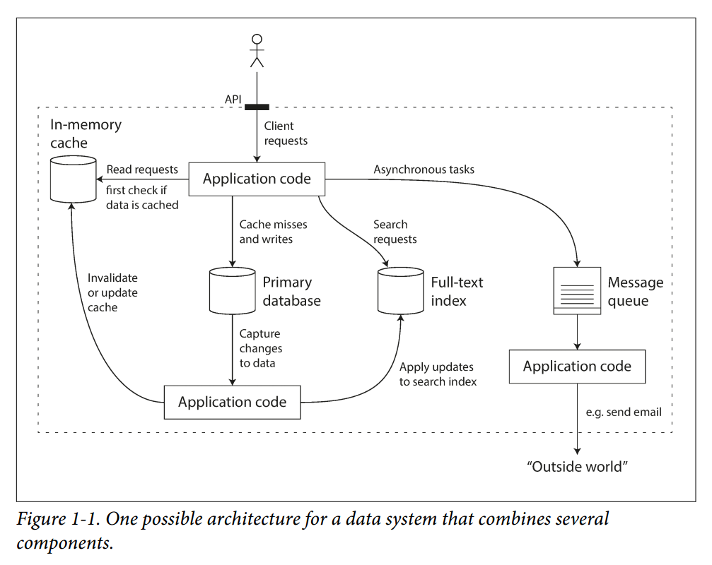
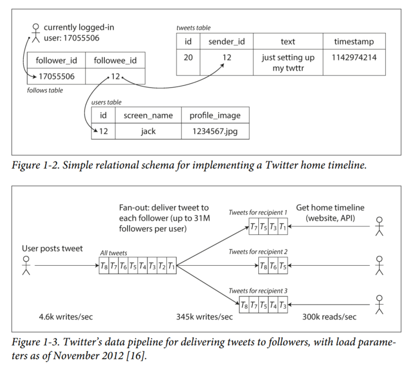

# Chapter 1: Reliable, Scalable, and Maintainable Applications

A data-intensive application is typically built from standard building blocks that provide commonly needed functionality. Many applications need to:
- Store data, so that they can find it again later (databases)
- Remember the result of an expensive operation, to speed up reads (caches)
- Allow users to search data by keyword or filter it in various ways (search indexes)
- Send a message to another process, to be handled asynchronously (stream processing)
- Periodically crunch a large amount of accumulated data (batch processing)

### Thinking About Data Systems
We typically think of databases, queues, caches, etc. as being very different categories of tools. Although a database and a message queue have some superficial similarity — both store data for some time—they have very different access patterns, which means different performance characteristics, and thus very different implementations.

**So why should we lump them all together under an umbrella term like *data systems*?**

Many new tools for data storage and processing have emerged in recent years. *They are optimized for a variety of different use cases, and they no longer neatly fit into traditional categories*. For example, there are datastores that are also used as message queues (Redis), and there are message queues with database-like durability guarantees (Apache Kafka). The boundaries between the categories are becoming blurred.

Secondly, *increasingly many applications now have such demanding or wide-ranging requirements that a single tool can no longer meet all of its data processing and storage needs*. Instead, the work is broken down into tasks that can be performed efficiently on a single tool, and those different tools are stitched together using application code.

For example, if you have an application-managed caching layer (using Memcached or similar), or a full-text search server (such as Elasticsearch or Solr) separate from your main database, it is normally the application code’s responsibility to keep those caches and indexes in sync with the main database. Figure 1-1 gives a glimpse of what this may look like (we will go into detail in later chapters).



Three concerns that are important in most software systems:
1. Reliability  
The system should continue to work correctly (performing the correct function at the desired level of performance) even in the face of adversity (hardware or software faults, and even human error).

2. Scalability  
As the system grows (in data volume, traffic volume, or complexity), there should be reasonable ways of dealing with that growth.

3. Maintainability  
Over time, many different people will work on the system (engineering and operations, both maintaining current behavior and adapting the system to new use cases), and they should all be able to work on it productively.

## Reliability
*The software should continue to work correctly, even when things go wrong*

A fault is usually defined as one component of the system deviating from its spec, whereas a failure is when the system as a whole stops providing the required service to the user.

### Hardware Faults
Our first response is usually to add redundancy to the individual hardware components to reduce the failure rate of a system. Disks may be set up in a RAID configuration, servers may have dual power supplies and hot-swappable CPUs, and datacenters may have batteries and diesel generators for backup power. When one component dies, the redundant component can take its place while the broken component is replaced.

There is a move toward systems that can tolerate the loss of entire machines, by using software fault-tolerance techniques. Such systems also have operational advantages: a single-server system requires planned downtime if you need to reboot the machine (to apply operating system security patches, for example), whereas a system that can tolerate machine failure can be patched one node at a time, without downtime of the entire system.

### Software Errors
There is no quick solution to the problem of systematic faults in software. Lots of small things can help: carefully thinking about assumptions and interactions in the system; thorough testing; process isolation; allowing processes to crash and restart; measuring, monitoring, and analyzing system behavior in production. If a system is expected to provide some guarantee (for example, in a message queue, that the number of incoming messages equals the number of outgoing messages), it can constantly check itself while it is running and raise an alert if a discrepancy is found.

### Human Errors
How do we make our systems reliable, in spite of unreliable humans? The best systems combine several approaches:
- Design systems in a way that minimizes opportunities for error. For example, well-designed abstractions, APIs, and admin interfaces make it easy to do “the right thing” and discourage “the wrong thing.” However, if the interfaces are too restrictive people will work around them, negating their benefit, so this is a tricky balance to get right.
- Decouple the places where people make the most mistakes from the places where they can cause failures. In particular, provide fully featured non-production sandbox environments where people can explore and experiment safely, using real data, without affecting real users.
- Test thoroughly at all levels, from unit tests to whole-system integration tests and manual tests. Automated testing is widely used, well understood, and especially valuable for covering corner cases that rarely arise in normal operation.
- Allow quick and easy recovery from human errors, to minimize the impact in the case of a failure. For example, make it fast to roll back configuration changes, roll out new code gradually (so that any unexpected bugs affect only a small subset of users), and provide tools to recompute data (in case it turns out that the old computation was incorrect).
- Set up detailed and clear monitoring, such as performance metrics and error rates. In other engineering disciplines this is referred to as telemetry.  Monitoring can show us early warning signals and allow us to check whether any assumptions or constraints are being violated. When a problem occurs, metrics can be invaluable in diagnosing the issue.
- Implement good management practices and training — a complex and important aspect, and beyond the scope of this book.

### How Important Is Reliability?
Bugs in business
applications cause lost productivity (and legal risks if figures are reported incorrectly), and outages of ecommerce sites can have huge costs in terms of lost revenue and damage to reputation.
Be careful when we may choose to sacrifice reliability to reduce development cost or operational cost.

## Scalability
Consider questions like "if the system grows in a particular way, what are our options for coping with growth?" and "how can we add computing resources to handle the additional load?"

### Describing Load
We can use parameters like:
- requests per second to a web server
- ratio of reads to writes in a database
- number of simultaneously active users
- hit rate of a cache, etc.

Using Twitter as an example, two of their main operations are:
1. Post tweet:  
A user can publish a new message to their followers (4.6k requests/sec on average, >12k requests/sec at peak)
2. Home timeline  
A user can view tweets posted by the people they follow (300k requests/sec)

Twitter's scaling challenge is due to fan-out, where each user follows many people, and each user is followed by many people. There are broadly 2 ways of implementing these two operations:

1. Posting a tweet simply inserts the new tweet into a global collection of tweets. When a user requests their home timeline, look up all the people they follow, find all the tweets for each of those users, and merge them (sorted by time). In a RDBMS, the query could be like:
```
SELECT tweets.*, users.*, FROM tweets
  JOIN users     ON tweets.sender_id      = users.id
  JOIN follows   ON follows.followee_id   = users.id
  WHERE follows.follower_id = current_user
```

2. Maintain a cache for each user's home timeline - like a mailbox of tweets for each recipient user. When a user posts a tweet, look up all the people who follow that user, and insert the new tweet into each of their home timeline caches. The request to read the home timeline is then cheap, because its result has been computed ahead of time.



Twitter switched to approach 2 because in this case, it is preferable to do more work at write time and less at read time.

However, the downside of approach 2 is that posting a tweet now requires a lot of extra work. The number of followers per user varies wildly (some people have over 30 million followers, which means 1 single tweet may result in over 30 million writes to home timelines).

Twitter is now moving to a hybrid approach. Most users will use approach 2, while people with a lot of followers use approach 1.

### Describing Performance
Once you have described the load on your system, you can now investigate what happens when the load increases.

1. When you increase a load parameter and keep the system resources unchanged, how is the performance of your system affected?
2. When you increase a load parameter, how much do you need to increase the resources to keep performance unchanged?

In a batch processing system like Hadoop, we usually care about *throughput* - the number of records we can process per second, or the total time it takes to run a job on a dataset of a certain size.

In online systems, we usually care more about service's response time.

Instead of using average, use percentiles to get a better gauge. Queuing delays often account for a large part of the response time at high percentiles. As a server can only process a small number of things in parallel, it only takes a small number of slow requests to hold up the processing of subsequent requests. Thus, it is important to measure response times on the client side.

### Approaches for Coping with Load
How do we maintain good performance even when our load parameters increase?

In reality, good architectures usually involve a pragmatic mixture of approaches: for example, using several fairly powerful machines can still be simpler and cheaper than a large number of small virtual machines.

Some systems are elastic, meaning that they can automatically add computing resources when they detect a load increase, whereas other systems are scaled manually (a human analyzes the capacity and decides to add more machines to the system). An elastic system can be useful if load is highly unpredictable, but manually scaled systems are simpler and may have fewer operational surprises.

An architecture that scales well for a particular application is built around assumptions of which operations will be common and which will be rare—the load parameters.

## Maintainability
We will pay particular attention to three design principles for software
systems:
1. Operability  
Make it easy for operations teams to keep the system running smoothly.

2. Simplicity  
Make it easy for new engineers to understand the system, by removing as much complexity as possible from the system. (Note this is not the same as simplicity of the user interface.)

3. Evolvability  
Make it easy for engineers to make changes to the system in the future, adapting it for unanticipated use cases as requirements change. Also known as extensibility, modifiability, or plasticity.

### Operability: Making Life Easy for Operations
A good operations team is typically responsible for the following:

- Monitoring the health of the system and quickly restoring service if it goes into a
bad state
- Tracking down the cause of problems, such as system failures or degraded performance
- Keeping software and platforms up to date, including security patches
- Keeping tabs on how different systems affect each other, so that a problematic change can be avoided before it causes damage
- Anticipating future problems and solving them before they occur (e.g., capacity
planning)
- Establishing good practices and tools for deployment, configuration management, and more
- Performing complex maintenance tasks, such as moving an application from one platform to another
- Maintaining the security of the system as configuration changes are made
- Defining processes that make operations predictable and help keep the production environment stable
- Preserving the organization’s knowledge about the system, even as individual
people come and go

Good operability means making routine tasks easy, allowing the operations team to focus their efforts on high-value activities. Data systems can do various things to make routine tasks easy, like:

- Providing visibility into the runtime behavior and internals of the system, with
good monitoring
- Providing good support for automation and integration with standard tools
- Avoiding dependency on individual machines (allowing machines to be taken down for maintenance while the system as a whole continues running uninterrupted)
- Providing good documentation and an easy-to-understand operational model (“If I do X, Y will happen”)
- Providing good default behavior, but also giving administrators the freedom to override defaults when needed
- Self-healing where appropriate, but also giving administrators manual control over the system state when needed
- Exhibiting predictable behavior, minimizing surprises

### Simplicity: Managing Complexity
There are various possible symptoms of complexity: explosion of the state space, tight coupling of modules, tangled dependencies, inconsistent naming and terminology, hacks aimed at solving performance problems, special-casing to work around issues elsewhere, and many more.

In complex software, there is a greater risk of introducing bugs when making a change. Reducing complexity greatly improves the maintainability of a software.

One of the best tools we have for removing accidental complexity is *abstraction*. A good abstraction can hide implementation detail behind a clean facade. It also makes code reusable, and leads to a higher quality software.

### Evolvability: Making Change Easy
To help with the changing system requirements, Agile working patterns provide a framework for adapting to change, and provide helpful technical tools and patterns, such as TDD and refactoring.

The ease with which you can modify a data system and adapt it to changing requirements is closely linked to its simplicity and its abstractions.

## Summary
- Reliability means making systems work correctly, even when faults occur. Faults can be in hardware (typically random and uncorrelated), software (bugs are typically systematic and hard to deal with), and humans (who inevitably make mistakes from time to time). Fault-tolerance techniques can hide certain types of faults from the end user.

- Scalability means having strategies for keeping performance good, even when load increases. In order to discuss scalability, we first need ways of describing load and performance quantitatively. We briefly looked at Twitter’s home timelines as an example of describing load, and response time percentiles as a way of measuring performance. In a scalable system, you can add processing capacity in order to remain reliable under high load.

- Maintainability has many facets, but in essence it’s about making life better for the engineering and operations teams who need to work with the system. Good abstractions can help reduce complexity and make the system easier to modify and adapt for new use cases. Good operability means having good visibility into the system’s health, and having effective ways of managing it.
