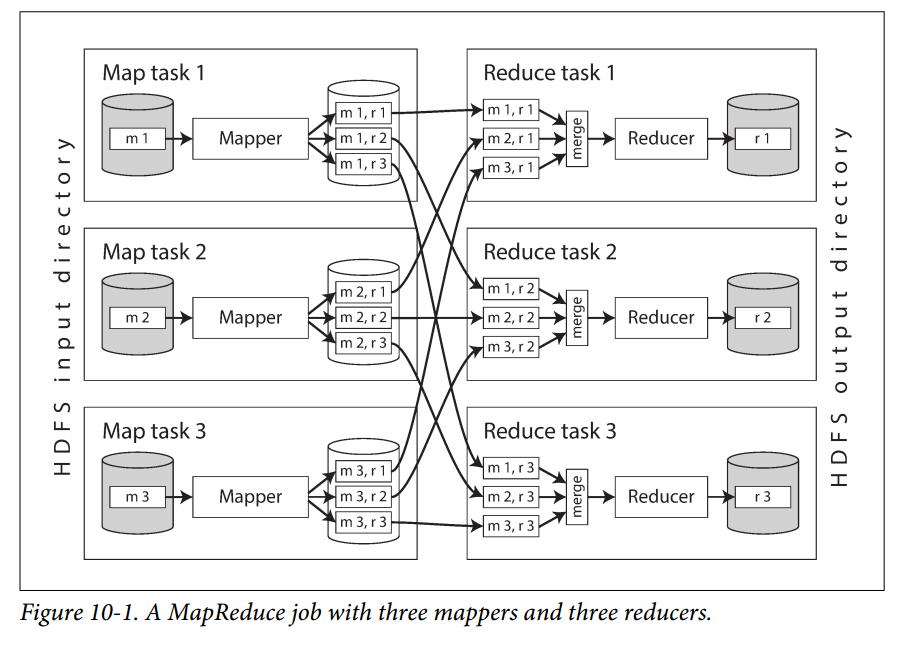
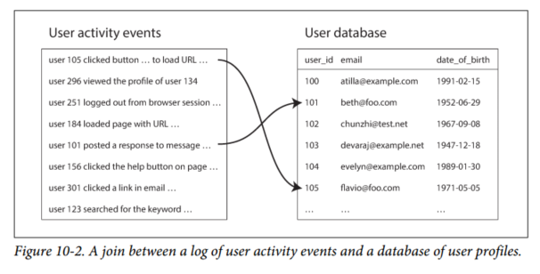
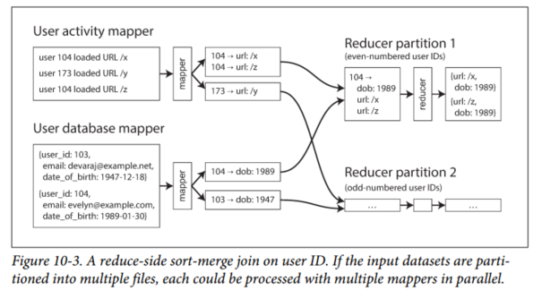

# Chapter 10 - Batch Processing
The web, and increasing numbers of HTTP/REST-based APIs, has made the request/response style of interaction common. But we should remember that it's not the only way of building systems, and that other approaches have their merits too.

Let's distinguish three different types of systems:

1. *Services (online systems)*  
A service waits for a request or instruction from a client. When received, the service tries to handle it as quickly as possible and sends a response back. Response time is usually the primary measure of performance of a service, and availability is often very important.

2. *Batch processing systems (offline systems)*
A batch processing system takes a large amount of input data. Jobs often take a while, so there normally isn't a user waiting for the job to finish. Batch jobs are scheduled to run periodically. The primary performance is usually throughput (the time it takes to process an input dataset of a certain size).

3. *Stream processing systems (near-real-time systems)*  
Like a batch processing system, a stream processor consumes inputs and produces outputs (rather than responding to requests). However, a stream job operates on events shortly after they happen, whereas a batch job operates on a fixed set of input data. This difference allows stream processing systems to have lower latency than the equivalent batch systems.

MapReduce is a batch processing algorithm that makes Google so massively scalable. It was subsequently implemented in various open source data systems, like Hadoop, CouchDB and MongoDB.

MapReduce is a fairly low-level programming model compared to the parallel processing systems that were developed for data warehouses many years previously, but it was a major step forward in terms of the scale of processing that could be achieved on commodity hardware. In this chapter, we will look at MapReduce and several other batch processing algorithms and frameworks and explore how they are used in modern data systems.

## Batch Processing with Unix Tools
Say you have a web server that appends a line to a log file every time it serves a request. For example, using the nginx default access log format, one line of the log might look like this:
```
216.58.210.78 - - [27/Feb/2015:17:55:11 +0000] "GET /css/typography.css HTTP/1.1"
200 3377 "http://martin.kleppmann.com/" "Mozilla/5.0 (Macintosh; Intel Mac OS X
10_9_5) AppleWebKit/537.36 (KHTML, like Gecko) Chrome/40.0.2214.115
Safari/537.36"
```
In order to interpret it, you need to look at the definition of the log format, which is as follows:
```
$remote_addr - $remote_user [$time_local] "$request"
$status $body_bytes_sent "$http_referer" "$http_user_agent"
```
So, this one line of the log indicates that on February 27, 2015, at 17:55:11 UTC, the server received a request for the file /css/typography.css from the client IP address 216.58.210.78. The user was not authenticated, so $remote_user is set to a hyphen (-). The response status was 200 (i.e., the request was successful), and the response was 3,377 bytes in size. The web browser was Chrome 40, and it loaded the file because it was referenced in the page at the URL http://martin.kleppmann.com/

### Simple Log Analysis
Various tools can take these log files and produce pretty reports. We will build our own, using basic Unix tools. For example, say you want to find the 5 most popular pages on your website.
```
cat /var/log/nginx/access.log  (1)
  awk '{print $7}'             (2)
  sort                         (3)
  uniq -c                      (4)
  sort -r -n                   (5)
  head -n 5                    (6)
```

1. Read the log file
2. Split each line into fields by whitespace, and output only the seventh such field from each line, which happens to be the requested URL. In our example line, this request URL is */css/typography.css*.
3. Alphabetically `sort` the list of requested URLs. If some URL has been requested *n* times, then after sorting, the file contains the same URL repeated n times in a row.
4. The `uniq` command filters out repeated lines in its input by checking *whether two adjacent lines are the same*. The `-c` option tells it to also output a counter: for every distinct URL, it reports how many times that URL appeared in the input.
5. The second sort sorts by the number `(-n)` at the start of each line, which is the number of times the URL was requested. It then returns the results in reverse `(-r)` order, i.e. with the largest number first.
6. Finally, head outputs just the first five lines `(-n 5)` of input, and discards the rest.

The output looks something like:
```
4189 /favicon.ico
3631 /2013/05/24/improving-security-of-ssh-private-keys.html
2124 /2012/12/05/schema-evolution-in-avro-protocol-buffers-thrift.html
1369 /
915 /css/typography.css
```

Although the preceding command line likely looks a bit obscure if you’re unfamiliar with Unix tools, it is incredibly powerful. It will process gigabytes of log files in a matter of seconds, and you can easily modify the analysis to suit your needs.

Surprisingly many data analyses can be done in a few minutes using some combination of awk, sed, grep, sort, uniq, and xargs, and they perform surprisingly well.

#### Chain of commands versus custom program
Instead of chain of Unix commands, you could write a simple program to do the same thing. However, there is a big difference in the execution flow, which becomes apparent if you run this analysis on a large file.
```
counts = Hash.new(0)
File.open('/var/log/nginx/access.log') do |file|
  file.each do |line|
    url = line.split[6]
    counts[url] += 1
  end
end

top5 = counts.map{|url, count| [count, url] }.sort.reverse[0...5]
top5.each{|count, url| puts "#{count} #{url}" }
```

#### Sorting versus in-memory aggregation
The Ruby script keeps an in-memory hash table of URLs, where each URL is mapped to the number of times it has been seen. The Unix pipeline example does not have such a hash table, but instead relies on sorting a list of URLs in which multiple occurrences of the same URL are simply repeated.

In the job's working set is larger than the available memory, the in-memory hash table will not be able to fit all the URLs. In this case, the sorting approach has the advantage that it can make efficient use of disks. It's the same principle as we discussed in "SSTables and LSM-Trees" (Chapter 3): chunks of data can be sorted in memory and written out to disk as segment files, and then multiple sorted segments can be merged into a larger sorted file. Mergesort has sequential access patterns that perform well on disks.

The `sort` utility in GNU Coreutils (Linux) automatically handles larger-than-memory datasets by spilling to disk, and automatically parallelizes sorting across multiple CPU cores. This means that simple chain of Unix commands easily scales to large datasets, without running out of memory.

### The Unix Philosophy
1. Make each program do one thing well. To do a new job, build afresh rather than complicate old programs by adding new “features”.
2. Expect the output of every program to become the input to another, as yet unknown, program. Don’t clutter output with extraneous information. Avoid stringently columnar or binary input formats. Don’t insist on interactive input.
3. Design and build software, even operating systems, to be tried early, ideally within weeks. Don’t hesitate to throw away the clumsy parts and rebuild them.
4. Use tools in preference to unskilled help to lighten a programming task, even if you have to detour to build the tools and expect to throw some of them out after you’ve finished using them.

A Unix shell like `bash` lets us easily compose these small programs into surprisingly powerful data processing jobs. Even though many of these programs are written by different groups of people, they can be joined together in flexible ways. What does Unix do to enable this composability?

#### A uniform interface
If you expect the output of one program to become the input to another program, that means those programs must use the same data format - in other words, a compatible interface. All programs must use the same input/output interface.

In Unix, that interface is a file (more precisely, a file descriptor). A file is just an ordered sequence of bytes. Because that is such a simple interface, many different things can be represented using the same interface: an actual file on the filesystem, a communication channel to another process (Unix socket, `stdin`, `stdout`), a device driver ( say `/dev/audio or /dev/lp0`), a socket representing a TCP connection, and so on.

By convention, many Unix programs treat this sequence of bytes as ASCII text. Our log analysis all treat their input file as a list of records separated by the `\n` character.

The parsing of each record is more vague. Unix tools commonly split a file into fields by whitespace or tab characters. A simple tool like `xargs` has command options for specifying how its input should be parsed.

The uniform interface of ASCII text mostly works, but it’s not exactly beautiful: our log analysis example used {print $7} to extract the URL, which is not very readable. In an ideal world this could have perhaps been {print $request_url} or something of that sort. We will revisit this later.

#### Separation of logic and wiring
Another characteristic feature of Unix tools is their use of `stdin` and `stdout`. You can take input from a file and/or redirect output to a file. Pipes let you attach the  `stdout` of one process to the `stdin` of another process (with a small in-memory buffer, and without writing the entire intermediate data stream to disk).

Separating the input/output wiring from the program logic makes it easier to compose small tools into bigger systems.

However, there are limits to what you can do with `stdin` and `stdout`. Programs that need multiple inputs or outputs are possible but tricky. You can’t pipe a program’s output into a network connection. If a program directly opens files for reading and writing, or starts another program as a subprocess, or opens a network connection, then that I/O is wired up by the program itself.

#### Transparency and experimentation
Part of what makes Unix tools so successful is that they make it quite easy to see what is going on:

- The input files to Unix commands are normally treated as immutable. This means you can run the commands as often as you want, trying various command-line options, without damaging the input files.

- You can end the pipeline at any point, pipe the output into `less`, and look at it to see if it has the expected form. This ability to inspect is great for debugging.

- You can write the output of one pipeline stage to a file and use that file as input to the next stage. This allows you to restart the later stage without rerunning the entire pipeline.

Thus, even though Unix tools are quite blunt, simple tools compared to a query optimizer of a relational database, they remain amazingly useful, especially for experimentation.

However, the biggest limitation of Unix tools is that they run only on a single machine — and that’s where tools like Hadoop come in.

## MapReduce and Distributed Filesystems
MapReduce is a bit like Unix tools, but distributed across potentially thousands of machines. Like Unix tools, it is a fairly blunt, brute-force, but surprisingly effective tool. A single MapReduce job is comparable to a single Unix process: it takes one or more inputs and produces one or more outputs.

While Unix tools use `stdin` and `stdout`, MapReduce jobs read and write files on a distributed filesystem. In Hadoop's implementation of MapReduce, that filesystem is called HDFS (Hadoop Distributed File System). Various other distributed filesystems include GlusterFS, and the Quantcas File System (QFS).

HDFS is based on the *shared-nothing* principle (see introduction to Part II), in contrast to the shared-disk approach of *Network Attached Storage* (NAS) and *Storage Area Network* (SAN) architectures. Shared-disk storage is implemented by a centralized storage appliance, often using custom hardware and special network infrastructure like Fibre Channel. On the other hand, the shared-nothing approach requires no special hardware, only computers connected by a conventional datacenter network.

HDFS consists of a daemon process running on each machine, exposing a network service that allows other nodes to access files stored on that machine. A central server called the **NameNode** keeps track of which file blocks are stored on which machine. Thus, HDFS conceptually creates one big filesystem that can use the space on the disks of all machines running the daemon.

To tolerate machine and disk failures, file blocks are replicated on multiple machines. The techniques are similar to RAID, which provides redundancy across several disks; the difference is that in a distributed filesystem, file access and replication are done over a conventional datacenter network without special hardware.

### MapReduce Job Execution
MapReduce is a programming framework with which you can write code to process large datasets in a distributed filesystem like HDFS. Similar to "Simple Log Analysis", the pattern of data processing is very similar:

1. Read a set of input files and break it up into records.
2. Call the **mapper** function to extract a key and value from each input record. In the preceding example, the mapper function is `awk '{print $7}'`: itr extracts the URL as the key, and leaves the value empty.
3. Sort all of the key-value pairs by key.
4. Call the **reducer** function to iterate over the sorted key-value pairs. If there are multiple occurrences of the same key, the sorting has made them adjacent in the list, so it is easy to combine those values without having to keep a lot of state in memory. In the preceding example, the reducer is implemented by the command `uniq -c`, which counts the number of adjacent records with the same key.

To create a MapReduce job, you need to implement two callback functions, the mapper and reducer, which behave as follows:

1. *Mapper*  
The mapper is called once for every input record, and its job is to extract the key and value from the input record. For each input, it may generate any number of key-value pairs (including none). Each record is handled independently.

2. *Reducer*  
The MapReduce framework takes the key-value pairs produced by the mappers, collects all the values belonging to the same key, and calls the reducer with an iterator over that collection of values.

In the web server log example, we had a second `sort` command in step 5, which ranked URLs by number of requests.

In MapReduce, if you need a second sorting stage, you can implement it by writing a second MapReduce job and using the output of the first job as input to the second job. Viewed like this, the role of the mapper is to prepare the data by putting it into a form that is suitable for sorting, and the role of the reducer is to process the data that has been sorted.

#### Distributed execution of MapReduce
MapReduce can parallelize a computation across many machines automatically. The mapper and reducer only operate on one record at a time, so the framework can handle the complexities of moving data between machines. Mappers and reducers are more commonly implemented as functions in a conventional programming language. In Hadoop MapReduce, the mapper and reducer are each a Java class that implements a particular interface. In MongoDB and CouchDB, they are JavaScript functions.

Figure 10-1 shows the dataflow in a Hadoop MapReduce job.



Its parallelization is based on partitioning: the input to a job is typically a directory in HDFS, and each file or file block within the input directory is considered to be a separate partition that can be processed by a separate map task (marked by *m1*, *m2*, and *m3* in Figure 10-1).

Each input file is typically hundreds of MBs. The MapReduce scheduler tries to run each mapper on one of the m achines that stores a replica of the input file, provided that machine has enough spare RAM and CPU resources to run the map task. This principle is known as *putting the computation near the data*: it saves copying the input file over the network, reducing network load and increasing locality.

In most cases, the application code that should run in the map task is not yet present on the machine that is assigned the task of running it, so the MapReduce first copies the code to the appropriate machines. It then starts the map task and begins reading the input file, passing one record at a time to the mapper callback.

The reduce side of the computation is also partitioned. While the number of map tasks is determined by the number of input file blocks, the number of reduce tasks is configured by the job author. To ensure that all key-value pairs with the same key end up at the same reducer, the framework uses a **hash of the key** to determine which reduce task should receive a particular key-value pair.

The key-value pairs must be sorted, and since the dataset is likely too large, the sorting is performed in stages. First, each map task partitions its output by reducer, based on the hash of the key. Each of these partitions is written to a sorted file on the mapper's local disk.

Whenever a mapper finishes reading its input file and writing its sorted output files, the MapReduce scheduler notifies the reducers that they can start fetching the output files from that mapper. The reducers connect to each of the mappers and download the files of sorted key-value pairs for their partition. This process of partitioning by reducer, sorting, and copying data partitions from mappers to reducers is known as the *shuffle*.

The reduce task takes the files from the mappers and merges them together, preserving the sort order. Thus, if different mappers produced records with the same key, they will be adjacent in the merged reducer input.

The reducer is called with a key and an iterator that incrementally scans over all records with the same key (which may in some cases not all fit in memory). The reducer can use arbitrary logic to process these records, and can generate any number of output records. These output records are written to a file on the distributed filesystem (usually, one copy on the local disk of the machine running the reducer, with replicas on other machines).

#### MapReduce workflows
The range of problems you can solve with a single MapReduce job is limited. Referring back to the log analysis example, a single MapReduce job could determine the number of page views per URL, but to get the most popular URLs, we need a second round of sorting.

Thus, it is very common for MapReduce jobs to be chained together into *workflows*. The chaining is done implicitly by directory name: the first job must be configured to write its output to a designated directory in HDFS, and the second job must be configured to read that same directory name as input.

Chained MapReduce jobs are less like pipelines of Unix commands and more like a sequence of commands where each command's output is written to a temp file. This design has its pros and cons, which will be discussed in "Materialization of Intermediate State".

One job in a workflow can only start when the prior jobs have completed successfully. To handle these dependencies, various workflow schedulers for Hadoop have been developed, including Oozie, Azkaban, Luigi, Airflow, etc.

These schedulers also have management features that are useful when maintaining a large collection of batch jobs. Various higher-level tools for Hadoop, such as Pig, Hive, Cascading, Crunch, and FlumeJava, also set up workflows of multiple MapReduce stages that are automatically wired together appropriately.

### Reduce-Side Joins and Grouping
In a database, if you execute a query that involves only a small number of records, the database will typically use an *index* to quickly locate the records of interest. If the query involves joins, it may require multiple index lookups. However, MapReduce has no concept of indexes.

When a MapReduce job is given a set of files as input, it reads the entire content of all of those files (a *full table scan* in database terms). In analytic queries, it is common to want to calculate aggregates over a large number of records. In this case, scanning the entire input might be quite a reasonable thing to do, especially if you can parallelize across multiple machines.

When we talk about joins in the context of batch processing, we mean resolving all occurrences of some association within a dataset.

#### Example: analysis of user activity events
Figure 10-2 shows an example of a join in a batch job.



An analytics task may need to correlate user activity with user profile information. However, the activity events only contain the user ID. Thus, the activity events need to be joined with the user profile database.

The simplest implementation of this join would go over the activity events one by one and query the user database (on a remote server) for every user ID it encounters. This is possible, but it would most likely suffer from very poor performance: the processing throughput would be limited by the round-trip time to the database server, the effectiveness of a local cache would depend very much on the distribution of data, and running a large number of queries in parallel could easily overwhelm the database.

To achieve good throughput in a batch process, the computation must be (as much as possible) local to one machine.

Thus, a better approach would be to take a copy of the user database and to put it in the same distributed filesystem as the log of user activity events. You then could use MapReduce to bring together all of the relevant records in the same place and process them efficiently.

#### Sort-merge joins
Recall that the purpose of the mapper is to extract a key and value from each input record.

In the case of Figure 10-2, the key would be user ID: one set of mappers would go over the activity events, extracting the user ID as the key and the activity event as the value, while another set would go over the user database and extract the user ID as the key and the user's birth date as the value.



When the MapReduce framework partitions the mapper output by key and then sorts the key-value pairs, the effect is that all the activity events and the user record with the same user ID become adjacent to each other in the reducer input. The MapReduce job can even arrange the records to be sorted such that the reducer always sees the record from the user database first, followed by the activity events in timestamp order. This is known as *secondary sort*.

The reducer can then perform the actual join logic easily: the reducer function is called once for every user ID, and thanks to the secondary sort, the first value is expected to be the date-of-birth record from the user database. The reducer stores the date of birth in a local variable and then reiterates over the activity events with the same user ID. Subsequent MapReduce jobs could then calculate the distribution of viewer ages for each URL, and cluster by age group.

Since the reducer processes all of the records for a particular user ID in one go, it only needs to keep one user record in memory at any one time, and it never needs to make any requests over the network. This algorithm is known as a *sort-merge* join, since mapper output is sorted by key, and the reducers then merge together the sorted lists of records from both sides of the join.

#### Bringing related data together in the same place
In a sort-merge join, the mappers and the sorting process make sure that all the necessary data to perform the join operation for a particular user ID is brought together in the same place: a single call to the reducer. Having lined up all the required data in advance, the reducer can be a fairly simple, single-threaded piece of code that can churn through records with high throughput and low memory overhead.

Using the MapReduce programming model has separated the physical network communication aspects of the computation from the application logic. Since MapReduce handles all network communication, it also shields the application code from having to worry about partial failures, such as the crash of another node.

#### GROUP BY
Besides joins, another common use of the "bringing related data to the same place" pattern is grouping records by some key (as in the `GROUP BY` clause in SQL). All records with the same key form a group, and the next step is often to perform some kind of aggregation within each group - for example:

- Counting the number of records in each group (like `COUNT(*)` in SQL)
- Adding up the values in one particular field (like `SUM(fieldname)` in SQL)
- Picking the top *k* records according to some ranking function

The simplest way of implementing such a grouping operation with MapReduce is to set up the mappers so that the key-value pairs they produce use the desired grouping key. The partitioning and sorting process then brings together all the records with the same key in the same reducer. Thus, grouping and joining look quite similar when implemented on top of MapReduce.

Another common use for grouping is collating all the activity events for a particular user session, in order to find out the sequence of actions that the user took - a process called *sessionization*. For example, such analysis could be used to work out whether users who were shown a new version of your website are more likely to make a purchase than those who were shown the old version (A/B testing).

If you have multiple web servers handling user requests, the activity events for a particular user are most likely scattered across various different servers’ log files. You can implement sessionization by using a session cookie, user ID, or similar identifier as the grouping key and bringing all the activity events for a particular user together in one place, while distributing different users’ events across different partitions.

#### Handling skew
The pattern of "bringing all records with the same key to the same place" breaks down if there is a very large amount of data related to a single key. For example, in a social network, a small number of celebrities may have many millions of followers. Such disproportionately active database records are known as *linchpin objects* or *hot keys*.

Collecting all activity related to a celebrity in a single reducer can lead to significant *skew* - that is, one reducer that must process significantly more records than the others. Since a MapReduce job is only complete when all o f its mappers and reducers have completed, any subsequent jobs must wait for the slowest reducer to complete before they can start.

If a join input has hot keys, there are a few algorithms you can use to compensate. For example, the *skewed join* method in Pig first runs a sampling job to determine which keys are hot. When performing the actual join, the mappers send any records relating to a hot key to one of several reducers, chosen at random. For the other input to the join, records relating to the hot key need to be replicated to *all* reducers handling that key.

This technique spreads the work of handling the hot key over several reducers, which allows it to be parallelized better, at the cost of having to replicate the other join input to multiple reducers. The *sharded join* in Crunch is similar, but requires the hot keys to be specified explicitly rather than using a sampling job.

Hive's skewed join optimization requires hot keys to be specified explicitly in the table metadata, and it stores records related to those keys in separate files from the rest. When performing a join on that table, it uses a map-side join (next section) for the hot keys.

When grouping records by a hot key and aggregating them, you can perform the grouping in two stages. The first MapReduce stage sends records to a random reducer, so that each reducer performs the grouping on a subset of records for the hot key and outputs a more compact aggregated value per key. The second MapReduce job then combines the values from all of the first-stage reducers into a single value per key.

### Map-Side Joins
The join algorithms described in the last section perform the actual join logic in the reducers, and are hence known as *reduce-side joins*. The mappers take the role preparing the input data: extracting the key and value from each input record, assigning the key-value pairs to a reducer partition, and sorting by key.

The reduce-side approach has the advantage that you do not need to make any assumptions about the input data: whatever its properties and structure, the mappers can prepare the data to be ready for joining. However, the downside is that all that sorting, copying to reducers, and merging of reducer inputs can be quite expensive. Depending on the available memory buffers, data may be written to disk several times as it passes through the stages of MapReduce.

However, if you *can* make certain assumptions about your input data, it is possible to make joins faster by using a so-called *map-side join*. This approach uses a cut-down MapReduce job in which there are no reducers and no sorting. Instead, each mapper simply reads one input file block from the distributed filesystem and writes one output file to the filesystem.

#### Broadcast hash joins
The simplest way of performing a map-side join applies in the case where a large dataset is joined with a small dataset. The small dataset needs to be small enough that it can be loaded entirely into memory in each of the mapper.

For example, imagine in the case of Figure 10-2 that the user database is small enough to fit in memory. When a mapper starts, it can first read the user database from the distributed filesystem into an in-memory hash table. Afterwards, the mapper can scan over the user activity events and look up the user ID for each event in the event table. There can still be several map tasks: one for each file block of the large input to join. Each of these mappers loads the small input entirely into memory.

This algorithm is called a *broadcast hash join*: the word *broadcast* reflects the fact that each mapper for a partition of the large input reads the entirety of the small input (i.e. the small input is being broadcast to all partitions of the large input), and the word *hash* reflects its use of a hash table.

Instead of loading the small join input into an in-memory hash table, alternatively you can store the small join input in a read-only index on the local disk. The frequently used parts of this index will remain in the OS's page cache, which provides similar performance, but without requiring the dataset to fit in memory.

#### Partitioned hash joins
If the inputs to the map-side join are partitioned in the same way, then the hash join approach can be applied to each partition independently. In the case of Figure 10-2, you might arrange for the activity events and the user database to each be partitioned based on the last decimal digits of the user ID. For example, mapper 3 first loads all users with an ID ending in 3 into a hash table, and then scans over all the activity events for each user whose ID ends in 3.

All the records you want to join will be located in the same numbered partition, and so it is sufficient for each mapper to only read one partition from each of the input datasets. This way, each mapper can load a smaller amount of data into its hash table.

However, this approach only works if both of the join's inputs have the same number of partitions, with records assigned to partitions based on the same key and the same hash function. If the inputs are generated by prior MapReduce jobs that already perform this grouping, then this can be a reasonable assumption to make.

#### Map-side merge joins
Another variant of a map-side join applies if the input datasets are not only partitioned in the same way, but also **sorted** based on the same key. In this case, it does not matter whether the inputs are small enough to fit in memory, because a mapper can perform the same merging operation that would be normally done by a reducer: reading both input files incrementally, in order of ascending key, and matching records with the same key. (Note that it must be sorted)

If a map-side merge join is possible, it means that prior MapReduce jobs brought the input datasets into this partitioned and sorted form in the first place.

#### MapReduce workflows with map-side joins
When the output of a MapReduce join is consumed by downstream jobs, the choice of map-side or reduce-side join **affects** the structure of the output.

- The output of a reduce-side join is **partitioned** and **sorted** by the join key
- The output of a map-side join is **partitioned** and **sorted** in the same way as the large input.

Map-side joins also make more assumptions about the size, sorting, and partitioning of their input datasets. Knowing about the physical layout of datasets in the distributed filesystem becomes important when optimizing join strategies. It is not sufficient to just know the encoding format and the name of the directory in which the data is stored; you must also know the number of partitions and the keys by which the data is partitioned and sorted. In the Hadoop ecosystem, this kind of metadata about the partitioning of datasets is often maintained in HCatalog and the Hive metastore.

### The Output of Batch Workflows
We have talked a lot about various algorithms for implementing workflows of MapReduce jobs, but what is the result of all of that processing, once it is done?

In the case of database queries, we distinguished transaction processing (OLTP) purposes from analytic purposes. We saw that OLTP queries generally look up a **small number of records by key**, using indexes, in order to present them to a user.

On the other hand, analytic queries (OLAP) often scan over a **large number of records**, perform groupings and aggregations, and the output has the form of a report. The consumer of such a report is often an analyst or a manger who makes business decisions.

Where does the batch processing fit in? It is closer to analytics, in that a batch process typically scans over large portions of an input dataset. However, a workflow of MapReduce jobs is not the same as a SQL query used for analytic purposes. The output of a batch process is often some other kind of structure.

#### Building Search Indexes
We saw briefly how full-text search work in Chapter 3 ("Full-text search and fuzzy indexes"): it is a file (the term dictionary) in which you can efficiently look up a particular keyword and find the list of all the document IDs containing that keyword (the postings list). This is a very simplified view of a search index - in reality it requires various additional data, in order to rank search results by relevance, correct misspellings, resolve synonyms, and so on.

If you need to perform a full-text search over a fixed set of documents, then a batch process is a very effective way of building the indexes: the mappers partition the set of documents as needed, each reducer builds the index for its partition, and the index files are written to the distributed filesystem. Building such document-partitioned indexes (see “Partitioning and Secondary Indexes” on page 206 (Chapter 6)) parallelizes very well.

Since querying a search index by keyword is a read-only operation, these index files are immutable once created.

If the indexed set of documents changes, one option is to periodically rerun the entire indexing workflow for the entire set of documents, and replace the previous index files with the new index files. This approach can be computationally expensive if only a small number of documents have changed, but it has the advantage that the indexing process is very easy to reason about: documents in, indexes out.

Alternatively, we can build indexes incrementally. As discussed in Chapter 3, if you want to add, remove, or update documents in an index, Lucene writes out new segment files and asynchronously merges and compacts segment files in the background.

#### Key-value stores as batch process output
Another common use for batch processing is to build machine learning systems such as classifiers and recommendation systems.

The output of those batch jobs is often some kind of database: for example, a database that can be queried by user Id to obtain suggested friends for that user, or a database that can be queried by product ID to get a list of related products.

These databases need to be queried from the web application that handles user requests, which is usually separate from the Hadoop infrastructure. So how does the output from the batch process get back into a database where the web application can query it?

We can use the client library for our favorite database directly within a mapper or reducer, and to write from the batch job directly to the database server, one record at a time. This will work, but is a bad idea for several reasons:  

1. Making a network request will lower the throughput of a batch task. Performance will be poor.
2. MapReduce jobs often run tasks in parallel. If all the mappers or reducers concurrently write to the same output database, that database can easily be overwhelmed. Performance is likely to suffer.
3. Normally, MapReduce provides a clean all-or-nothing guarantee for job output. Writing to an external system from inside a job produces externally visible side effects that cannot be hidden. You have to worry about the results of partially completed jobs being visible to other systems, and the complexities of Hadoop task attempts and speculative execution.

A much better solution is to build a brand-new database *inside* the batch job and write it as files to the job’s output directory in the distributed filesystem, just like the search indexes in the last section. Those data files are then immutable once written, and can be loaded in bulk into servers that handle read-only queries. Various key-value stores support building database files in MapReduce jobs, including Voldemort, Terrapin, ElephantDB, and HBase bulk loading.

#### Philosophy of batch process outputs
MapReduce jobs treat inputs as immutable and avoiding side effects (like writing to external databases), and by doing so, they can achieve good performance and become much easier to maintain:

1. If you introduce a bug, you can simply roll back to a previous version of the code and rerun the job, and the output will be correct again. Databases with read-write transactions do not have this property: if you deploy buggy code that writes bad data to the database, rolling back the code will not fix the data in the database.

2. As a consequence of this ease of rolling back, feature development can proceed more quickly than in an environment where mistakes could mean irreversible damage.

3. If a map or reduce task fails, the MapReduce framework automatically reschedules it and runs it again on the same input. If the failure is due to a bug in the code, it will keep crashing and eventually cause the job to fail after a few attempts; but if the failure is due to a transient issue, the fault is tolerated. This automatic retry is only safe because inputs are immutable and outputs from failed tasks are discarded by the MapReduce framework.

4. The same set of files can be used as input for various different jobs.

5. Like Unix tools, MapReduce jobs separate logic from wiring, which provides a separation of concerns and enables potential reuse of code.

### Comparing Hadoop to Distributed Databases
As we have seen, Hadoop is somewhat like a distributed version of Unix, where the HDFS is the filesystem and MapReduce is the implementation of a Unix process which happens to always run the `sort` utility between the map phase and the reduce phase. We saw how we can implement various joins and grouping operations on top of these primitives.

#### Diversity of storage
Databases require you to structure data according to a particular model (e.g. relational or documents), whereas files in a distributed filesystem are just byte sequences, which can be written using any data model and encoding.

As such, Hadoop opened up the possibility of indiscriminately dumping data into HDFS, and only later figuring out how to process it further. By contrast, Massively Parallel Processing (MPP) databases typically require careful up-front modeling of the data and query patterns before importing the data into the database's proprietary storage format.

The idea is similar to a data warehouse: simply bringing data from various parts of a large organization together in one place is valuable, because it enables joins across datasets that were previously disparate. The careful schema design required by an MPP database slows down that centralized data collection; collecting data in its raw form, and worrying about schema design later, allowing the data collection to be sped up (a concept sometimes known as a "data lake" or "enterprise data hub").

Indiscriminate data dumping shifts the burden of interpreting the data: instead of forcing the producer to bring it into a standardized format, the interpretation of data becomes the consumer's problem (schema-on-read approach). This can be advantageous if the producer and consumers are different teams with different priorities. This approach is dubbed the *sushi principle*: "raw data is better".

Thus, Hadoop has often been used for implementing ETL processes: data from transaction processing systems is dumped into the distributed filesystem in some raw form, and then MapReduce jobs clean up that data, transform it into a relational form, and import it to an MPP data warehouse for analytic purposes. This decoupling is possible because a **distributed filesystem supports data encoded in any format**.

#### Diversity of processing models
MPP databases are monolithic, tightly integrated pieces of software that take care of storage layout on disk, query planning, scheduling, and execution. Since these components can all be tuned and optimized for the specific needs of the database, the system as a whole can achieve good performance on the types of queries *for which it is designed*. Moreover, SQL allows expressive queries and elegant semantics without the need to write code, making it accessible to graphical tools (like Tableau).

On the other hand, not all kinds of processing can be sensibly expressed as SQL queries. MapReduce gave engineers the ability to easily run their own code over large datasets. If you have HDFS and MapReduce, you *can* build a SQL query execution engine on top of it (this is what Hive did).

Subsequently, people found that MapReduce was too limiting and performed too badly for some types of processing, so various other processing models were developed on top of Hadoop. Having two processing models, SQL and MapReduce, was not enough: we need more different models. Due to the openness of the Hadoop platform, it was feasible to implement a whole range of approaches, which would not have been possible within the confines of a monolithic MPP database.

Crucially, those various processing models can all be run on a single shared-use cluster of machines, all accessing the same files on the distributed filesystem. In the Hadoop approach, there is no need to import the data into several different specialized systems for different kinds of processing: the system is flexible enough to support a diverse set of workloads within the same cluster.

The Hadoop ecosystem includes both random-access OLTP databases such HBase and MPP-style analytic databases such as Impala. Neither HBase nor Impala uses MapReduce, but both use HDFS for storage. They are very different approaches to accessing and processing data, but they can nevertheless coexist and be integrated in the same system. 417

#### Designing for frequent faults
When comparing MapReduce to MPP databases, two more differences in design approach stand out: the handling of faults and the use of memory and disk. Batch processes are less sensitive to faults than online systems. If a node crashes while a query is executing, most MPP databases abort the entire query and let the user resubmit the query or automatically run it again. This way of handling errors is acceptable, since the cost of retrying is not too great. MPP databases also prefer to keep as much data as possible in memory to avoid the cost of reading from disk.

MapReduce can tolerate the failure of a map or reduce task without it affecting the job as a whole by retrying work at the granularity of an individual task. It is also very eager to write data to disk, partly for fault tolerance, and partly on the assumption that the dataset will be too big to fit in memory.

The MapReduce approach is more appropriate for larger jobs: jobs that process so much data and run for a long time that they are likely to experience at least one task failure along the way. In that case, rerunning the entire job would be wasteful. Even if recovery at the granularity of an individual task introduces overheads that make fault-free processing slower, it can still be a reasonable trade-off.

To understand the reasons for MapReduce’s sparing use of memory and task-level recovery, it is helpful to look at the environment for which MapReduce was originally designed. Google has mixed-use datacenters, in which online production services and offline batch jobs run on the same machines. Every task has a resource allocation that is enforced using containers. Every task also has a priority.

This architecture allows non-production computing resources to be overcommitted, because the system knows that it can reclaim the resources if necessary. Overcommitting resources allows better utilization of machines and greater efficiency compared to systems that segregate production and non-production tasks. As MapReduce jobs run at low priority, they run the risk of being preempted at any time because a higher-priority process requries their resources. Batch jobs effectively "pick up the scraps under the table".

And this is why MapReduce is designed to tolerate frequent unexpected task termination.

## Beyond MapReduce
Implementing a complex processing job using the raw MapReduce API is quite hard. Various higher-leevl programming models (Pig, Hive, Cascading, Crunch) were created as abstractions on top of MapReduce. If you understand how MapReduce works, their higher-level constructs make many common batch processing tasks easier to implement.

However, there are problems with the MapReduce execution model itself, which are not fixed by adding a level of abstraction and which manifest themselves as poor performance for some kinds of processing. While MapReduce is very robust, other tools are sometimes orders of magnitude faster for some kinds of processing.

We will look at some of those alternatives for batch processing.

### Materialization of Intermediate State
As discussed previously, every MapReduce job is independent from every other job. The main contact poitns of a job are its input and output directories on the distributed filesystem. This setup is reasonable if the output from the first job is a dataset that you want to publish widely. In that case, you need to be able to refer to it by name and reuse it as input to several different jobs. Publishing data to a well-known location in the distributed filesystem allows **loose coupling** so that jobs don't need to know who is producing their input or consuming their output.

However, in many cases, you know that the output of one job is only ever used as the input to one other job, which is maintained by the same team. In this case, the files on the distributed filesystem are simply *intermediate state*: just a means of passing data from one job to the next. In complex workflows consisting many MapReduce jobs, there is a lot of such intermediate state.

The process of writing out this intermediate state to files is called *Materialization*. By contrast, the log analysis example at the beginning of the chapter used Unix pipes to connect the output of one command with the input of another. Pipes do not materialize the intermediate state, but they *stream* the output to the input incrementally, using a small in-memory buffer.

MapReduce's approach of fully materializing intermediate state has downsides compared to Unix pipes:

1. A MapReduce job can only start when all tasks in the preceding jobs have completed, whereas processes connected by a Unix pipe are started at the same time, with output being consumed as soon as it is produced.

2. Mappers are often redundant: they just read back the same file that was just written by a reducer, and prepare it for the next stage of partitioning and sorting. In many cases, the mapper code could be part of the previous reducer.

3. Storing intermediate state in a distributed filesystem means those files are replicated across several nodes.

#### Dataflow engines
In order to fix these problems with MapReduce, several new execution engines for distbuted batch computations were developed, the most well known of which are Spark, Tez, and Flink. They all have one thing in common: they handle an entire workflow as one job, rather than breaking it up into independent subjobs.

Since they explicitly model the flow of data through several processing stages, these systems are known as *dataflow engines*. Like MapReduce, they work by repeatedly calling a user-defined function to process one record at a time on a single thread. They parallelize work by partitioning inputs, and they copy the output of one function over the network to become the input to another function.

Unlike in MapReduce, these functions need not take the strict roles of alternating `map` and `reduce`. We call these functions *operators*, and the dataflow engine provides several options for connecting one operator's output to another's input:

1. Repartition and sort records by key, like in the shuffle stage of MapReduce. This feature enables sort-merge joins and grouping in the same way as in MapReduce.

2. Take several inputs and partition them in the same way, but skip the sorting. This saves effort on partitioned hash joins, where the partitioning of records is important but the order is irrelevant because building the hash table randomizes the order anyway.

3. For broadcast hash joins, the same output from one operator can be sent to all partitions of the join operator.

This style of processing engine is based on research systems like Dryad and Nephele, and it offers several advantages compared to the MapReduce model:

1. Expensive work such as sorting need only be performed in places where it is actually required, rather than always happening by default between every `map` and `reduce` stage.

2. There are no unnecessary map tasks, since the work done by a mapper can often be incorporated into the preceding reduce operator (because a mapper does not change the partitioning of a dataset).

3. Because all joins and data dependencies in a workflow are explicitly declared, the scheduler has an overview of what data is required where, so it can make optimizations. For example, it can try to place the task that consumes some data on the same machine as the task that produces it.

4. It is usually sufficient for intermediate state between operators to be kept in memory or written to local disk, which requires less I/O than writing it to HDFS. MapReduce already uses this optimization for mapper output, but dataflow engines generalize the idea to all intermediate state.

5. Operators can start executing as soon as their input is ready; there is no need to wait for the entire preceding stage to finish before the next one starts.

6. Existing JVM processes can be reused to run new operators, reducing startup overheads compared to MapReduce, which launches a new JVM for each task.

You can use dataflow engines to implement the same computations as MapReduce workflows, and they usually execute significantly faster due to the optimizations described here. Since operators are a generalization of map and reduce, the same processing code can run on either execution engine: workflows implemented in Pig, Hive, or Cascading can be switched from MapReduce to Tez or Spark with a simple configuration change.

Tez is a fairly thin library that relies on the YARN shuffle service for the actual copying of data between nodes, whereas Spark and Flink are big frameworks that include their own network communication layer, scheduler, and user-facing APIs.

#### Fault tolerance
An advantage of fully materializing intermediate state to a distributed filesystem is that it is durable, which makes fault tolerance fairly easy in MapReduce: if a task fails, it can just be restarted on another machine and read the same input again from the filesystem.

Spark, Flink, and Tez avoid writing intermediate state to HDFS, so they take a different approach to tolerating faults: if a machine fails and the intermediate state on that machine is lost, it is recomputed from other data that is still available.

To enable this recomputation, the framework must keep track of how a given piece of data was computed - which input partitions it used, and which operators were applied to it. Spark uses the resilient distributed dataset (RDD) abstraction for tracking the ancestry of data, while Flink checkpoints operator state, allowing it to resume running an operator that ran into a fault during its execution.

When recomputing data, it is important to know whether the computation is *deterministic*. This question matters because if the operator is restarted and the recomputed data is not the same as the original lost data, it becomes very hard for downstream operators to resolve the contradictions between the old and new data.

In order to avoid such problems, it is better to make operators deterministic. Such causes of nondeterminism need to be removed in order reliably recover from faults, for example by generating pesudorandom numbers using a fixed seed.

Recovering from faults by recomputing data is not always the right answer: if the intermediate data is much smaller than the source data, or if the computation is very CPU-intensive, it is probably cheaper to materialize the intermediate data to files than to recompute it.

#### Discussion of materialization
Returning to the Unix analogy, we saw that MapReduce is like writing the output of each command to a temporary file, whereas dataflow engines look much more like Unix pipes. Flink especially is built around the idea of pipelined execution.

A sorting operation inevitably needs to consume its entire input before it can produce any output, because it's possible that the very last input record is the one with the lowest key and thus needs to be the very first output record. Any operator that requires sorting will thus need to accumulate state, at least temporarily. But many other parts of a workflow can be executed in a pipelined manner.

When the job completes, its output needs to go somewhere durable so that it can be reused. Thus, when using a dataflow engine, materialized datasets on HDFS are still usually the inputs and the final outputs of a job. Like with MapReduce, the inputs are immutable and the output is completely replaced. The improvement over MapReduce is that you save yourself writing all the intermediate state to the filesystem as well.

### Graphs and Iterative Processing
It is interesting to look at graphs in a batch processing context, where the goal is to perform some kind of offline processing or analysis on an entire graph. This need often arises in machine learning applications such as recommendation engines, or in ranking systems. For example, one of the most famous graph analysis algorithms is PageRank, which tries to estimate the popularity of a web page based on what other web pages link to it.

Many graph algorithms are expressed by traversing one edge at a time, joining one vertex with an adjacent vertex in order to propagate some information, and repeating until some condition is met (for example, until there are no more edges to follow, or until some metric converges). It is possible to store a graph in a distributed filesystem (in files containing lists of vertices and edges), but this idea of "repeating until done" cannot be expressed in plain MapReduce, since it only performs a single pass over the data. This kind of algorithm is thus often implemented in an **iterative** style:

1. An external scheduler runs a batch process to calculate one step of the algorithm
2. When the batch process completes, the scheduler checks whether it has finished
3. If it has not yet finished, the scheduler goes back to step 1 and runs another round of the batch process

This approach works, but implementing it with MapReduce is often very inefficient, because MapReduce does not account for the iterative nature of the algorithm: it will **always** read the **entire input dataset** and produce a completely new output dataset, even if only a small part of the graph has changed compared to the last iteration.

#### The Pregel processing model
As an optimization for batch processing graphs, the *bulk synchronous parallel* (BSP) model of computation has become popular. Among others, it is implemented by Apache Giraph, Spark's GraphX API, Flink's Gelly API. It is also known as the Pregel model, as popularized by Google's Pregel paper.

In MapReduce, mappers conceptually "send a message" to a particular call of the reducer because the framework collects together all the mapper outputs with the same key. A similar idea is behind Pregel: one vertex can "send a message" to another vertex, and typically those messages are sent along the edges in a graph.

In each iteration, a function is called for each vertex, passing it all the messages that were sent to it - much like a call to the reducer. The difference from MapReduce is that in the Pregel model, a vertex remembers its state in memory from one iteration to the next, so the function only needs to process new incoming messages.

It's a bit similar to the actor model (Chapter 4), if you think of each vertex as an actor, except that vertex state and messages between vertices are fault-tolerant and durable, and communication proceeds in fixed rounds: at every iteration, the framework delivers all messages sent in the previous iteration. Actors normally have no such timing guarantee.

#### Fault tolerance
The fact that vertices can only communicate by message passing (not querying each other directly) helps improve the performance of Pregel jobs, since messages can be batched and there is less waiting for communication. The only waiting is between iterations: since the Pregel model guarantees that all messages sent in one iteration are delivered in the next iteration, the prior iteration must completely finish before the next one can start.

Even though the underlying network may drop, duplicate, or arbitrarily delay messages, Pregel implementations guarantee that messages are processed **exactly once** at their destination vertex in the following iteration. Like MapReduce, the framework transparently recovers from faults.

This fault tolerance is achieved by periodically checkpointing the state of all vertices at the end of an iteration - i.e. writing their full state to durable storage. If a node fails and its in-memory state is lost, the simplest solution is to roll back the entire graph computation to the last checkpoint and restart the computation.

#### Parallel execution
A vertex need not know on which physical machine it is execution; when it send messages to other vertices, it simply sends them to a vertex ID. It is up to the framework to decide which vertex runs on which machine, and how to route messages over the network so that they end up in the right place.

Because the programming model deals with just one vertex at a time, the framework may partition the graph in arbitrary ways. Ideally it would be partitioned such that vertices are co-located on the same machine if they need to communicate a lot. However, in practice, the framework makes no attempt to group related vertices together as finding such an optimized partitioning is hard.

As a result, graph algorithms often have a lot of cross-machine communication overhead, and the intermediate state is often bigger than the original graph. For this reason, if your graph can fit in memory on a single computer, it's quite likely that a single machine algorithm will outperform a distributed batch process. Even if the graph is bigger than memory, it can fit on the disks of a single computer, single-machine processing using a framework such as GraphChi is a viable option. Otherwise, a distributed approach such as Pregel is unavoidable.

### High-Level APIs and Languages
As discussed previously, higher-level languages and APIs such as Hive, Pig, Cascading, and Crunch become popular because programming MapReduce jobs by hand is quite laborious. As Tez emerged, these high-level languages had the additional benefit of being able to move to the new dataflow execution engine without the need to rewrite job code.

These dataflow APIs generally use relational-style building blocks to express a computation: joining datasets on the value of some field; grouping tuples by key; filtering by some condition; and aggregating tuples. Internally, these operations are implemented using the various join and grouping algorithms discussed earlier in the chapter.

Besides requiring less code, these high-level interfaces also allow interactive use, in which you write analysis code incrementally in a shell and run it frequently to observe what it is doing. Moreover, these high-level interfaces also improve the job execution efficiency at a machine level.

#### The move toward declarative query languages
An advantage of specifying joins as relational operators, compared to spelling out the code that performs the join, is that the framework can analyze the properties of the join inputs and automatically decide which join algorithms would be most suitable for the task. Hive, Spark, and Flink have cost-based query optimizers that do this, and even change the order of joins so that the amount of intermediate state is minimized. The choice of join algorithm can make a big difference to the performance of a batch job.

MapReduce and its dataflow successors are very different from the fully declarative query model of SQL. MapReduce was built around the idea of function callbacks. This approach has the advantage that you can draw upon a large ecosystem of existing libraries to do things like parsing, natural language analysis, image analysis, and running numerical or statistical algorithms.

Dataflow engines have found that there are also advantages to incorporating more declarative features in areas besides joins. For example, if a callback function contains only a simple filtering condition, or just selects some fields from a record, then there is a significant CPU overhead in calling the function on every record. If such simple filtering and mapping operations are expressed in a declarative way, the query optimizer can take advantage of column-oriented storage layouts and read only the required columns from disk. Hive, Spark DataFrames, and Impala also use vectorized execution: iterating over data in a tight inner loop that is friendly to CPU caches, and avoiding function calls.

By incorporating declarative aspects in their high-level APIs, and having query optimizers that can take advantage of them during execution, batch processing frameworks begin to look more like MPP databases (and can achieve comparable performance). At the same time, by having the extensibility of being able to run arbitrary code and read data in arbitrary formats, they retain their flexibility advantage.

#### Specialization for different domains
While the extensibility of being able to run arbitrary code is useful, there are also many common cases where standard processing patterns keep reoccurring, and so it is worth having reusable implementations of the common building blocks. Another domain of increasing importance is statistical and numerical algorithms, which are needed for machine learning applications such as classification and recommendation systems.

Also, spatial algorithms such as *k-nearest neighbors*, which searches for items that are close to a given item in some multi-dimensional space. Approximate search is also important for genome analysis algorithms, which need to find strings that are similar but not identical.

Batch processing engines are being used for distributed execution of algorithms from an increasingly wide range of domains. As batch processing systems gain built-in functionality and high-level declarative operators, and as MPP databases become more programmable and flexible, the two are beginning to look more alike.

# Summary
In this chapter we explored the topic of batch processing. We started by looking at Unix tools such as awk, grep, and sort, and we saw how the design philosophy of those tools is carried forward into MapReduce and more recent dataflow engines. Some of those design principles are that inputs are immutable, outputs are intended to become the input to another (as yet unknown) program, and complex problems are solved by composing small tools that “do one thing well.

In the Unix world, the uniform interface that allows one program to be composed with another is files and pipes; in MapReduce, that interface is a distributed filesystem. We saw that dataflow engines add their own pipe-like data transport mechanisms to avoid materializing intermediate state to the distributed filesystem, but the initial input and final output of a job is still usually HDFS.

The two main problems that distributed batch processing frameworks need to solve are:

1. Partitioning  
In MapReduce, mappers are partitioned according to input file blocks. The output of mappers is repartitioned, sorted, and merged into a configurable number of reducer partitions. The purpose of this process is to bring all the related data — e.g., all the records with the same key—together in the same place.

Post-MapReduce dataflow engines try to avoid sorting unless it is required, but they otherwise take a broadly similar approach to partitioning.

2. Fault tolerance  
MapReduce frequently writes to disk, which makes it easy to recover from an individual failed task without restarting the entire job but slows down execution in the failure-free case. Dataflow engines perform less materialization of intermediate state and keep more in memory, which means that they need to recompute more data if a node fails. Deterministic operators reduce the amount of data that needs to be recomputed.

We discussed several join algorithms for MapReduce, most of which are also internally used in MPP databases and dataflow engines. They also provide a good illustration of how partitioned algorithms work:

1. Sort-merge joins
Each of the inputs being joined goes through a mapper that extracts the join key. By partitioning, sorting, and merging, all the records with the same key end up going to the same call of the reducer. This function can then output the joined records.

2. Broadcast hash joins
One of the two join inputs is small, so it is not partitioned and it can be entirely loaded into a hash table. Thus, you can start a mapper for each partition of the large join input, load the hash table for the small input into each mapper, and then scan over the large input one record at a time, querying the hash table for each record.

3. Partitioned hash joins
If the two join inputs are partitioned in the same way (using the same key, same hash function, and same number of partitions), then the hash table approach can be used independently for each partition.

Distributed batch processing engines have a deliberately restricted programming model: callback functions (such as mappers and reducers) are assumed to be stateless and to have no externally visible side effects besides their designated output. This restriction allows the framework to hide some of the hard distributed systems problems behind its abstraction: in the face of crashes and network issues, tasks can be retried safely, and the output from any failed tasks is discarded. If several tasks for a partition succeed, only one of them actually makes its output visible.

Thanks to the framework, your code in a batch processing job does not need to worry about implementing fault-tolerance mechanisms: the framework can guarantee that the final output of a job is the same as if no faults had occurred, even though in reality various tasks perhaps had to be retried. These reliable semantics are much stronger than what you usually have in online services that handle user requests and that write to databases as a side effect of processing a request.

The distinguishing feature of a batch processing job is that it reads some input data and produces some output data, without modifying the input—in other words, the output is derived from the input. Crucially, the input data is bounded: it has a known, fixed size (for example, it consists of a set of log files at some point in time, or a snapshot of a database’s contents). Because it is bounded, a job knows when it has finished reading the entire input, and so a job eventually completes when it is done.

The next chapter will cover stream processing, in which the input is *unbounded*. We shall see that stream and batch processing ar similar in some respects, but the assumption of unbounded streams also changes a lot about how we build systems. 
