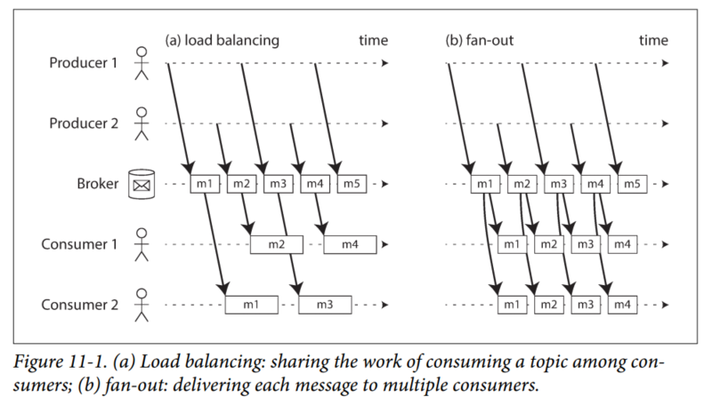
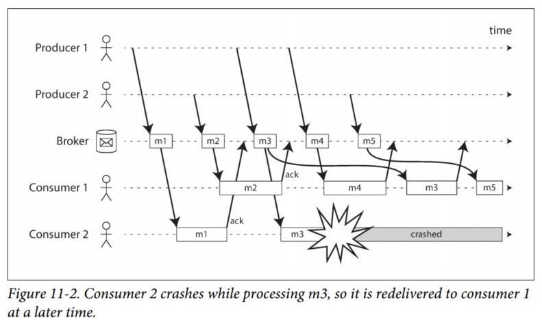
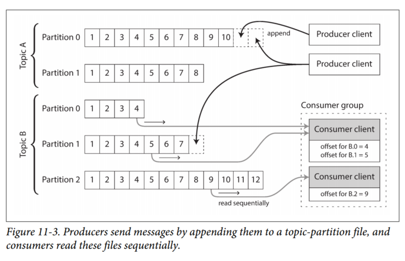
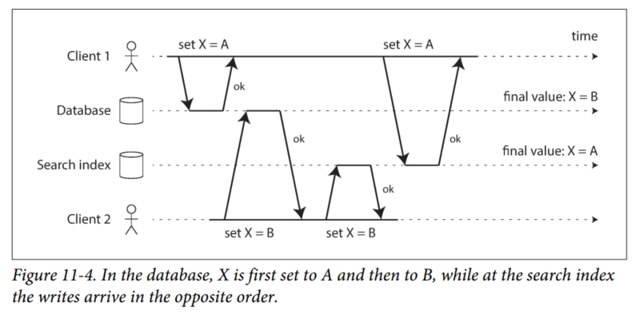
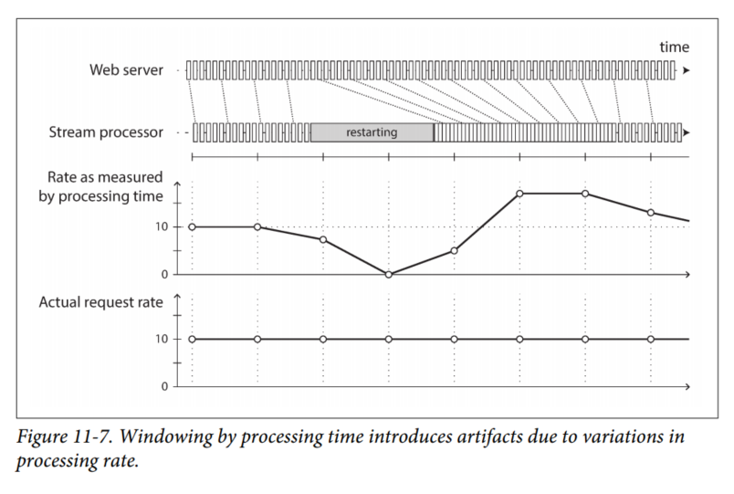

# Chapter 11 - Stream Processing

In general, a "stream" refers to data that is incrementally made available over time. In this chapter we will look at *event streams* as a data management mechanism: the unbounded, incrementally processed counterpart to the batch data we saw in the last chapter. We will first discuss how streams are represented, stored and transmitted over a network. Then, we will investigate the relationship between streams and databases. Afterwards, we will explore approaches and tools for processing those streams continually, and ways that they can be used to build applications.

## Transmitting Event Streams
In the batch processing world, the inputs and outputs of a job are files. What does the streaming equivalent look like?

When the input is a file, the first step is usually to parse into a sequence of records. In a stream processing context, a record is known as an *event*: a small, self-contained, immutable object containing the details of something that happened at some point in time.

An event may be encoded as a text string, or JSON, or perhaps in binary form. This encoding allows you to store an even by appending it to a file, inserting it into a relational table, or to a document database. It also allows you to send it over the network.

In batch processing, a file is written once and then potentially read by multiple jobs. In streaming terminology, an event is generated once by a *producer*, and then potentially processed by multiple *consumers*. In a filesystem, a filename identifies a set of related records; in a streaming system, related events are usually grouped together into a *topic*.

In principle, a database or file is sufficient to connect producers and consumers. Producers -> Database/File -> Consumers

When moving toward continual processing with low delays, polling becomes expensive if the datastore is not designed for this kind of usage. The more often you poll, the lower the percentage of requests that return new events, and thus the higher the overheads become. Hence, it is better for consumers to be notified when new events appear.

Databases have traditionally not supported this kind of notification mechanism very well: relational databases commonly have *triggers*, but they are very limited. Specialized tools have been developed for the purpose of delivering event notifications.

### Messaging Systems
A common approach for notifying consumers about new events is to use a *messaging system*: a producer sends a message containing the event, which is then pushed to consumers. A direct communication channel like a Unix pipe or TCP connection between producer and consumer would be a simple way of implementing a messaging system. However, most messaging systems expand on this basic model.

Within this *publish/subscribe* model, different systems take a wide range of approaches. To differentiate the systems, ask yourself these two questions:
1. *What happens if the producers send messages faster than the consumers can process?* Broadly speaking, there are 3 options: Drop messages, Buffer messages in a queue, or apply *backpressure* (block producers from sending more messages).

2. *What happens if nodes crash or temporarily go offline? - are any messages lost?* As with databases, durability may require some combination of writing to disk and/or replication, which has a cost. If you can afford to sometimes lose messages, you can probably get higher throughput and lower latency.

A nice property of batch processing systems is that they provide a strong reliability guarantee: failed tasks are automatically retried, and partial output from failed tasks is automatically discarded. Later in this chapter we will examine how we can provide similar guarantees in a streaming context.

#### Direct messaging from producers to consumers
A number of messaging systems use direct network communication between producers and consumers without going via intermediary nodes:

1. UDP multicast is widely used in financial industry for streams like stock market feeds, where low latency is important.
2. Brokerless messaging libraries like ZeroMQ and nanomsg take a similar approach, implementing pub/sub messaging over TCP or IP multicast.
3. StatsD and Brubeck user unreliable UDP messaging for collecting metrics from all machines on the network and monitoring them.
4. If the consumer exposes a service on the network, producers can make a direct HTTP or RPC request to push messages to the consumer. This is the idea behind webhooks, a pattern in which a callback URL of one service is registered with another service, and it makes a request to that URL whenever an event occurs.

These direct messaging systems generally require the application code to be aware of the possibility of message loss. They generally assume that producers and consumers are constantly online. While some protocols allow the producer to retry failed message deliveries, this approach may break down if the producer crashes, losing the buffer of messages that it was supposed to retry.  

#### Message brokers
A common alternative is to send messages via a *message broker* (a.k.a *message queue*), which is essentially a kind of database that is optimized for handling message streams.

By centralizing the data in the broker, these systems can more easily tolerate clients that come and go, and the responsibility of durability is moved to the broker instead. Some message brokers only keep messages in memory, while others write them to disk. They generally allow unbounded queuing (as opposed to dropping messages or backpressure), although this is configurable.  

A consequence of queuing is also that consumers are generally *asynchronous*: when a producer sends a message, it normally only waits for the broker to confirm that it has buffered the message and does not wait for the message to be processed by consumers.

#### Message brokers compared to databases
Some message brokers can even participate in two-phase commit protocols using XA or JTA. This feature makes them quite similar in nature to databases, although there are still important practical differences between message brokers and databases:
1. Databases usually keep data until it is explicitly deleted, whereas most message brokers automatically delete a message when it has been successfully delivered to its consumers.
2. Most message brokers assume that their working set is fairly small. Otherwise, the overall throughput might degrade and this defeats the purpose of using message brokers in the first place.
3. Databases often support secondary indexes and various ways of searching for data, while message brokers often support some way of subscribing to a subset of topics matching some pattern. Both are essentially ways for a client to select the portion of the data that it wants to know about.
4. When querying a database, the result is typically a snapshot of the data. If another client writes something to the database that changes the query result, the first client does not automatically find out that its prior result has changed. Message brokers do not support arbitrary queries, but they do notify clients when data changes.

**Note:** This is the traditional view of message brokers, which is encapsulated in standards like JMS (Java Messaging System) and AMQP (Advanced Message Queuing Protocol) and implemented in software like RabbitMQ, ActiveMQ, HornetQ, Qpid, Google Cloud Pub/Sub.

#### Multiple consumers
When multiple consumers read messages in the same topic, two main patterns of messaging are used:
1. *Load balancing*  
Each message is delivered to *one* of the consumers, so the consumers can share the work of processing the messages in the topic. This pattern is useful when the messages are expensive to process, and so you want to be able to add consumers to parallelize the processing.

2. *Fan-out*  
Each message is delivered to *all* of the consumers. Fan-out allows several independent consumers to each "tune in" to the same broadcast of messages, without affecting each other (equivalent of having several batch jobs that read the same input file)



The two patterns can be combined: for example, two separate groups of consumers may each subscribe to a topic, such that each group collectively receives all messages, but within each group only one of the nodes receives each message.

#### Acknowledgements and re-delivery
In order to ensure that messages are not lost, message brokers use *acknowledgements*: a client must explicitly tell the broker when it has finished processing a message so that the broker can remove it from the queue.

**Note**: that it could happen that the message was actually fully processed, but the acknowledgement was lost in the network. Handling this case requires an atomic commit protocol, as discussed in "Distibuted Transactions in Practice" in Chapter 9.

When combined with load balancing, this redelivery behavior has an interesting effect on the ordering of messages. In Figure 11-2, the consumers generally process messages in the order they were sent by producers.



However, consumer 2 crashes while processing *m3*, at the same time as consumer 1 is processing message *m4*. The unacknowledged message *m3* is subsequently redelivered to consumer 1, with the result that consumer 1 process messages in the order: *m4*, *m3*, *m5*. Thus, *m3* and *m4* are not delivered in the same order they were sent by producer 1.

The combination of load balancing and redelivery inevitably leads to messages being reordered. To avoid this issue, you can use a separate queue per consumer (not use the load balancing).

### Partitioned Logs
Message brokers take the transient approach, while databases and filesystems take the opposite approach: everything is permanently recorded until someone explicitly chooses to delete it.

This has a big impact on how derived data is created. A key feature of batch processes is that you can run them repeatedly without risk of damaging the input (since the input is read-only). This is not the case with message brokers, since receiving the acknowledgement causes the message to be deleted from the broker.

If you add a new consumer to a messaging system, it typically only starts receiving messages sent after the time it was registered. Contrast this with files and databases, where a new client can read all the data.

Can we have a hybrid, combining the durable storage approach of databases and the low-latency notification facilities of messaging? This is the idea behind *log-based message brokers*.

#### Using logs for message storage
A log is an append-only sequence of records on disk. The same structure can be used to implement a message broker: a producer sends a message by appending it to the end of the log, and a consumer receives messages by reading the log sequentially. If a consumer reaches the end of the log, it waits for a notification that a new message has been appended.

In order to scale to higher throughput than a single disk can offer, the log can be *partitioned*. Different partitions can be hosted on different machines, making each partition a separate log that works independently from other partitions. A topic can be defined as a group of partitions that carry messages of the same type.



Within each partition, the broker assigns a monotonically increasing sequence number (*offset*) to every message. Apache Kafka, Amazon Kinesis Streams, and Twitter's DistributedLog are log-based message brokers that work like this. Even though these message brokers write all messages to disk, they are able to achieve high throughput by partitioning across multiple machines, and fault tolerance by replicating messages.

#### Logs vs traditional messaging
Log based approach trivially supports fan-out messaging, as several consumers can independently read the log without affecting each other. To achieve load balancing across a group of consumers, the broker can assign entire partitions, instead of assigning individual messages, to nodes in the consumer group.

Each client then consumes *all* the messages in the partitions it has been assigned. Typically, when a consumer has been assigned a log partition, it reads the messages in the partition sequentially. This coarse-grained load balancing approach has some downsides:

1. The number of nodes sharing the work of consuming a topic can **at most** be the number of log partitions in that topic.
2. If a single message is slow to process, it blocks the processing of subsequent messages in that partition.

Thus, in situations where messages may be expensive to process and you want to parallelize processing on a message-by-message basis, and where message ordering is not important, the JMS (Java Messaging System)/AMQP (Advanced Message Queuing Protocol) style of message broker is preferable.

On the other hand, in situations with high message throughput, where each message is fast to process and where message ordering is important, the log-based approach works very well.

#### Consumer offsets
The broker does not need to track acknowledgements for every single message, it only needs to periodically record the consumer offsets. The reduced bookkeeping overhead and the opportunities for batching and pipelining in this approach help increase the throughput of log-based systems.

This offset is very similar to the *log sequence number* that is commonly found in single-leader database replication. In database replication, the log sequence number allows a follower to reconnect to a leader after it has become disconnected, and resume replication without skipping any writes. The message broker behaves like a leader database, and the consumer like a follower.

If a consumer node fails, another node in the consumer group is assigned the failed consumer's partitions, and it starts consuming messages at the last recorded offset. If the consumer had processed subsequent messages, but not yet recorded their offset, those messages will be processed a second time upon restart.

#### Disk space usage
If you only ever append to the log, you will eventually run out of disk space. To reclaim disk space, the log is actually divided into segments, and old segments are either deleted or moved into archive storage.

This means that if a slow consumer cannot keep up with the rate of messages, it may fall so far behind that the consumer offset points to a deleted segment and it will miss some of the messages. Effectively, the log implements a bounded-size buffer that discards old messages when it gets full, a.k.a. a *circular buffer* or *ring buffer*. However, since that buffer is on disk, it can be quite large.

Regardless of how long you retain messages, the throughput of a log remains more or less constant, since every message is written to disk anyway. This behavior is in contrast to messaging systems that keep messages in memory by default and only write them to disk if the queue grows too large: such systems are fast when queues are short and become much slower when they start writing to disk, so the throughput depends on the amount of history retained.

#### When consumers cannot keep up with producers
Earlier, we discussed three possible solutions: dropping messages, buffering, or applying backpressure.

If a consumer falls so far behind that the messages it requires are older than what is retained on disk, it will not be able to read those messages. The broker drops old messages that go back further than the buffer size. You can monitor how far a consumer is behind, and raise an alert if it falls behind significantly. As the buffer is large, there is enough time for a human operator to fix the slow consumer and allow it to catch up before it starts missing messages.

If a consumer falls too far behind and starts missing messages, only that consumer is affected. This is a big operational advantage: you can experimentally consume a production log for development, testing, or debugging purposes, without having to worry much about disrupting production services. When a consumer is shut down or crashes, it stops consuming resources. The only thing that remains is its consumer offset.

This behavior contrasts with traditional message brokers, where you need to be careful to delete any queues whose consumers have been shut down. Otherwise, they continue unnecessarily accumulating messages and taking away memory from active consumers.

#### Replaying old messages
With AMQP- and JMS-style message brokers, processing and acknowledging messages is a destructive operation, as messages as deleted on the broker. In a log-based message broker, consuming messages is more like reading from a file: it does not change the log; only the consumer offset moves forward.

But the offset is under the consumer's control, so it can easily be manipulated if necessary. This makes log-based messaging more like a batch process, where derived data is separated from input data through a repeatable transformation process. It allows more experimentation and easier recovery from errors and bugs, making it a good tool for integrating dataflows within an organization.

## Databases and Streams
We previously said that an event is a record of something that happened at some point in time. It can be a user action, a sensor reading, or a *write to a database*. This suggests that the connection between databases and streams runs deeper than just the physical storage of logs on disk.

In fact, a replication log is a stream of database write events, produced by the leader as it processes transactions. The followers apply that stream of writes to their own copy of the database and thus end up with an accurate copy of the same data. The events in the replication log describe the data changes that occurred.

In this section we will look at a problem that arises in heterogeneous data systems, and then explore how we can solve it by bringing ideas from event streams to databases.

### Keeping Systems in Sync
As the same or related data appears in several different places, they need to be kept in sync with one another. With data warehouses, this synchronization is usually performed by ETL processes, often by taking a full copy of a database, transforming it, and bulk-loading into the data warehouse (i.e. a batch process).

We saw in "The Output of Batch Workflows" on Chapter 10, how search indexes, recommendation systems, and other derived data systems might be created using batch processes.

If periodic full database dumps are too slow, an alternative that is sometimes used is *dual writes*, where the application code explicitly writes to each of the systems when data changes: for example, first writing to the database, then updating the search index, then invalidating the cache entries.

However, dual writes have some serious problems, one of which is a race condition.



In this example, two clients concurrently want to update an item X: client 1 wants to set the value to A, and client 2 wants to set it to B. Both clients first write the new value to the database, then write it to the search index. Due to unlucky timing, the requests are interleaved: the database first sees the write from client 1, then the write from client 2, so the final value in the database is B.

The search index first sees the write from client 2, then from client 1, so the final value in the search index is A. The two systems are now permanently inconsistent with each other.

Unless you have additional concurrency detection mechanism, such as the version vectors discussed in "Detecting Concurrent Writes" (Chapter 5), you will not even notice that concurrent writes have occurred.

Another problem with dual writes is that one of the writes may fail while the other succeeds. This also has the effect of the two systems becoming inconsistent with each other. Ensuring that they either both succeed or both fail is a case of the atomic commit problem (see "Atomic Commit and Two-Phase Commit (2PC) on Chapter 9").

If you only have one replicated database with a single leader, that leader determines the order of writes, so the state machine replication approach works among replicas of the database. However, in Figure 11-4, there isn't a single leader: the database may have a leader and the search index may have a leader, but neither follows the other, so conflicts can occur.

### Change Data Capture
The problem with most databases' replication logs is that they have long been considered to be an internal implementation detail of the database, not a public API. Clients are supposed to query the database through its data model and query language, not parse the replication logs and try to extract data from them.

Many databases simply did not have a documented way of getting the log of changes written to them. For this reason, it was difficult to take all the changes made in a database and replicate them to a different storage technology such as a search index, cache, or data warehouse.

There has been a growing interest in *change data capture* (CDC), which is the process of observing all data changes written to a database and extracting them in a form that can be replicated to other systems. CDC is especially interesting if changes are made available as a stream, immediately as they are written.

For example, you can capture the changes in a database and continually apply the same changes to a search index. If the log of changes is applied in the same order, you can expect the data in the search index to match the data in the database. The search index and any other derived data systems are just consumers of the change stream, as illustrated in Figure 11-5.


#### Implementing change data capture
We can call the log consumers *derived data systems*, as discussed in the introduction to Part III: The data stored in the search index and the data warehouse is just another view onto the data in the system of record.

CDC is a mechanism for ensuring that all changes made to the system of record are also reflected in the derived data systems so that the derived systems have an accurate copy of the data.

Essentially, CDC makes one database the leader, and turns the others into followers. A log-based message broker is well suited for transporting the change events from the source database, since it preserves the ordering of messages.

Database triggers can be used to implement CDC by registering triggers that observe all changes to data tables and add corresponding entries to a changelog table. However, they tend to be fragile and have significant performance overheads. Parsing the replication log can be a more robust approach, although it also comes with challenges, like handling schema changes.

Like message brokers, CDC is usually asynchronous: the system of record database does not wait for the change to be applied to consumers before committing it. This has the advantage that adding a slow consumer does not affect the system of record too much, but it has the downside that all the issues of replication lag apply ("Problems with Replication Lag" on Chapter 5)

#### Initial snapshot
If you have the log of all changes that were ever made to a database, you can reconstruct the entire state of the database by replaying the log. However, in many cases, keeping all changes would require too much disk space, so the log needs to be truncated.

Building a new full-text index requires a full copy of the entire database - it is not sufficient to only apply a log of recent changes, since it would be missing items that were not recently updated. Thus, if you don't have the entire log history, you need to start with a consistent snapshot.

The snapshot must correspond to a known position or offset in the change log, so that you know at which point to start applying changes after the snapshot has been processed. Some CDC tools integrate this snapshot facility, while others leave it as a manual operation.

#### Log compaction
If you can only keep a limited amount of log history, you need to go through the snapshot process every time you want to add a new derived data system. *Log compaction* provides a good alternative.

The storage engine periodically looks for log records with the same key, throws away any duplicates, and keeps only the most recent update for each key. This compaction and merging process runs in the background (remember Chapter 3).

In a log-structured storage engine, an update with a special null value (a *tombstone*) indicates that a key was deleted, and causes it to be removed during log compaction. But as long as the key is not overwritten or deleted, it remains in the log forever. The disk space required for such a compacted log depends only on the current contents of the database.

The same idea works in the context of log-based message brokers and CDC. If the CDC system is set up such that every change has a primary key, and every update for a key replaces the previous value for that key, then it's sufficient to keep just the most recent write for a particular key.

Now, when you want to rebuild a derived data system (like a search index), you can start a new consumer from offset 0 of the log-compacted topic, and sequentially scan over all messages in the log. The log is guaranteed to contain the most recent value for every key in the database.

This log compaction feature is supported by Apache Kafka. As we shall see later in this chapter, it allows the message broker to be used for durable storage, not just for transient messaging.

#### API support for change streams
Databases are beginning to support change streams as a first-class interface, rather than the typical retrofitted and reverse-engineered CDC efforts. For example, RethinkDB allows queries to subscribe to notifications when the results of a query change. Firebase and CouchDB provide data synchronization based on a change feed that is also made available to applications. Meteor uses the MongoDB oplog to subscribe to data changes and update the UI.

Kafka Connect is an effort to integrate CDC tools for a wide range of database systems with Kafka. Once the stream of change events is in Kafka, it can be used to update derived data systems such as search indexes, and also feed into stream processing systems.

### Event Sourcing
There are some parallels between the ideas we've discussed here and *event sourcing*, a technique that was developed in the domain-driven design (DDD) community. We will discuss event sourcing briefly, because it incorporates some useful and relevant ideas for streaming systems.

Similarly to CDC, event sourcing involves storing all changes to the application state as a log of change events. The biggest difference is that event sourcing applies the idea at a different level of abstraction:

1. In CDC, the application uses the database in a mutable way, updating and deleting records at will. The log of changes is extracted from the database at a low level, which ensures that the order of writes extracted from the database **matches the order** in which they are actually written, avoiding the race condition.

2. In event sourcing, the application logic is explicitly built on the basis of immutable events that are written to an event log. In this case, the event store is append-only, and updates or deletes are discouraged/prohibited. Events are designed to reflect things that happened at the application level, not low-level state changes.

Event sourcing is a powerful technique for data modeling: from an application POV it is more meaningful to record the user's actions as immutable events, rather than recording the effect of the actions. Event sourcing helps with debugging by making it easier to understand after the fact why something happened.

Specialized databases such as Event Store have been developed to support applications using event sourcing, but in general the approach is independent of any particular tool.

#### Deriving current state from the event log
Applications that use event sourcing need to take the log of events and transform it into application state that is suitable for showing to a user. This transformation should be deterministic so that you can run it again and derive the same application state from the event log.

Like with CDC, replaying the event log allows you to reconstruct the current state of the system. However, log compaction needs to be handled differently:
- A CDC event for the update of a record typically contains the entire new version of the record, so the current value for a primary key is entirely determined by the most recent event for that primary key, and log compaction can discard previous events for the same key.

- On the other hand, with event sourcing, events are modeled at a higher level: an event typically expresses the intent of a user action. In this case, later events typically do not override prior events, so you need the **full history of events to reconstruct the final state**. Log compaction is not possible in the same way.

Applications that use event sourcing typically have some mechanism for storing snapshots of the current state that is derived from the log of events, so they don't need to repeatedly reprocess the full log. However, this is only a performance optimization to speed up reads and recovery from crashes; the intention is that the system is able to store all raw events forever and reprocess the full event log when required.

#### Commands and events
The event sourcing philosophy distinguishes between *events* and *commands*. When a request from user first arrives, it is initially a *command*: at this point it may still fail, e.g. because some integrity condition is violated. The application must first validate that it can execute the command. If the validation is successful, the *command* becomes an *event*, which is durable and immutable.

For example, if a user tries to register a particular username, the application must check that the username is available. When that check has succeeded, the application can generate an *event* to indicate that a particular username was registered by a particular user ID. At the point the event is generated, it becomes a *fact*.

A consumer of the event stream is not allowed to reject an event: by the time the consumer sees the event, it is already an immutable part of the log. Thus, any validation of a command needs to happen synchronously, before it becomes an event - for example, by using a serializable transaction that automatically validates the command and publishes the event.

### State, Streams, and Immutability
We saw in Chapter 10 that batch processing benefits from the immutability of its input files. The principle of immutability is also what makes event sourcing and CDC powerful.

We normally think of databases as storing the current state of the application. This representation is optimized for reads, and it is usually the most convenient for serving queries. The nature of state is that it changes, so databases support inserting, updating, and deleting data. How does this fit with immutability?

Whenever you have state that changes, that state is the result of the events that mutated it over time. No matter how the state changes, there was always a sequence of events that caused those changes. The key idea is that mutable state and append-only log of immutable events are two sides of the same coin. The *changelog* represents the evolution of state over time.

If you store the changelog durably, that simply has the effect of making the state reproducible. Log compaction is one way of bridging the distinction between log and database state: it retains only the latest version of each record, and discards overwritten versions.

#### Advantages of immutable events
Auditability is one of the advantages of having immutable transactions in an append-only ledger. As discussed in "Philosophy of batch process outputs" in Chapter 10, if you accidentally deploy buggy code that writes bad data to a database, recovery is much harder if the code is able to destructively overwrite data. With an append-only log of immutable, it's much easier to diagnose and recover from the problem.

Immutable events also capture more information than just the current state. For example, on a shopping website, a customer may add an item to their cart and then remove it again. This information is recorded in an event log, but would be lost in a database that deletes items when they are removed from the cart. This could be useful for analytics purposes.

#### Deriving several views from the same event log
Moreover, by separating mutable state from the immutable event log, you can derive several different read-oriented representations from the same log of events. This works just like having multiple consumers of a stream (Figure 11-5): for example, the analytic database Druid ingests directly from Kafka using this approach, Pistachio is a distributed key-value store that uses Kafka as a commit log, and Kafka Connect sinks can export data from Kafka to various different databases and indexes.

It would make sense for many other storage and indexing systems, such as search servers, to similarly take their input from a distributed log.

Having an explicit translation step from an event log to a database makes it easier to evolve your application over time: if you want to introduce a new feature that presents your existing data in some new way, you can use the event log to build a separate read-optimized view for the new feature, and run it alongside the existing systems without having to modify them.

Running old and new systems side by side is often easier than performing a complicated schema migration in an existing system.

Storing data is normally quite straightforward if you don't have to worry about how it is going to be queried and accessed; many of the complexities of schema design, indexing, and storage engines are the result of wanting to support certain query and access patterns.

For this reason, you gain a lot of flexibility by separating the form in which data is written from the form it is read, and by allowing several different read views. This idea is sometimes known as *command query responsibility segregation* (CQRS).

The traditional approach to database and schema design is based on the fallacy that data must be written in the same form as it will be queried. It is entirely reasonable to denormalize data in the read-optimized views, as the translation process gives you a mechanism for keeping it consistent with the event log.

#### Concurrency control
The biggest downside of event sourcing and CDC is that the consumers of the event log are usually asynchronous, so there is a possibility of dirty-reading.

One solution would be to perform the updates of the read view synchronously with appending the event to the log. This requires a transaction to combine the writes into an atomic unit. Alternatively, you can use the approach discussed in "Implementing linearizable storage using total order broadcast" on Chapter 9.

On the other hand, deriving the current state from an event log also simplifies some aspects of concurrency control. Much of the need for multi-object transactions stems from a single user action requiring data to be changed in several different places.

With event sourcing, you can design an event such that it is a self-contained description of a user action. The user action then requires only a single write in one place (appending the events to the log), which is easy to make atomic.

If the event log and the application state are partitioned in the same way, then a straightforward single-threaded log consumers needs no concurrency control for writes.

#### Limitations of immutability
Many systems that don't use an event-sourced model nevertheless rely on immutability: various databases internally use immutable data structures or multi-version data to support point-in-time snapshots. Version control systems such as Git also rely on immutable data to preserve version history of files.

To what extent is it feasible to keep an immutable history of all changes forever? Some workloads mostly add data and rarely update or delete; they are easy to make immutable. Other workloads have a high rate of updates and deletes on a comparatively small dataset; in these cases, the immutable history may grow very large, fragmentation may become an issue, and the performance of compaction and garbage collection becomes crucial for operational robustness.

Besides the performance reasons, there may also be circumstances in which you need data to be deleted for administrative reasons, in spite of all immutability. In these circumstances, it's not sufficient to just append another event to the log to indicate that the prior data should be considered deleted - you actually want to rewrite history and pretend that the data was never written in the first place.

Truly deleting data is surprisingly hard, since copies can live in many places. Deletion is more a matter of "making it harder to retrieve the data".

## Processing Streams
So far we have talked about where streams come from (user activity, events, sensors, writes to databases) and we have talked about how streams are transported (through direct messaging, via message brokers, and in event logs).

What remains is to discuss what you can do with the stream once you have it. Broadly, there are three options:

1. You can take the data in the events and write it to a database, cache, search index, or similar storage system, from where it can then be queried by other clients.
2. You can push the events to users in some way, e.g. by sending email alerts or push notifications, or by streaming the events to a real-time dashboard.
3. You can process one or more input streams to produce one or more output streams. Streams may go through a pipeline consisting of several such processing stages before they eventually end up at an output (option 1 or 2).

In the rest of this chapter, we will discuss option 3: processing streams to produce other, derived streams. A piece of code that processes streams like this is known as an *operator* or a *job*. The patterns for partitioning and parallelization in stream processors are very similar to those in MapReduce and the dataflow engines we saw in Chapter 10. Basic mapping operations such as transforming and filtering records work the same.

The one crucial difference is that a stream never ends. This has many implications: sorting does not make sense with an unbounded dataset, and so sort-merge joins cannot be used. Fault-tolerance mechanism must also change: with a batch job, a failed task can simply be restarted, but with a stream job this may not be a viable option.

### Uses of Stream Processing
Stream processing has long been used for monitoring purposes. For example: fraud detection, stock price tracking, machine malfunction detection, etc. However, other uses of stream processing have also emerged over time. In this section we will briefly compare and contrast some of these applications.

#### Complex event processing
*Complex event processing* (CEP) is an approach developed in the 1990s for analyzing event streams, especially geared toward the kind of application that requires searching for event patterns. CEP allows you to specify rules to search for certain patterns of events in a stream.

CEP systems often use a high-level declarative query language like SQL, or a graphical user interface, to describe the patterns to be detected. These queries are submitted to a processing engine that consumes the input streams and internally maintains a state machine that performs the required matching. When a match is found, the engine emits a *complex event* with the details of the event pattern.

In these systems, the relationship between queries and data is reversed. Usually a database stores data persistently and treats queries as transient. CEP engines reverse these roles: queries are stored long-term, and events from the input streams are transient.

#### Stream analytics
The boundary between CEP and stream analytics is blurry, but as a general rule, analytics tends to be less interested in finding specific event sequences and more oriented towards aggregations and statistical metrics over a large number of events. Such statistics are often computed over fixed time interval, usually known as a *window*. Stream analytics systems sometimes use probabilistic algorithms, such as Bloom filters for set membership, HyperLogLog for cardinality estimation, and various percentile estimation algorithms. Probabilistic algorithms produce approximate results, but have the advantage of requiring significantly less memory than exact algorithms.

Many open source distributed stream processing frameworks are designed with analytics in mind: for example, Apache Storm, Spark Streaming, Flink, Concord, Samza, and Kafka Streams. Hosted services include Google Cloud Dataflow and Azure Stream Analytics.

#### Maintaining materialized views
A stream of changes to a database can be used to keep derived data systems, such as caches, search indexes, and data warehouses, up to date with a source database. We can regard these examples as specific cases of maintaining *materialized views*: deriving an alternative view onto some dataset so that you can query it efficiently, and updating that view whenever the underlying data changes.

Similarly, in event sourcing, application state is maintained by applying a log of events; here the application state is also a kind of materialized view. Unlike stream analytics scenarios, building the materialized view usually requires *all* events over an arbitrary time period, apart from any obsolete events that may be discarded by log compaction.

In principle, any stream processor could be used for materialized view maintenance, although the need to maintain events forever runs counter to the assumptions of some analytics-oriented frameworks that mostly operate on windows of a limited duration. Samza and Kafka Streams support this kind of usage.

#### Search on Streams
Besides CEP, there is also sometimes a need to search for individual events based on complex criteria, such as full-text search queries. For example, media monitoring services subscribe to feeds of new articles and broadcasts from media outlets, and search for any news mentioning companies, products, or topics of interest. This is done by formulating a search query in advance, and then matching the stream of news items against this query. The percolator feature of Elasticsearch is one option for implementing this.

Conventional search engines first index the documents and then run queries over the index. By contrast, searching a stream turns the processing on its head: the queries are stored, and the documents run past the queries, like in CEP. To optimize this process, it is possible to index the queries as well as the documents, and thus narrow down the set of queries that may match.

#### Message passing and RPC
In “Message-Passing Dataflow” on Chapter 4 we discussed message-passing systems as an alternative to RPC, i.e. as a mechanism for services to communicate, as used for example in the actor model. Although these systems are also based on messages and events, we normally don't think of them as stream processors:

- Actor frameworks are primarily a mechanism for managing concurrency and distributed execution of communicating modules, whereas stream processing is primarily a data management technique.
- Communication between actors is often ephemeral and one-to-one, whereas event logs are durable and multi-subscriber.
- Actors can communicate in arbitrary ways (including cyclic request/response patterns), but stream processors are usually set up in acyclic pipelines.

That said, there is some crossover area between RPC-like systems and stream processing. For example, Apache Storm has a feature called *distributed RPC*, which allows user queries to be farmed out to a set of nodes that also process event streams; these queries are then interleaved with events from the input streams, and results can be aggregated and sent back to the user.

It is also possible to process streams using actor frameworks. However, many such frameworks do not guarantee message delivery in the case of crashes, so the processing is not fault-tolerant unless you implement additional retry logic.

### Reasoning About Time
Stream processors often need to deal with time, especially when used for analytics purposes, which frequently use time windows. In a batch process, the processing tasks rapidly crunch through a large collection of historical events. If some kind of breakdown by time needs to happen, the batch process needs to look at the timestamp embedded in each event. There is no point in looking at the system clock, because the two times are not related.

On the other hand, many stream processing frameworks use the local system clock on the processing machine (the *processing time*) to determine windowing. This approach has the advantage of being simple, and it is reasonable if the delay between event creation and event processing is short. This means that it breaks down if there is a significant processing lag.

#### Event time vs. processing time
There are many reasons why processing may be delayed: queuing, network faults, performance issue, etc. Message delays can also lead to unpredictable ordering of messages.

Confusing event time and processing time leads to bad data. For example, you have a stream processor that measures the rate of requests. If you redeploy the stream processor, it may be shut down for a minute and process the backlog of events when it comes back up. If you measure the rate based on the **processing time**, it will look as if there was a sudden anomalous spike of requests while processing the backlog, while in fact the real rate of requests was steady.



#### Knowing when you're ready
A tricky problem when defining windows in terms of event time is that you can never be sure when you have received all of the events for a particular window.

For example, you're grouping events into one-minute windows so that you can count the number of requests per minute. You have counted some number of events with timestamps that fall in the 37th minute of the hour, and time has moved on; now most of the incoming events fall within the 38th and 39th minutes of the hour. When do you declare that you have finished the window for the 37th minute, and output its counter value?

You can time out and declare a window ready after you have not seen any new events for a while, but it could still happen that some events were buffered on another machine, delayed due to a network interruption. You need to be able to handle such *straggler* events that arrive after the window has been declared complete.

Broadly, you have two options:
1. Ignore the straggler events. You can track the number of dropped events as a metric, and alert if you start dropping a significant amount of data.
2. Publish a *correction*, an updated value for the window with stragglers included. You may also need to retract the previous output.

In some cases it is possible to use a special message to indicate "From now onwards there will be no more messages with a timestamp earlier than *t*", which can be used by consumers to trigger windows. However, if several producers on different machines are generating events, each with their own minimum timestamp thresholds, the consumers need to keep track of each producer individually. Adding and removing producers become trickier.

#### Whose clock are you using anyway?
Assigning timestamps to events is more difficult when events can be buffered at several points in the system. For example, consider a mobile app that reports events for usage metrics to a server. The app may be used while the device is offline, in which case it will buffer events locally on the device and send them to a server when an internet connection is next available. To any consumers of this stream, the events will appear as extremely delayed stragglers.

In this context, the timestamp of the events should be the time at which the user interaction occurred, according to the mobile device's local clock. However, the clock on a user-controlled device often cannot be trusted, as it may be wrong (accidentally or deliberately set). The time at which the event was received by the server is more likely to be accurate, since the server is under your control, but less meaningful in terms of describing the user interaction.

To adjust for incorrect device clocks, one approach is to log three timestamps:
- The time at which the event occurred, according to the device clock
- The time at which the event was sent to the server, according to the device clock
- The time at which the event was received by the server, according to the server clock

By subtracting the second timestamp from the third, you can estimate the offset between the device clock and the server clock. You can then apply that offset to the event timestamp, and thus estimate the true time at which the event actually occurred. This problem is not unique to stream processing - batch processing suffers from exactly the same issues of reasoning about time.

#### Types of windows
Once you know how the timestamp of an event should be determined, the next step is to decide how windows over time periods should be defined. Several types of windows are in common use:

1. *Tumbling window*  
A tumbling window has a fixed length, and every event belongs to exactly one window. For example, if you have a 1-minute tumbling window, all the events with timestamps between 00:03:00 and 00:03:59 are grouped into one window, events between 00:04:00 and 00:04:59 into the next window, and so on.

2. *Hopping window*  
A hopping window also has a fixed length, but allows windows to overlap in order to provide some smoothing. For example, a 5-minute window with a hop size of 1 minute would contain the events between 00:03:00 and 00:07:59, then the next window would cover events between 00:04:00 and 00:08:59, and so on.

3. *Sliding window*  
A sliding window contains all the events that occur within some interval of each other. For example, a 5-minute sliding window would cover events at 10:03:39 and 10:08:12, because they are less than 5 minutes apart (note that tumbling and hopping 5-minute windows would not have put these two events in the same window, as they use fixed boundaries). A sliding window can be implemented by keeping a buffer of events sorted by time and removing old events when they expire from the window.

4. *Session window*  
A session window has no fixed duration. Instead, it is defined by grouping together all events for the same user that occur closely together in time, and the window ends when the user has been inactive for some time.

## Stream Joins
In Chapter 10 we discussed how batch jobs can join datasets by key, and how such joins form an important part of data pipelines. Stream processing generalizes data pipelines to incremental processing to unbounded datasets, so there is exactly the same need for joins on streams.

However, the fact that new events can appear anytime on a stream makes joins on streams more challenging than in batch jobs. Let's distinguish three types of joins: stream-stream joins, stream-table joins, and table-table joins.

#### Stream-stream join (window join)
Say you have a search feature on your website, and you want to detect recent trends in searched-for URLs. Every time someone types a search query, you log an event containing the query and the results returned. Every time someone clicks one of the search results, you log another event recording the click. In order to calculate the click-through rate for each URL in the search results, you need to bring together the events for the search action and the click action, which are connected by having the same session ID. Similar analyses are needed in advertising systems.

The click may never come if the user abandons their search, or it may come at any later time. Due to variable network delays, the click event may even arrive before the search event. You can choose a suitable window for the join. For example, you may choose to join a click with a search if they occur at most one hour apart.

Note that embedding the details of the search in the click event is not the same as joining the events. In order to measure search quality, you need accurate click-through rates, for which you need both the search events and the click events.

To implement this type of join, a stream processor needs to maintain *state*: for example, all the events that occurred in the last hour, indexed by session ID. Whenever a search event or click event occurs, it is added to the appropriate index, and the stream processor also checks the other index to see if another event for the same session ID has already arrived. If there is a matching event, you emit an event saying which search result was clicked. If the search event expires without you seeing a matching click event, you emit an event saying which search results were not clicked.

#### Stream-table join (stream enrichment)
In "Example: analysis of user activity events" (Figure 10-2), we saw an example of a batch job joining two datasets: a set of user activity events and a database of user profiles. It is natural to think of the user activity events as a stream, and to perform the same join a continuous basis in a stream processor: the input is a stream of activity events containing a user ID, and the output is a stream of activity events in which the user ID has been augmented with profile information about the user. This process is known as *enriching* the activity events with info from the database.

To perform this join, the stream process needs to look at one activity event at a time, look up the event's user ID in the database, and add the profile information to the activity event. The database lookup can be implemented by querying a remote database, but such remote queries are likely to be slow and risk overloading the database.

Another approach is to load a copy of the database into the stream processor so that it can be queried locally without a network round trip. The local copy of the database might be an in-memory hash table if it is small enough, or an index on the local disk.

The difference to batch jobs is that a batch job uses a point-in-time snapshot of the database as input, whereas a stream processing is long-running, so the stream processor's local copy of the database needs to be kept up to date. This issue can be solved by change data capture: the stream processor can subscribe to a changelog of the user profile database as well as the stream of activity events. When a profile is created or modified, the stream processor updates its local copy. Thus, we obtain a join between two streams: the activity events and the profile updates.

A stream-table join is similar to a stream-stream join: the biggest difference is that for the table changelog stream, the join uses a window that reaches back to the "beginning of time", with newer versions of records overwriting older ones. For the stream input, the join might not maintain a window at all.

#### Table-table join (materialized view maintenance)
Consider the Twitter timeline example that we discussed in “Describing Load” on Chapter 1. We said that when a user wants to view their home timeline, it is too expensive to iterate over all the people the user is following, find their recent tweets, and merge them.

Instead, we want a timeline cache: a kind of per-user “inbox” to which tweets are written as they are sent, so that reading the timeline is a single lookup. Materializing and maintaining this cache requires the following event processing:

- When user *u* sends a new tweet, it is added to the timeline of every user who is following *u*.
- When a user deletes a tweet, it is removed from all users' timelines.
- When user *u1* starts following user *u2*, recent tweets by *u2* are added to *u1*'s timeline.
- When user *u1* unfollows user *u2*, tweets by *u2* are removed from *u1*'s timeline.

To implement this cache maintenance in a stream processor, you need streams of events for tweets (sending and deleting) and for following relationships (following and unfollowing). The stream process needs to maintain a database containing the set of followers for each user so that it knows which timelines need to be updated when a new tweet arrives.

Another way of looking at this stream process is that it maintains a materialized view for a query that joins two tables (tweets and follows), something like:

```
SELECT follows.follower_id AS timeline_id,
  array_agg(tweets.* ORDER BY tweets.timestamp DESC)
FROM tweets
JOIN follows ON follows.followee_id = tweets.sender_id
GROUP BY follows.follower_id
```

The join of the streams corresponds directly to the join of the tables in that query. The timelines are effectively a cache of the result of this query, updated every time the underlying tables change.

#### Time-dependence of joins
The three types of joins described here (stream-stream, stream-table, and table-table) have a lot in common: they all require the stream processor to maintain some state (search and click events, user profiles, or follower list) based on one join input, and query that state on messages from the other join input.

The order of the events that maintain the state is important. In a partitioned log, the ordering of events within a single partition is preserved, but there is typically no ordering guarantee across different streams or partitions.

If events on different streams happen around a similar time, in what order are they processed? If the ordering of events across streams is undetermined, the join becomes nondeterministic, which means you cannot rerun the same job on the same input and necessarily get the same output.

In data warehouses, this is known as a *slowly changing dimension* (SCD), and is often addressed by using a unique identifier for a particular version of the joined record. This change makes the join deterministic, but makes log compaction not possible, since all version of the records in the table need to be retained.

### Fault Tolerance
In batch processing, if a task in a MapReduce job fails, it can simply be started again and the output of the failed task is discarded. The same issue of fault tolerance arises in stream processing, but is less straightforward to handle. Waiting a task is finished before making its output visible is not an option, because a stream is infinite, and so you can never finish processing it.

#### Microbatching and checkpointing
One solution is to break the stream into small blocks, and treat each block like a mini batch process. This is called *microbatching*, and is used in Spark Streaming. The batch size is typically around 1 second. Smaller batches incur greater scheduling and coordination overhead, while larger batches mean a longer delay before the results become visible.

Microbatching also implicitly provides a tumbling window equal to the batch size; any jobs the require larger windows need to explicitly carry over state from one microbatch to the next.

A variant approach, used in Apache Flink, is to periodically generate rolling checkpoints of state and write them to durable storage. If a stream operator crashes, it can restart from its most recent checkpoint and discard any output generated between the last checkpoint and the crash. The checkpoints are triggered by barriers in the message stream, similar to the boundaries between microbatches, but without forcing a particular window size.

As soon as the output leaves the stream processor, the framework is no longer able to discard the output of a failed batch. In this case, restarting a failed task causes the external side effect to happen twice.

#### Atomic commit revisited
In order to give the appearance of exactly-once processing in the presence of faults, we need to ensure that all outputs and side effects of processing an event take effect *if and only if* the processing is successful.

Those things either all need to happen atomically, or none of them must happen, but they should not go out of sync with each other.

In Chapter 9 we discussed the problems in the traditional implementations of distributed transactions, such as XA. However, in more restricted environments it is possible to implement such an atomic commit facility efficiently. This approach is used in Google Cloud Dataflow and VoltDB, and there are plans to add similar features to Apache Kafka. Unlike XA, these implementations do not attempt to provide transactions across heterogeneous technologies, but instead keep them internal by managing both state changes and messaging within the stream processing framework. The overhead of the transaction protocol can be amortized by processing several input messages within a single transaction.

#### Idempotence
Our goal is to discard the partial output of any failed tasks so that they can be safely retried without taking effect twice. Distributed transactions are one way of achieving that goal, but another way is to rely on *idempotence*.

An idempotent operation is one that you can perform multiple times, and it has the same effect as if you performed it only once.

Even if an operation is not naturally idempotent, it can often be made idempotent with a bit of extra metadata. For example, when consuming messages from Kafka, every message has a persistent, monotonically increasing offset. When writing a value to an external database, you can include the offset of the message that triggered the last write with the value. Thus, you can tell whether an update has already been applied, and avoid performing the same update again.

Relying on idempotence implies several assumptions: restarting a failed task must replay the same messages in the same order, the processing must be deterministic and no other node may concurrently update the same value.

When failing over from one processing node to another, fencing may be required ("The leader and the Lock" Chapter 8) to prevent interference from a node that is thought to be dead but is actually alive. Despite all those caveats, idempotent operations can be an effective way of achieving exactly-once semantics with only a small overhead.

#### Rebuilding state after a failure
Any stream process that requires state - for example, windowed aggregations and any tables and indexes used for joins - must ensure that this state can be recovered after a failure.

One option is to keep the state in a remote datastore and replicate it, although having to query a remote database for each individual message can be slow. An alternative is to keep state local to the stream processor, and replicate it periodically. Then, when the stream processor is recovering from a failure, the new task can read the replicated state and resume processing without data loss.

For example, Flink periodically captures snapshots of operator state and writes them to durable storage such as HDFS; Samza and Kafka Streams replicate state changes by sending them to a dedicated Kafka topic with log compaction, similar to change data capture. VoltDB replicates state by redundantly processing each input message on several nodes.

In some cases, it may not even be necessary to replicate the state, because it can be rebuilt from the input streams. For example, if the state consists of aggregations over a fairly short window, it may be fast enough to simply replay the input events corresponding to that window. If the state is a local replica of a database, maintained by change data capture, the database can also be rebuilt from the log-compacted change stream.

However, all of these trade-offs depend on the performance characteristics of the underlying infrastructure: in some systems, network delay may be lower than disk access latency, and network bandwidth may be comparable to disk bandwidth. There is no universally ideal trade-off for all situations, and the merits of local versus remote state may also shift as storage and networking technologies evolve.

# Summary
In this chapter we have discussed event streams, what purposes they serve, and how to process them. In some ways, stream processing is very much like the batch processing we discussed in Chapter 10, but done continuously on unbounded (neverending) streams rather than on a fixed-size input. From this perspective, message brokers and event logs serve as the streaming equivalent of a filesystem.

We spent some time comparing two types of message brokers:

1. *AMQP/JMS-style message broker*  
The broker assigns individual messages to consumers, and consumers acknowledge individual messages when they have been successfully processed. Messages are deleted from the broker once they have been acknowledged. This approach is appropriate as an asynchronous form of RPC, for example in a task queue, where the exact order of message processing is not important and there is no need to go back and read old messages again after they have been processed.

2. *Log-based message broker*  
The broker assigns all messages in a partition to the same consumer node, and always delivers messages in the same order. Parallelism is achieved through partitioning, and consumers track their progress by checkpointing the offset of the last message they have processed. The broker retains messages on disk, so it is possible to jump back and reread old messages if necessary.

The log-based approach has similarities to the replication logs found in databases (see Chapter 5) and log-structured storage engines (see Chapter 3). We saw that this approach is especially appropriate for stream processing systems that consume input streams and generate derived state or derived output streams.

In terms of where streams come from, we discussed several possibilities: user activity events, sensors providing periodic readings, and data feeds (e.g., market data in finance) are naturally represented as streams. We saw that it can also be useful to think of the writes to a database as a stream: we can capture the changelog—i.e., the history of all changes made to a database—either implicitly through change data capture or explicitly through event sourcing. Log compaction allows the stream to retain a full copy of the contents of a database.

Representing databases as streams opens up powerful opportunities for integrating systems. You can keep derived data systems such as search indexes, caches, and analytics systems continually up to date by consuming the log of changes and applying them to the derived system. You can even build fresh views onto existing data by starting from scratch and consuming the log of changes from the beginning all the way to the present.

The facilities for maintaining state as streams and replaying messages are also the basis for the techniques that enable stream joins and fault tolerance in various stream processing frameworks. We discussed several purposes of stream processing, including searching for event patterns (complex event processing), computing windowed aggregations (stream analytics), and keeping derived data systems up to date (materialized views).

We then discussed the difficulties of reasoning about time in a stream processor, including the distinction between processing time and event timestamps, and the problem of dealing with straggler events that arrive after you thought your window was complete.

We distinguished three types of joins that may appear in stream processes:

1. *Stream-stream joins*  
Both input streams consist of activity events, and the join operator searches for related events that occur within some window of time. For example, it may match two actions taken by the same user within 30 minutes of each other. The two join inputs may in fact be the same stream (a self-join) if you want to find related events within that one stream.

2. *Stream-table joins*  
One input stream consists of activity events, while the other is a database changelog. The changelog keeps a local copy of the database up to date. For each activity event, the join operator queries the database and outputs an enriched activity event.

3. *Table-table joins*  
Both input streams are database changelogs. In this case, every change on one side is joined with the latest state of the other side. The result is a stream of changes to the materialized view of the join between the two tables.

Finally, we discussed techniques for achieving fault tolerance and exactly-once semantics in a stream processor. As with batch processing, we need to discard the partial output of any failed tasks. However, since a stream process is long-running and produces output continuously, we can’t simply discard all output. Instead, a finer-grained recovery mechanism can be used, based on microbatching, checkpointing, transactions, or idempotent writes.

---
