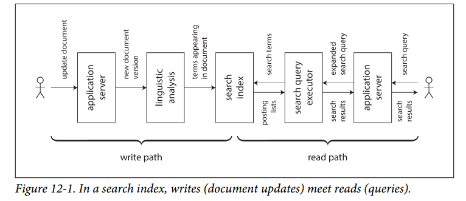

# Chapter 12 - The Future of Data Systems

## Data Integration
A recurring theme has been that for any given problem, there are several solutions, all of which have different pros, cons and trade-offs. For example, when discussing storage engines in Chapter 3, we saw log-structured storage, B-trees, and column-oriented storage. When discussing replication in Chapter 5, we saw single-leader, multi-leader and leaderless approaches.

### Combining Specialized Tools by Deriving Data
For example, it is common to need to integrate an OLTP database with a full-text search index in order to handle queries for arbitrary keywords. Some databases such as PostgreSQL include a full-text indexing feature that is sufficient for simple applications, but more sophisticated search facilities require specialist information retrieval tools.

Conversely, search indexes are not generally very suitable as a durable system of record, and so many applications need to combine different tools to satisfy all the requirements.

As the number of different representation of data increases, the integration problem becomes harder. Besides the database and the search index, perhaps you need to keep copies of the data in analytics systems; maintain caches or denormalized versions of objects that were derived from the original data; pass the data through machine learning, classification, ranking, or recommendation systems; or send notifications based on changes to the data.

#### Reasoning about dataflows
When copies of the same data need to be maintained in several storage systems in order to satisfy different access patterns, you need to be very clear about the inputs and outputs: where is data written first, and which representations are derived from which sources? How do you get the data into all the right places, in the right formats?

Allowing the application to directly write to both the search index and the database introduces the problem shown in Figure 11-4, in which two clients concurrently send conflicting writes and the two storage systems process them in a different order. In this case, neither the database nor the search index is "in charge" of determining the order of writes, and so they may make contradictory decisions and become permanently inconsistent with each other.

If it is possible for you to funnel all user input through a single system that decides on an ordering for all writes, it becomes easier to derive other representations of the data by processing the writes in the same order.

Updating a derived data system based on an event log can often be made deterministic and idempotent, making it quite easy to recover from faults.

#### Derived data vs. distributed transactions
The classic approach for keeping different data systems consistent with each other involves distributed transactions.

At an abstract level, derived data systems and distributed transactions achieve a similar goal by different means. Distributed transactions decide on an ordering of writes by using locks for mutual exclusion, while CDC and event sourcing use a log for ordering.

Distributed transactions use atomic commit to ensure that changes take effect exactly once, while log-based systems are often based on deterministic retry and idempotence.

The biggest difference is that transaction systems usually provide linearizability, which implies useful guarantees such as reading your own writes. Derived data systems are often updated asynchronously, so they do not by default offer the same timing guarantees.

Within limited environments that are willing to pay the cost of distributed transactions, they have been used successfully. However, XA has poor fault tolerance and performance characteristic, which limits its usefulness.

In the absence of widespread support for a good distributed transaction protocol, log-based derived data is the most promising approach for integrating different data systems. However, guarantees such as reading your own writes are useful.

#### The limits of total ordering
With systems that are small enough, constructing a totally ordered event log is feasible. However, as systems are scaled toward bigger and more complex workloads, limitations begin to emerge:

- In most cases, constructing a totally ordered log requires all events to pass through a *single leader node* that decides on the ordering. If the throughput of events is greater than a single machine can handle, you need to partition it across multiple machines. The order of events in two different partitions is then ambiguous.

- If the servers are spread across multiple *geographically distributed* datacenters, you typically have a separate leader in each datacenter, because network delays make synchronous cross-datacenter coordination inefficient. This implies an undefined ordering of events that originate in two different datacenters.

- When applications are deployed as *microservices*, a common design choice is to deploy each service and its durable state as an independent unit, with no durable state shared between services. When two events originate in different services, there is no defined order for those events.

- Some applications maintain client-side state that is updated immediately on user input, and even continue to work offline. With such applications, clients and servers are likely to see events in different orders.

Deciding on a total order of events is known as *Total order broadcast*, which is equivalent to consensus. Most consensus algorithms are designed for situations in which the throughput of a single node is sufficient to process the entire stream of events, and these algorithms do not provide a mechanism for multiple nodes to share the work of ordering the events. It is still an open research problem to design consensus algorithms that can beyond the throughput of a single node and that work well in a geographically distributed setting.

#### Ordering events to capture causality
In cases where there is no causal link between events, the lack of a total order is not a big problem. Some other cases are easy to handle: for example, when there are multiple updates of the same object, they can be totally ordered by routing all updates for a particular object ID to the same log partition.

For example, consider a social networking service, and two users who were in a relationship but have just broken up. One of the users removes the other as a friend, and then sends a message to their remaining friends complaining about their ex-partner. The user’s intention is that their ex-partner should not see the rude message, since the message was sent after the friend status was revoked.

However, in a system that stores friendship status in one place and messages in another place, that ordering dependency between the *unfriend* event and the *message-send* event may be lost. If the causal dependency is not captured, a service that sends notifications about new messages may process the *message-send* event before the *unfriend* event, and thus incorrectly send a notification to the ex-partner.

In this example, the notifications are effectively a join between the messages and the friend list, making it related to the timing issues of joins that we discussed previously. Unfortunately, there does not seem to be a simple answer to this problem.

Starting points include:
- Logical timestamps can provide total ordering without coordination, so they may help in cases where total order broadcast is not feasible. However, they still require recipients to handle events that are delivered out of order, and they require additional metadata to be passed around.

- If you can log an event to record the state of the system that the user saw before making a decision, and give that event a unique identifier, then any later events can reference that event identifier in order to record the causal dependency.

- Conflict resolution algorithms help with processing events that are delivered in an unexpected order. They are useful for maintaining state, but do not help if actions have external side effects (e.g. sending a notification to a user)

Perhaps, over time, patterns for application development will emerge that allow causal dependencies to be captured efficiently, and derived state to be maintained correctly, without forcing all events to go through the bottleneck of total order broadcast.

### Batch and Stream Processing
The outputs of batch and stream processes are derived datasets such as search indexes, materialized views, recommendations to show to users, aggregate metrics, and so on. As we saw in Chapter 10 and Chapter 11, batch and stream processing have a lot of principles in common, except that stream processors operate on unbounded datasets.

Spark performs stream processing on top of a batch processing engine by breaking the stream into *microbatches*, whereas Apache Flink performs batch processing on top of a stream processing engine.

#### Maintaining derived state
Batch processing encourages deterministic, pure functions whose output depends only on the input and which have no side effects other than the explicit outputs, treating inputs as immutable and outputs as append-only. Stream processing is similar, but it extends operators to allow managed, fault-tolerant state.

The principle of deterministic functions with well-defined inputs and outputs is not only good for fault tolerance, but also simplifies reasoning about the dataflows in an organization. No matter whether the derived data is a search index, a statistical model, or a cache, it is helpful to think in terms of data pipelines that derive one thing from another, pushing state changes in one system through functional application code and applying the effects to derived systems.

In principle, derived data systems could be maintained synchronously, just like a relational database updates secondary indexes synchronously within the same transaction as writes to the table being indexed. However, **asynchrony** is what makes systems based on event logs robust: it allows a fault in one part of the system to be contained locally, whereas distributed transactions abort if any one participant fails, so they tend to amplify failures by spreading them to the rest of the system.

#### Reprocessing data for application evolution
When maintaining derived data, batch and stream processing are both useful. Stream processing allows changes in the input to be reflected in derived views with low delay, whereas batch processing allows large amounts of accumulated historical data to be reprocessed in order to derive new views onto an existing dataset.

Reprocessing existing data provides a good mechanism for maintaining a system, evolving it to support new features and changed requirements (see Chapter 4). Without reprocessing, schema evolution is limited to simple changes like adding a new optional field to a record, or adding a new type of record. This is the case both in a schema-on-write and in a schema-on-read context (see “Schema flexibility in the document model” on page 39). On the other hand, with reprocessing it is possible to restructure a dataset into a completely different model in order to better serve new requirements.

Derived views allow gradual evolution. If you want to restructure a dataset, you do not need to perform the migration as a sudden switch. Instead, you can maintain the old schema and the new schema side by side as two independently derived views onto the same underlying data. Gradually, you can increase the proportion of users accessing the new view, and eventually drop the old view.

#### The lambda architecture
If batch processing is used to reprocess historical data, and stream processing is used to process recent updates, then how do you combine the two? The lambda architecture is a proposal in this area that has gained a lot of attention.

The core idea of the lambda architecture is that incoming data should be recorded by appending immutable events to an always-growing dataset, similarly to event sourcing (see “Event Sourcing” on page 457). From these events, read-optimized views are derived. The lambda architecture proposes running two different systems in parallel: a batch processing system such as Hadoop MapReduce, and a separate stream-processing system such as Storm.

In the lambda approach, the stream processor consumes the events and quickly produces an approximate update to the view; the batch processor later consumes the same set of events and produces a corrected version of the derived view. The reasoning behind this design is that batch processing is simpler and thus less prone to bugs, while stream processors are thought to be less reliable and harder to make fault-tolerant (see “Fault Tolerance” on page 476). Moreover, the stream process can use fast approximate algorithms while the batch process uses slower exact algorithms.

The lambda architecture was an influential idea that shaped the design of data systems for the better, particularly by popularizing the principle of deriving views onto streams of immutable events and reprocessing events when needed. However, there are a few practical problems too:

- Having to maintain the same logic to run both in a batch and in a stream processing framework is significant additional effort.

- Since the stream pipeline and the batch pipeline produce separate outputs, they need to be merged in order to respond to user requests. This merge is fairly easy if the computation is a simple aggregation over a tumbling window, but it becomes significantly harder if the view is derived using more complex operations such as joins and sessionization, or if the output is not a time series.

- Although it is great to have the ability to reprocess the entire historical dataset, doing so frequently is expensive on large datasets. Thus, the batch pipeline often needs to be set up to process incremental batches (e.g., an hour’s worth of data at the end of every hour) rather than reprocessing everything. This raises the problems discussed in “Reasoning About Time” on page 468, such as handling stragglers and handling windows that cross boundaries between batches. Incrementalizing a batch computation adds complexity, making it more akin to the streaming layer, which runs counter to the goal of keeping the batch layer as simple as possible.

#### Unifying batch and stream processing
More recent work has enabled the benefits of the lambda architecture to be enjoyed without its downsides, by allowing both batch computations (reprocessing historical data) and stream computations to be implemented in the same system.

Unifying batch and stream processing in one system requires the following features:
- The ability to replay historical events through the same processing engine that handles the stream of recent events. For example, log-based message brokers have the ability to replay messages and some stream processors can read input from a distributed filesystem like HDFS.

- Exactly-once semantics for stream processors—that is, ensuring that the output is the same as if no faults had occurred, even if faults did in fact occur. Like with batch processing, this requires discarding the partial output of any failed tasks.

- Tools for windowing by event time, not by processing time, since processing time is meaningless when reprocessing historical events (see “Reasoning About Time” on Chapter 11). For example, Apache Beam provides an API for expressing such computations, which can then be run using Apache Flink or Google Cloud Dataflow.

## Unbundling Databases
At a most abstract level, databases, Hadoop, and operating systems all perform the same functions: store some data, and they allow you to process and query that data.

We will explore the different philosophies between the Unix approach and relational database approach.

### Composing Data Storage Technologies
We have discussed various features provided by databases and how they work, including:
- Secondary indexes, which allow you to efficiently search for records based on the value of a field ("Other Indexing Structures", Chapter 3)
- Materialized views, which are a kind of precomputed cache of query results ("Aggregation: Data Cubes and Materialized Views", Chapter 3)
- Replication logs, which keeps copies of the data on other nodes up to date ("Implementation of Replication Logs", Chapter 5)
- Full-text search indexes, which allow keyword search in text ("Full-text search and fuzzy indexes, Chapter 3") and which are built into some relational databases.

In Chapters 10 and 11, we talked about building full-text search indexes ("The Output of Batch Workflows"), and about materialized view maintenance ("Maintaining materialized views"), and about replicating changes from a database to derived data systems ("Change Data Capture").

It seems that there are parallels between the features that are built into databases and derived data systems that people are building with batch and stream processors.

#### Creating an index
What happens when you run `CREATE INDEX` to create a new index in a relational database? The database has to scan over a consistent snapshot of the table, pick out all of the field values being indexed, sort them, and then write out the index. Then it must process the backlog of writes that have been made since the consistent snapshot was taken. Once that is done, the database must continue to keep the index up to date whenever a transaction writes to the table.

This process is similar to setting up a new follower replica and to bootstrapping change data capture in a streaming system.

Whenever you run `CREATE INDEX`, the database essentially reprocesses the existing dataset and derives the index as a new view onto the existing data. The existing data may be a snapshot of the state rather than a log of all changes that ever happened.

#### The meta-database of everything
In this light, the dataflow across an entire organization starts looking like one huge database. Whenever a batch, stream, or ETL process transports data from one place and form to another place and form, it is acting like the database subsystem that keeps indexes or materialized views up to date.

Viewed like this, batch and stream processors are like elaborate implementations of triggers, stored procedures, and materialized view maintenance routines. The derived data systems they maintain are like different index types. For example, a relational database may support B-tree indexes, hash indexes, spatial indexes, and other types of indexes. In the emerging architecture of derived data systems, instead of implementing those facilities as features of a single integrated database product, they are provided by various different pieces of software, running on different machines, administered by different teams.

I speculate that there are two avenues by which different storage and processing tools can nevertheless be composed into a cohesive system:

1. *Federated databases: unifying reads*  
It is possible to provide a unified query interface to a wide variety of underlying storage engines and processing methods. This approach is known as *federated database* or *polystore*. Applications that need a specialized data model or query interface can still access the underlying storage engines directly, while users who want to combine data from disparate places can do so easily through the federated interface.

 A federated query interface follows the relational tradition of a single integrated system with a high-level query language and elegant semantics, but a complicated implementation.

2. *Unbundled databases: unifying writes*  
While federation addresses read-only querying across several different systems, it does not have a good answer to synchronizing writes across those systems. We said that within a single database, creating a consistent index is a built-in feature. When we compose several storage systems, we similarly need to ensure that all data changes end up in all the right places, even in the face of faults. Making it easier to reliably plug together storage systems (e.g., through change data capture and event logs) is like unbundling a database’s index-maintenance features in a way that can synchronize writes across disparate technologies.

#### Making unbundling work
Federation and unbundling are two sides of the same coin: composing a reliable, scalable, and maintainable system out of diverse components. Federated read-only querying requires mapping one data model into another, which takes some thought but is ultimately quite a manageable problem.

The traditional approach to synchronizing writes requires distributed transactions across heterogeneous storage systems, which **I think is the wrong solution** ("Derived data vs. distributed transactions" above). Transactions within a single storage or stream processing system are feasible, but when data crosses the boundary between different technologies, I believe that an asynchronous event log with idempotent writes is a much more robust and practical approach.

The big advantage of log-based integration is loose coupling between the various components, which manifests itself in two ways:

1. At a system level, asynchronous event streams make the system as a whole more robust to outages or performance degradation of individual components. If a consumer runs slow or fails, the event log can buffer messages (see “Disk space usage”, Chapter 11), allowing the producer and any other consumers to continue running unaffected. The faulty consumer can catch up when it is fixed, so it doesn’t miss any data, and the fault is contained. By contrast, the synchronous interaction of distributed transactions tends to escalate local faults into largescale failures.

2. At a human level, unbundling data systems allows different software components and services to be developed, improved, and maintained independently from each other by different teams. Specialization allows each team to focus on doing one thing well, with well-defined interfaces to other teams’ systems. Event logs provide an interface that is powerful enough to capture fairly strong consistency properties (due to durability and ordering of events), but also general enough to be applicable to almost any kind of data.

#### Unbundled vs. integrated systems
If unbundling does indeed become the way of the future, it will not replace databases in their current form—they will still be needed as much as ever. Databases are still required for maintaining state in stream processors, and in order to serve queries for the output of batch and stream processors.

**Specialized query engines** will continue to be important for particular workloads: for example, query engines in MPP data warehouses are optimized for exploratory analytic queries and handle this kind of workload very well.

The complexity of running several different pieces of infrastructure can be a problem, so it is worth deploying as few moving parts as possible. A single integrated software product may also be able to achieve better and more predictable performance on the kinds of workloads for which it is designed.

The goal of unbundling is not to compete with individual databases on performance for particular workloads; the goal is to allow you to combine several different databases in order to achieve good performance for a much wider range of workloads than is possible with a single piece of software.

**Thus, if there is a single technology that does everything you need, you’re most likely
best off simply using that product rather than trying to reimplement it yourself from
lower-level components.**

### Designing Applications Around Dataflow
In this section I will expand on these ideas and explore some ways of building applications around the ideas of unbundled databases and dataflow.

#### Application code as a derivation function
When one dataset is derived from another, it goes through some kind of transformation function. For example:

- A secondary index is a kind of derived dataset with a straightforward transformation function: for each row or document in the base table, it picks out the values in the columns or fields being indexed, and sorts by those values (assuming a B-tree or SSTable index, which are sorted by key, as discussed in Chapter 3).
- A full-text search index is created by applying various natural language processing functions such as language detection, word segmentation, stemming or lemmatization, spelling correction, and synonym identification, followed by building a data structure for efficient lookups (such as an inverted index).
- In a machine learning system, we can consider the model as being derived from the training data by applying various feature extraction and statistical analysis functions. When the model is applied to new input data, the output of the model is derived from the input and the model (and hence, indirectly, from the training data).
- A cache often contains an aggregation of data in the form in which it is going to be displayed in a user interface (UI). Populating the cache thus requires knowledge of what fields are referenced in the UI; changes in the UI may require updating the definition of how the cache is populated and rebuilding the cache.

The derivation function for a secondary index is so commonly required that it is built into many databases as a core feature, and you can invoke it by merely saying `CREATE INDEX`. For full-text indexing, basic linguistic features for common languages may be built into a database, but the more sophisticated features often require domain specific tuning. In machine learning, feature engineering is notoriously application specific, and often has to incorporate detailed knowledge about the user interaction and deployment of an application.

When the function that creates a derived dataset is not a standard cookie-cutter function like creating a secondary index, custom code is required to handle the application-specific aspects. And this custom code is where many databases struggle. Although relational databases commonly support triggers, stored procedures, and user-defined functions, which can be used to execute application code within the database, they have been somewhat of an afterthought in database design.

#### Separation of application code and state
In theory, databases could be deployment environments for arbitrary application code, like an operating system. However, in practice they have turned out to be poorly suited for this purpose. They do not fit well with the requirements of modern application development, such as dependency and package management, version control, rolling upgrades, evolvability, monitoring, metrics, calls to network services, and integration with external systems.

On the other hand, deployment and cluster management tools such as Mesos, YARN, Docker, Kubernetes, and others are designed specifically for the purpose of running application code. By focusing on doing one thing well, they are able to do it much better than a database that provides execution of user-defined functions as one of its many features.

Most web applications today are deployed as stateless services, in which any user request can be routed to any application server, and the server forgets everything about the request once it has sent the response. This style of deployment is convenient, as servers can be added or removed at will, but the state has to go somewhere: typically, a database. The trend has been to keep stateless application logic separate from state management (databases): not putting application logic in the database and not putting persistent state in the application.

In this typical web application model, the database acts as a kind of mutable shared variable that can be accessed synchronously over the network. The application can read and update the variable, and the database takes care of making it durable, providing some concurrency control and fault tolerance.

Databases have inherited this passive approach to mutable data: if you want to find out whether the content of the database has changed, often your only option is to poll (i.e., to repeat your query periodically).

#### Dataflow: Interplay between state changes and application code
Instead of treating a database as a passive variable that is manipulated by the application, we think much more about the interplay and collaboration between state, state changes, and code that processes them. Application code responds to state changes in one place by triggering state changes in another place.

Similar things happen inside a database when a trigger fires due to a data change, or when a secondary index is updated to reflect a change in the table being indexed. Unbundling the database means taking this idea and applying it to the creation of derived datasets outside of the primary database: caches, full-text search indexes, machine learning, or analytics systems. We can use stream processing and messaging systems for this purpose.

The important thing to keep in mind is that maintaining derived data is not the same as asynchronous job execution, for which messaging systems are traditionally designed:

- When maintaining derived data, the order of state changes is often important. As discussed in
“Acknowledgments and redelivery” on Chapter 11, many message brokers do not have this property when redelivering unacknowledged messages. Dual writes are also ruled out ("Keeping Systems in Sync", Chapter 11)

- Fault tolerance is key for derived data: losing just a single message causes the derived dataset to go permanently out of sync with its data source. Both message delivery and derived state updates must be reliable.

#### Stream processors and services
The currently trendy style of application development involves breaking down functionality into a set of services that communicate via synchronous network requests such as REST APIs. The advantage of such a service-oriented architecture over a single monolithic application is primarily organizational scalability through loose coupling.

Composing stream operators into dataflow systems has a lot of similar characteristics to the microservices approach. However, the underlying communication mechanism is very different: stream operators use *one-directional, asynchronous message streams* rather than synchronous request/response interactions.

Besides the advantages listed in "Message-Passing Dataflow" on Chapter 4, such as better fault tolerance, dataflow systems can also achieve better performance.

For example, say a customer is purchasing an item that is priced in one currency but paid for in another currency. In order to perform the currency conversion, you need to know the current exchange rate. This operation could be implemented in two ways:

1. In the microservices approach, the code that processes the purchase would probably query an exchange-rate service or database in order to obtain the current rate for a particular currency.

2. In the dataflow approach, the code that processes purchases would subscribe to a stream of exchange rate updates ahead of time, and record the current rate in a local database whenever it changes. When it comes to processing the purchase, it only needs to query the **local database**.

Dataflow approach is also more robust to the failure of another service. The fastest and most reliable network request is no network request at all! Instead of RPC, we now have a stream join between purchase events and exchange rate update events ("Stream-table join" on Chapter 11)

### Observing Derived State
At an abstract level, the dataflow systems discussed in the last section give you a process for creating derived datasets (such as search indexes, materialized views, and predictive models) and keeping them up to date. Let’s call that process the *write path*: whenever some piece of information is written to the system, it may go through multiple stages of batch and stream processing, and eventually every derived dataset is updated to incorporate the data that was written. Figure 12-1 shows an example of updating a search index.



You create the derived dataset because you want to query it again later. This is called the *read path*: when serving a user request you read from the derived dataset, perform processing on the results if required, and construct the response to the user.

Taken together, the write path and the read path encompass the whole journey of the data, from the point where it is collected to the point where it is consumed (probably by another human). The write path is the portion of the journey that is precomputed —i.e., that is done eagerly as soon as the data comes in, regardless of whether anyone has asked to see it. The read path is the portion of the journey that only happens when someone asks for it. If you are familiar with functional programming languages, you might notice that the write path is similar to eager evaluation, and the read path is similar to lazy evaluation.

The derived dataset is the place where the write path and the read path meet. It represents a trade-off between the amount of work that needs to be done at write time and the amount that needs to be done at read time.

#### Materialized views and caching
A full-text search index is a good example: the write path updates the index, and the read path searches the index for keywords. Both reads and writes need to do some work. Writes need to update the index entries for all terms that appear in the document. Reads need to search for each of the words in the query, and apply Boolean logic to find documents that contain *all* of the words in the query (an `AND` operator), or *any* synonym of each of the words (an `OR` operator).

If you didn’t have an index, a search query would have to scan over all documents (like grep), which would get very expensive if you had a large number of documents. No index means less work on the write path (no index to update), but a lot more work on the read path.

On the other hand, you could imagine precomputing the search results for all possible queries. In that case, you would have less work to do on the read path: no Boolean logic, just find the results for your query and return them. However, the write path would be a lot more expensive: the set of possible search queries that could be asked is infinite, and thus precomputing all possible search results would require infinite time and storage space. That wouldn’t work so well

Another option would be to precompute the search results for only a fixed set of the most common queries, so that they can be served quickly without having to go to the index. The uncommon queries can still be served from the index. This would generally be called a cache of common queries, although we could also call it a materialized view, as it would need to be updated when new documents appear that should be included in the results of one of the common queries.

From this example we can see that an index is not the only possible boundary between the write path and the read path. Caching of common search results is possible, and `grep`-like scanning without the index is also possible on a small number of documents. Viewed like this, the role of caches, indexes, and materialized views is simple: they shift the boundary between the read path and the write path. They allow us to do more work on the write path, by precomputing results, in order to save effort on the read path.

#### Stateful, offline-capable clients
Traditionally, web browsers have been stateless clients that can only do useful things when you have an internet connection. However, recent “single-page” JavaScript web apps have gained a lot of stateful capabilities, including client-side user interface interaction and persistent local storage in the web browser. Mobile apps can similarly store a lot of state on the device and don’t require a round-trip to the server for most user interactions.

These changing capabilities have led to a renewed interest in offline-first applications that do as much as possible using a local database on the same device, without requiring an internet connection, and sync with remote servers in the background when a network connection is available. Since mobile devices often have slow and unreliable cellular internet connections, it’s a big advantage for users if their user interface does not have to wait for synchronous network requests, and if apps mostly work offline.

When we move away from the assumption of stateless clients talking to a central database and toward state that is maintained on end-user devices, a world of new opportunities opens up. In particular, we can think of the on-device state as a cache of state on the server. The pixels on the screen are a materialized view onto model objects in the client app; the model objects are a local replica of state in a remote datacenter.

#### Pushing state changes to clients
In a typical web page, if you load the page in a web browser and the data subsequently changes on the server, the browser does not find out about the change until you reload the page.

More recent protocols have moved beyond the basic request/response pattern of HTTP: server-sent events (the EventSource API) and WebSockets provide communication channels by which a web browser can keep an open TCP connection to a server, and the server can actively push messages to the browser as long as it remains connected. This provides an opportunity for the server to actively inform the end user client about any changes to the state it has stored locally, reducing the staleness of the client-side state.

In terms of our model of write path and read path, actively pushing state changes all the way to client devices means extending the write path all the way to the end user. When a client is first initialized, it would still need to use a read path to get its initial state, but thereafter it could rely on a stream of state changes sent by the server. The devices will be offline some of the time, and unable to receive any notifications of state changes from the server during that time. But we already solved that problem: in “Consumer offsets” on Chapter 11 we discussed how a consumer of a log-based message broker can reconnect after failing or becoming disconnected, and ensure that it doesn’t miss any messages that arrived while it was disconnected.

#### End-to-end event streams
Recent tools for developing stateful clients and user interfaces, such as the Elm language and Facebook’s toolchain of React, Flux, and Redux, already manage internal client-side state by subscribing to a stream of events representing user input or responses from a server, structured similarly to event sourcing.

It would be very natural to extend this programming model to also allow a server to push state-change events into this client-side event pipeline. Thus, state changes could flow through an end-to-end write path: from the interaction on one device that triggers a state change, via event logs and through several derived data systems and stream processors, all the way to the user interface of a person observing the state on another device.

Some applications already have such a "real-time" architecture. But why don't we build all applications this way? The challenge is that the assumption of stateless clients and request/response interactions is very deeply ingrained in our databases, libraries, frameworks, and protocols.

Many datastores support read and write operations where a request returns one response, but much fewer provide an ability to subscribe to changes—i.e., a request that returns a stream of responses over time.

In order to extend the write path all the way to the end user, we would need to fundamentally rethink the way we build many of these systems: moving away from request/response interaction and toward publish/subscribe dataflow.

#### Reads are events too
We discussed that when a stream processor writes derived data to a store (database, cache, or index), and when user requests query that store, the store acts as the boundary between the write path and the read path. The store allows random-access read queries to the data that would otherwise require scanning the whole event log.

In many cases, the data storage is separate from the streaming system. But recall that stream processors also need to maintain state to perform aggregations and joins (“Stream Joins” on Chapter 11). This state is normally hidden inside the stream processor, but some frameworks allow it to also be queried by outside clients, turning the stream processor itself into a kind of simple database.

As discussed so far, the writes to the store go through an event log, while reads are transient network requests that go directly to the nodes that store the data being queried. This is a reasonable design, but not the only possible one. It is also possible to represent read requests as streams of events, and send both the read events and the write events through a stream processor; the processor responds to read events by emitting the result of the read to an output stream.

When both the writes and the reads are represented as events, and routed to the same stream operator in order to be handled, we are in fact performing a stream-table join between the stream of read queries and the database. The read event needs to be sent to the database partition holding the data , just like batch and stream processors need to copartition inputs on the same key when joining.

This correspondence between serving requests and performing joins is quite fundamental. A one-off read request just passes the request through the join operator and then immediately forgets it; a subscribe request is a persistent join with past and future events on the other side of the join.

Recording a log of read events potentially also has benefits with regard to tracking causal dependencies and data provenance across a system: it would allow you to reconstruct what the user saw before they made a particular decision.

Writing read events to durable storage thus enables better tracking of causal dependencies (see “Ordering events to capture causality” above), but it incurs additional storage and I/O cost. Optimizing such systems to reduce the overhead is still an open research problem. But if you already log read requests for operational purposes, as a side effect of request processing, it is not such a great change to make the log the source of the requests instead.

#### Multi-partition data processing.
For queries that only touch a single partition, the effort of sending queries through a stream and collecting a stream of responses is perhaps overkill. However, this idea opens the possibility of distributed execution of complex queries that need to combine data from several partitions, taking advantage of the infrastructure for message routing, partitioning, and joining that is already provided by stream processors.

An example of this pattern occurs in fraud prevention: in order to assess the risk of whether a particular purchase event is fraudulent, you can examine the reputation scores of the user’s IP address, email address, billing address, shipping address, and so on. Each of these reputation databases is itself partitioned, and so collecting the scores for a particular purchase event requires a sequence of joins with differently partitioned datasets.

The internal query execution graphs of MPP databases have similar characteristics (see “Comparing Hadoop to Distributed Databases” on Chapter 10). If you need to perform this kind of multi-partition join, it is probably simpler to use a database that provides this feature than to implement it using a stream processor. However, treating queries as streams provides an option for implementing large-scale applications that run against the limits of conventional off-the-shelf solutions.

## Aiming for Correctness
With stateless services that only read data, it is not a big deal if something goes wrong: you can fix the bug and restart the service, and everything returns to normal. Stateful systems such as databases are not so simple: they are designed to remember things forever (more or less), so if something goes wrong, the effects also potentially last forever—which means they require more careful thought.

We want to build applications that are reliable and *correct*. For about 4 decades, the transaction properties of atomicity, isolation, and durability have been the tools of choice for building correct applications. However, these foundations are weaker than they seem: witness for example the confusion of weak isolation levels ("Weak Isolation Levels", Chapter 7). In some areas, transactions are being abandoned entirely and replaced with models that offer better performance and scalability, but much messier semantics (e.g. "Leaderless Replication"). *Consistency* is often talked about, but poorly defined. Some people assert that we should "embrace weak consistency" for the sake of better availability, while lacking a clear idea of what that actually means in practice.

If your application can tolerate occasionally corrupting or losing data in unpredictable ways, life is a lot simpler, and you might be able to get away with simply crossing your fingers and hoping for the best. On the other hand, if you need stronger assurances of correctness, then serializability and atomic commit are established approaches, but they come at a cost: they typically only work in a single datacenter (ruling out geographically distributed architectures), and they limit the scale and fault-tolerance properties you can achieve.

While the traditional transaction approach is not going away, I also believe it is not the last word in making applications correct and resilient to faults. In this section I will suggest some ways of thinking about correctness in the context of dataflow architectures.

### The End-to-End Argument for Databases
Just because an application uses a data system that provides comparatively **strong safety properties**, such as serializable transactions, that does not mean the application is guaranteed to be free from data loss or corruption. For example, if an application has a bug that causes it to write incorrect data, or delete data from a database, serializable transactions aren’t going to save you.

This example may seem frivolous, but it is worth taking seriously: application bugs occur, and people make mistakes. I used this example in “State, Streams, and Immutability” on Chapter 11 to argue in favor of immutable and append-only data, because it is easier to recover from such mistakes if you remove the ability of faulty code to destroy good data. Although immutability is useful, it is not a cure-all by itself. Let’s look at a more subtle example of data corruption that can occur.

#### Exactly-once execution of an operation
In "Fault Tolerance" on Chapter 11, we encountered an idea of *exactly-once* semantics. If something goes wrong while processing a message, you can either give up (drop the message—i.e., incur data loss) or try again. If you try again, there is the risk that it actually succeeded the first time, but you just didn’t find out about the success, and so the message ends up being processed twice. Processing twice is a form of data corruption: it is undesirable to charge a customer twice for the same service (billing them too much) or increment a counter twice (overstating some metric). In this context, exactly-once means arranging the computation such that the final effect is the same as if no faults had occurred, even if the operation actually was retried due to some fault. We previously discussed a few approaches for achieving this goal.

One of the most effective approaches is to make operation *idempotent*; that is, to ensure that it has the same effect regardless of how many times it is being executed. Taking an operation that is not naturally idempotent and making it idempotent requires some effort and care. You may need to maintain some additional metadata, and ensure fencing when failing over from one node to another.

#### Duplicate suppression
The same pattern of needing to suppress duplicates occurs in many other places besides stream processing. For example, TCP uses sequence numbers on packets to put them in the correct order at the recipient, and to determine whether any packets were lost or duplicated on the network. Any lost packets are retransmitted and any duplicates are removed by the TCP stack before it hands the data to an application.

However, this duplicate suppression only works within the context of a single TCP connection. Imagine the TCP connection is a client’s connection to a database, and it is currently executing a certain transaction. In many databases, a transaction is tied to a client connection. If the client suffers a network interruption and connection timeout after sending the `COMMIT`, but before hearing back from the database server, it does not know whether the transaction has been committed or aborted. The client can reconnect to the database and retry the transaction, but now it is outside of the scope of TCP duplicate suppression. **Thus, even though using transactions is a standard example for transaction atomicity, it is actually not correct.**

Two-phase commit protocols break the 1:1 mapping between a TCP connection and a transaction, since they must allow a transaction coordinator to reconnect to a database after a network fault, and tell it whether to commit or abort an in-doubt transaction. Is this sufficient to ensure that the transaction will be executed only once? **No**.

Even if we can suppress duplicate transactions between the database client and server, we still need to worry about the network between the end-user device and the application server. For example, if the end-user client is a web browser, it probably uses an `HTTP POST` request to submit an instruction to the server. Perhaps the user is on a weak cellular data connection, and they succeed in sending the `POST`, but the signal becomes too weak before they are able to receive the response from the server. In this case, the user will probably be shown an error message, and they may retry manually. Web browsers warn, “Are you sure you want to submit this form again?”— and the user says yes, because they wanted the operation to happen. (The Post/Redirect/Get pattern avoids this warning message in normal operation, but it doesn’t help if the `POST` request **times out**.) From the web server’s point of view the retry is a separate request, and from the database’s point of view it is a separate transaction. The usual deduplication mechanisms don’t help.

#### Operation identifiers
To make the operation idempotent through several hops of network communication, you need to consider the *end-to-end* flow of the request. For example, you can generate a unique identifier for an operation and include it as a hidden form field in the client application, or calculate a hash of all the relevant form fields to derive the operation ID. If the web browser submits the `POST` request twice, they will have the same operation ID. You can then pass that operation ID through the database and check that you only ever execute one operation with such ID.

```
ALTER TABLE requests ADD UNIQUE (request_id);

BEGIN TRANSACTION;

INSERT INTO requests
  (request_id, from_account, to_account, amount)
  VALUES('0286FDB8-D7E1-423F-B40B-792B3608036C', 4321, 1234, 11.00);

UPDATE accounts SET balance = balance + 11.00 WHERE account_id = 1234;
UPDATE accounts SET balance = balance - 11.00 WHERE account_id = 4321;

COMMIT;
```
If a transaction attempts to insert an ID that already exists, the `INSERT` fails and the transaction is aborted, preventing it from taking effect twice. Relational databases can generally maintain a uniqueness constraint correctly, even at weak isolation levels.

Besides suppressing duplicate requests, the `requests` table acts as a kind of event log. The updates to the account balances don't have to happen in the same transaction as the event insertion, since they can be derived from the request event in a downstream consumer, as long as the event is processed exactly once.

#### The end-to-end argument
This scenario of suppressing duplicate transactions is just one example of a more general principle called the *end-to-end argument*:
 "The function in question can completely and correctly be implemented only with the knowledge and help of the application standing at the endpoints of the communication system. Therefore, providing that questioned function as a feature of the communication system itself is not possible. (Sometimes an incomplete version of the function provided by the communication system may be useful as a performance enhancement.)"

In our example, the *function in question* was duplicate suppression. We saw that TCP suppresses duplicate packets at the TCP connection level, and some stream processors provide so-called exactly-once semantics at the message processing level, but that is not enough to prevent a user from submitting a duplicate request if the first one times out. By themselves, TCP, database transactions, and stream processors cannot entirely rule out these duplicates. Solving the problem requires an end-to-end solution: a transaction identifier that is passed all the way from the end-user client to the database.

A similar argument applies with encryption: the password on your home WiFi network protects against people snooping your WiFi traffic, but not against attackers elsewhere on the internet; TLS/SSL between your client and the server protects against network attackers, but not against compromises of the server. Only end-to-end encryption and authentication can protect against all of these things.

Although the low-level features cannot provide the desired end-to-end features by themselves, they are still useful, as they reduce the probability of problems at the higher levels. For example, HTTP requests would often get mangled if we didn't have TCP putting the packets back in the right order. We need to remember that the low level reliability features are not by themselves sufficient to ensure end-to-end correctness.

### Enforcing Constraints
Let's think about correctness in the context of the ideas around unbundling databases ("Unbundling Databases", above). We saw that end-to-end duplicate suppression can be achieved with a request ID that is passed all the way from the client to the database that records the write. What about other kinds of constraints?

In particular, let's focus on uniqueness constraints. Previously, we saw several other examples of application features that need to enforce uniqueness: e.g. a username or email address. Other kinds of constraints are very similar: e.g. ensuring that an account balance never goes negative, that you don't sell more items than what you have in stock, etc. Techniques that enforce uniqueness can often be used for these kinds of constraints as well.

#### Uniqueness constraints require consensus
In Chapter 9 we saw that in a distributed setting, enforcing a uniqueness constraint requires consensus: if there are several concurrent requests with the same value, the system somehow needs to decide which one of the conflicting operations is accepted, and reject the others as violations of the constraint.

The most common way of achieving this consensus is to make a single node the leader, and put it in charge of making all the decisions. That works fine as long as you don’t mind funneling all requests through a single node, and as long as that node doesn’t fail. If you need to tolerate the leader failing, you’re back at the consensus problem again.

Uniqueness checking can be scaled out by partitioning based on the value that needs to be unique. For example, if you need to ensure uniqueness by request ID, as in Example 12-2, you can ensure all requests with the same request ID are routed to the same partition (see Chapter 6). If you need usernames to be unique, you can partition by hash of username.

However, asynchronous multi-master replication is ruled out, because it could happen that different masters concurrently accept conflicting writes, and thus the values are no longer unique (see “Implementing Linearizable Systems” on Chapter 9). If you want to be able to immediately reject any writes that would violate the constraint, synchronous coordination is unavoidable.

#### Uniqueness in log-based messaging
The log ensures that all consumers see messages **in the same order** - a guarantee formally known as *total order broadcast* and is equivalent to consensus. In the unbundled database approach with log-based messaging, we can use a very similar approach to enforce uniqueness constraints.

A stream processor consumes all the messages in a log partition sequentially on a single thread. Thus, if the log is partitioned based on the value that needs to be unique, a stream processor can unambiguously and deterministically decide which one of several conflicting operations came first.

This algorithm is basically the same as in "Implementing linearizable storage using total order broadcast" in Chapter 9. It scales easily to a large request throughput by increasing the number of partitions, as each partition can be processed independently.

The approach works not only for uniqueness constraints. Its fundamental principle is that any writes that may conflict are routed to the same partition and processed sequentially.

#### Multi-partition request processing
Ensuring that an operation is executed atomically, while satisfying constraints, becomes more interesting when several partitions are involved. In Example 12-2, there are potentially 3 partitions: the one containing the request ID, the one containing the payee account, and the one containing the payer account.

In the traditional approach to databases, executing this transaction would require an atomic commit across all three partitions, which essentially forces it into a total order with respect to all other transactions on any of those partitions. Since there is now cross-partition coordination, different partitions can no longer be processed independently, so throughput is likely to suffer.

However, it turns out that equivalent correctness can be achieved with partitioned logs, and without an atomic commit:

1. The request to transfer money from account A to account B is given a unique request ID by the client, and appended to a log partition based on the request ID.

2. A stream processor reads the log of requests. For each request message it emits two messages to output streams: a debit instruction to the payer account A (partitioned by A), and a credit instruction to the payee account B (partitioned by B). The original request ID is included in those emitted messages.

3. Further processors consume the streams of credit and debit instructions, deduplicate by request ID, and apply the changes to the account balances.

Steps 1 and 2 are necessary because if the client directly sent the credit and debit instructions, it would require an atomic commit across those two partitions to ensure that either both or neither happen. To avoid the need for a distributed transaction, we first durably log the request as a single message, and then derive the credit and debit instructions from that first message. Single-object writes are atomic in almost all data systems (see “Single-object writes” on Chapter 7), and so the request either appears in the log or it doesn’t, without any need for a multi-partition atomic commit.

If the stream processor in step 2 crashes, it resumes processing from its last checkpoint. In doing so, it does not skip any request messages, but it may process requests multiple times and produce duplicate credit and debit instructions. However, since it is deterministic, it will just produce the same instructions again, and the processors in step 3 can easily deduplicate them using the end-to-end request ID.

If you want to ensure that the payer account is not overdrawn by this transfer, you can additionally have a stream processor (partitioned by payer account number) that maintains account balances and validates transactions. Only valid transactions would then be placed in the request log in step 1.

By breaking down the multi-partition transaction into two differently partitioned stages and using the end-to-end request ID, we have achieved the same correctness property (every request is applied exactly once to both the payer and payee accounts), even in the presence of faults, and without using an atomic commit protocol.

### Timeless and Integrity
A convenient property of transactions is that they are typically linearizable: that is, a writer waits until a transaction is committed, and thereafter its writes are immediately visible to all readers.

This is not the case when unbundling an operation across multiple stages of stream processors: consumers of a log are asynchronous by design, so a sender does not wait until its message has been processed by consumers. However, it is possible for a client to wait for a message to appear on an output stream. This is what we did in “Uniqueness in log-based messaging” above when checking whether a uniqueness constraint was satisfied.

In this example, the correctness of the uniqueness check does not depend on whether the sender of the message waits for the outcome. The waiting only has the purpose of synchronously informing the sender whether or not the uniqueness check succeeded, but this notification can be decoupled from the effects of processing the message.

More generally, I think the term consistency conflates two different requirements that are worth considering separately:
1. *Timeliness*  
Timeliness means ensuring that users observe the system in an up-to-date state. We saw previously that if a user reads from a stale copy of the data, they may observe it in an inconsistent state. However, that inconsistency is temporary, and will eventually be resolved by simply waiting and trying again.

 The CAP theorem uses consistency in the sense of linearizability, which is a strong way of achieving timeliness. Weaker timeliness properties like *read-after-write* ("Reading Your Own Writes", Chapter 5) consistency can also be useful.

2. *Integrity*  
Integrity means absence of corruption. In particular, if some derived dataset is maintained as a view onto some underlying data, the derivation must be correct. If integrity is violated, the inconsistency is permanent: waiting and trying again is not going to fix database corruption in most cases. In the context of ACID transactions, consistency is usually understood as some kind of application-specific notion of integrity. Atomicity and durability are important tools for preserving integrity.

In slogan form: violations of timeliness are “eventual consistency,” whereas violations
of integrity are “perpetual inconsistency.”

In most applications, integrity is much more important than timeliness. Violations of timeliness can be annoying and confusing, but violations of integrity can be catastrophic.

For example, on your credit card statement, it is not surprising if a transaction that you made within the last 24 hours does not yet appear—it is normal that these systems have a certain lag. We know that banks reconcile and settle transactions asynchronously, and timeliness is not very important here. However, it would be very bad if the statement balance was not equal to the sum of the transactions plus the previous statement balance (an error in the sums), or if a transaction was charged to you but not paid to the merchant (disappearing money). Such problems would be violations of the integrity of the system.

#### Correctness of dataflow systems
ACID transactions usually provide both timeliness (e.g. linearizability) and integrity (e.g. atomic commit) guarantees. Thus, if you approach application correctness from the POV of ACID transactions, the distinction between timeliness and integrity is fairly inconsequential.

On the other hand, an interesting property of the event-based dataflow systems that we have discussed in this chapter is that they *decouple timeliness and integrity*. When processing event streams asynchronously, there is no guarantee of timeliness, unless you explicitly build consumers that wait for a message to arrive before returning. But integrity is in fact central to streaming systems.

*Exactly-once* semantics is a mechanism for preserving integrity. Fault-tolerance message delivery and duplicate suppression are important for maintaining the integrity of a data system in the face of faults.

As we saw in the last section, reliable stream processing systems can preserve integrity without requiring distributed transactions and an atomic commit protocol, which means they can potentially achieve comparable correctness with much better performance and operational robustness.

We achieved this integrity through a combination of mechanisms:
- Representing the content of the write operation as a single message, which can easily be written atomically—an approach that fits very well with **event sourcing**.

- Deriving all other state updates from that single message using deterministic derivation functions, similarly to stored procedures. ("Application code as a derivation function", above)

- Passing a client-generated request ID through all these levels of processing, enabling **end-to-end duplicate suppression and idempotence**.

- Making messages **immutable** and allowing derived data to be reprocessed from time to time, which makes it easier to recover from bugs.

#### Loosely interpreted constraints
Enforcing a uniqueness constraint requires consensus, typically implemented by funneling all events in a particular partition through a single node. This limitation is unavoidable if we want the traditional form of uniqueness constraint, and stream processing cannot avoid it.

However, another thing to realize is that many real applications can actually get away with much weaker notions of uniqueness. In many business contexts, it is actually acceptable to temporarily violate a constraint and fix it up later by apologizing. If the cost of the apology is acceptable, the traditional model of checking all constraints is unnecessarily restrictive, and a linearizable constraint is not needed. It may well be a reasonable choice to go ahead with a write optimistically, and check the constraint afterwards.

These applications *do* require integrity, but they *do not* require timeliness on the enforcement of the constraint: if you have sold more items than you have, you can simply apologize.

#### Coordination-avoiding data systems
We have now made two interesting observations:
1. Dataflow systems can maintain integrity guarantees on derived data without atomic commit, linearizability, or synchronous cross-partition coordination.

2. Although strict uniqueness constraints require timeliness and coordination, many applications are actually fine with loose constraints that may be temporarily violated and fixed up later, as long as integrity is preserved throughout.

Taken together, these observations mean that dataflow systems can provide the data management services for many applications without requiring coordination, while still giving strong integrity guarantees. Such *coordination-avoiding* data systems have a lot of appeal: they can achieve better performance and fault tolerance than systems that need to perform synchronous coordination.

In this context, serializable transactions are still useful as part of maintaining derived state, but they can be run at a small scope where they work well. Heterogeneous distributed transactions such as XA transactions (see “Distributed Transactions in Practice” on Chapter 9) are not required. Synchronous coordination can still be introduced in places where it is needed (for example, to enforce strict constraints before an operation from which recovery is not possible), but there is no need for everything to pay the cost of coordination if only a small part of an application needs it.

Another way of looking at coordination and constraints: they reduce the number of apologies you have to make due to inconsistencies, but potentially also reduce the performance and availability of your system, and thus potentially increase the number of apologies you have to make due to outages. You cannot reduce the number of apologies to zero, but you can aim to find the best trade-off for your needs — the sweet spot where there are neither too many inconsistencies nor too many availability problems.

### Trust, but Verify
Traditionally, system models take a binary approach toward faults: we assume some things can happen, and other things can never happen. In reality, some things are more likely to happen than others. The question is whether violations of our assumptions happen often enough that we may encounter them in practice.

#### Maintaining integrity in the face of software bugs
Even widely used database software has bugs, despite considerable efforts in careful design, testing, and review. Although they are rare, and they eventually get found and fixed, there is still a period during which such bugs can corrupt data.

Consistency in the sense of ACID is based on the assumption that the database starts off in a consistent state, and a transaction transforms it to another consistent state. Thus, we expect the database to always be in a consistent state. However, this notion only holds if you assume that the transaction is free from bugs.

#### Don't just blindly trust what they promise  
We should at least have a way to check the integrity of data (a.k.a. *auditing*). For example, large-scale storage systems such as HDFS and Amazon S3 do not fully trust disks: they run background processes that continually read back files, compare them to other replicas, and move files from one disk to another, in order to mitigate the risk of silent corruption.

#### A culture of verification
Systems like HDFS and S3 still have to assume that disks work correctly most of the time—which is a reasonable assumption, but not the same as assuming that they always work correctly. However, not many systems currently have this kind of “trust, but verify” approach of continually auditing themselves. Many assume that correctness guarantees are absolute and make no provision for the possibility of rare data corruption. I hope that in the future we will see more *self-validating* or *self-auditing* systems that continually check their own integrity, rather than relying on blind trust.

I fear that the culture of ACID databases has led us toward developing applications on the basis of blindly trusting technology (such as a transaction mechanism), and neglecting any sort of auditability in the process. Since the technology we trusted worked well enough most of the time, auditing mechanisms were not deemed worth the investment.

But then the database landscape changed: weaker consistency guarantees became the norm under the banner of NoSQL, and less mature storage technologies became widely used. Yet, because the audit mechanisms had not been developed, we continued building applications on the basis of blind trust, even though this approach had now become more dangerous. Let’s think for a moment about designing for auditability.

#### Designing for auditability
If a transaction mutates several objects in a database, it is difficult to tell after the fact what that transaction means. The invocation of the application logic that decided on those mutations is transient and cannot be reproduced.

By contrast, event-based systems can provide better auditability. In the event sourcing approach, user input to the system is represented as a single immutable event, and any resulting state updates are derived from that event. The derivation can be made deterministic and repeatable, so that running the same log of events through the same version of the derivation code will result in the same state updates.

Being explicit about dataflow makes the *provenance* of data much clearer, which makes integrity checking much more feasible. For the event log, we can use hashes to check that the event storage has not been corrupted. For any derived state, we can rerun the batch and stream processors that derived it from the event log in order to check whether we get the same result, or even run a redundant derivation in parallel.

A deterministic and well-defined dataflow also makes it easier to debug and trace the execution of a system in order to determine why it did something.

#### The end-to-end argument again
If we cannot fully trust that every individual component of the system will be bug-free, then we must periodically check the integrity of our data.

Checking the integrity of data systems is best done in an end-to-end fashion: the more systems we can include in an integrity check, the fewer opportunities there are for corruption to go unnoticed at some stage of the process.

Having continuous end-to-end integrity checks gives you increased confidence about the correctness of your systems.

## Doing the Right Thing
Stuff about regulations, ethics, etc. Non-technical stuff.

# Summary
In this chapter we discussed new approaches to designing data systems, and I included my personal opinions and speculations about the future. We started with the observation that there is no one single tool that can efficiently serve all possible use cases, and so applications necessarily need to compose several different pieces of software to accomplish their goals. We discussed how to solve this *data integration* problem by using batch processing and event streams to let data changes flow between different systems.

In this approach, certain systems are designated as systems of record, and other data is derived from them through transformations. In this way we can maintain indexes, materialized views, machine learning models, statistical summaries, and more. By making these derivations and transformations asynchronous and loosely coupled, a problem in one area is prevented from spreading to unrelated parts of the system, increasing the robustness and fault-tolerance of the system as a whole.

Expressing dataflows as transformations from one dataset to another also helps evolve applications: if you want to change one of the processing steps, for example to change the structure of an index or cache, you can just rerun the new transformation code on the whole input dataset in order to rederive the output. Similarly, if something goes wrong, you can fix the code and reprocess the data in order to recover.

These processes are quite similar to what databases already do internally, so we recast the idea of dataflow applications as unbundling the components of a database, and building an application by composing these loosely coupled components.

Derived state can be updated by observing changes in the underlying data. Moreover, the derived state itself can further be observed by downstream consumers. We can even take this dataflow all the way through to the end-user device that is displaying the data, and thus build user interfaces that dynamically update to reflect data changes and continue to work offline.

Next, we discussed how to ensure that all of this processing remains correct in the presence of faults. We saw that strong integrity guarantees can be implemented scalably with asynchronous event processing, by using end-to-end operation identifiers to make operations idempotent and by checking constraints asynchronously. Clients can either wait until the check has passed, or go ahead without waiting but risk having to apologize about a constraint violation. This approach is much more scalable and robust than the traditional approach of using distributed transactions, and fits with how many business processes work in practice.

By structuring applications around dataflow and checking constraints asynchronously, we can avoid most coordination and create systems that maintain integrity but still perform well, even in geographically distributed scenarios and in the presence of faults. We then talked a little about using audits to verify the integrity of data and detect corruption.

Finally, we took a step back and examined some ethical aspects of building data*intensive applications. We saw that although data can be used to do good, it can also do significant harm: making justifying decisions that seriously affect people’s lives and are difficult to appeal against, leading to discrimination and exploitation, normalizing surveillance, and exposing intimate information. We also run the risk of data breaches, and we may find that a well-intentioned use of data has unintended consequences.

---
