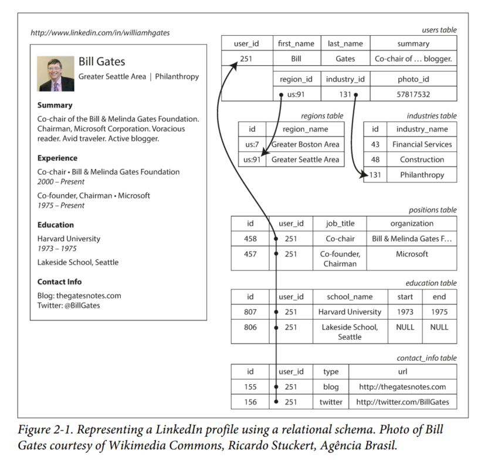
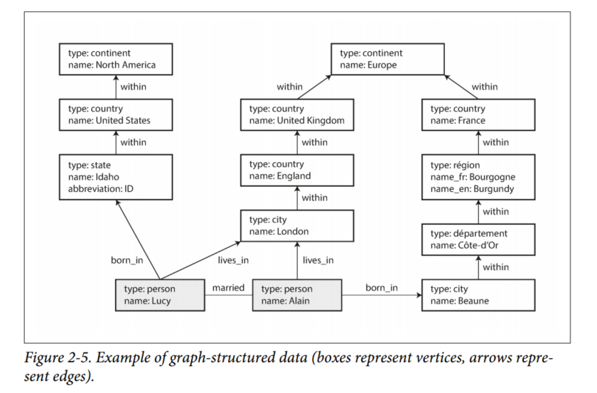

# Chapter 2 - Data Models and Query Languages
In this chapter we will look at a range of general-purpose data models for data storage and querying. In particular, we will compare the relational model, the document model, and a few graph-based data models. We will also look at various query languages and compare their use cases.

## Relational Model Vs Document Model
The best-known data model today is probably that of SQL: data is organized into *relations* (or tables in SQL), where each relation is an unordered collection of *tuples* (rows in SQL).

### NoSQL
There are several reasons behind the adoption of NoSQL databases:
- A need for greater scalability than relational databases can achieve, including very large datasets or very high write throughput
- Widespread preference for free and open source software
- Specialized query operations that are not well supported by the relational model
- Desire for more dynamic and expressive data model

### The Object-Relational Mismatch
Most application development today is done in OOP languages, but if the data is stored in relational tables, an awkward translation layer is required between the objects in the application code and the database model of tables, rows and columns. Object-Relational mapping (ORM) frameworks like Hibernate and ActiveRecord reduce the amount of boilerplate code required for this translation layer.

For example, Figure 2-1 below illustrates how a resume could be expressed in a relational schema.


Fields like first_name and last_name appear only once per user, so they can be modeled as columns on the users table. However, most people have had more than 1 job in their career, and people may have varying numbers of periods of education and any number of pieces of contact information.

There is a one-to-many relationship from the user to these items, which can be represented in various ways:
1. Traditionally (pre SQL:1999) the most common normalized representation is to put position, education and contact info in separate tables, with a foreign key reference to the users table.

2. Later versions of the SQL standard added support for structured datatypes and XML data. This allowed multi-valued data to be stored within a single row, with support for querying and indexing inside those documents.

3. Encode jobs, education and contact info as a JSON or XML document, store it on a text column in the database and let the application interpret its structure and content.

For a data structure like a resume, which is mostly a self-contained document, a JSON representation can be quite appropriate. JSON has the appeal of being much simpler than XML.

Document-oriented databases like MongoDB, RethinkDB, CouchDB, and Espresso support this data model.

JSON representation of the resume:
```
{
  "user_id": 251,
  "first_name": "Bill",
  "last_name": "Gates",
  "summary": "Co-chair of the Bill & Melinda Gates... Active blogger.",
  "region_id": "us:91",
  "industry_id": 131,
  "photo_url": "/p/7/000/253/05b/308dd6e.jpg",
  "positions": [
    {"job_title": "Co-chair", "organization": "Bill & Melinda Gates Foundation"},
    {"job_title": "Co-founder, Chairman", "organization": "Microsoft"}
  ],
  "education": [
    {"school_name": "Harvard University", "start": 1973, "end": 1975},
    {"school_name": "Lakeside School, Seattle", "start": null, "end": null}
  ],
  "contact_info": {
    "blog": "http://thegatesnotes.com",
    "twitter": "http://twitter.com/BillGates"
  }
}
```

The JSON representation has better locality than the multi-table schema previously mentioned. If you want to fetch a profile in the relational example, you need to either perform multiple queries or perform a messy multi-way join between the users table and the subordinate tables. In the JSON representation, all the relevant information is in once place, and only one query is needed.

### Many-to-One and Many-to-Many Relationships
In the example above, region_id and industry_id are given as IDs, not as plain-text strings. Why?
- Consistent style and spelling across profiles
- Avoiding ambiguity
- Ease of updating
- Localization support
- Better search

The advantage of using an ID is that it has no meaning to humans, it never needs to change. The ID can remain the same even if the information it identifies changes. Anything that is meaningful to humans may need to change sometime in the future — and if that information is duplicated, all the redundant copies need to be updated. That incurs write overheads, and risks inconsistencies (where some copies of the information are updated but others aren’t). Removing such duplication is the key idea behind normalization in databases.

Unfortunately, normalizing this data requires many-to-one relationships (many people live in one particular region, many people work in one particular industry), which doesn't fit nicely into the document model. In relational databases, it's normal to refer to rows in other tables by ID because joins are easy. In document databases, joins are not needed for one-to-many tree structures, and support for joins is often weak.

Document databases works well for one-to-many relationships, but it made many-to-many relationships and joins difficult.

### Relational Vs Document Databases Today
The main arguments in favor of the document data model are schema flexibility, better performance due to locality and that for some applications it is closer to the data structures used by the application. The relational model counters by providing better support for joins and many-to-one and many-to-many relationships.

#### Which data model leads to simpler application code?
If the data in your application has a document-like structure, then it's probably a good idea to use a document model.

The document model has limitations: for example, you cannot refer directly to a nested item within a document, but instead you need to say something like "the second item in the list of positions for user 251". However, as long as documents are not too deeply nested, that is not usually a problem.

However, if you application does use many-to-many relationships, the document model becomes less appealing. It's possible to reduce the need for joins by denormalizing, but then the application code needs to do additional work to keep the denormalized data consistent. In such cases, using a document model can lead to a significantly more complex application code and worse performance.

For highly interconnected data, the document model is awkward, the relational model is acceptable and graph models are the most natural.

#### Schema flexibility in the document model
Document databases are called schema-on-read, in contrast with schema-on-write (the traditional approach of relational databases).

The difference between the approaches is particularly noticeable in situations where an application wants to change the format of its data. Schema changes have a bad reputation of being slow and requiring downtime.

Running the `UPDATE` statement on a large table is likely to be slow on any database. If that is not acceptable, the application can fill the new column in at read time, like it would with a document database.

The schema-on-read approach is advantageous if the items in the collection don't all have the same structure.

#### Data locality for queries
A document is usually stored as a single continuous string, encoded as JSON, XML or a binary variant thereof (like MongoDB's BSON). If your application often needs to access the entire document, there is a performance advantage to this storage locality.

The locality advantage only applies if you need large parts of the document at the same time. The database typically needs to load the entire document, even if you access only a small portion of it, which can be wasteful on large documents. On updates to a document, the entire document usually needs to be rewritten. For these reasons, it is generally recommended that you keep documents fairly small and avoid writes that increase the size of a document.

### Query Languages for Data
An imperative language tells the computer to perform certain operations in a certain order. You can imagine stepping through the code line by line, evaluating conditions, updating variables, and deciding whether to go around the loop one more time.

In a declarative query language, like SQL, you just specify the pattern of the data you want - what conditions the results must meet, and how you want the data to be transformed (e.g., sorted, grouped or aggregated) - but not **how** to achieve that goal. It is up to the database system's query optimizer to decide which indexes and which join methods to use.

A declarative query language is attractive because it is typically more concise and easier to work with than an imperative API. It also hides implementation details of the database engine. Declarative languages often lend themselves to parallel execution. Imperative code is very hard to parallelize across multiple cores and multiple machines, because it specifies instructions that must be performed in a particular order.

### MapReduce Querying
MapReduce is a programming model for processing large amounts of data in bulk across many machines. A limited form of MapReduce is supported by some NoSQL datastores, including MongoDB and CouchDB, as a mechanism for performing read-only queries across many documents.

MapReduce is neither a declarative query language nor a fully imperative query API, but somewhere in between: the logic of the query is expressed with snippets of code, which are called repeatedly by the processing framework. It is based on the `map` (also known as collect) and `reduce` (also known as fold or inject) function that exist in many functional programming languages.

`EXAMPLE`  
Imagine you are a marine biologist, and you add an observation record to your database every time you see animals in the ocean. Now you want to generate a report saying how many sharks you have sighted per month

In PostgreSQL, your query would be:
```
SELECT date_trunc('month', observation_timestamp) AS observation_month,
  sum(num_animals) AS total_animals
FROM observations
WHERE family = 'Sharks'
GROUP BY observation_month;
```

The query first filters the observations to only show species in the Sharks family, then groups the observations by the calendar month in which they occurred, and finally adds up the number of animals seen in all observations in that month.

The same can be expressed with MongoDB's MapReduce feature as follows:
```
db.observations.mapReduce(
  function map() {                    (2)
      var year = this.observationTimestamp.getFullYear();
      var month = this.observationTimestamp.getMonth() + 1;
      emit(year + "-" + month, this.numAnimals);      (3)
  },
  function reduce(key, values) {      (4)
    return Array.sum(values);         (5)
  }
  {
    query : {family: " Sharks"},      (1)
    out "monthlySharkReport"          (6)
  }
);
```

1. The filter to consider only shark species can be specified declaratively (this is a MongoDB-specific extension to MapReduce)
2. The JavaScript function `map` is called once for every document that matches the query, with `this` set to the document object. **IMPORTANT**
3. The `map` function emits a key (a string consisting of year and month, such as "2013-12") and a value (the number of animals in that observation)
4. The key-value pairs emitted by `map` are grouped by key. For all key-value pairs with the same key (same month and year), the `reduce` function is called once.
5. The `reduce` function adds up the number of animals from all observations in a particular month.
6. The final output is written to the collection monthlySharkReport.

For example, say the observations collection contains these two documents:
```
{
  observationTimestamp: Date.parse("Mon, 25 Dec 1995 12:34:56 GMT"),
  family: "Sharks",
  species: "Carcharodon carcharias",
  numAnimals: 3
}

{
  observationTimestamp: Date.parse("Tue, 12 Dec 1995 16:17:18 GMT"),
  family: "Sharks",
  species: "Carcharias taurus",
  numAnimals: 4
}
```

The map function would be called once for each document, resulting in emit("1995-12", 3) and emit("1995-12", 4). Subsequently, the reduce function would be called with reduce("1995-12", [3, 4]), returning 7.

The map and reduce functions are somewhat restricted in what they are allowed to do. **They must be pure functions, which means they only use the data that is passed to them as input, they cannot perform additional database queries, and they must not have any side effects**. These restrictions allow the database to run the functions anywhere, in any order, and rerun them on failure. However, they are nevertheless powerful: they can parse strings, call library functions, perform calculations, and more.

MapReduce is a fairly low-level programming model for distributed execution on a cluster of machines. Higher-level query languages like SQL can be implemented as a pipeline of MapReduce operations, but there are also many distributed implementations of SQL that don't use MapReduce. Note there is nothing in SQL that constraints it to running on a single machine, and MapReduce doesn't have a monopoly on distributed query execution.

### Graph-Like Data Models
If many-to-many relationships are very common in your data, the relational model can handle simple cases of many-to-many relationships. But as the connections within your data becomes more complex, it becomes more natural to start modeling your data as a graph.

Well-known algorithms can operate on these graphs: for example, car navigation systems search for the shortest path between two points in a road network.



#### Property graphs
In the property graph model, each vertex consists of:
- a unique identifier
- a set of outgoing edges
- a set of incoming edges
- a collection of properties (key-value pairs)

Each edge consists of:
- a unique identifier
- the vertex at which the edge starts (tail vertex)
- the vertex at which the edge ends (head vertex)
- a label to describe the kind of relationship between the two vertices
- a collection of properties (key-value pairs)

You can think of a graph store as consisting two relational tables, one for vertices and one for edges. The head and tail vertex are stored for each edge; if you want the set of incoming or outgoing edges for a vertex, you can query the edges table by head_vertex or tail_vertex, respectively.

Representing a property graph using a relational schema:
```
CREATE TABLE vertices (
  vertex_id integer PRIMARY KEY,
  properties json
);

CREATE TABLE edges (
  edge_id integer PRIMARY KEY,
  tail_vertex integer REFERENCES vertices (vertex_id),
  head_vertex integer REFERENCES vertices (vertex_id),
  label text,
  properties json
);

CREATE INDEX edges_tails ON edges (tail_vertex);
CREATE INDEX edges_heads ON edges (head_vertex);
```

Some important aspects of this model are:

1. Any vertex can have an edge connecting it with any other vertex. There is no schema that restricts which kinds of things can or cannot be associated.
2. Given any vertex, you can efficiently find both its incoming and its outgoing edges, and thus traverse the graph—i.e., follow a path through a chain of vertices — both forward and backward. (That’s why Example 2-2 has indexes on both the tail_vertex and head_vertex columns.)
3. By using different labels for different kinds of relationships, you can store several different kinds of information in a single graph, while still maintaining a clean data model.

Those features give graphs a great deal of flexibility for data modeling. Figure 2-5 shows a few things that would be difficult to express in a traditional relational schema, such as different kinds of regional structures in different countries and varying granularity of data (Lucy's current residence is specified as a city, whereas her place of birth is specified only at the level of a state).

### The Cypher Query Language
Cypher is a declarative query language for property graphs, created for the Neo4j database. (Page 52 for more information)

### Graph Queries in SQL
In a relational database, you usually know in advance which joins you need in your query. In a graph query, you may need to traverse a variable number of edges before you find the vertex you’re looking for — that is, the number of joins is not fixed in advance.

### Triple-Stores and SPARQL
The triple-store model is mostly equivalent to the property graph model, using different words to describe the same ideas.

In a triple-store, all information is stored in the form of very simple three-part statements: (subject, predicate, object). The subject of a triple is equivalent to a vertex in a graph. The object is one of two things:

1. A value in a primitive datatype, such as a string or a number. In that case, the predicate and object of the triple are equivalent to the key and value of a property on the subject vertex. (Lucy, age, 33) is like a vertex Lucy with properties {"age": 33}

2. Another vertex in a graph. In that case, the predicate is an edge in the graph, the subject is the tail vertex and the object is the head vertex. (Lucy, marriedTo, Alain) the subject and object Lucy and Alain are both vertices, and the predicate marriedTo is the label of the edge that connects them.

### Summary
Data models are a huge subject, and in this chapter we have taken a quick look at a broad variety of different models.

Historically, data started out being represented as one big tree (hierarchical model), but that wasn't good for representing many-to-many relationships, so the model was invented to solve that problem. More recently, developers found that some applications don't fit well in the relational model either. New nonrelational "NoSQL" datastores diverged in two main directions:

1. Document databases target use cases where data comes in self-contained documents and relationships between one document and another are rare.

2. Graph databases go in the opposite direction, targeting use cases where anything is potentially related to everything.

All three models (document, relational and graph) are widely used today, and each is good in its respective domain. Graph data can be represented in a relational database - but the result is often awkward.

One thing that document and graph databases have in common is that they typically don't enforce a schema for the data they store, which can make it easier to adapt applications to changing requirements. However, your application most likely still assumes that data has a certain structure; it's just a question of whether the schema is explicit (enforced on write) or implicit (handled on read).

Each data model comes with its own query language or framework, and we discussed several examples: SQL, MapReduce, MongoDB's aggregation pipeline, Cypher, SPARQL, and Datalog.
In the next chapter we will discuss some of the trade-offs that come into play when implementing the data models described in this chapter.
