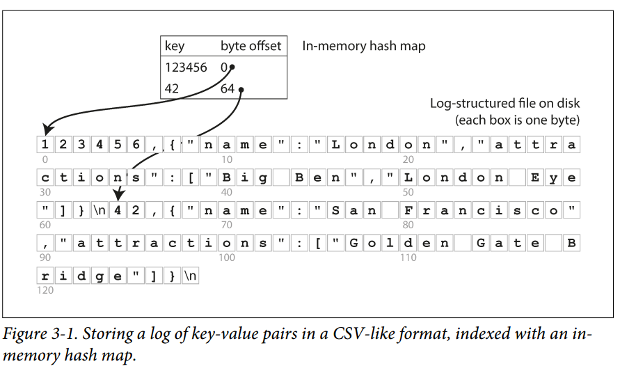
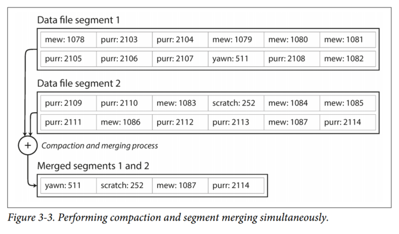
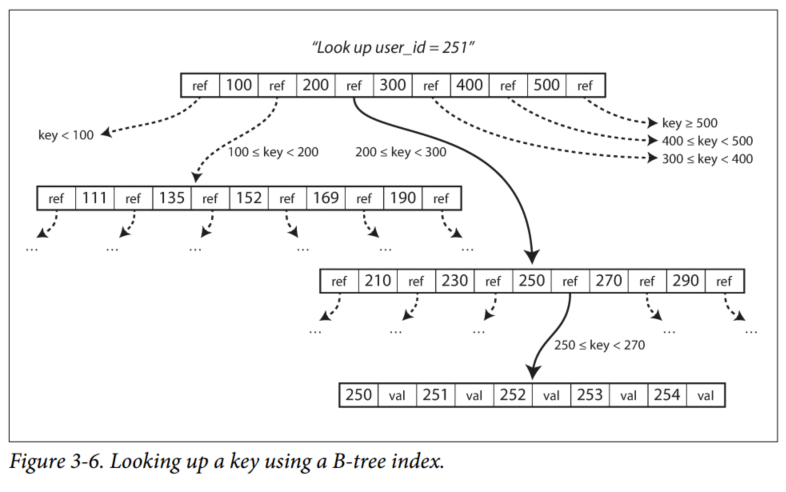
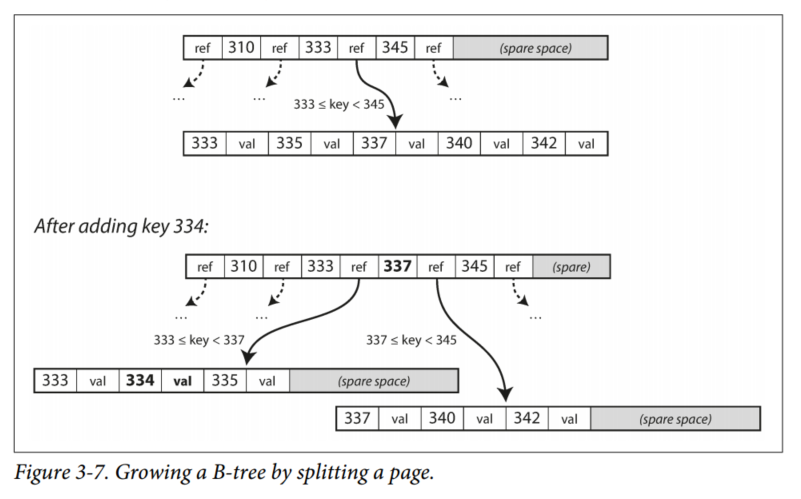
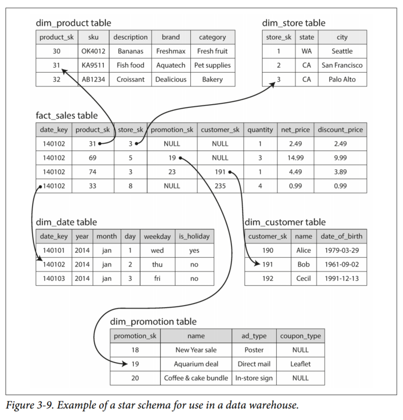
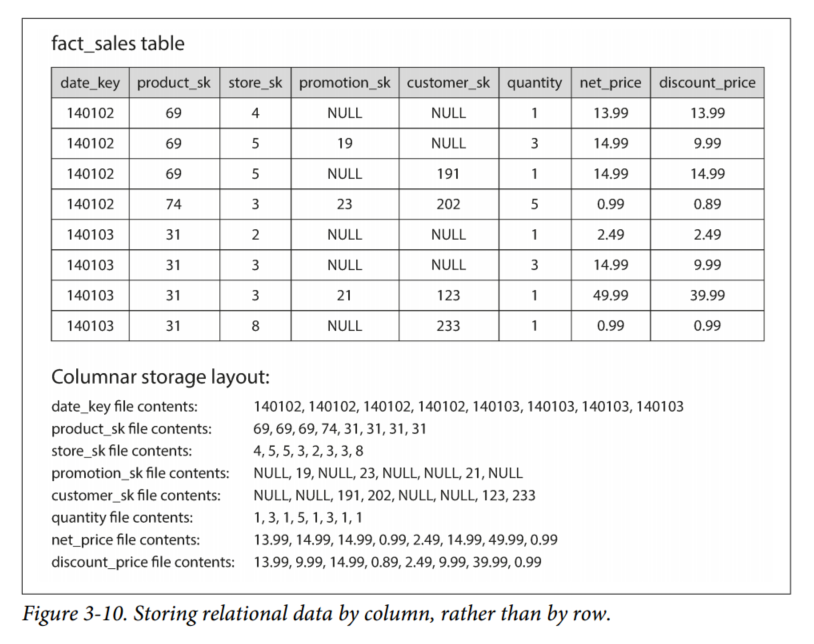
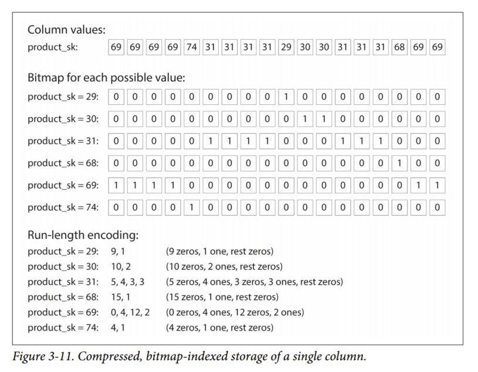
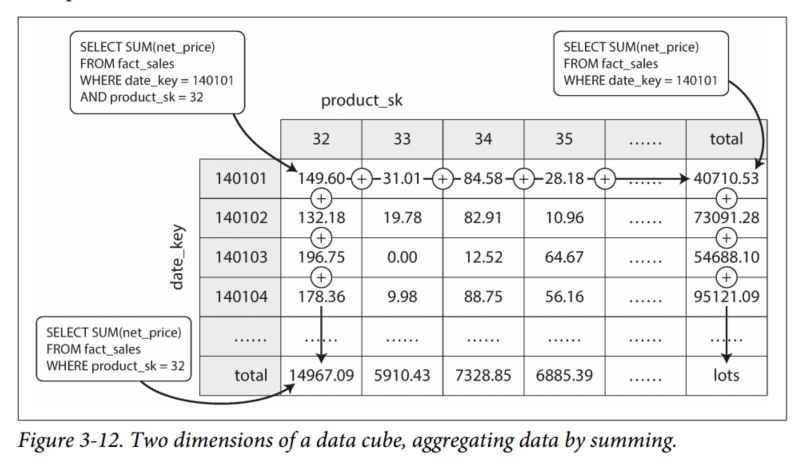

# Chapter 3 - Storage and Retrieval
We'll start this chapter by talking about storage engines that are used in the kinds of databases that you're probably familiar with: traditional relational databases, and also most so-called NoSQL databases.

We will examine two families of storage engines: log-structured storage engines, and page-oriented storage engines such as B-trees.

## Data Structures That Power Your Database
Consider the world's simplest database, which implements a key-value store.
```
#!/bin/bash

db_set () {
  echo "$1,$2" >> database
}

db_get () {
  grep "^$1," database | sed -e "s/^$1,//" | tail -n 1
}
```

You can call `db_set key value` , which will store key and value in the database. You can then call `db_get key`, which looks up the most recent value associated with theat particular key and returns it.

The underlying storage format is a text file where each line contains a key-value pair, separated by a comma. Every call to `db_set` appends to the end of the file, so if you update a key several times, the old versions are not overwritten, you have to look at the last occurrence of a key in a file to find the latest value (hence the tail -n 1)

Our `db_set` function actually has pretty good performance, because appending to a file is generally very efficient. On the other hand, our `db_get` function has terrible performance if you have a large number of records in your database. Every time you want to look up a key, `db_get` has to scan the entire file from beginning to end, O(n) running time.

In order to efficiently find the value for a particular key in the database, we need a different data structure: an index. In this chapter we will look at a range of indexing structures and see how they compare; the general idea behind them is to keep some additional metadata on the side, which acts as a signpost and helps you to locate the data you want.

An index is an additional structure that is derived from the primary data. Many databases allow you to add and remove indexes, and this doesn’t affect the contents of the database; it only affects the performance of queries. Maintaining additional structures incurs overhead, especially on writes. For writes, it’s hard to beat the performance of simply appending to a file, because that’s the simplest possible write operation. Any kind of index usually slows down writes, because the index also needs to be updated every time data is written.

**This is an important trade-off in storage systems: well-chosen indexes speed up read queries, but every index slows down writes.** For this reason, databases don’t usually index everything by default.

## Hash Indexes
Since we already have hash maps for our in-memory data structures, let's use them to index our data on disk.

The simplest indexing strategy is: keep an in-memory hash map where every key is mapped to a byte offset in the data file - the location at which the value can be found. Whenever you append a new key-value pair to the file, you also update the hash map to reflect the offset of the data you just wrote. When you want to look up a value, use the hash map to find the offset in the data file, seek to that location, and read the value.



This may sound simplistic, but it is a viable approach. In fact, this is essentially what Bitcask (the default storage engine in Riak) does. Bitcask offers high-performance reads and writes, subject to the requirement that all the keys fit in the available RAM, since the hash map is kept completely in memory.

The values can use more space than there is available memory, since they can be loaded from disk with just one disk seek. If that part of the data file is already in the filesystem cache, a read doesn’t require any disk I/O at all.

As we only ever append to a file, how do we avoid eventually running out of disk space?
A good solution is to break the log into segments of a certain size by closing a segment file when it reaches a certain size, and making subsequent writes to a new segment file. We can then perform compaction on these segments. Compaction means throwing away duplicate keys in the log and keeping only the most recent update for each key.

Compaction often makes segments much smaller, we can also merge several segments together at the same time as performing the compaction. Segments are never modified after they have been written, so the merged segment is written to a new file. After merging, we switch read requests to using the new merged segment, and the old segment files can simply be deleted.



Each segment now has its own in-memory hash table, mapping keys to file offsets. In order to find the value for a key, we first check the most recent segment's hash map; if the key is not present, we check the second-most-recent segment, and so on.

The merging process keeps the number of segments small, so lookups don't need to check many hash maps.

**Some of the issues that are important in a real implementation are:**

1. File format  
CSV is not the best format for a log. It's faster and simpler to use a **binary format** that first encodes the length of a string in bytes, followed by the raw string. (no need for escaping)

2. Deleting records  
If you want to delete a key and its associated value, you have to append a special deletion record to the data file (called a tombstone). When log segments are merged, the tombstone tells the merging process to discard any previous values for the deleted keys.

3. Crash recovery  
If the database is restarted, the in-memory hash maps are lost. In principle, you can restore each segment’s hash map by reading the entire segment file from beginning to end and noting the offset of the most recent value for every key as you go along. However, that might take a long time if the segment files are large, which would make server restarts painful. Bitcask speeds up recovery by storing a snapshot of each segment’s hash map on disk, which can be loaded into memory more quickly.

4. Partially written records
The database may crash at any time, including halfway through appending a record to the log. Bitcask files include checksums, allowing such corrupted parts of the log to be detected and ignored.

5. Concurrency control
As writes are appended to the log in a strictly sequential order, a common implementation choice is to have only one writer thread. Data file segments are append-only and otherwise immutable, so they can be read concurrently by multiple threads.

**Ponder**: An append-only log seems wasteful at first glance: why don't you update the file in place, overwriting the old value with the new value?

An append-only design turns out to be good for several reasons:

1. Appending and segment merging are sequential write operations, which are generally **much faster than random writes**, especially on magnetic spinning-disk hard drives. To some extent sequential writes are also preferable on flash-based solid state drives (SSDs).

2. **Concurrency and crash recovery** are much simpler if segment files are append only or immutable. For example, you don’t have to worry about the case where a crash happened while a value was being overwritten, leaving you with a file containing part of the old and part of the new value spliced together.

3. Merging old segments avoids the problem of data files getting fragmented over
time.

However, the hash table index also has limitations:

1. The hash table **must fit in memory,** so if you have a very large number of keys, you’re out of luck. In principle, you could maintain a hash map on disk, but unfortunately it is difficult to make an on-disk hash map perform well. It requires a lot of random access I/O, it is expensive to grow when it becomes full, and hash collisions require fiddly logic.

2. Range queries are not efficient. For example, you cannot easily scan over all keys between kitty00000 and kitty99999 — you’d have to look up each key individually in the hash maps.

In the next section we will look at an indexing structure that doesn’t have those limitations.

## Sorted String Tables and Log Structured Merge-Trees
In Figure 3-3 above, each log-structured storage segment is a sequence of key-value pairs. These pairs appear in the order that they were written, values later in the log take precedence over values for the same key earlier in the log (overwrite).

Now we can make a simple change to the format of our segment files: we require that the sequence of key-value pairs is sorted by key. We also require that each key only appears once within each merged segment file (the compaction process already ensures that). This format is called Sorted String Tables (SSTables).

SSTables have several big advantages over log segments with hash indexes:

1. Merging segments is simple and efficient, even if the files are bigger than the available memory. The approach is like the one used in the *mergesort* algorithm. Start reading the input files side by side, look at the first key in each file, copy the lowest key to the output file, and repeat. When multiple segments contain the same key, we keep the value from the most recent segment.

2. To find a particular key in the file, we can use binary search instead of needing to keep an index of all the keys in memory.

3. Since read requests need to scan over several key-value pairs in the requested range, it is possible to group those records into a block and compress it before writing it to disk. It saves disk space and reduces the I/O bandwidth use.

### Constructing and Maintaining SSTables
Maintaining a sorted structure in memory is easier than on disk. There are plenty of tree data structures you can use, such as red-black trees or AVL trees. You can insert keys in any order and read them back in sorted order.

Our storage engine works as follows:
1. When a write comes in, add it to an in-memory balanced tree data structure. This in-memory tree is sometimes called a memtable.

2. When the memtable gets bigger than some threshold, write it out to disk as an SSTable file. This can be done efficiently because the key-value pairs are already sorted in the tree.

3. To serve a read request, first try to find the key in the memtable, then in the most recent on-disk segment, then in the second-most recent segment, etc.

4. From time to time, run a merging and compaction process in the background to combine segment files and to discard overwritten or deleted values.

One problem: if the database crashes, then the values in the memtable are lost. To avoid that problem, we can keep a separate log on disk to which every write is immediately appended. Every time the memtable is written out to an SSTable, the log can be discarded.

### Making an LSM-tree out of SSTables
The algorithm described here is essentially what is used in LevelDB and RocksDB, key-value storage engine libraries that are designed to be embedded into other applications. Similar storage engines are used in Cassandra and HBase, both of which were inspired by Google's Bigtable paper.

Originally this indexing structure was described under the name Log-Structured Merge-Tree (LSM-Tree).

Lucene, an indexing engine for full-text search used by Elasticsearch and Solr, uses a similar method for storing its term dictionary. A full-text index is much more complex than a key-value index, but is based on a similar idea: given a word in a search query, find all the documents that mention the word. This is implemented with a key-value structure where the key is a word (a *term*) and the value is the list of IDs of all the documents that contain the word (the *postings list*).

In Lucene, this mapping from term to postings list is kept in SSTable-like sorted files, which are merged in the background as needed.

### Performance Optimizations
The LSM-tree algorithm can be slow when looking up keys that do not exist in the database. In order to optimize this kind of access, storage engines often use additional *Bloom filters*. A bloom filter is a memory-efficient data structure for approximating the contents of a set. It can tell you if a key does not appear in the database, saving many unnecessary disk reads for nonexistent keys.

There are also different strategies to determine the order and timing of how SSTables are compacted and merged. The most common options are *size-tiered* and *leveled* compaction. LevelDB and RocksDB use leveled compaction, HBase uses size-tiered, and Cassandra supports both.

In size-tiered compaction, newer and slammer SSTables are successively merged into older and larger SSTables. In leveled compaction, the key range is split up into smaller SSTables and older data is moved into separate "levels", which allows the compaction to proceed more incrementally and use less disk space.

The basic idea of LSM-Trees - keeping a cascade of SSTables that are merged in the background - is simple and effective. Even when the dataset is >> the available memory, it continues to work well. Since data is stored in sorted order, you can efficiently perform range queries, and because the disk writes are sequential, the LSM-tree can support high write throughput.

## B-Trees
The most widely used indexing structure is the B-tree.
B-Trees remain the standard index implementation in almost all relational databases and many nonrelational databases.

B-trees break the database down into fixed-size blocks, or pages, traditionally 4KB in size, and read or write one page at a time. Each page can be identified using an address or location, which allows one page to refer to another - similar to a pointer, but on disk instead of in memory. We can use these page references to construct a tree of pages (see below).



One page is designated as the root of the B-tree; whenever you want to look up a key in the index, you start here. The page contains several keys and references to child pages. Each child is responsible for a continuous range of keys, and the keys between the references indicate the boundaries between those ranges.

In the example in Figure 3-6, we are looking for the key 251, so we know that we need to follow the page reference between the boundaries 200 and 300. That takes us to a similar-looking page that further breaks down the 200–300 range into subranges.

Eventually we get down to a page containing individual keys (leaf page), which either contains the value for each key inline or contains references to the pages where the values can be found.

The number of references to child pages in one page of the B-tree is called the branching factor. In the example above, the branching factor is six. In practice, the branching factor depends on the amount of space required to store the page refereces and the range boundaries, but typically it is several hundred.

If you want to update the value for an existing key in a B-tree, you search for the leaf page containing that key, change the value in that page, and write the page back to disk. If you want to add a new key, you need to find the page whose range encompasses the new key and add it to that page. If there isn't enough free space in the page to accommodate the new key, it is split into two half-full pages, and the parent page is updated to account for the new subdivision of key ranges (see below).



This algorithm ensures that the tree remains balanced: A B-tree with n keys always has a depth of O(log n). Most databases can fit into a B-tree that is 3 of 4 levels deep, so you don't need to follow many page references to find the page you are looking for.
(A four-level tree of 4 KB pages with a branching factor of 500 can store up to 256 TB.)

### Making B-trees reliable
The basic underlying write operation of a B-tree is to **overwrite a page on disk with new data**. It is assumed that the overwrite does not change the location of the page; i.e. all references to that page remain intact when the page is overwritten. This is in stark contrast to log-structured indexes such as LSM-trees, which only append to files, but never modify files in place.

In order to make the database resilient to crashes, it is common for B-tree implementations to include an additional data structure on disk: a write-ahead log (WAL, also known as a redo log). This is an append-only file to which every B-tree modification must be written before it can be applied to the pages of the tree itself.

An additional complication of updating pages in place is that careful concurrency control is required if multiple threads are going to access the B-tree at the same time - otherwise a thread may see the tree in an inconsistent state. This is typically done by protecting the tree's data structure with latches (lightweight locks).

### B-tree Optimizations
1. Instead of overwriting pages and maintaining a WAL for crash recovery, some databases (like LMDB) use a copy-on-write scheme. A modified page is written to a different location, and a new version of the parent pages in the tree is created, pointing to a new location. This approach is also useful for concurrency control.

2. We can save space in pages by not storing the entire key, but abbreviating the key. Especially in pages on the interior of the tree, keys only need to provide enough information to act as boundaries between key ranges.

3. In general, pages can be positioned anywhere on disk. If a query needs to scan over a large part of the key range in sorted order, that page-by-page layout can be inefficient, because a disk seek may be required for every page that is read. Many B-tree implementations try to lay out the tree so that leaf pages appear in **sequential order** on disk. However, it's difficult to maintain that order as the tree grows.   
By contrast, since LSM-trees rewrite large segments of the storage in one go during merging, it's easier for them to keep sequential keys close to each other on disk.

4. Additional pointers have been added to the tree. For example, each leaf page may have references to its sibling pages to the left and right, which allows scanning keys in order without jumping back to parent pages.

5. B-tree variants such as *fractal trees* borrow some log-structured ideas to reduce disk seeks.

## Comparing B-Trees and LSM-Trees
Even though B-tree implementations are generally more mature than LSM-tree implementations, LSM-trees are also interesting due to their *performance characteristics*.

As a rule of thumb, LSM-trees are typically *faster for writes*, whereas B-trees are thought to be *faster for reads*. Reads are typically slower on LSM-trees because they have to check several different data structures and SSTables at different stages of compaction.

### Advantages of LSM-trees
A B-tree index must write every piece of data at least twice: once to the write-ahead log, and once to the tree page itself.

There is also overhead from having to write an entire page at a time, even if only a few bytes in that page changed.

Log-structured indexes also rewrite data multiple times due to repeated compaction and merging of SSTables. This effect is known as *write amplification*. It is of particular concern on SSDs, which can only overwrite blocks a limited number of times before wearing out.

In write-heavy applications, the performance bottleneck might be the rate at which the database can write to the disk. In this case, write amplification has a direct performance cost: the more that a storage engine writes to disk, the fewer writes per second it can handle within the available disk bandwidth.

Moreover, LSM-trees are typically able to sustain higher write throughput than B-trees, partly because they sometimes have lower write amplification, and partly because they **sequentially** write compact SSTable files rather than having to overwrite several pages in the tree. This is particularly important on magnetic hard drives, where sequential writes are much faster than random writes.

LSM-trees can be compressed better than B-trees. B-tree storage engines leave some disk space unused due to fragmentation: when a page is split or when a row cannot fit into an existing page, some space in a page remains unused. Since LSM-trees are not page-oriented and periodically rewrite SSTables to remove fragmentation, they have lower storage overheads, especially when using leveled compaction.

On many SSDs, the firmware internally uses a log-structured algorithm to turn random writes into sequential writes on the underlying storage chips. However, lower write amplification and reduced fragmentation are still advantageous on SSDs: representing data more compactly allows more read and write requests within the available I/O bandwidth.

### Downsides of LSM-trees
The compaction process can sometimes interfere with the performance of ongoing reads and writes. Disks have limited resources, so it can easily happen that a request needs to wait while the disk finishes an expensive compaction operation. The impact on throughput and average response time is usually small, but at higher percentiles the response time of queries to log-structured storage engines can sometimes be quite high, and B-trees can be more predictable.

At high write throughput: the disk's finite write bandwidth needs to be shared between the initial write (logging and flushing a memtable to disk) and the compaction threads running in the background. When writing to an empty database, the full disk bandwidth can be used for the initial write, but the bigger the database gets, the more disk bandwidth is required for compaction.

If compaction is not configured correctly, compaction may not be able to keep up with the rate of incoming writes. In this case, the number of unmerged segments on disk keeps growing until you run out of disk space, and reads also slow down because they need to check more segment files. Typically, SSTable-based storage engines do not throttle the rate of incoming writes, even if compaction cannot keep up, so you need explicit monitoring to detect this situation.

An advantage of B-trees is that each key exists in exactly one place in the index, whereas a log-structured storage engine may have multiple copies of the same key in different segments. This makes B-trees attractive in databases that want to offer strong transactional semantics: in many relational databases, transaction isolation is implemented using locks on ranges of keys, and in a B-tree index, those locks can be directly attached to the tree.

B-trees are very ingrained in the architecture of databases and provide consistently good performance for many workloads.

## Other Indexing Structures
It is also very common to have secondary indexes. In relational databases, you can create several secondary indexes on the same table. A secondary index can easily be constructed from a key-value index. The main difference is that keys are not unique; i.e. there might be many rows with the same key. This can be solved in two ways: either by making each value in the index a list of matching row identifiers or by making each key unique by appending a row identifier to it. Either way, both B-trees and log-structured indexes can be used as secondary indexes.

### Storing values within the index
The key in an index is the thing that queries search for, but the values can be either the actual row (for a document, or a vertex) in question, or it could be a reference to the row stored elsewhere. In the latter case, the place where rows are stored is known as a *heap file*, and it stores data in no particular order. The heap file approach is common because it avoids duplicating data when multiple secondary indexes are present: each index just references a location in the heap file and the actual data is kept in one place.

When updating a value without changing the key, the heap file approach can be quite efficient: the record can be overwritten in place, provided that the new value is not larger than the old value. If the new value is larger, it might need to be moved to a new location in the heap where there is enough space. In that case, either all indexes need to be updated to point at the new heap location, or a forwarding pointer is left behind in the old heap location (that points to the new heap location).

In some situations, the extra hop from the index to the heap file is too much of a performance penalty for reads, so it can be desirable to store the indexed row directly within an index. This is known as *clustered index*. E.g. in MySQL's InnoDB storage engine, the primary key of a table is always a clustered index, and secondary indexes refer to the primary key (rather than a heap file location). In SQL Server, you can specify one clustered index per table.

**IMPORTANT**  
A compromise between a clustered index (storing all row data within the index) and a non-clustered index (storing only references to the data within the index) is known as a *covering index* or *index with included columns*, which stores *some* of a table's columns within the index. This allows some queries to be answered by using the index alone.

As with any kind of duplication of data, **clustered and covering indexes can speed up reads, but they require additional storage and can add overhead on writes**. Databases also need to go to additional effort to enforce transactional guarantees, because applications should not see inconsistencies due to the duplication.

### Multi-column indexes
The indexes discussed so far only map a single key to a value. That is not sufficient if we need to query multiple columns of a table (or multiple fields in a document) simultaneously.

The most common type of multi-column index is called a *concatenated index*, which combines several fields into one key by appending one column to another (the index definition specifies in which order the fields are concatenated). Imagine the old paper phone book, which provides an index from <lastname, firstname> to phone number. Due to the sort order, the index can be used to find all the people with a particular last name, or anyone with a particular lastname-firstname combination. **However, the index is useless if you want to find all the people with a particular first name**

**Multi-dimensional indexes** are a more general way of querying several columns at once, which is particularly important for geospatial data. For example, a restaurant search website may have a database containing the latitude and longitude of each restaurant. When a user is looking at the restaurants on a map, the website needs to search for all the restaurants within the rectangular map area that the user is currently viewing. This requires a two-dimensional range query like the following:

```
SELECT * FROM restaurants WHERE latitude  > 51.4946 AND latitude  < 51.5079
                            AND longitude > -0.1162 AND longitude < -0.1004
```

A standard B-tree or LSM-tree index is not able to answer that kind of query efficiently: it can give you either all the restaurants in a range of latitudes (but at ANY longitude), or vice versa, but not both simultaneously.

### Full-text search and fuzzy indexes
All the indexes discussed so far assume that you have exact data and allow you to query for exact values of a key, or a range of values of a key with a sort order. What they don’t allow you to do is search for *similar* keys, such as misspelled words. Such *fuzzy* querying requires different techniques.

For example, full text search engines commonly allow a search for one word to be expanded to include synonyms of the word, to ignore grammatical variations of words, and to search occurrences of words near each other in the same document. To cope with typos in documents or queries, Lucene is able to search text for words within a certain edit distance.

Lucene uses a SSTable-like structure for its term dictionary. This requires a small in-memory index that tells queries at which offset in the sorted file they need to look for a key. In LevelDB, this in-memory index is a sparse collection of some of the keys, but in Lucene, the in-memory index is a finite state automaton over the characters in the keys, similar to a trie.

### Keeping everything in memory
The data structures discussed so far in this chapter have all been answers to the limitations of disks. Compared to main memory, disks are awkward to deal with. With both magnetic disks and SSDs, data on disk needs to be laid out carefully if you want good performance on reads and writes. However, we tolerate this awkwardness because disks have two significant advantages: they are durable (their contents are not lost if the power is turned off), and they have a lower cost per gigabyte than RAM.

As RAM becomes cheaper, the cost-per-gigabyte argument is eroded. Many datasets can be kept entirely in memory, potentially distributed across several machines. This has led to the development of in-memory databases.

Some in-memory key-value stores, such as Memcached, are intended for caching use only, where it's acceptable for data to be lost if a machine is restarted. Other in-memory databases aim for durability, which can be achieved with special hardware (battery powered RAM), by writing a log of changes to disk, by writing periodic snapshots to disk, or by replication the in-memory state to other machines.

When an in-memory database is restarted, it needs to reload its state, either from disk or over the network from a replica. Despite writing to disk, it's still an in-memory database, because the disk is merely used as an append-only log for durability, and reads are served entirely from memory. Writing to disk also has operational advantages: files on disk can easily be backed up, inspected, and analyzed by external utilities.

Products such as VoltDB, MemSQL, and Oracle TimesTen are in-memory databases with a relational model, and the vendors claim that they can offer big performance improvements by removing all the overheads associated with managing on-disk data structures. Redis and Couchbase provide weak durability by writing to disk asynchronously.

The performance advantage of in-memory databases is not due to the fact that they don't need to read from disk. Rather, because they can avoid the overheads of encoding in-memory data structures in a form that can be written to disk.

Besides performance, in-memory databases is providing data models that are difficult to implement with disk-based indexes. For example, Redis offers a database-like interface to various data structures such as priority queues and sets.

Recent research indicates that an in-memory database architecture could be extended to support datasets larger than the available memory, without bringing back the overheads of a disk-centric architecture. The so-called anti-caching approach works by evicting the least recently used data from memory to disk when there is not enough memory, and loading it back into memory when it is accessed again in the future. This is similar to what operating systems do with virtual memory and swap files, but the database can manage memory more efficiently than the OS, as it can work at the granularity of individual records rather than entire memory pages.

This approach still requires indexes to fit entirely in memory, though.

Further changes to storage engine design will probably be needed if non-volatile memory (NVM) technologies become more widely adopted.

## Transaction Processing or Analytics? (OLAP - On-line Analytical Processing / OLTP)
A transaction need not necessarily have ACID (atomicity, consistency, isolation, and durability) properties. Transaction processing just means allowing clients to make low-latency reads and writes - as opposed to batch processing jobs.

Databases' basic access pattern remained similar to processing business transactions. An application typically looks up a smaller number of records by some key, using an index. Records are inserted/updated based on the user's input. Because these applications are interactive, the access pattern became known as *online transaction processing* (OLTP).

However, databases also started being increasingly used for *data analytics*, which has very different access patterns. Usually an analytic query needs to scan over a huge number of records, only reading a few columns per record, and calculates aggregate statistics rather than returning the raw data to the user.

Below are the differences:

| Property | Transaction processing systems (OLTP) | Analytic systems (OLAP) |
| --- | --- | --- |
| Main read pattern | Small number of records per query, fetched by key | Aggregate over large number of records |
| Main write pattern | Random-access, low-latency writes from user input | Bulk import (ETL) or event stream |
| Primarily used by | End user/customer, via web application | Internal analyst, for decision support |
| What data represents | Latest state of data (current point in time) | History of events that happened over time |
| Dataset size | GB to TB | TB to PB |

At first, the same databases were both used for both transaction processing and analytic queries. SQL works well for both query types. However, later on there was a trend for companies to stop using their OLTP systems for analytics purposes, and to run the analytics on a separate database, which is then called a *data warehouse*.

## Data Warehousing
Database administrators usually do not let business analysts run ad hoc analytic queries on an OLTP database, since those queries are often expensive, which can harm the performance of concurrently executing transactions.

A data warehouse is a separate database that analysts can query without affecting OLTP operations. The data warehouse contains a read-only copy of the data in all the various OLTP systems in the company. Data is extracted from OLTP databases (using either a periodic data dump or a continuous stream of updates), transformed into an analysis-friendly schema, cleaned up, and then loaded into the data warehouse.

An advantage of using data warehouse is that it can be optimized for analytic access patterns. It turns out that the indexing algorithms discussed in the first half of this chapter works well for OLTP, but not so much at answering analytic queries.

We will now look at storage engines that are optimized for Analytics

---

### The divergence between OLTP databases and data warehouses
The data model of a data warehouse is most commonly relational, because SQL is generally a good fit for analytic queries. There are many graphical data analysis tools that generate SQL queries, visualize the results, and allow analysts to explore the data (through operations such as drill-down and slicing and dicing).

Some databases like MS SQL Server and SAP HANA have support for transaction processing and data warehousing in the same product. However, they are increasingly becoming two separate storage and query engines.

Data warehouse vendors such as Teradata, Vertica, SAP HANA, and ParAccel are expensive. Amazon RedShift is a hosted version of ParAccel. More recently, a lot of open source SQL-on-Hadoop projects have emerged. These include Apache Hive, Spark SQL, Cloudera Impala, Facebook Presto, Apache Tajo and Apache Drill. Some of them are based on ideas from Google's Dremel.

## Stars and Snowflakes: Schemas for Analytics
As explored in Chapter 2, a wide range of different data models are used in the realm of transaction processing, depending on the needs of the application. In analytics, there is much less diversity of data models. Many data warehouses are used in a fairly formulaic style, known as *star schema* (a.k.a *dimensional modeling*).

The example schema below shows a data warehouse that might be found at a grocery retailer. At the center of the schema is a *fact table*. Each row of the fact table represents an event that occurred at a particular time (here, each row represents a customer's purchase of a product). If we were analyzing website traffic rather than retail sales, each row might represent a page view or a click by a user.



Usually facts are captured as individual events, because this allows maximum flexibility of analysis later. However, this means that the fact table can be extremely large.

Some of the columns in the fact table are attributes, such as the price at which the product was sold and the cost of buying it from the supplier (allowing the profit margin to be calculated). Other columns in the fact table are foreign key references to other tables, called *dimension tables*. As each row in the fact table represents an event, the dimensions represent the *who*, *what*, *where*, *when*, *how* and *why* of the event.

Each row in the `dim_product` table represents one type of product that is for sale, including its stock-keeping unit (SKU), description, brand name, category, fat content, package size, etc. Each row in the `fact_sales` table uses a foreign key to indicate which product was sold in that particular transaction.

Even date and time are often represented using dimension tables, because this allows additional information about dates (such as public holidays) to be encoded, allowing queries to differentiate between sales on holidays and non-holidays.

A variation of this template is called the *snowflake schema*, where dimensions are further broken down into subdimensions. For example, there could be separate tables for brands and product categories, and each row in the `dim_product` table could reference the brand and category as foreign keys, rather than storing them as strings in that table. Snowflake schemas are more normalized than star schemas, but star schemas are often preferred because they are simpler for analysts to work with.

## Column-Oriented Storage
If you have a lot of rows and data in your fact tables, storing and querying them efficiently becomes a challenging problem. Dimension tables are usually much smaller, so we will concentrate primarily on storage of fact tables.

Although tables are often over 100 columns wide, a typical data warehouse query only accesses 4 or 5 of them at one time. The query ignores all other columns.

**How can we execute this query efficiently?**

In most OLTP databases, storage is laid out in a row-oriented fashion: all the values from one row of a table are stored next to each other. Document databases are similar: an entire document is typically stored as one contiguous sequence of bytes.

While you can have indexes on some of the columns, a row-oriented storage engine still needs to load all of those rows (each consisting of > 100 columns) from disk into memory, parse them, and filter out the other columns.

The idea behind *column-oriented storage* is: instead of storing all the values from one row together, you store all the values from each column together instead.

**Note**: Column storage is easiest to understand in a relational data model, but it applies equally to nonrelational data. For example, Parquet is a columnar storage format that supports a document data model, based on Google's Dremel.



The column-oriented storage layout relies on each column file containing the rows in the same order. Thus, if you need to reassemble an entire row, you can take 23rd entry from each of the individual column files and put them together.

## Column Compression
Column-oriented storage often lends itself very well to compression.

Take a look at the sequences of values for each column in Figure 3-10: they often look quite repetitive, which is a good sign for compression. Depending on the data in the column, different compression techniques can be used. One technique that is particularly effective in data warehouses in *bitmap encoding*, shown below:



Often, the number of distinct values in a column is small compared to the number of rows (for example, a retailer may have billions of sales transactions, but only 100,000 distinct products). We can now take a column with *n* distinct values and turn it into n separate bitmaps: one bitmap for each distinct value, with one bit for each row. The bit is 1 if the row has that value, and 0 if not.

If *n* is very small (for example, a *country* column may have about 200 distinct values), those bitmaps can be stored with one bit per row. But if *n* is bigger, there will be a lot of zeros in most of the bitmaps (sparse). In that case, the bitmaps can additionally be run-length encoded, as shown at the bottom of the *Figure 3-11*.

Bitmap indexes such as these are very well suited for the kinds of queries that are common in a data warehouse. For example:

`WHERE product_sk IN (30, 68, 69):`
Load the three bitmaps for product_sk = 30, product_sk = 68, and product_sk = 69, and calculate the bitwise OR of the three bitmaps, which can be done very efficiently

`WHERE product_sk = 31 AND store_sk = 3:`
Load the bitmaps for product_sk = 31 and store_sk = 3, and calculate the bitwise AND. This works because the columns contain the rows in the same order, so the kth bit in one column’s bitmap corresponds to the same row as the kth bit in another column’s bitmap.

### Column-oriented storage and column families
Cassandra and HBase have a concept of *column families*, which they inherited from Bigtable. Within each column family, they store all columns from a row together, along with a row key, and they do not use column compression. Thus, the Bigtable model is still mostly row-oriented.

### Memory bandwidth and vectorized processing
A big bottleneck is often the bandwidth for getting data from disk into memory. However, that is not the only bottleneck. Developers of analytical databases also worry about efficiently using the bandwidth from main memory into the CPU cache, avoiding branch mispredictions and bubbles in the CPU instruction processing pipeline, and making use of single-instruction-multi-data (SIMD) instructions in modern CPUs.

Besides reducing the volume of data that needs to be loaded from disk, column-oriented storage layouts are also good for making efficient use of CPU cycles. For example, the query engine can take a chunk of compressed column data that fits in the CPU's L1 cache and iterate through it in a tight loop (with no function calls). A CPU can execute such a loop much faster than code that requires a lot of function calls and conditions for each record that is processed. Column compression allows more rows from a column to fit in the same amount of L1 cache. Operators such as the bitwise AND and OR described previously can be designed to operate on such chunks of compressed column data directly. This is known as *vectorized processing*.

### Sort Order in Column Storage
In a column store, it doesn't matter in which order the rows are stored. It's easiest to store them in the order in which they were inserted, since then inserting a new row just means appending to each of the column files. However, we can choose to impose an order, like we did with SSTables previously, and use that as an indexing mechanism.

It wouldn't make sense to sort each column independently, because then we would no longer know which items in the columns belong to the same row. We can only reconstruct a row because we know that the kth item in column belongs to the same row as the kth item in another column.

The data needs to be sorted as an entire row at a time, even though it is stored by column. The database admin can choose the columns by which the table should be sorted, using their knowledge of common queries. For example, if queries often target date ranges, it might make sense to make `date_key` the first sort key. Then the query optimizer can scan only the rows from the last month, which will be much faster than scanning all rows.

A second column can determine the sort order of any rows that have the same value in the first column. For example, if `date_key` is the first sort key in *Figure 3-10*, it might make sense for `product_sk` to be the second sort key so that all sales for the same product on the same day are grouped together in storage. That will help queries that need to group or filter sales by product within a certain date range.

Another advantage of sorted order is that it can help with the columns compression. If the primary sort column does not have many distinct values, then after sorting, it will have long sequences where the same value is repeated many times in a row. A simple run-length encoding, like we used for the bitmaps in *Figure 3-11*, could compress that column down to a few kilobytes—even if the table has billions of rows.

That compression effect is strongest on the first sort key. The second and third sort keys will be more jumbled up, and thus not have such long runs of repeated values. Columns further down the sorting priority appear in essentially random order, so they probably won’t compress as well. But having the first few columns sorted is still a win overall.

### Several different sort orders
Different queries benefit from different sort orders, so why not store the same data sorted in different ways? Data needs to be replicated to multiple machines anyway, so might as well store that redundant data sorted in different ways.

Having multiple sort orders in a column-oriented store is a bit similar to having multiple secondary indexes in a row-oriented store. But the big difference is that the row oriented store keeps every row in one place (in the heap file or a clustered index), and secondary indexes just contain pointers to the matching rows. In a column store, there normally aren’t any pointers to data elsewhere, only columns containing values.

## Writing to Column-Oriented Storage
Column-oriented storage, compression, and sorting all help to make read queries faster. However, they have the downside of making writes more difficult.

An update-in-place approach, like B-trees use, is not possible with compressed columns. If you wanted to insert a row in the middle of a sorted table, you would most likely have to rewrite all the column files. As rows are identified by their position within a column, the insertion has to update all columns consistently.

Fortunately, we can use LSM-trees. All writes first go to an in-memory store, where they are added to a sorted structure and prepared for writing to disk. It doesn't matter whether the in-memory store is row-oriented or column-oriented. When enough writes have accumulated, they are merged with the column files on disk and written to new files in bulk.

Queries need to examine both the column data on disk and the recent writes in memory, and combine the two.

## Aggregation: Data Cubes and Materialized View
Not every data warehouse is necessarily a column store. However, columnar storage can be significantly faster for ad hoc analytical queries.

Another aspect of data warehouses that is worth mentioning is *materialized aggregates*. As discussed earlier, data warehouse queries often involve an aggregate function, such as `COUNT, SUM, AVG, MIN, MAX`. If the same aggregates are used by many different queries, why not cache some of the counts or sums that queries use most often?

One way of creating such a cache is a *materialized view*. In a relational data model, it is often defined like a standard view: a table-like object whose contents are the results of some query. The difference is that a materialized view is an actual copy of the query results, written to disk. When you read from a virtual view, the SQL engine expands it into the view's underlying query on the fly and then process the expanded query.

When the underlying data changes, a materialized view needs to be updated. The database can do that automatically, but it makes writes more expensive, which is why materialized views are not often used in OLTP databases. In read-heavy data warehouses they can make more sense.

A common special case of a materialized view is a *data cube* or *OLAP cube*. Below is an example:



In general, facts often have more than 2 dimensions. It's a lot harder to imagine what a 5-dimensional hypercube would look like, but the principle remains the same.

The advantage of a materialized data cube is that certain queries become very fast because they have been pre-computed.

The disadvantage is that a data cube doesn't have the same flexibility as querying the raw data. Most data warehouses therefore try to keep as much raw data as possible, and use aggregates such as data cubes only as a performance boost for certain queries.

# Summary
On a high level, we saw that storage engines fall into two broad categories: those optimized for transaction processing (OLTP) and those optimized for analytics (OLAP). There are big differences between the access patterns in those use cases:
1. OLTP systems are typically user-facing, which means they may see a huge volume of requests. In order to handle the load, applications usually only touch a small number of records in each query. The application requests records using some kind of key, and the storage engine uses an index to find the data for the requested key. **Disk seek time is often the bottleneck here.**

2. Data warehouses and similar analytic systems handle a much lower volume of queries than the OLTP systems, but each query is typically very demanding. **Disk bandwidth is often the bottleneck here**, and column-oriented storage is an increasingly popular solution for this kind of workload.

On the OLTP side, we saw storage engines from main schools of thought:

1. The log-structured school, which only permits appending to files and deleting obsolete files, but never updates a file that has been written. Bitcask, SSTables, LSM-trees, LevelDB, Cassandra, HBase, Lucene belong to this group.

2. The update-in-place school, which treats the disk as a set of fixed-size pages that can be overwritten. B-trees are the biggest example of this philosophy, being used in all major relational databases and also many nonrelational ones.

Log-structured storage engines are a comparatively recent development. Their key idea is that they systematically turn random-access writes into sequential writes on disk, which enables higher write throughput due to the performance characteristics of hard drives and SSDs.

Finishing off the OLTP side, we did a brief tour through some more complicated indexing structures, and databases that are optimized for keeping all data in memory.

Then we looked at the high-level architecture of a typical data warehouse. This background illustrated why analytic workloads are so different from OLTP: when your queries require sequentially scanning across a large number of rows, indexes are much less relevant. Instead it becomes important to encode data very compactly, to minimize the amount of data that the query needs to read from disk. We discussed how column-oriented storage helps achieve this goal.

---
