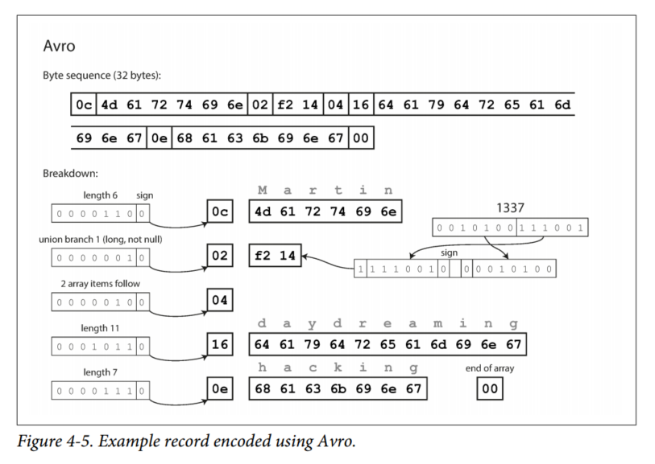
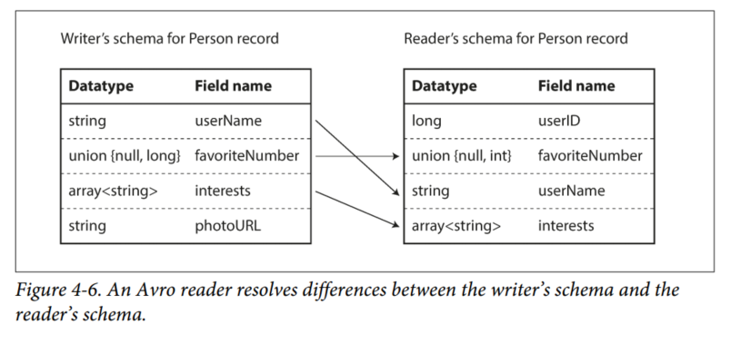
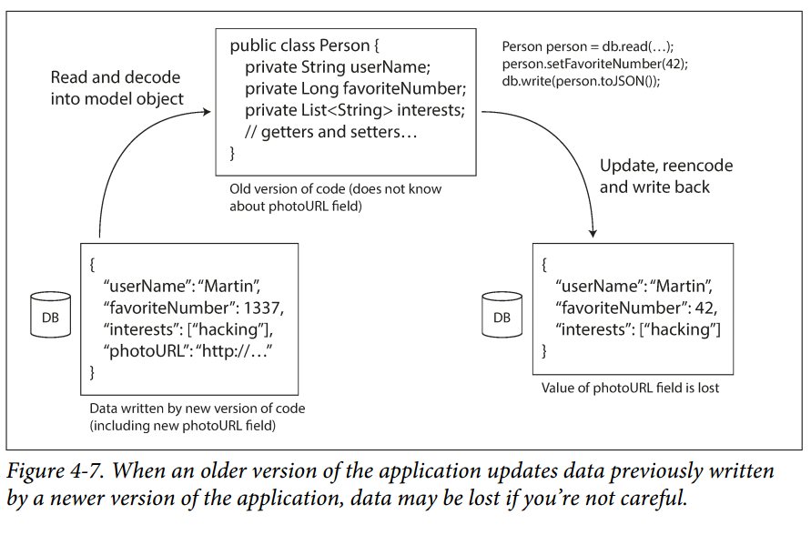

# Chapter 4: Encoding and Evolution

In Chapter 1 we introduced the idea of evolvability: we should aim to build systems that make it easy to adapt to change.

The data models we discussed in Chapter 2 have different ways of coping with such change. Relational databases generally assume that all data in the database conforms to one schema. Although that schema can be changed, there is exactly one schema in force at any one point in time.

By contrast, schemaless databases don't enforce a schema, so the database can contain a mixture of older and newer data formats.

When a data format or schema changes, a corresponding change to application code often needs to happen. In a large application, code changes often cannot happen instantaneously:

1. With server-side applications you may want to perform a rolling upgrade (a.k.a a *staged rollout*), deploying the new version to a few nodes at a time, checking whether the new version is running smoothly, and gradually working your way through all the nodes. This allows new versions to be deployed without service downtime, and thus encourages more frequent releases and better evolvability.

2. With client-side applications, you're at the mercy of the user, who may not install the update for some time.

This means that old and new versions of the code, and old and new data formats may potentially coexist in the system at the same time. We need to ensure that our code is both backward compatible and forward compatible.

Backward compatibility is normally easier to handle: you know the format of data written by older code, so you can explicitly handle it (if necessary by simply keeping the old code to read old data). Forward compatibility is trickier, because it requires older code to ignore additions made by a newer version of the code.

In this chapter we will look at several formats for encoding data, including JSON, XML, Protocol Buffers, Thrift, and Avro. In particular, we will look at how they handle schema changes and how they support systems where old and new data and code need to coexist. We will then discuss how those formats are used for data storage and for communication: in web services, Representational State Transfer (REST), and remote procedure calls (RPC), as well as message-passing systems such as actors and message queues.

## Formats for Encoding Data
Programs usually work with data in (at least) two different representations:
1. In memory, data is kept in objects, structs, lists, arrays, hash tables, trees, and so on. These data structures are optimized for efficient access and manipulation by the CPU (usually using pointers)

2. When you want to write data to a file or send it over the network, you have to encode it as some kind of self-contained sequence of bytes (e.g. a JSON document). Since a pointer wouldn't make sense to any other process, this sequence-of-bytes representation looks quite different from the data structures that are normally used in memory.

Thus, we need some kind of translation between the two representations. The translation from the in-memory representation to a byte sequence is called *encoding* (a.k.a. *serialization* or *marshalling*), and the reverse is *decoding* (a.k.a. *deserialization*, *unmarshalling*).

## Language-Specific Formats
Many programming languages come with built-in support for encoding in-memory objects into byte sequences. For example, Java has `java.io.Serializable`, Ruby has `Marshal`, Python has `pickle`, etc.

These encoding libraries are very convenient, because they allow in-memory objects to be saved and restored with minimal additional code. However, they also have a number of problems:

1. The encoding is often tied to a particular programming language, and reading the data in another language is very difficult.

2. In order to restore data in the same object types, the decoding process needs to be able to instantiate arbitrary classes. This is frequently a source of security problems: if an attacker can get your application to decode an arbitrary byte sequence, they can instantiate arbitrary classes, which in turn often allows them to do things like remotely executing arbitrary code.

3. Versioning data is often an afterthought in these libraries: as they are intended for quick and easy encoding of data, they often neglect the inconvenient problems of forward and backward compatibility.

4. Efficiency is also often an afterthought. Java's built-in serialization is notorious for its bad performance and bloated encoding.

For these reasons it's generally a bad idea to use your language's built-in encoding for anything other than very transient purposes.

## JSON, XML, and Binary Variants
Standard encodings: JSON and XML.
XML is often criticized for being too verbose and unnecessarily complicated. JSON's popularity is mainly due to its built-in support in web browsers (by virtue of being a subset of JavaScript) and simplicity relative to XML. CSV is another popular format, albeit less powerful.

JSON, XML and CSV are textual formats, and thus somewhat human readable. However, they also have some subtle problems:
1. There is a lot of ambiguity around the encoding of numbers. In XML and CSV, you cannot distinguish between a number and a string that happens to consist of digits. JSON distinguishes strings and numbers, but not integers and floating-point numbers, and it doesn't specify a precision.  
**This is a problem when dealing with large numbers.** Integers greater than 2^53 cannot be exactly represented in an IEEE 754 double-precision floating-point number, so such numbers become inaccurate when parsed in a language that uses floating-point numbers (like JavaScript). An example of numbers larger than 253 occurs on Twitter, which uses a 64-bit number to identify each tweet. The JSON returned by Twitter’s API includes tweet IDs twice, once as a JSON number and once as a decimal string, to work around the fact that the numbers are not correctly parsed by JavaScript applications.

2. JSON and XML have good support for Unicode character strings, but they don't support binary strings (sequences of bytes without a character encoding). Binary strings are a useful feature, so people get around this limitation by encoding the binary data as text using Base64. The schema is then used to indicate that the value should be interpreted as Base64-encoded. This works, but it increases the data size by 33%.

3. There is optional schema support for both XML and JSON. These schema languages are quite powerful, and thus quite complicated to learn and implement. Use of XML schemas is fairly common, but many JSON-based tools don't bother using schemas.  
Since the correct interpretation of data depends on information in the schema, applications that don't use XML/JSON schemas need to potentially hardcode the appropriate encoding/decoding logic.

4. CSV doesn't have any schema, so it is up to the application to define the meaning of each row and column.

### Binary Encoding
JSON is less verbose than XML, but both still use a lot of space compared to binary formats. This led to the development of a profusion of binary encodings for JSON (MessagePack, BSON, BJSON, UBJSON, BISON, etc.) and for XML (WBXML, Fast Infoset, etc.). Some of these formats extend the set of datatypes (e.g. distinguishing integers and floating-point numbers), but otherwise keep the JSON/XML data model unchanged. In particular, since they don't prescribe a schema, they need to include all the object field names within the encoded data. That is, in a binary encoding of the JSON document in **Example 4-1**, they will need to include the strings `userName`, `favoriteNumber`, and `interests` (not only the values, but also the keys) somewhere.

```
EXAMPLE 4-1
{
  "userName": "Martin",
  "favoriteNumber": 1337,
  "interests": ["sleeping", "hacking"]
}
```
Using MessagePack, a binary encoding for JSON, it becomes 66 bytes long, which is only a little less than the 81 bytes taken by the textual JSON encoding. It is not clear whether such a small space reduction is worth the loss of human-readability.

We will see how we can do much better in the following sections.

## Thrift and Protocol Buffers
Apache Thrift and Protocol Buffers (Protobuf) are **binary encoding libraries** that are based on the same principle. Both require a schema for any data that is encoded. To encode Example 4-1 in Thrift, you would describe the schema in the Thrift interface definition language (IDL) like this:

```
struct Person {
  1: required string        userName,
  2: optional i64           favoriteNumber,
  3: optional list<string>  interests
}
```

In Protobuf:

```
message Person {
  required string user_name         = 1;
  optional int64 favorite_number    = 2;
  repeated string interests         = 3;
}
```

Thrift and Protobuf each come with a code generation tool that takes a schema definition like the ones shown here, and produces classes that implement the schema in various programming languages. Your application code can call this generated code to encode or decode records of the schema.

### Field tags and schema evolution
How do Thrift and Protocol Buffers handle schema changes while keeping backward and forward compatibility?

As you can see from the examples, an encoded record is just the concatenation of its encoded fields. Each field is identified by its tag number (the numbers 1, 2, 3 in the sample schemas) and annotated with a datatype. If a field value is not set, it is simply omitted from the encoded record. Thus, field tags are critical to the meaning of the encoded data. You can change the name of a field in the schema, but you cannot change a field's tag.

You can add new fields to the schema, provided that you give each field a new tag number. If old code tries to read data written by new code, including a new field with a tag number it doesn't recognize, it can simply ignore that field. The datatype annotation allows the parser to determine how many bytes it needs to skip. This maintains forward compatibility.

For backward compatibility, as long as each field has a unique tag number, new code can always read old data because the tag numbers still have the same meaning. The only detail is that if you add a new field, you cannot make it `required` as the old data will not have this column.

### Datatypes and schema evolution
While it is possible to change a field's datatype, there is a risk that values will lose precision or get truncated. For example, you changed a 32-bit integer into a 64-bit integer. New code can easily read old data because the parser can fill missing bits with zeros, but when old code reads new data, if the decoded 64-bit value won't fit in the 32-bit, it will be truncated.

An interesting detail is that Protocol Buffers does not have a list or array datatype, but instead has a repeated marker for fields. This has the nice effect that it's okay to change an optional field into a repeated field. New code reading old data sees a list with zero or one elements; old code reading new data sees only the last element of the list.

Thrift has a dedicated list datatype. This does not allow the same evolution from single-valued to multi-valued as Protobuf does, but it has the advantage of supporting nested lists.

## Avro
Apache Avro is another binary encoding format that is different from Protobuf and Thrift. Avro uses a schema to specify the structure of the data being encoded. It has two schema languages:

1. Avro IDL - intended for human editing
2. (based on JSON) - more easily machine readable

For example, a schema in Avro IDL may look like this:
```
record Person {
  string              userName;
  union {null, long}  favoriteNumber = null;
  array<string>       interests;
}
```

The equivalent JSON representation is as follows:
```
{
  "type": "record",
  "name": "Person",
  "fields": [
    {"name": "userName",         "type": "string"},
    {"name": "favoriteNumber",   "type": ["null", "long"], "default": null},
    {"name": "interests",        "type": {"type": "array", "items", "string"}}
  ]
}
```
First of all, note that there are no tag numbers in the schema. If we encode our Example 4-1 with this schema, the Avro binary encoding is just 32 bytes long.

If you examine the byte sequence, there is nothing to identify fields or their datatypes. The encoding simply consists of values concatenated together.



To parse the binary data, you go through the fields in the order that they appear in the schema and use the schema to tell you the datatype of each field. This means that the binary data can only be decoded correctly if the code reading the data is using the *exact same schema* as the code that wrote the data.

So how does Avro support schema evolution?

### The writer's schema and the reader's schema
With Avro, when an application wants to encode some data, it encodes the data using whatever version of the schema it knows about - for example, that schema may be compiled into the application. This is known as the *writer's schema*.

When application wants to decode some data, it is expecting the data to be in some schema, which is known as the *reader's schema*. That is the schema the application code is relying on - code may have been generated from that schema during the application's build process.

With Avro, the writer's schema and the reader's schema don't have to be the same - they just need to be compatible. When data is decoded (read), the Avro library resolves the differences by looking at the two schemas and translating the data from the writer's schema into the reader's schema. The Avro specification defines exactly how this resolution works, as illustrated in Figure 4-6 below.



It's no problem if the writer's schema and the reader's schema have their fields in a different order, because he schema resolution matches up the fields by field name. If the code reading the data encounters a field that appears in the writer's schema but not in the reader's schema, it is ignored. If the code reading the data expects some field, but the writer’s schema does not contain a field of that name, it is filled in with a default value declared in the reader’s schema.

### Schema evolution rules
With Avro, forward compatibility means that you can have a new version of the schema as writer and an old version of the schema as reader. Conversely backward compatibility means that you can have the new version of the schema as reader and old version as writer.

To maintain compatibility, you may only add or remove a field that has a default value. When a reader using the new schema reads a record written with the old schema, the default value is filled in for the missing field.

If you were to add a field that has no default value, new readers wouldn't be able to read data written by old writers, so you would break backward compatibility. If you were to remove a field that has no default value, old readers wouldn't be able to read data written by new writers, so you would break forward compatibility.

In some programming languages, `null` is an acceptable default for any variable, but this is not the case in Avro: if you want to allow a field to be null, you have to use a *union type*. This is a little more verbose than everything nullable by default, but it helps prevent bugs by being explicit about what can and cannot be null.

Consequently, Avro doesn't have optional and required markers (it has union types and default values instead).

Changing the datatype of a field is possible, provided that Avro can convert the type. Changing a field name is backward compatible but not forward compatible.

### But what is the writer's schema?
But how does the reader know the which data was encoded with which writer's schema?

The answer depends on the context in which Avro is being used. To give a few examples:
1. Large file with lots of records  
A common use for Avro is for storing a large file containing millions of records, all encoded with the same schema. In this case, the writer of that file can just include the writer's schema once at the beginning of the file. Avro specifies a file format (object container files) to do this.

2. Database with individually written records  
In a database, different records may be written at different points in time using different writer's schemas - since we cannot assume that all the records will have the same schema. The simplest solution is to include a version number at the beginning of every encoded record, and to keep a list of schema versions in your database.  
When a reader fetches a record, it extracts the version number, and then fetch the writer's schema for that version number from the database.

3. Sending records over a network connection  
When two processes are communicating over a bidirectional network connection, they can negotiate the schema version on connection setup and then use that schema for the connection lifetime. The Avro RPC protocol works like this.

A database of schema versions is a useful thing to have in any case, since it acts as documentation and gives you a chance to check schema compatibility.

### Dynamically generated schemas
One advantage of Avro's approach is that the schema doesn't contain any tag numbers. But why is this important?

The difference is that Avro is friendlier to **dynamically generated** schemas. If you use Avro, you can fairly easily generate an Avro schema (in the JSON representation we saw earlier) from the relational schema and encode the database contents using that schema, dumping it all to an Avro object container file. You generate a record schema for each database table, and each column becomes a field in that record. The column name in the database maps to the field name in Avro.

If the database schema changes, you can just generate a new Avro schema from the updated database schema and export data in the new Avro schema. Since the fields are identified by name, the updated writer's schema can still be matched up with the old reader's schema.

In contrast, if you were using Thrift or Protobuf, someone would have to manually update the mapping from database column names to field tags.

### Code generation and dynamically typed languages
Thrift and Protobuf rely on code generation: after a schema has been defined, you can generate code that implements this schema in a programming language of your choice. This is useful in statically typed languages (Java, C#) because it allows efficient in-memory structures to be used for decoded data, and it allows type checking in IDEs when writing programs that access the data structures.

In dynamically typed programming languages (JavaScript, Python), there is not much point in generating code since it is an unnecessary obstacle to getting to the data.

Avro provides optional code generation for statically typed programming languages, but it can be used without code generation as well. If you have an object container file, you can simply open it using the Avro library and look at the data the same way you could look at a JSON file. The file is *self-describing* since it includes all the necessary metadata.

In Apache Pig, you can open Avro files, analyze them, and write derived datasets to output files in Avro format without thinking about schemas.

## The Merits of Schemas
Protobuf, Thrift, and Avro all use a schema to describe a binary encoding format. Their schema languages are much simpler than XML Schema or JSON Schema, which support much more detailed validation rules.

Nice properties of binary encodings based on schemas:
1. They can be much more compact than the various "binary JSON" variants, since they can omit field names from the encoded data.

2. The schema is a valuable form of documentation, and because the schema is required for decoding, you can be sure that it is up to date.

3. Keeping a database of schemas allows you to check forward and backward compatibility of schema changes.

4. For users of statically typed programming languages, the ability to generate code from the schema is useful.

In summary, schema evolution allows the same kind of flexibility as schemaless / schema-on-read JSON databases provide while also providing better guarantees about your data and better tooling.

## Modes of Dataflow
There are many ways data can flow from one process to another. We will explore some of the most common ways how data flows between processes:
- Via databases
- Via service calls
- Via asynchronous message passing

### Dataflow Through Databases
In a database, the process that writes to the database encodes the data, and the process that reads from the database decodes it.

In general, it's common for several different processes to be accessing a database at the same time. Those processes might be several different applications or services, or simply several instances of the same service. Either way, it is likely that some processes accessing the database will be running newer code and some will be running older code - for example because of rolling update.

Thus, forward compatibility and backward compatibility are important.

However, there is an additional snag. Say you add a field to a record schema, and the new code writes a value for that new field to the database. When an older code reads the record, updates it, and writes it back, it shouldn't touch the new field. While the encoding formats discussed previously support such preservation of unknown fields, sometimes you need to take care at an application level.



#### Different values written at different times
For database contents, the old data will remain in its original encoding. Rewriting (migrating) data into a new schema is possible, but expensive on a large dataset. Most relational databases allow simple schema changes without rewriting existing data. When an old row is read, the database fills in `null`s for any columns that are missing from the encoded data on disk. LinkedIn's document database Espresso uses Avro for storage, allowing it to use Avro's schema evolution rules.

#### Archival storage
In this case, the data dump will typically be encoded using the latest schema, even if the original encoding in the source database contained a mixture of schema versions. As the data dump is written in one go and is thereafter immutable, formats like Avro object container files are a good fit. This is also a good opportunity to encode the data in an analytics-friendly column oriented format like Parquet.

### Dataflow Through Services: REST and RPC
When you have processes that need to communicate over a network, the most common arrangement is to have two roles: *clients* and *servers*. The servers expose an API over the network, and the clients can connect to the servers to make requests to that API. The API exposed by the server is known as a *service*.

Web browsers are not the only type of client. For example, a native app running on a mobile device/desktop can also make network requests to a server, and a client-side JavaScript application running inside a web browser can use XMLHttpRequest to become a HTTP client (this technique known as Ajax).

A server can also be a client to another service. This approach is often used to decompose a large application into smaller services by area of functionality, such that one service makes a request to another when it requires some functionality or data from that other service. This way of building applications is called a *service-oriented architecture* (SOA), more recently rebranded as *microservices architecture*.

A key design goal of a SOA is to make the application easier to change and maintain by making services independently deployable and evolvable.

#### Web services
When HTTP is used as the underlying protocol for talking to the service, it is called a *web service*. Web services are not only used on the web. For example:
1. A client application running on a user's device making requests to a service over HTTP. These requests typically go over the public internet.
2. One service making requests to another service owned by the same organization, located within the same datacenter, as part of a SOA.
3. One service making requests to a service owned by a different organization via the internet. This is used for data exchange between organizations' backend systems. This category includes public APIs provided by online services, such as credit card processing systems, or OAuth for shared access to user data.

Two popular approaches to web services: REST and SOAP.

REST is not a protocol, but a design philosophy that builds upon the principles of HTTP. It emphasizes simple data formats, using URLs for identifying resources and using HTTP features for cache control, authentication, and content type negotiation. REST is often associated with microservices.

SOAP is an XML-based protocol for making network API requests. Although it is most commonly used over HTTP, it aims to be independent from HTTP and avoids using most HTTP features. It comes with a complex multitude of related standards (the web service framework, known as WS-\*) that adds various features.

The API of a SOAP web service is described using an XML-based language called the Web Services Description Language (WSDL). WSDL enables code generation so that a client can access a remote service using local classes and method calls. As WSDL is not designed to be human-readable, and as SOAP messages are often too complex to construct manually, users of SOAP rely heavily on tool support, code generation and IDEs. Interoperability between different vendors' implementations of SOAP often cause problems. This is why RESTful APIs is favored.

A definition format such as OpenAPI, a.k.a. Swagger, can be used to describe RESTful APIs and produce documentation.

#### The problems with remote procedure calls (RPCs)
The RPC model tries to make a request to a remote network service look the same as calling a function or method in your programming language, within the same process (this abstraction is called *location transparency*). RPC approach is fundamentally flawed. A network request is very different from a local function call:
1. A local function call is predictable and either succeeds or fails, depending only on parameters that are under your control. A network request is unpredictable: the request or response may be lost due to a network problem, or the remote machine may be slow or unavailable, and such problems are entirely outside of your control.

2. A local function call either returns a result, or throws an exception, or never returns (because it goes into an infinite loop or the process crashes). A network request has another possible outcome: it may return without a result due to a timeout. In that case, you simply don't know what happened.

3. If you retry a failed network request, it could happen that the requests are actually getting through, and only the responses are lost. Retrying will cause the action to be performed multiple times, unless you build a mechanism for deduplication. Local function calls don't have this problem.

4. Every time you call a local function, it normally takes about the same time to execute. A network request is much slower than a function call and its latency wildly varies.

5. When you call a local function, you can efficiently pass it references to objects in local memory. When you make a network request, all those parameters need to be encoded. It becomes problematic with larger objects.

6. The client and the service may be implemented in different programming languages, so the RPC framework must translate datatypes from one language into another.

#### Current directions for RPC
Various RPC frameworks have been built on top of all the encodings mentioned previously: for example, Thrift and Avro come with RPC support included, gRPC is an RPC implementation using Protobuf, Rest.li uses JSON over HTTP.

This new generation of RPC frameworks is more explicit about the fact that a remote request is different from a local function call. For example, Finagle and Rest.li use *futures* (*promises*) to encapsulate asynchronous actions that may fail. Futures also simplify situations where you need to make requests to multiple services in parallel and combine their results. gRPC supports *streams*. Some of these frameworks also provide *service discovery* which allows a client to find out at which IP address and port number it can find a particular service.

Custom RPC protocols with a binary encoding format can achieve better performance than something generic like JSON over REST. However, a RESTful API has other significant advantages: it is good for experimentation and debugging (simply make requests using a web browser without any code generation / software installation), it is supported by all mainstream programming languages and platforms, and there is a vast ecosystem of tools available (servers, caches, load balancers, proxies, firewalls, monitoring, debugging tools, testing tools, etc.).

#### Data encoding and evolution for RPC
We can make a simplifying assumption in the case of dataflow through services: it is reasonable to assume that all the servers will be updated first, and all the clients second. Thus you only need backward compatibility on requests, and forward compatibility on responses.

The backward and forward compatibility properties of an RPC scheme are inherited from whatever encoding it uses:
- Thrift, gRPC (Protocol Buffers), and Avro RPC can be evolved according to the compatibility rules of the respective encoding format.
- In SOAP, requests and responses are specified with XML schemas. These can be evolved, but there are some subtle pitfalls.
- RESTful APIs most commonly use JSON (without a formally specified schema) for responses, and JSON or URI-encoded/form-encoded request parameters for requests. Adding optional request parameters and adding new fields to response objects are usually considered changes that maintain compatibility.

Since RPC is often used for communication across organizations, the provider of a service often has no control over its clients and cannot force them to upgrade. Thus, compatibility needs to be maintained for a long time.

For RESTful APIs, common approaches are to use a version number in the URL or in the HTTP `Accept` header.

## Message-Passing Dataflow
We will look at asynchronous message-passing systems, which are somewhere between RPC and databases. They are similar to RPC in that a client's request (*message*) is delivered to another process with low latency. They are similar to databases in that the message is not sent via a direct network connection, but via an intermediary called a *message broker* (a.k.a. *message queue* or *message-oriented middleware*), which stores the message temporarily.

Using a message broker has several advantages over direct RPC:
1. It can act as a buffer if the recipient is unavailable or overloaded, thus improve system reliability.

2. It can automatically redeliver messages to a process that has crashed, thus prevent messages from being lost.

3. It avoids the sender needing to know the IP address and port number of the recipient.

4. It allows one message to be sent to several recipients.

5. It logically decouples the sender from the recipient.

Message-passing communication is usually one-way: the sender doesn't expect a reply to its messages. The communication pattern is asynchronous: the sender doesn't wait for the message to be delivered, but simply sends it and then forgets about it.

### Message brokers
Open source implementations such as RabbitMQ, ActiveMQ, HornetQ, and Apache Kafka have become popular. In general, message brokers are used as follows: one process sends a message to a named *queue* or *topic*, and the broker ensures that the message is delivered to one or more *consumers* or *subscribers* to that queue or topic. One topic can have many producers and consumers.

Message brokers typically don't enforce any particular data model. If the encoding is backward and forward compatible, you have the greatest flexibility to change publishers and consumers independently and deploy them in any order. If a consumer republishes messages to another topic, you may need to be careful to preserve unknown fields, to prevent the issue described previously in the context of databases (Figure 4-7).

### Distributed actor frameworks
The *actor model* is a programming model for concurrency in a single process. Rather than dealing directly with threads, logic is encapsulated in *actors*. Each actor typically represents one client or entity, it may have some local state (which is not shared with other actors), and it communicates with other actors by sending and receiving asynchronous messages. Message delivery is not guaranteed. Since each actor processes one message at a time, it doesn't need to worry about threads, and each actor can be scheduled independently by the framework.

In *distributed actor frameworks*, this model is used to scale an application across multiple nodes. The same message-passing mechanism is used, no matter whether the sender and recipient are on the same node or not. If they are on different nodes, the message is transparently encoded into a byte sequence, sent over the network, and decoded on the other side.

A distributed actor framework essentially integrates a message broker and the actor programming model into a single framework. However, if you want to perform rolling upgrades of your actor-based application, you still have to worry about forward and backward compatibility, as messages may be sent from a node running the new version to a node running the old version, and vice versa.

## Summary
In this chapter we looked at several ways of turning data structures into bytes on the network or bytes on disk. We saw how the details of these encodings affect not only their efficiency, but more importantly also the architecture of applications and your options for deploying them.

In particular, many services need to support rolling upgrades, where a new version of a service is gradually deployed to a few nodes at a time, rather than deploying to all nodes simultaneously. Rolling upgrades allow new versions of a service to be released without downtime (thus encouraging frequent small releases over rare big releases) and make deployments less risky (allowing faulty releases to be detected and rolled back before they affect a large number of users). These properties are hugely beneficial for evolvability, the ease of making changes to an application.

During rolling upgrades, or for various other reasons, we must assume that different nodes are running the different versions of our application’s code. Thus, it is important that all data flowing around the system is encoded in a way that provides backward compatibility (new code can read old data) and forward compatibility (old code can read new data).

We discussed several data encoding formats and their compatibility properties:

- Programming language–specific encodings are restricted to a single programming language and often fail to provide forward and backward compatibility.

- Textual formats like JSON, XML, and CSV are widespread, and their compatibility depends on how you use them. They have optional schema languages, which are sometimes helpful and sometimes a hindrance. These formats are somewhat vague about datatypes.

- Binary schema–driven formats like Thrift, Protocol Buffers, and Avro allow compact, efficient encoding with clearly defined forward and backward compatibility semantics. The schemas can be useful for documentation and code generation in statically typed languages. However, they have the downside that data needs to be decoded before it is human-readable.

We also discussed several modes of dataflow, illustrating different scenarios in which data encodings are important:

- Databases, where the process writing to the database encodes the data and the process reading from the database decodes it.

- RPC and REST APIs, where the client encodes a request, the server decodes the request and encodes a response, and the client finally decodes the response.

- Asynchronous message passing (using message brokers or actors), where nodes communicate by sending each other messages that are encoded by the sender and decoded by the recipient.

We can conclude that with a bit of care, backward/forward compatibility and rolling upgrades are quite achievable. May your application’s evolution be rapid and your deployments be frequent.
