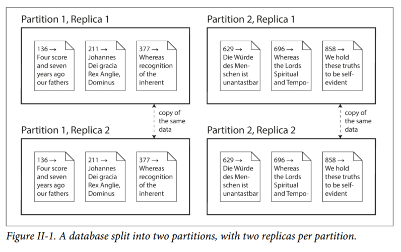

# Part II: Distributed Data
There are various reasons why you might want to distribute a database across multiple machines:
- Scalability  
If your data volume, read load, or write load grows bigger than a single machine can handle, you can spread the load across multiple machines.

- Fault tolerance/high availability  
If one machine goes down, you can use multiple machines to give you redundancy. When one fails, another can take over.

- Latency  
You might want to have servers at various locations worldwide so that each user can be served from a datacenter that is geographically close to them.

## Scaling to Higher Load
The simplest approach is to buy a more powerful machine (scaling up / vertical scaling). Many CPUs, many RAM chips, and many disks can be joined together under one OS, and a fast interconnect allows any CPU to access any part of the memory / disk. In this *shared-memory architecture*, all the components can be treated as a single machine.

The problem with this approach is that the cost grows faster than linearly. A shared-memory architecture may offer limited fault tolerance - high end machines have hot-swappable components, but it is definitely limited to a single geographic location.

Another approach is the *shared-disk architecture*, which uses several machines with independent CPUs and RAM, but stores data on an array of disks that is shared between the machines, which are connected via a fast network. This architecture is used for some data warehousing workloads, but contention and the overhead of locking limit the scalability of the shared-disk approach.

## Shared-Nothing Architectures
Also known as *horizontal scaling* or *scaling out*. In this approach, each machine or virtual machine running the database software is called a *node*. Each node uses its CPUs, RAM, and disks independently. Any coordination between nodes is done at the software level, using a conventional network.

No special hardware is required, so you can use whatever machines with the best price/performance ratio. You can potentially distribute data across multiple geographic regions, and thus reduce latency for users and potentially be able to survive the loss of an entire datacenter. With cloud deployments of virtual machines, even for small companies, a multi-region distributed architecture is now feasible.

We will focus on shared-nothing architectures because they require the most caution from the application developer. If your data is distributed across multiple nodes, you need to be aware of the constraints and trade-offs that occur in such a distributed system - the database cannot magically hide these from you.

While a distributed shared-nothing architecture has many advantages, it usually also incurs additional complexity for applications and sometimes limits the expressiveness of the data models you can use.

## Replication vs. Partitioning
Two common ways data is distributed across multiple nodes:
1. Replication  
Keeping a copy of the same data on several different nodes, potentially in different locations. Replication provides redundancy: if some nodes are unavailable, the data can still be served from the remaining nodes. Replication can also help improve performance. (Discussed in Chapter 5)

2. Partitioning  
Splitting a big database into smaller subsets called *partitions* so that different partitions can be assigned to different nodes (also known as *sharding*). (Discussed in Chapter 6)

With an understanding of these concepts, we can discuss the difficult trade-offs that you need to make in a distributed system.

We’ll discuss transactions in Chapter 7, as that will help you understand all the many things that can go wrong in a data system, and what you can do about them. We’ll conclude this part of the book by discussing the fundamental limitations of distributed systems in Chapters 8 and 9.
