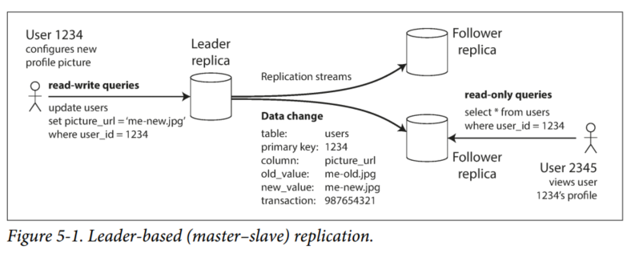
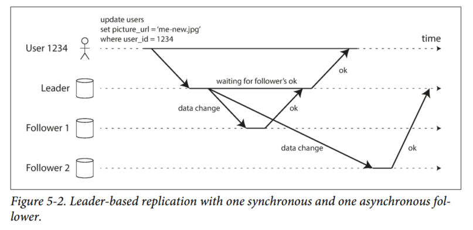
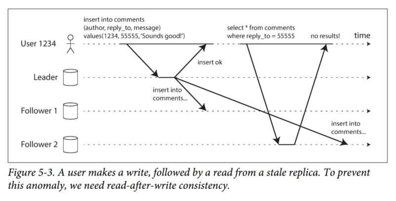
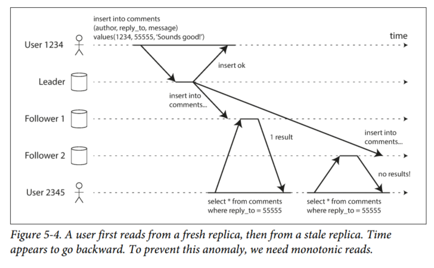
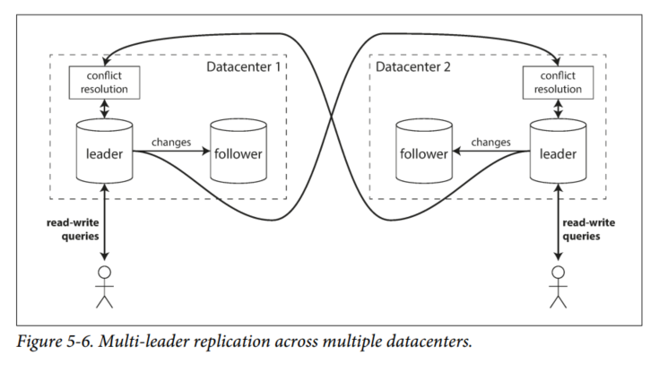
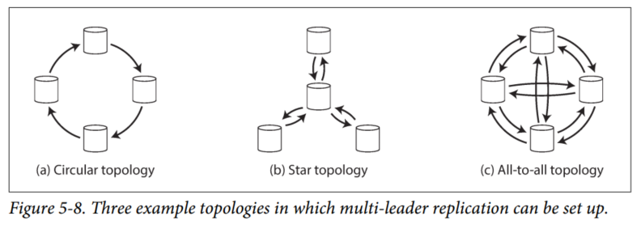
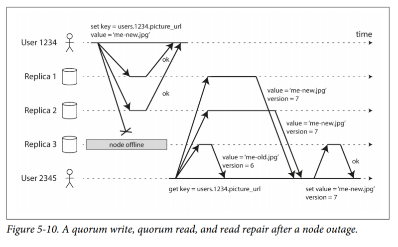
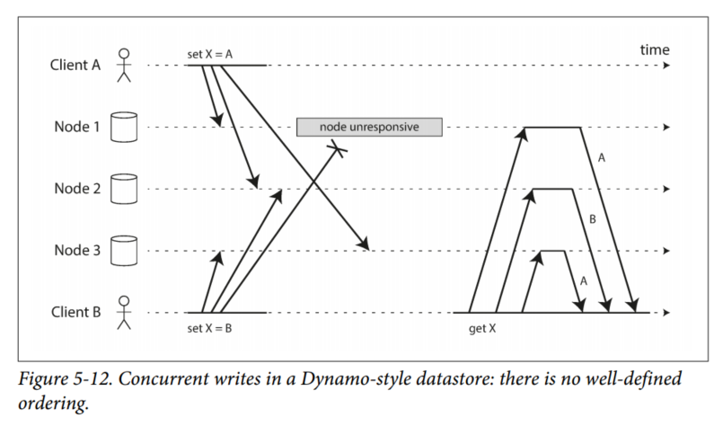
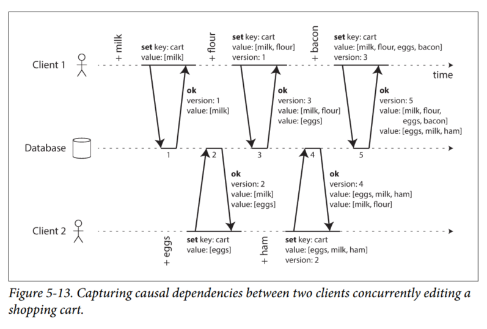
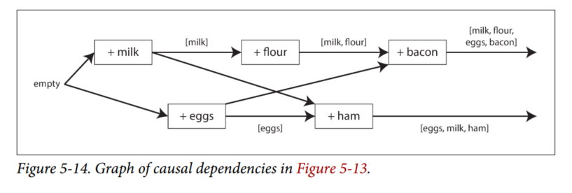

# Chapter 5 - Replication

Replication means keeping a copy of the same data on multiple machines that are connected via a network. There are several reasons for replication:
- To keep data geographically close to your users (reduce latency)

- To allow the system to continue working even if some of its parts have failed (increase availability)

- To scale out the number of machines that can serve read queries (increase read throughput)

We will assume that each machine can hold a copy of your entire dataset for now.

If the data that you’re replicating does not change over time, then replication is easy: you just need to copy the data to every node once, and you’re done. All of the difficulty in replication lies in handling changes to replicated data, and that’s what this chapter is about. We will discuss three popular algorithms for replicating changes between nodes: single-leader, multi-leader, and leaderless replication. Almost all distributed databases use one of these three approaches. They all have various pros and cons, which we will examine in detail.

Replication of databases is an old topic because the fundamental constraints of networks have remained the same. However, many developers continued to assume for a long time that a database consisted of just one node. Mainstream use of distributed database is more recent.

## Leaders and Followers
Each node that stores a copy of a database is called a *replica*. With multiple replicas, how do we ensure all the data ends up on all the replicas?

Every write to the database needs to be processed by every replica: otherwise the replicas would no longer contain the same data. The most common solution for this is called *leader-based replication* (a.k.a. active/passive or master-slave). It works like this:

1. One of the replicas is designated the *leader* (master/primary). When clients want to write to the database, they must send their requests to the leader, which first writes the new data to its local storage.
2. The other replicas are called the *followers* (slaves/secondary). Whenever the leader writes new data to its local storage, it also sends the data change to all of its followers as part of a *replication log* or *change stream*. Each follower takes the log from the leader and updates its local copy of the database accordingly, by applying all writes in the same order as they were processed on the leader.
3. When a client wants to read from a database, it can read from either the leader or the followers. However, writes are only accepted on the leader.

This replication mode is a built-in feature of many relational databases, such as PostgreSQL, MySQL, Oracle Data Guard, and SQL Server's AlwaysOn Availability Groups. It is also used in some nonrelational databases, including MongoDB, RethinkDB, and Espresso. Leader-based replication is also used in distributed message brokers such as Kafka and RabbitMQ.

### Synchronous vs. Asynchronous Replication
Figure 5-2 shows the communication between various components of the system: the user's client, the leader, and two followers. A request or response is shown as a thick arrow.

In this example, the replication to follower 1 is synchronous: the leader waits until follower 1 has confirmed that it received the write before reporting success to the user and before making the write visible to other clients. The replication to follower 2 is asynchronous: the leader sends the message but doesn't wait for a response from the follower.

The diagram shows that there is a substantial delay before follower 2 processes the message. Normally, replication happens in less than a second. However, there is no guarantee of how long it might take.

The advantage of synchronous replication is that the follower is guaranteed to have an up-to-date copy of the data that is consistent with the leader. The disadvantage is that if the synchronous follower doesn't respond (due to crash, network fault, etc.), the write cannot be processed. The leader must block all writes and wait for the synchronous replica to be available again.

Therefore, it is impractical for all followers to be synchronous: any one node outage will cause the whole system to grind to a halt. In practice, if you enable synchronous replication on a database, it usually means that *one* follower is synchronous and the rest are asynchronous. If the synchronous follower becomes unavailable or slow, one of the asynchronous followers is made synchronous. This guarantees that you have an up-to-date copy of the data on at least two nodes. This configuration is called *semi-synchronous*.

Often, leader-based replication is configured to be completely asynchronous. This means that a write is not guaranteed to be durable, even if it has been confirmed to the client. Weakening durability may sound like a bad trade-off, but asynchronous replication is widely used, especially if there are many followers or if they are geographically distributed.

### Setting Up New Followers
How do you ensure that the new follower has an accurate copy of the leader's data?

Clients are constantly writing to the database, and the data is always in flux, so a standard file copy would see different parts of the database at different points in time. You could make the files on disk consistent by locking the database (making it unavailable for writes), but that would go against our goal of high availability.

Setting up a follower can usually be done without downtime.

1. Take a consistent snapshot of the leader's database at some point in time - if possible, without locking the entire database. Most database have this feature, as it is also required for backups. In some cases, third-party tools are needed.

2. Copy the snapshot to the new follower.

3. The follower connects to the leader and requests all the data changes that have happened since the snapshot was taken. This requires that the snapshot is associated with an exact position in the leader's replication log. In PostgreSQL, it is called the *log sequence number*, and MySQL calls it the *binlog coordinates*.

4. When the follower has processed the backlog of data changes since the snapshot, we say it has *caught up*. It can now continue to process data changes from the leader as they happen.

### Handling Node Outages
Being able to reboot individual nodes without downtime is a big advantage for operations and maintenance. Thus, our goal is to keep the system as whole running despite individual node failures, and to keep the impact of a node outage as small as possible.

How do you achieve high available with leader-based replication?

#### Follower failure: Catch-up recovery
On its local disk, each follower keeps a log of the data changes it has received from the leader. If a follower falls behind, it can recover quite easily: from its log, it knows the last transaction that was processed. Thus, the follower can connect to the leader and request all the data changes that occurred during the time when the follower was disconnected.

#### Leader failure: Failover
One of the follower needs to be promoted to be the new leader, clients need to be reconfigured to send their writes to the new leader, and other followers need to start consuming data changes from the new leader. This is called *failover*.

Failover can happen manually or automatically. An automatic failover process usually consists of the following steps:
1. *Determining that the leader has failed*. Most systems simply use a timeout: if a node doesn't respond for a period of time, it is assumed to be dead (unless the leader is deliberately taken down for maintenance).

2. *Choosing a new leader*. This could be done through an election process, or a new leader could be appointed by a previously elected *controller node*. The best candidate for leadership is usually the replica with the most up-to-date data changes from the old leader. Getting all the nodes to agree on a new leader is a consensus problem, discussed in detail in Chapter 9.

3. *Reconfiguring the system to use the new leader*. Clients now need to send their write requests to the new leader (Request Routing). If the old leader comes back, it might still believe that it is the leader, not realizing that the other replicas have forced it to step down. The system needs to ensure that the old leader becomes a follower and recognizes a new leader.

Failover is fraught with things that can go wrong:

1. If asynchronous replication is used, the new leader may not have received all the writes from the old leader before it failed. If the former leader rejoins the cluster after a new leader has been chosen, what should happen to those writes? The new leader may have received conflicting writes in the meantime. The most common solution is for the old leader's unreplicated writes to be discarded, which may violate clients' durability expectations.

2. Discarding writes is especially dangerous if other storage systems outside of the database need to be coordinated with the database contents. For example, in one incident at GitHub, an out-of-date MySQL follower was promoted to leader. The database used an autoincrementing counter to assign primary keys to new rows, but because the new leader’s counter lagged behind the old leader’s, it reused some primary keys that were previously assigned by the old leader. These primary keys were also used in a Redis store, so the reuse of primary keys resulted in inconsistency between MySQL and Redis, which caused some private data to be disclosed to the wrong users.

3. In certain fault scenarios, it could happen that two nodes both believe that they are the leader. This situation is called *split brain*, and it is dangerous: if both leaders accept writes and there is no process for resolving conflicts, data is likely to be lost or corrupted. As a safety catch, some systems have a mechanism to shut down one node if two leaders are detected. However, if this mechanism is nor carefully designed, you can end up with both nodes getting shut down.

4. What is the right timeout before the leader is declared dead? A longer timeout means a longer time to recover in the case where the leader fails. If the timeout is too short, there could be unnecessary failovers.

There are no easy solutions to these problems. For this reason, some teams prefer to perform failovers manually.

These issues - node failures; unreliable networks; and trade-offs around replica consistency, durability, availability, and latency - are in fact fundamental problems in distributed systems.

### Implementation of Replication Logs
How does leader-based replication work under the hood?

#### Statement-based replication
In the simplest case, the leader logs every write request (*statement*) that it executes and sends that statement log to its followers. For a relational database, this means that every `INSERT`, `UPDATE`, or `DELETE` statement is forwarded to followers, and each follower parses and executes that SQL statement as if it had been received from a client.

Although this may sound reasonable, there are various ways in which this approach to replication can break down:

- Any statement that calls a nondeterministic function, such as `NOW()` OR `rand()` is going to generate a different value on each replica.

- If statements use an autoincrementing column, or if the depend on the existing data in the database (e.g., `UPDATE` ... `WHERE` <some condition>), they must be executed in exactly the same order on each replica, or else they may have a different effect. This can be limiting when there are multiple concurrently executing transactions

- Statements that have side effects (e.g., triggers, stored procedures, user-defined functions) may result in different side effects occurring on each replica, unless the side effects are absolutely deterministic.

It is possible to work around these issues - for example, the leader can replace any nondeterministic function calls with a fixed return value when the statement is logged so that the followers all get the same value. However, there are so many edge cases, so other replication methods are preferred.

#### Write-ahead log (WAL) shipping
In Chapter 3 we discussed how storage engines represent data on disk, and we found that usually every write is appended to a log:
- In log-structured storage engine (SSTables and LSM-Trees), this log is the main place for storage. Log segments are compacted and garbage-collected in the background.

- In the case of B-trees, which overwrites individual disk blocks, every modification is first written to a write-ahead log so that the index can be restored to a consistent state after a crash.

Either way, the log is an append-only sequence of bytes containing all writes to the database. We can use the log to build a replica on another node. When the follower processes this log, it builds a copy of the exact same data structures as found on the leader.

This method is used in PostgreSQL and Oracle, among others. The **main disadvantage** is that the log describes the data on a very low level: a WAL contains details of which bytes were changed in which disk blocks. This makes replication closely coupled to the storage engine. If the database changes its storage format, it is typically not possible to run different versions of the database software on the leader and the followers.

This has a big operational impact, since **database upgrades will require downtime.**  If the replication protocol allows the follower to use a newer software version than the leader, you can perform a zero-downtime upgrade of the database software by first upgrading the followers and then performing a failover to make one of the upgraded nodes the new leader.

#### Logical (row-based) log replication
An alternative is to use different log formats for replication and for the storage engine, which allows the replication log to be decoupled from the storage engine internals. This is called a *logical log*, to distinguish it from the storage engine's (*physical*) data representation.

A logical log for a relational database is usually a sequence of records describing writes to database tables at the granularity of a row.

1. For an inserted row, the log contains the new values of all columns.

2. For a deleted row, the log contains enough information to uniquely identify the row that was deleted. Typically this would be the primary key, but if there is no primary key on the table, the old values of all columns need to be logged.

3. For an updated row, the log contains enough information to uniquely identify the updated row and the new values of all columns (or at least the new values of all columns that changed).

A transaction that modifies several rows generates several log records, followed by a record indicating that the transaction was committed. MySQL's binlog uses this approach.

Since a logical log is decoupled from the storage engine internals, it can more easily be kept backward compatible, allowing the leader and the follower to run different versions of the database software, or even different storage engines.

A logical format is easier for external applications to parse. This is useful if you want to send the contents of a database to an external system, such as a data warehouse for offline analysis, or for building custom indexes and caches. This is called *change data capture*.

#### Trigger-based replication
If you want to only replicate a subset of the data, or want to replicate from one kind of database to another, or if you need conflict resolution logic, then you may need to move replication up to the application layer.

Some tools like Oracle GoldenGate can make data changes available to an application by reading the database log. Alternatively, relational databases can use *triggers* and *stored procedures*.

A trigger lets you register custom application code that is automatically executed when a data change (write transaction) occurs in the database. The trigger has the opportunity to log this change into a separate table, from which it can be read by an external process.

Trigger-based replication typically has greater overheads than other replication methods, and is more prone to bugs and limitations than the database's built-in replication.

## Problems with Replication Lag
If an application reads from an asynchronous follower, it may see outdated information if the follower has fallen behind. This inconsistency is temporary - the followers will eventually catch up and become consistent with the leader. This is known as *eventual consistency*.

In theory, there is no limit to how far a replica can fall behind. In normal operation, the delay between a write happening on the leader and being reflected on a follower (the replication lag) may be only a fraction of a second - unnoticeable. However, if the system is operating near capacity or if there is a network problem, this lag can become apparent.

In this section, we will highlight three examples of problems that are likely to occur when there is replication lag and outline some approaches to solving them.

### Reading Your Own Writes
Many applications let the user submit some data and then view what they have submitted. When new data is submitted, it must be sent to the leader, but when the user views the data, it can be read from a follower. This is especially appropriate if data is frequently viewed but only occasionally written.

With asynchronous replication, there is a problem, illustrated in Figure 5-3: if the user views the data shortly after making a write, the new data may not yet have reached the replica.

In this situation, we need *read-after-write consistency* (a.k.a. *read-your-writes consistency*). This is a guarantee that if the user reloads the page, they will always see any updates they submitted themselves. It makes no promises about other uses: other users' updates may not be visible until some time later. However, it reassures the user that their own input has been saved correctly.

How can we implement read-after-write consistency in a system with leader-based replication?

1. When reading something that the user may have modified, read it from the leader; otherwise, read it from a follower. This requires that you have some way of knowing whether something might have been modified, without actually querying it. For example, user profile information on a social network is only editable by the profile's owner. Thus, we can use a simple rule: always read the user's own profile from the leader, and any other users' profile from a follower.

2. If most things in the application are potentially editable by the user, we can't use the above approach. In that case, other criteria may be used to decide whether to read from the leader. For example, you could track the time of the last update and for one minute after the last update, make all reads from the leader. We can change the one minute timer depending on the replication lag.

3. The client can remember the timestamp of its most recent write - then the system can ensure that the replica serving any reads for that user reflects updates at least until that timestamp. If a replica is not sufficiently up to date, either the read can be handled by another replica or the query can wait until the replica has caught up.

4. If your replicas are distributed across multiple datacenters, there is additional complexity. Any request that needs to be served by the leader must be routed to the datacenter that contains the leader.

Another complication arises when the same user is accessing your service from multiple devices. In this case you may want to provide *cross-device* read-after-write consistency.

In this case, there are some additional issues to consider:
- Approaches that require remembering the timestamp of the user's last update become more difficult. This metadata will need to be centralized.

- If your replicas are distributed across different datacenters, there is no guarantee that connections from different devices will be routed to the same datacenter. If your approaches requires reading from the leader, you may first need to route requests from all of a user's devices to the same datacenter.

### Monotonic Reads
Another anomaly that can occur when reading from asynchronous followers is that it's possible for a user to see things *moving backward in time*.

This can happen if a user makes several reads from different replicas. For example, Figure 5-4 shows user 2345 making the same query twice, first to a follower with little lag, then to a follower with more lag. In effect, the second query is observing the system at an earlier point in time than the first query.

*Monotonic reads* is a guarantee that this kind of anomaly does not happen. It's a lesser guarantee than strong consistency, but a strong guarantee than eventual consistency. When you read data, you may see an old value; monotonic reads only means that if one user makes several reads in a sequence, they will not read older data after having previously read newer data.

One way of achieving monotonic reads is to make sure that each user always makes their reads from the same replica (different users can read from different replicas). For example, the replica can be chosen based on the hash of the user ID.

### Consistent Prefix Reads
The third anomaly concerns violations of causality. Observe Figure 5-5:

The things said by Mrs. Cake go through a follower with little lag, but the things said by Mr. Poons have a longer replication lag.

Preventing this kind of anomaly requires another type of guarantee: *consistent prefix reads*. This guarantee says that if a sequence of writes happens in a certain order, then anyone reading those writes will see them appear in the same order.

This is a particular problem in partitioned (sharded) databases. If the database always writes in the same order, reads always see a consistent prefix, so this anomaly cannot happen. However, in many distributed databases, different partitions operate independently, so there is no global ordering of writes: when a user reads from the database, they may see some parts of the database in an older state and some in a newer state.

One solution is to make sure that any writes that are causally related to each other are written to the same partition - but sometimes this cannot be done efficiently. There are also algorithms that explicitly keep track of causal dependencies, which will be explained in details later on.

### Solutions for Replication Lag
It would be better if application developers didn't have to worry about subtle replication issues and could just trust their databases to "do the right thing". This is why *transactions* exist: there are a way for a database to provide stronger guarantees so that the application can be simpler.

Single-node transactions have existed for a long time. However, in the move to distributed (replicated and partitioned) databases, many systems have abandoned them, claiming that transactions are too expensive in terms of performance and availability, and asserting that eventual consistency is inevitable in a scalable system. This will be discussed in details later on.

## Multi-Leader Replication
Leader-based replication has one major downside: there is only one leader, and all writes must go through it. If you can't connect to the leader for any reason, you can't write to the database.

So, we just allow more than one node to accept writes. This is a *multi-leader* configuration (a.k.a. *master-master* or *active/active replication*).
In this setup, each leader simultaneously acts as a follower to the other leaders.

### Use Cases for Multi-Leader Replication
It rarely makes sense to use a multi-leader setup within a single datacenter, because the benefits rarely outweigh the added complexity.

#### Multi-datacenter operation
Imagine you have a database with replicas in several different datacenters. With a normal leader-based replication setup, the leader has to be in *one* of the datacenters, and all writes must go through that datacenter.

In a multi-leader configuration, you can have a leader in *each* datacenter. Figure 5-6 shows what this architecture might look like. Within each datacenter, regular leader-follower replication is used; between datacenters, each datacenter's leader replicates its changes to the leaders in other datacenters.

Let's compare these different configurations in a multi-datacenter deployment:

| | Single-leader | Multi-leader |
|---|---|---|
| Performance | Every write must go over the internet to the datacenter with the leader. This can add serious latency | Every write can be processed in the local datacenter and is replicated asynchronously to other datacenters |
| Tolerance of datacenter outages | Failover can promote a follower in another datacenter to be leader | Each datacenter can continue operating independently, and replication catches up when the failed datacenter comes back online |
| Tolerance of network problems | Very sensitive to problems in this inter-datacenter link, because writes are made synchronously over this link | A temporary network interruption does not prevent writes being processed due to its asynchronous replication nature |

Although multi-leader replication has advantages, it also has a big downside: the same data may be concurrently modified in two different datacenters, and those write conflicts must be resolved (indicated as "conflict resolution" in Figure 5-6).

As multi-leader replication is a somewhat retrofitted feature in many databases, there are often subtle configuration pitfalls and surprising interactions with other database features. For example, autoincrementing keys, triggers, and integrity constraints can be problematic. For this reason, multi-leader replication is often considered dangerous territory that should be avoided if possible.

#### Clients with offline operation
Another situation in which multi-leader replication is appropriate is if you have an application that needs to continue to work while it is disconnected from the internet.

If you make changes while you are offline, they need to be synced with a server and your other devices when the device is next online (e.g. calendar apps).

In this case, every device has a local database that acts as a leader (it accepts write requests), and there is an asynchronous multi-leader replication process (sync) between the replicas of your calendar on all your devices.

There are tools that aim to make this kind of multi-leader configuration easier. For example, CouchDB is designed for this mode of operation.

#### Collaborative editing
We don't usually think of collaborative editing as a database replication problem, but it has a lot in common with the previously mentioned offline editing use case. When one user edits a document, the changes are instantly applied to their local replica (the state of the document in their web browser or client application) and asynchronously replicated to the server and any other users who are editing the same document.

For faster collaboration, you may want to make the unit of change very small (e.g. a single keystroke) and avoid locking. This approach allows multiple users to edit simultaneously, but it also brings all the challenges of multi-leader replication, including requiring conflict resolution.

### Handling Write Conflicts
Consider a wiki page that is simultaneously being edited by two users, as shown in Figure 5-7. Each user's change is successfully applied to their local leader. However, when the changes are asynchronously replicated, a conflict is detected. This problem does not occur in a single-leader database.

#### Synchronous versus asynchronous conflict detection
In principle, you could make the conflict detection synchronous - i.e., wait for the write to be replicated to all replicas before telling the user that the write was successful. However, by doing so, you would lose the main advantage of multi-leader replication: allowing each replica to accept writes independently.

#### Conflict avoidance
The simplest strategy for dealing with conflicts is to avoid them: if the application can ensure that all writes for a particular record go through the same leader, then conflicts cannot occur. This is a common approach in many multi-leader replication implementations.

In an application where a user can edit their own data, you can ensure that requests from a particular user are always routed to the same datacenter and use the leader in that datacenter for reading and writing. From any one user's point of view, the configuration is essentially single-leader.

However, when the designated leader has to change, perhaps because of a datacenter failure, then conflict avoidance breaks down.

#### Converging towards a consistent state
A single-leader database applies writes in a sequential order: if there are several updates to the same field, the last write determines the final value of the field.

In a multi-leader configuration, there is no defined ordering of writes, so it's not clear what the final value should be. If each replica simply applied writes in the order that it saw the writes, the database would end up in an inconsistent state; different leader will have different values.

Thus, the database must resolve the conflict in a *convergent* way, which means that all replicas must arrive at the same final value when all the changes have been replicated.

There are various ways of achieving convergent conflict resolution:

1. Give each write a unique ID, pick the write with the highest ID as the winner and throw away other writes. If a timestamp is used as the unique ID, this is called *last write wins* (LWW). Although this approach is popular, it is dangerously prone to data loss.

2. Give each replica a unique ID, and let writes that originated at a higher-numbered replica always take precedence over writes that originated at a lower-numbered replica. This approach also implies data loss.

3. Somehow merge the values together - e.g., order them alphabetically and then concatenate them.

4. Record the conflict in an explicit data structure that preserves all information, and write application code that resolves the conflict at a later time, perhaps by prompting the user.

#### Custom conflict resolution logic
Most multi-leader replication tools let you write conflict resolution logic using application code. That code may be executed on write or on read:

- *On write*  
As soon as the database system detects a conflict in the log of replicated changes, it calls the conflict handler. This handler typically cannot prompt a user - it runs in a background process and it must execute quickly. For example, Bucardo allows you to write a snippet of Perl code.

- *On read*  
When a conflict is detected, all the conflicting writes are stored. The next time the data is read, the application may prompt the user or automatically resolve the conflict and write the result back to the database. CouchDB works this way.

Conflict resolution usually applies at the level of an individual row or document, not an entire transaction.

#### Automatic Conflict Resolution
There has been some interesting research into automatically resolving conflicts caused by concurrent data modifications:
- *Conflict-free replicated datatypes* (CRDTs) are a family of *data structures* for sets, maps, ordered lists, counters, etc. that can be concurrently edited by multiple users, and which automatically resolve conflicts in sensible ways.

- *Mergeable persistent data structures* track history explicitly, similar to the Git version control system, and use a three-way merge function (CRDTs use two-way merges).

- *Operational transformation* is the conflict resolution algorithm behind collaborative editing applications like Google Docs.

### Multi-Leader Replication Topologies
A *replication topology* describes the communication paths along which writes are propagated from one node to another. Some examples are as follows:

The most general topology is all-to-all, in which every leader sends its writes to every other leader. However, more restricted topologies are also used: for example, MySQL by default only supports a *circular topology*, in which each node receives writes from one node and forwards those writes to one other node. In the *star topology*, one designated root node forwards writes to all of the other nodes. This is similar to a tree.

In circular and star topologies, a write may need to pass through several nodes before it reaches all replicas. Therefore, nodes need to forward data changes they receive from other nodes. To prevent infinite replication loops, each node is given a unique identifier, and in the replication log, each write is tagged with the identifiers of all the nodes it has passed through.

A problem with the circular and star topologies is that if just one node fails, it can interrupt the flow of replication messages between other nodes, causing them to be unable to communicate until the node is fixed. The fault tolerance of a more densely connected topology (like all-to-all) is better because it allows messages to travel along different paths, avoiding a *single point of failure*.

On the other hand, all-to-all topologies can have issues too. In particular, some network links may be faster than others, with the result that some replication messages may overtake others. This is a problem of causality, similar to the one in "Consistent Prefix Reads".

To order these events correctly, a technique called *version vectors* can be used, which will be discussed later.

## Leaderless Replication
Some data storage systems abandon the concept of a leader and allow any replica to directly accept writes from clients. It is used in Amazon's in-house *Dynamo* system, which inspired Riak, Cassandra, and Voldemort. This kind of database is also known as *Dynamo-style*.

In some leaderless implementations, the client directly sends its writes to several replicas, while in others, a coordinator node does this on behalf of the client. Unlike a leader database, the coordinator does not enforce a particular ordering of writes.

### Writing to the Database When a Node Is Down
In a leaderless configuration, failover does not exist. Figure 5-10 shows what happens: the client (user 1234) sends the write to all three replicas in parallel, and the two available replicas accept the write but the unavailable replica misses it. Let's say that it's sufficient for two out of three replicas to acknowledge the write: after user 1234 has received two *ok* responses, then we consider the write to be successful.

Now imagine that the unavailable node comes back online, and clients start reading from it. Any writes that happened while the node was down are missing from that node. Thus, if you read from that node, you may get stale (outdated) values as responses.

To solve that problem, when a client reads from the database, it doesn't just send its request to one replica: *read requests are also sent to several nodes in parallel*. The client may get different responses from different nodes. Version numbers are used to determine which value is newer.

#### Read repair and anti-entropy
The replication scheme should ensure that eventually all the data is copied to every replica. After an unavailable node comes back online, there are two mechanisms used to catch up on the writes that it missed:

1. *Read repair*  
When a client makes a read from several nodes in parallel, it can detect any stale responses. When the client sees that a replica has a stale value, it will write the newer value back to that replica. This approach works well for values that are frequently read.

2. *Anti-entropy process*  
In addition, some datastores have a background process that constantly looks for differences in the data between replicas and copies any missing data from one replica to another. Unlike the replication log in leader-based replication, this *anti-entropy process* does not copy writes in any particular order, and there may be a significant delay before data is copied.

Without an anti-entropy process, values that are rarely read may be missing from some replicas and thus have reduced durability, because read repair is only performed when a value is read by the application.

#### Quorums for reading and writing
In the example in Figure 5-10, if we know that every successful write is guaranteed to be present on at least 2 out of 3 replicas, that means at most 1 replica can be stale. Thus, if we read from at least two replicas, we can be sure that at least 1 is up to date.

More generally, if there are *n* replicas, every write must be confirmed with *w* nodes to be considered successful, and we must query at least *r* nodes for each read. As long as *w + r > n*, we expect to get an up-to-date value when reading. Reads and writes that obey these *r* and *w* values are called *quorum* reads and writes.

The quorum condition, w + r > n, allows the system to tolerate unavailable nodes as follows:
- If w < n, we can still process writes in a node is unavailable.
- If r < n, we can still process reads if a node is unavailable.
- Normally, reads and writes are always sent to all *n* replicas in parallel. The parameters *w* and *r* determine how many of the *n* nodes need to report success before we consider the operation to be successful.

If fewer than the required *w* or *r* nodes are available, the operation returns an error.

### Limitations of Quorum Consistency
Often, r and w are chosen to be more than n/2 nodes, because that ensures w + r > n while still tolerating  up to n/2 node failures. But quorums are not necessarily majorities - it only matters that the sets of nodes used by the read and write operations overlap in at least 1 node.

You may also set *w* and *r* to smaller numbers, so that w + r <= n (i.e., the quorum condition is not satisfied). In this case, reads and writes will still be sent to *n* nodes, but a smaller number of successful responses is required for the operation to succeed.

With a smaller w and r, you are more likely to read stale values, because it's more likely that your read didn't include the node with the latest value. On the upside, this configuration allows lower latency and higher availability: if there is a network interruption and many replicas become unreachable, there's a higher chance that you can continue processing reads and writes. Only after the number of reachable replicas falls below w or r does the database become unavailable for writing or reading, respectively.

However, even with w + r > n, there are likely to be edge cases where stale values are returned. Possible scenarios include:
- If a sloppy quorum is used, the *w* writes may end up on different nodes than the *r* reads, so there is no longer a guaranteed overlap between the *r* nodes and the *w* nodes.

- If two writes occur concurrently, it is not clear which one happened first. In this case, the only safe solution is to merge the concurrent writes. If a winner is picked based on a timestamp, writes can be lost due to clock skew.

- If a write happens concurrently with a read, the write may be reflected on only some of the replicas. In this case, it's undetermined whether the read returns the old or the new value.

- If a write succeeded on some replicas but failed on others (e.g. some of the disks on some nodes are full), and overall succeeded on fewer than *w* replicas, it is not rolled back on the replicas where it succeeded. This means that if a write was reported as failed, subsequent reads may or may not return the value from that write.

- If a node carrying a new value fails, and its data is restored from a replica carrying an old value, the number of replicas storing the new value may fall below *w*, breaking the quorum condition.

Thus, although quorums appear to guarantee that a read returns the latest written value, in practice it is not so simple. Dynamo-style databases are generally optimized for use cases that can tolerate eventual consistency. The parameters *w* and *r* allow you to adjust the probability of stale values being read, but it’s wise to not take them as absolute guarantees.

#### Monitoring staleness
For leader-based replication, the database typically exposes metrics for the replication lag. This is possible because writes are applied to the leader and to followers in the same order, and each node has a position in the replication log. By subtracting a follower's current position from the leader's current position, you can measure the amount of replication lag.

However, in systems with leaderless replication, there is no fixed order in which writes are applied, which makes monitoring more difficult. Moreover, if the database only uses read repair (no anti-entropy), there is no limit to how old a value might be.

There has been some research on measuring replica staleness in databases with leaderless replication and predicting the expected percentage of stale reads depending on the parameters n, w, and r. This is unfortunately not yet common practice, but it would be good to include staleness measurements in the standard set of metrics for databases. Eventual consistency is a deliberately vague guarantee, but for operability it’s important to be able to quantify "eventual".

### Sloppy Quorums and Hinted Handoff
Quorums are not as fault-tolerant as they could be. A network interruption can easily cut off a client from a large number of database nodes. In this case, it is likely that fewer than *w* or *r* reachable nodes remain, so the client can no longer reach a quorum.

In a large cluster, it's likely that the client can connect to *some* database nodes during the network interruption, just not to the nodes that it needs to assemble a quorum for a particular value.

In that case, database designers face a trade-off:
- Is it better to return errors to all requests for which we cannot reach a quorum of *w* or *r* nodes?
- Or should we accept writes anyway, and write them to some nodes that are reachable but aren't among the *n* nodes on which the value usually lives?

The latter is known as a *sloppy quorum*: writes and reads still require w and r successful responses, but those may include nodes that are not among the designated *n* "home" nodes for a value.

Once the network interruption is fixed, any writes that one node temporarily accepted on behalf of another node are sent to the appropriate "home" nodes. This is called *hinted handoff*.

Sloppy quorums are particularly useful for increasing write availability: as long as *any w* nodes are available, the database can accept writes. However, this means that even when w + r > n, you cannot be sure to read the latest value for a key, because the latest value may have been temporarily written to a node outside of *n*.

Thus, a sloppy quorum actually isn’t a quorum at all in the traditional sense. It’s only an assurance of durability, namely that the data is stored on w nodes somewhere. There is no guarantee that a read of r nodes will see it until the hinted handoff has completed.

### Multi-datacenter operation
Leaderless replication is also suitable for multi-datacenter operation, since it is designed to tolerate conflicting concurrent writes, network interruptions, and latency spikes.

Cassandra and Voldemort implement their multi-datacenter support within the normal leaderless model: the number of replicas *n* includes nodes in *all* datacenters, and in the configuration you can specify how many of the *n* replicas you want to have in each datacenter. Each write from a client is sent to all replicas, regardless of datacenter, but the client usually only waits for acknowledgement from a quorum of nodes within its local datacenter so that it is unaffected by delays and interruptions on the cross-datacenter link. The higher latency writes to other datacenters are often configured to happen asynchronously, although there is some flexibility in the configuration.

### Detecting Concurrent Writes
Dynamo-style databases allow several clients to concurrently write to the same key, which means that conflicts can occur. Conflicts can also arise during read repair or hinted handoff. The problem is that events may arrive in a different order at different nodes, due to variable network delays and partial failures.

Figure 5-12 shows two clients, A and B, simultaneously writing to a key X in a three-node structure:

- Node 1 receives the write from A, but never receives the write from B due to a transient outage.
- Node 2 first receives the write from A, then from B.
- Node 3 first receives the write from B, then from A.

If each node simply overwrite the value for a key whenever it received a write request from a client, the nodes would become permanently inconsistent, as shown by the final *get* request: node 2 thinks the final value for X is B, whereas the other nodes think that the value is A.

In order to become eventually consistent, the replicas should converge toward the same value. Most databases' automatic implementations of conflict handling is quite poor, so the application developer needs to know a lot about the internals of the database's conflict handling.

#### Last write wins
In this approach, as long as we have some way of unambiguously determining which write is more "recent", and every write is eventually copied to every replica, the replicas will eventually converge to the same value.

Even though the writes don't have a natural ordering (concurrent writes), we can force an arbitrary order on them. For example, we can attach a timestamp to each write. This conflict resolution algorithm, called *last write wins* (LWW) is the only supported conflict resolution method in Cassandra, and is optional in Riak.

LWW achieves the goal of eventual convergence, but at the cost of durability. If losing data is not acceptable, LWW is a poor choice for conflict resolution. The only safe way of using a database with LWW is to ensure that a key is only written once and thereafter treated as immutable, thus avoiding any concurrent updates to the same key. For example, a recommended way of using Cassandra is to use a UUID as the key, thus giving each write operation a unique key.

#### The "happens-before" relationship and concurrency
How do we decide whether two operations are concurrent? We can simply say that two operations are concurrent if neither happens before the other (i.e., neither knows about the other), regardless of the physical time at which they occurred. If one operation happened before another, the later operation should overwrite the earlier operation, but if the operations are concurrent, we have a conflict that needs to be resolved.

#### Capturing the happens-before relationship
Let's start with a database that has only one replica. Figure 5-13 shows two clients concurrently adding items to the same shopping cart. Initially the cart is empty. Between them, the clients make five writes to the database:

1. Client 1 adds `milk` to the cart. The server successfully stores it and assigns it version 1. The server also echoes the value back tot he client, along with the version number.

2. Client 2 adds `eggs` to the cart, not knowing that client 1 concurrently added `milk` (client 2 thought that its eggs were the only item in the cart). The server assigns version 2 to this write, and stores `eggs` and `milk` as two separate values. It then returns *both* values to the client, along with the version number 2.

3. Client 1, oblivious to client 2’s write, wants to add flour to the cart, so it thinks the current cart contents should be [milk, flour]. It sends this value to the server, along with the version number 1 that the server gave client 1 previously. The server can tell from the version number that the write of [milk, flour] supersedes the prior value of [milk] but that it is concurrent with [eggs]. Thus, the server assigns version 3 to [milk, flour], overwrites the version 1 value [milk], but keeps the version 2 value [eggs] and returns both remaining values to the client.

4. Meanwhile, client 2 wants to add ham to the cart, unaware that client 1 just added flour. Client 2 received the two values [milk] and [eggs] from the server in the last response, so the client now merges those values and adds ham to form a new value, [eggs, milk, ham]. It sends that value to the server, along with the previous version number 2. The server detects that version 2 overwrites [eggs] but is concurrent with [milk, flour], so the two remaining values are [milk, flour] with version 3, and [eggs, milk, ham] with version 4.

5. Finally, client 1 wants to add bacon. It previously received [milk, flour] and [eggs] from the server at version 3, so it merges those, adds bacon, and sends the final value [milk, flour, eggs, bacon] to the server, along with the version number 3. This overwrites [milk, flour] (note that [eggs] was already overwritten in the last step) but is concurrent with [eggs, milk, ham], so the server keeps those two concurrent values.

The dataflow is illustrated graphically above. The arrows indicate which operation happened before which other operation, in the sense that the later operation *knew about* or *depended on* the earlier one. Old versions of the value do get overwritten eventually, and no writes are lost.

The server can determine whether two operations are concurrent by looking at the version numbers. The algorithm works as follows:

1. The server maintains a version number for every key, increments the version number every time that key is written, and stores the new version number along with the value written.

2. When a client reads a key, the server returns all values that have not been overwritten, as well as the latest version number. A client must read a key before writing.

3. When a client writes a key, it must include the version number from the prior read, and it must merge together all values that it received in the prior read.

4. When the server receives a write with a particular version number, it can overwrite all values with that version number or below (since it knows that they have been merged into a new value), but it must keep all values with a higher version number (because those values are concurrent with the incoming write).

#### Merging concurrently written values
This algorithm ensures that no data is silently dropped, but it requires that the clients do some extra work: if several operations happen concurrently, clients have to clean up afterward by merging the concurrently written values. Riak calls these concurrent values *siblings*.

Merging sibling values is essentially the same problem as conflict resolution in multi-leader application. With the shopping cart example, a reasonable approach is to take the union of the siblings. However, if you allow people to also remove things from their carts, then taking the union may not yield the right result.
To prevent this problem, the system must leave a marker with an appropriate version number to indicate that the item has been removed when merging siblings. Such a deletion marker is known as a *tombstone*.

#### Version vectors
The example in Figure 5-13 uses only a single replica. How does the algorithm change when there are multiple replicas but no leader?

We then need to use a version number *per replica* as well as per key. Each replica increments its own version number when processing a write, and also keeps track of the version numbers it has seen from each of the other replicas.

The collection of version numbers from all the replicas is called a *version vector*. Like the version numbers in Figure 5-13, version vectors are sent from the database replicas to clients when values are read, and need to be sent back to the database when a value is subsequently written. The version vector allows the database to distinguish between overwrites and concurrent writes.

Also, like in the single-replica example, the application may need to merge siblings. The version vector structure ensures that it is safe to read from one replica and subsequently write back to another replica. Doing so may result in siblings being created, but no data is lost as long as siblings are merged correctly.

# Summary
In this chapter we looked at the issue of replication. Replication can serve several purposes:

1. *High availability*  
Keeping the system running, even when one machine goes down.

2. *Disconnected operation*  
Allowing an application to continue working when there is a network interruption.

3. *Latency*  
Placing data geographically close to users, so that users can interact with it faster.

4. *Scalability*  
Being able to handle a higher volume of reads than a single machine could handle, by performing reads on replicas.

Despite being a simple goal, replication turns out to be a remarkably tricky problem. It requires carefully thinking about concurrency and about all the things that can go wrong, and dealing with the consequences of those faults. At a minimum, we have to deal with unavailable nodes and network interruptions.

We discussed three main approaches to replication:

1. *Single-leader application*  
Clients send all writes to a single node (leader), which sends a stream of data change events to the other replicas (followers). Reads can be performed on any replica, but reads from followers might be stale.

2. *Multi-leader replication*  
Clients send each write to one of several leader nodes, any of which can accept writes. The leaders send streams of data change events to each other and to any follower nodes.

3. *Leaderless replication*  
Clients send each write to several nodes, and read from several nodes in parallel in order to detect and correct nodes with stale data.

Each approach has advantages and disadvantages. Single-leader replication is popular because it is fairly easy to understand and there is no conflict resolution to worry about. Multi-leader and leaderless replication can be more robust in the presence of faulty nodes, network interruptions, and latency spikes—at the cost of being harder to reason about and providing only very weak consistency guarantees.

Replication can be synchronous or asynchronous. Asynchronous replication is fast when the system is running smoothly, but it's important to figure out what happens when replication lag increases and servers fail. If a leader fails and you promote an asynchronously updated follower to be the new leader, recently committed data may be lost.

We looked at some strange effects that can be caused by replication lag and we discussed a few consistency models which are helpful for deciding how an application should behave under replication lag.

1. *Read-after-write consistency*  
Users should always see data that they submitted themselves.

2. *Monotonic reads*  
After users have seen the data at one point in time, they shouldn't see the data from some earlier point in time.

3. *Consistent prefix reads*  
Users should see the data in a state that makes causal sense: for example, seeing a question and its reply in the correct order.

Finally, we discussed the concurrency issues that are inherent in multi-leader and leaderless replication approaches: because they allow multiple writes to happen concurrently, conflicts might occur. We examined an algorithm that a database might use to determine whether one operation happened before another, or whether they happened concurrently. We also touched on methods for resolving conflicts by merging together concurrent updates.

In the next chapter we will continue looking at data that is distributed across multiple machines, through the counterpart of replication: splitting a large dataset into partitions.

---
