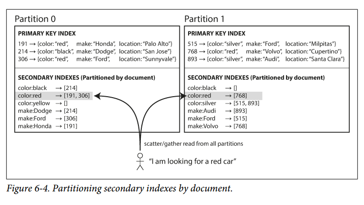

# Chapter 6 - Partitioning
Previously, we discussed replication - that is, having multiple copies of the same data on different nodes. For very large datasets, or very high query throughput, that is not enough: we need to break the data up into partitions, also known as sharding.

**Note**: What we call a partition here is called a *shard* in MongoDB, Elasticsearch and SolrCloud; it's known as a *region* in HBase, a *tablet* in Bigtable, a *vnode* in Cassandra and Riak, and a *vBucket* in Couchbase.

Normally, partitions are defined in such a way that each piece of data (record, row, or document) belongs to exactly one partition. There are various ways of achieving this, which will be discussed in depth. In effect, each partition is a small database of its own, although the database may support operations that touch multiple partitions at the same time.

The main reason for wanting to partition data is *scalability*. Different partitions can be placed on different nodes in a shared-nothing cluster (horizontal-scaled cluster). Thus, a large dataset can be distributed across many disks, and the query load can be distributed across many processors.

For queries that operate on a single partition, each node can independently execute the queries for its own partition, so query throughput can be scaled by adding more nodes. Large, complex queries can potentially be parallelized across many nodes.

Some systems are designed for transactional workloads, and others for analytics: this difference affects how the system is tuned, but the fundamentals of partitioning apply to both kinds of workloads. In this chapter we will first look at different approaches for partitioning large datasets and observe how indexing of data interacts with partitioning. We'll then talk about rebalancing, which is necessary if you want to add or remove nodes in your cluster. Finally we'll get an overview of how databases route requests to the right partitions and execute queries.

## Partitioning and Replication
Partitioning is usually combined with replication so that copies of each partition are stored on multiple nodes. Even though each record belongs to exactly one partition, it may still be stored on several different nodes for fault tolerance.

A node may store more than one partition. If a leader-follower replication model is used, the combination of partitioning and replication can look like Figure 6-1. Each partition's leader is assigned to one node, and its followers are assigned to other nodes. Each node may be the leader for some partitions and a follower for other partitions.

We will ignore replication in this chapter for simplicity.

## Partitioning of Key-Value Data
How do you decide which records to store on which nodes?

Our goal with partitioning is to spread the data and the query load evenly across nodes. If every node takes a fair share, then—in theory—10 nodes should be able to
handle 10 times as much data and 10 times the read and write throughput of a single node (ignoring replication for now).

If the partitioning is unfair, we call it *skewed*. The presence of skew makes partitioning much less effective. In an extreme case, all the load could end up on one partition, so the other nodes are idle and you have a single busy node. A partition with disproportionately high load is called a *hot spot*.

The simplest approach for avoiding hot spots would be to assign records to nodes randomly. This would distribute the data quite evenly, but when you're trying to read a particular item, you don't know which node it is on, so you have to query all nodes in parallel.

We can do better. Let's assume that you have a simple key-value data model, in which you always access a record by its primary key. For example, in an encyclopedia, you look up an entry by its title; since all the entries are alphabetically sorted by title, it's easy to find what you're looking for.

### Partitioning by Key Range
One way of partitioning is to assign a continuous range of keys (from some minimum to some maximum) to each partition, like the volumes of an encyclopedia. If you know the boundaries between the ranges, you can easily determine which partition contains a given key. The ranges of keys are not necessarily evenly spaced, because your data may not be evenly distributed.

The partition boundaries might be chosen manually by an administrator, or the database can choose them automatically. This partitioning strategy is used by Bigtable, its open source equivalent HBase, RethinkDB, and MongoDB.

Within each partition, we can keep keys in sorted order (SSTables and LSM-Trees). This has the advantage that range scans are easy, and you can treat the key as a concatenated index in order to fetch several related records in one query.

However, the downside of key range partitioning is that certain access patterns can lead to hot spots. If the key is a timestamp ,then the partitions correspond to ranges of time - e.g., one partition per day. Unfortunately, because we write data from the sensors to the database as the measurements happen, all the writes end up going to the same partition, so that partition can be overloaded with writes while others sit idle.

To avoid this problem, you need to use something other than the timestamp as the first element of the key. For example, you could prefix each timestamp with the sensor name so that the partitioning is first by sensor name. The write load will end up more evenly spread across the partitions. Now, when you want to fetch the values o multiple sensors within a time range, you need to perform a separate range query for each sensor name.

### Partitioning by Hash of Key
Because of this risk of skew and hot spots, many distributed datastores use a hash function to determine the partition for a given key.

A good hash function takes skewed data and makes it uniformly distributed. For partitioning purposes, the hash function need not to be cryptographically strong: for example, Cassandra and MongoDB use MD5, and Voldemort uses the Fowler-Noll-Vo function. Many programming languages have simple hash functions built in, but they may not be suitable for partitioning: for example, in Java's Object.hashCode(), the same key may have a different hash value in different processes.

Once you have a suitable hash function for keys, you can assign each partition a range of hashes (instead of range of keys). This is illustrated in Figure 6-3.

Unfortunately, however, by using the hash of the key for partitioning we lose a nice property of key-range partitioning: **the ability to do efficient range queries**. Keys that were once adjacent are now scattered across all the partitions, so their sort order is lost. In MongoDB, if you have enabled hash-based sharding mode, any range query has to be sent to all partitions. Range queries on the primary key are not supported by Riak, Couchbase, or Voldemort.

Cassandra achieves a compromise between the two partitioning strategies. A table in Cassandra can be declared with a *compound primary key* consisting of several columns. Only the first part of that key is hashed to determine the partition, but the other columns are used as a concatenated index for sorting the data in Cassandra's SSTables. A query, therefore, cannot search for a range of values within the first column of a compound key, but if it specifies a fixed value for the first column, it can perform an efficient range scan over the other columns of the key.  

The concatenated index approach enables an elegant data model for one-to-many relationships. For example, on a social media site, one user may post many updates. If the primary key for updates is chosen to be (user_id, update_timestamp), then you can efficiently retrieve all updates made by a particular user within some time interval, sorted by timestamp. Different users may be stored on different partitions, but within each user, the updates are stored ordered by timestamp on a single partition.

### Skewed Workloads and Relieving Hot Spots
While hashing a key can help reduce hot spots, it can't avoid them entirely. In the extreme case where all reads and writes are for the same key, you will still end up with all requests being routed to the same partition (e.g., a celebrity with many followers).

Today, most data systems are not able to automatically compensate for such a highly skewed workload, so it's up to the application to reduce the skew. For example, if one key is known to be very hot, a simple technique is to add a random number to the beginning or end of the key. Just a two-digit decimal random number would split the writes to they key evenly across 100 different keys, allowing those keys to be distributed to different partitions.

However, having split the writes across different keys, any reads now have to do additional work. This technique also requires additional bookkeeping: it only makes sense to append the random number for the small number of hot keys; for the vast majority of keys with low write throughput, this would be **unnecessary overhead**. Thus, you also need some way of keeping track of which keys are being split.

## Partitioning and Secondary Indexes
The partitioning schemes we have discussed so far rely on a key-value data model. If records are only ever accessed via their primary key, we can determine the partition from that key and use it to route read and write request to the partition responsible for that key.

The situation becomes more complicated if secondary indexes are involved. **A secondary index usually doesn't identify a record uniquely, but rather is a way of searching for occurrences of a particular value** (e.g., find all actions by user 123).

Secondary indexes are the bread and butter of relational databases, and they are common in document databases too. Many key-value stores (such as HBase and Voldemort) have avoided secondary indexes because of their added complexity, but some (such as Riak) have started adding them because they are so useful for data modeling. Secondary indexes are the *raison d'être* for search servers such as Solr and Elasticsearch.

The problem with secondary indexes is that they don't map neatly to partitions. There are two main approaches to partitioning a database with secondary indexes: document-based partitioning and term-based partitioning.

### Partitioning Secondary Indexes by Document
Imagine you are operating a website for selling used cars. Each listing has a unique ID called the document ID, and you partition the database by the document ID. If you want to allow users to filter the cars by color and by make, you would need a secondary index on `color` and `make`. If you have declared the index, the database can perform the indexing automatically.

In this indexing approach, each partition is completely separate: each partition maintains its own secondary index, covering only the documents in that partition. Whenever you need to write to the database, you only need to deal with the partition that contains the document ID that you are writing. A document-partitioned index is also known as a *local index*.

However, reading from a document-partitioned index requires care: unless you have done something special with the document IDs, there is no reason why all the cars with a particular color or a particular make would be in the same partition. Thus, if you want to search for red cars, you need to send the query to *all* partitions, and combine all the results you get back.

This approach to querying a partitioned database is known as *scatter/gather*, and it can make read queries on secondary indexes quite expensive. This is prone to tail latency amplification. Nevertheless, it is widely used: MongoDB, Riak, Cassandra, Elasticsearch, SolrCloud, and VoltDB all use document-partitioned secondary indexes. Most database vendors recommend that you structure your partitioning scheme so that secondary index queries can be served from a single partition, but that is not always possible, especially when you’re using multiple secondary indexes in a single query (such as filtering cars by color and by make at the same time).  

### Partitioning Secondary Indexes by Term
Rather than each partition having its own secondary index (a *local index*), we can construct a *global index* that covers data in all partitions. However, we can't just store that index on one node, since it would likely become a bottleneck and defeat the purpose of partitioning. A global index must be partitioned, but it can be partitioned differently from the primary key index.

Figure 6-5 illustrates what this could look like:

Red cars from all partitions appear under `color:red` in the index, but the index is partitioned so that colors starting with the letters `a` to `r` in partition 0 and colors starting with `s` to `z` appear in partition 1. The index on the make of car is partitioned similarly (with the partition boundary being between `f` and `h`).

We call this kind of index `term-partitioned`, because the term we're looking for determines the partition of the index. For example, a term would be `color:red`. As before, we can partition the index by the term itself, or using a hash of the term. Partitioning by the term itself can be useful for range scans (e.g., the price of the car), whereas partitioning on a hash of the term gives a more even distribution of load.

The advantage of a global (term-partitioning) index over a document-partitioned index is that it can make reads more efficient: a client only needs to make a request to the partition containing the term what it wants. However, writes are slower and more complicated because a write to a single document may now affect multiple partitions of the index.

In an ideal world, the index would always be up to date, and every document written to the database would immediately be reflected in the index. However, in a term-partitioned index, that would require a distributed transaction across all partitions affect by a write, which is not supported in all databases.

In practice, updates to global secondary indexes are often asynchronous. For example, Amazon DynamoDB states that its global secondary indexes are updated within a fraction of a second in normal circumstances, but may experience longer propagation delays in cases of faults in the infrastructure.

Other uses of global term-partitioned indexes include Riak's search feature and the Oracle data warehouse, which lets you choose between local and global indexing.

## Rebalancing Partitions
Over time, things change in a database:
- The query throughput increases, so you want to add more CPUs to handle the load.
- The dataset size increase, so you want to add more disks and RAM to store it.
- A machine may fail, and other machines need to take over the failed machine's responsibilities.

All of these require data and requests to be moved from one node to another. The process of moving load from one node to another is called *rebalancing*.
Rebalancing is usually expected to meet some minimum requirements:

- After rebalancing, the load (data storage, read and write requests) should be shared fairly between the nodes.
- While rebalancing is happening, the database should continue accepting reads and writes.
- No more data than necessary should be moved between nodes, to make rebalancing fast and to minimize the network and disk I/O load.

### Strategies for Rebalancing
There are a few ways of assigning partitions to nodes:

#### How NOT to do it: hash mod N
When partitioning by the hash of a key, we said earlier (Figure 6-3) that it's best to divide the possible hashes into ranges and assign each range to a partition.

Why don't we just use the modulus operand, then? The problem is that if the number of nodes N changes, then most of the keys will need to be moved from one node to another. Such frequent moves make rebalancing excessively expensive.

We need an approach that doesn't move data around more than necessary.

#### Fixed number of partitions.
There is a fairly simple solution: create many more partitions than there are nodes, and assign several partitions to each node. For example, a database running on a cluster of 10 nodes may be split into 1,000 partitions so that approximately 100 partitions are assigned to each node.

If a new node is added to the cluster, it can *steal* a few partitions from every existing node until partitions are fairly distributed again.

Only entire partitions are moved between nodes. The number of partitions does not change, nor does the assignment of keys to partitions. The only thing that changes is which partitions assigned to which nodes. This is illustrated in Figure 6-6.

In principle, you can even account for mismatched hardware in your cluster: by assigning more partitions to nodes that are more powerful.

**Note**: This approach is used in Riak, Elasticsearch, Couchbase and Voldemort

In this configuration, the number of partitions is usually fixed when the database is first set up and not changed afterward. The number of partitions configured at the outset is the maximum number of nodes you can have, so you need to choose it high enough to accommodate future growth. However, each partition also has management overhead, so it's counterproductive to choose too high a number.

Choosing the right number of partitions is difficult if the total size of the dataset is highly variable (for example, if it starts small but may grow much larger over time). Since each partition contains a fixed fraction of the total data, the size of each partition grows proportionally to the total amount of data in the cluster. If partitions are very large, rebalancing and recovery from node failures become expensive. But if partitions are too small, they incur too much overhead.

#### Dynamic partitioning
For databases that use key range partitioning (see Partitioning by Key Range above), a fixed number of partitions with fixed boundaries would be very inconvenient: if you got the boundaries wrong, you could have all the data in one partition, and the other partitions empty. Reconfiguring the boundaries manually is very tedious.

Key range-partitioned databases such as HBase and RethinkDB create partitions dynamically. When a partition grows to exceed a configured size, it is split into 2 partitions so that approximately half of the data ends up on each side of the split. Conversely, if a partition's size goes below some threshold, it can be merged with an adjacent partition. (This process is similar to what happens at the top level of a B-tree) (See B-trees on Chapter 3).

Each partition is assigned to one node, and each node can handle multiple partitions (like in the case of a fixed number of partitions). After a large partition is split, one of its two halves can be transferred to another node in order to balance the load.

An advantage of dynamic partitioning is that the number of partitions adapts to the total data volume. If there is only a small amount of data, a small number of partitions is sufficient, so overheads are small; if there is a huge amount of data, the size of each individual partition is limited to a configurable maximum.

A caveat is that an empty database starts off with a single partition, since there is no prior information about where to draw the partition boundaries. All writes have to be processed by a single node until the dataset hits the point at which the partition is split. To mitigate this issue, HBase and MongoDB allow an initial set of partitions to be configured on an empty database (this is called *pre splitting*).

Dynamic partitioning is not only suitable for key range-partitioned data, but can also be used with hash-partitioned data. MongoDB supports both partitioning methods.

#### Partitioning proportionally to nodes
With dynamic partitioning, the number of partitions is proportional to the size of the dataset, since the splitting and merging processes keep the size of each partition between a fixed minimum and maximum. On the other hand, with a fixed number of partitions, the size of each partition is proportional to the size of the dataset. In both of these cases, the number of partitions is independent of the number of nodes.

A third option, used by Cassandra and Ketama, is to make the number of partitions proportional to the number of nodes, i.e. to have a fixed number of partitions *per node*.

Since a larger data volume generally requires a larger number of nodes to store, this approach also keeps the size of each partition fairly stable.

When a new node joins the cluster, it randomly chooses a fixed number of existing partitions to split, and then takes ownership of one half of each of those split partitions while leaving the other half of each partition in place. The randomization can produce unfair splits, but when averaged over a larger number of partitions, the new node ends up taking a fair share of the load from existing nodes.

### Operations: Automatic or Manual Rebalancing
Does rebalancing happen automatically or manually?

There is a gradient between fully automatic rebalancing (the system decides automatically when to move partitions from one node to another, without any administrator interaction) and fully manual (the assignment of partitions to nodes is explicitly configured by an administrator, and only changes when the administrator explicitly reconfigures it). For example, Couchbase, Riak, and Voldemort generate a suggested partition assignment automatically, but require an administrator to commit it before it takes effect.

Fully automated rebalancing is convenient, but if not done carefully, it can overload the network or the nodes and harm the performance of other requests (rebalancing is an expensive process!).

Such automation is dangerous in combination with automatic failure detection. If one node is overloaded and is temporarily slow to respond, the other nodes conclude that the overloaded node is dead, and automatically rebalance the cluster to move load away from it. This causes additional load on the overloaded node, other nodes, and the network.

Hence, it can be a good thing to have a human in the loop for rebalancing.

## Request Routing
When a client makes a request, which node does it connect to? As partitions are rebalanced, the assignment of partitions to nodes changes. If a client wants to read or write a key "foo", someone needs to tell him which IP address and port number the client needs to connect to.

This is an instance of a more general problem called *service discovery*, which isn't limited to databases.

On a high level, there are a few different approaches to this problem (illustrated in Figure 6-7):

1. Allow clients to contact any node (e.g., via a round-robin load balancer). If that node coincidentally owns the partition to which the request applies, it can handle the request directly; otherwise, it forwards the request to the appropriate node, receives the reply, and passes the reply along to the client.

2. Send all requests from clients to a routing tier first, which determines the node that should handle each request and forwards it accordingly. This routing tier does not itself handle any requests; it only acts as a partition-aware load balancer.

3. Require that clients be aware of the partitioning and the assignment of partitions to nodes. In this case, a client can connect directly to the appropriate node, without any intermediary.

In all cases, the key problem is: how does the component making the routing decision (which may be one of the nodes, or the routing tier, or the client) learn about changes in the assignment of partitions to nodes?

This is a challenging problem, because it is important that all participants agree - otherwise requests would be sent to the wrong nodes and not handled correctly.

Many distributed data systems rely on a separate coordination service such as ZooKeeper to keep track of this cluster metadata (Figure 6-8).

Each node registers itself in ZooKeeper, and ZooKeeper maintains the authoritative mapping of partitions to nodes. Routing tiers or partitioning-aware clients can subscribe to this information in ZooKeeper. Whenever a partition changes ownership, or a node is added/removed, ZooKeeper notifies the routing tier so that it can keep its routing information up to date.

**Note**: LinkedIn's Espresso uses Helix for cluster management (which in turn relies on ZooKeeper). HBase, SolrCloud, and Kafka also use ZooKeeper. MongoDB has a similar architecture, but relies on its own *config server* implementation and *mongos daemons* as the routing tier.

Cassandra and Riak use a *gossip protocol* among the nodes to disseminate any changes in cluster state. Requests can be sent to any node, and that node forwards them to the appropriate node for the requested partition (approach 1 in Figure 6-7). This model puts more complexity in the database nodes but avoids the dependency on an external coordination service such as ZooKeeper.

Couchbase does not rebalance automatically, which simplifies the design. Normally it is configured with a routing tier called *moxi*, which learns about routing changes from the cluster nodes.

When using a routing tier or when sending requests to a random node, clients still need to find the IP addresses to connect to. These are not as fast-changing as the assignment of partitions to nodes, so it is often sufficient to use DNS for this purpose.

## Parallel Query Execution
So far we have focused on very simple queries that read or write a single key. This is about the level of access supported by most NoSQL distributed datastores.

However, *massively parallel processing* (MPP) relational database products, often used for analytics, are much more sophisticated in the types of queries they support. A typical data warehouse query contains several join, filtering, grouping, and aggregation operations.

The MPP query optimizer breaks this complex query into a number of execution stages and partitions, many of which can be executed in parallel on different nodes of the database cluster. Queries that involve scanning over large parts of the dataset particularly benefit from such parallel execution.

Fast parallel execution of data warehouse queries is a specialized topic, and given the business importance of analytics, it receives a lot of commercial interest. Some techniques for parallel query execution will be further discussed in Chapter 10.

## Summary
In this chapter, we explored different ways of partitioning a large dataset into smaller subsets. Partitioning is necessary when you have so much data that storing and processing it on a single machine is no longer feasible.

The goal of partitioning is to spread the data and query load evenly across multiple machines, avoiding hot spots. This requires choosing a partitioning scheme that is appropriate to your data, and rebalancing the partitions when nodes are added to or removed from the cluster.

We discussed two main approaches to partitioning:
- *Key range partitioning*, where keys are sorted, and a partition owns all the keys from some minimum up to some maximum. Sorting has the advantage that efficient range queries are possible, but there is a risk of hot spots if the application often accesses keys that are close together in the sorted order.   
In this approach, partitions are typically rebalanced dynamically by splitting the range into two subranges when a partition gets too big.

- *Hash partitioning*, where a hash function is applied to each key, and a partition owns a range of hashes. This method destroys the ordering of keys, making range queries inefficient, but may distribute load more evenly.  
When partitioning by hash, it is common to create a fixed number of partitions in advance, to assign several partitions to each node, and to move entire partitions from one node to another when nodes are added or removed. Dynamic partitioning can also be used.

Hybrid approaches are also possible, for example with a compound key: using one part of the key to identify the partition and another part for the sort order.

We also discussed the interaction between partitioning and secondary indexes. A secondary index also needs to be partitioned, and there are two methods:

- *Document-partitioned indexes* (local indexes), where the secondary indexes are stored in the same partition as the primary key and value. This means that only a single partition needs to be updated on write, but a read of the secondary index requires a scatter/gather across all partitions.

- *Term-partitioned indexes* (global indexes), where the secondary indexes are partitioned separately, using the indexed values. An entry in the secondary index may include records from all partitions of the primary key. When a document is written, several partitions of the secondary index need to be updated; however, a read can be served from a single partition.

Finally, we discussed techniques for routing queries to the appropriate partition, which range from simple partition-aware load balancing to sophisticated parallel query execution engines.

By design, every partition operates mostly independently—that’s what allows a partitioned database to scale to multiple machines. However, operations that need to write to several partitions can be difficult to reason about: for example, what happens if the write to one partition succeeds, but another fails? We will address that question in the following chapters.

---
