# Chapter 7 - Transactions
In the reality of data systems, many things can go wrong:
- The database software or hardware may fail at any time
- The application may crash at any time
- Network interruptions
- Several clients may write to the database at the same time, overwriting each other's changes
- A client may read data that has only partially been updated
- Race conditions between clients can cause bugs

To be reliable, a system has to deal with these faults and ensure that they don't cause catastrophic failure of the entire system. However, implementing fault-tolerance mechanism is a lot of work. It requires a lot of careful thinking about all the things that can go wrong, and a lot of testing to ensure that the solution actually works.

For decades, *transactions* have been the mechanism of choice for simplifying these issues. A transaction is a way for an application to group several reads and writes together into a logical unit. Conceptually, all the reads and writes in a transaction are executed as one operation: either the entire transaction succeeds (*commit*) or it fails (*abort, rollback*). With transactions, applications need not worry about partial failure.

By using transactions, the application is free to ignore certain potential error scenarios and concurrency issues, because the database takes care of them instead (this is called *safety guarantees*).

However, not every application needs transactions. How do you figure out whether you need transactions? In this chapter, we will examine many examples of things that can go wrong, and explore the algorithms that databases use to guard against those issues.

We will go especially deep in the area of concurrency control, discussing various kinds of race conditions that can occur and how databases implement isolation levels such as *read committed*, *snapshot isolation*, and *serializability*.

## The Slippery Concept of a Transaction
In the late 2000s, NoSQL databases started gaining popularity. They aimed to improve upon the relational status quo by offering a choice of new data models (Chapter 2), and by including replication (Chapter 5) and partitioning (Chapter 6) by default.

Transactions were the main casualty of this movement: many of this new generation databases abandoned transactions entirely, or redefined the word to describe a much weaker set of guarantees that had previously been understood.

Like every other technical design choice, transactions have advantages and limitations. Let's go into the details of the guarantees that transactions can provide - both in normal operation and in various extreme, but realistic circumstances.

### The Meaning of ACID
ACID stands for *Atomicity*, *Consistency*, *Isolation* and *Durability*. Systems that do not meet the ACID criteria are sometimes called BASE (*Basically Available, Soft state, and Eventual consistency*).

#### Atomicity
In general, *atomic* refers to something that cannot be broken down into smaller parts. In the context of ACID, atomicity is NOT about concurrency. It does not describe what happens if several processes try to access the same data at the same time, because that is covered under *isolation*.

ACID atomicity describes what happens if a client wants to make several writes, but a fault occurs after some of the writes have been processed. If the writes are grouped together into an atomic transaction, and the transaction cannot be completed due to a fault, then the transaction is *aborted* and the database must undo any writes it has made so far in that transaction. Without atomicity, you have a risk of making the same change twice, leading to duplicate or incorrect data.

Perhaps *abortability* would have been a better term than atomicity.

#### Consistency
In ACID context, *consistency* refers to an application-specific notion of the database being in a "good state".

The idea of ACID consistency is that you have certain statements about your data (*invariants*) that must always be true. However, this idea of consistency depends on the application's notions of invariants, and it's the application's responsibility to define its transactions correctly. This is not something the database can guarantee.

Atomicity, isolation, and durability are properties of the database, whereas consistency is a property of the application. The application may rely on the database's atomicity and isolation properties in order to achieve consistency.

#### Isolation
Most databases are accessed by several clients at the same time. You can run into concurrency problems (race conditions) if they are accessing the same database records.

Figure 7-1 is a simple example of this kind of problem.

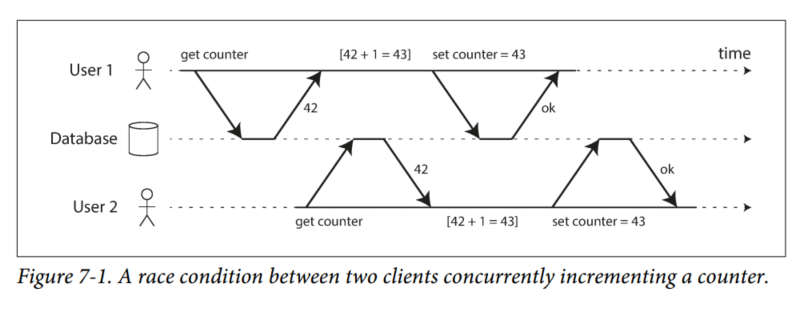

Say you have two clients simultaneously incrementing a counter that is stored in a database. Each client needs to read the current value, add 1, and write the new value back. In Figure 7-1, the counter should have increased from 42 to 44, but it actually only went to 43 because of the race condition.

*Isolation* means that concurrently executing transactions are isolated from each other. Classic database textbooks formalize isolation as *serializability*: each transaction can pretend that it is the only transaction running in the entire database. The database ensures that when the transactions have committed, the result is the same as if they had run serially (one after another), even though in reality they may have run concurrently.

In practice, serializable isolation is rarely used, because it carries a performance penalty.

#### Durability
Durability is the promise that once a transaction has committed successfully, any data it has written will not be forgotten, even if there is a hardware fault or the database crashes.

In a single-node database, durability typically means that the data has been written to nonvolatile storage, such as a hard drive or SSD. It usually also involves a write-ahead log or similar, which allows recovery in the event that the data structures on disk are corrupted. In a replicated database, durability may mean that the data has been successfully copied to some number of nodes.

### Single-Object and Multi-Object Operations
To recap, in ACID, atomicity and isolation describe what the database should do if a client makes several writes within the same transaction:

- *Atomicity*  
If an error occurs halfway through a sequence of writes, the transaction should be aborted, and the writes made up to that point should be discarded. In other words, the database saves you from having to worry about partial failure, by giving an all-or-nothing guarantee.

- *Isolation*  
Concurrently running transactions shouldn’t interfere with each other. For example, if one transaction makes several writes, then another transaction should see either all or none of those writes, but not some subset.

These definitions assume that you want to modify several objects at once. Such *multi-object transactions* are often needed if several pieces of data need to be kept in sync. Figure 7-2 shows an example from an email application. To display the number of unread messages for a user, you could query something like:

```
SELECT COUNT(*) FROM email WHERE recipient_id = 2 AND unread_flag = true
```

However, you might find this query to be too slow if there are many emails, and decide to store the number of unread messages in a separate field (a kind of denormalization). Now, whenever a new message comes in, you have to increment the unread counter as well, and whenever a message is marked as read, you also have to decrement the unread counter.

In Figure 7-2, user 2 experiences an anomaly: the mailbox listing shows an unread message, but the counter shows zero unread messages because the counter increment has not yet happened. Isolation would have prevented this issue by ensuring that user 2 sees either both the inserted email and the updated counter, or neither, but not an inconsistent halfway point.

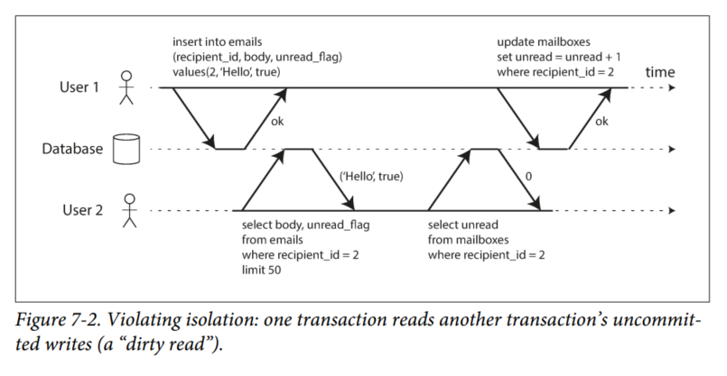

Figure 7-3 illustrates the need for atomicity: if an error occurs somewhere over the course of the transaction, the contents of the mailbox and the unread counter might become out of sync. In an atomic transaction, if the update to the counter fails, the transaction is aborted and the inserted email is rolled back.

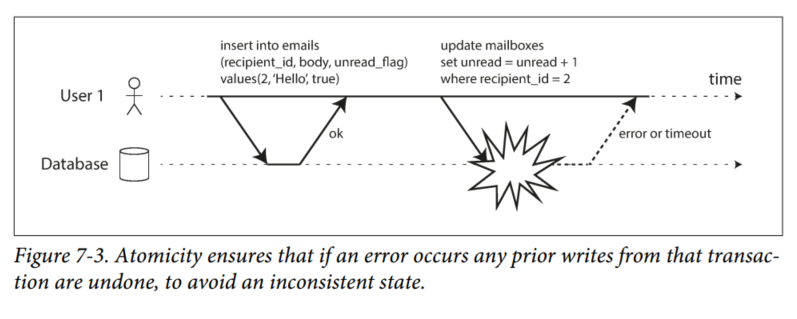

Multi-object transactions require some way of determining which read and write operations belong to the same transaction. In relational databases, that is typically done based on the client's TCP connection to the database server: on any particular connection, everything between a `BEGIN TRANSACTION` and a `COMMIT` is considered one transaction.

On the other hand, many nonrelational databases don't have such a way of grouping operations together. Even if there is a multi-object API (e.g., a multi-put operation that updates several keys in one operation), that doesn't necessarily mean it has transaction semantics: the command may succeed for some keys and fail for others, leaving the database in a partially updated state.

#### Single-object writes
Atomicity and isolation also apply when a single object is being changed. For example, imagine you are writing a 20KB JSON document to a database:
- If the network connection is interrupted after the first 10 KB have been sent, does the database store that unparseable 10 KB JSON fragment?
- If the power fails while the database is in the middle of overwriting the previous value on disk, do you end up with the old and new values spliced together?
- If another client reads that document while the write is in progress, will it see a partially updated value?

Since those issues would be incredibly confusing, storage engines aim to provide atomicity and isolation on  the level of a single object on one node. Atomicity can be implemented using a log for crash recovery (see "Making B-trees reliable") and isolation can be implemented using a lock on each object.

Some databases provide more complex atomic operations, such as an increment operation, which removes the need for a read-modify-write cycle like that in Figure 7-1. Another one is a compare-and-set operation, which allows a write to happen only if the value has not been concurrently changed by someone else.

These single-object operations are useful as they can prevent lost updates when several clients try to write to the same object concurrently. However, they are not transactions per se.

#### The need for multi-object transactions
There are some use cases in which single-object inserts, updates, and deletes are sufficient. However, in many other cases, writes to several different objects need to be coordinated:

1. In a relational data model, a row in one table often has a foreign key reference to a row in another table. Multi-object transactions allow you to ensure that these references remain valid: when inserting several records that refer to one another, the foreign keys have to be correct and up to date.

2. In a document data model, the fields that need to be updated together are often within the same document - which is treated as a single object. However, document databases lacking join functionality also encourage denormalization. When denormalized information needs to be updated (e.g. Figure 7-2), you need to update several documents in one go. Transactions are very useful in this situation to prevent denormalized data going out of sync.

3. In databases with secondary indexes, the indexes also need to be updated every time you change a value. These indexes are different database objects from a transaction point of view.

Such applications can still be implemented without transactions. However, error handling becomes much more complicated without atomicity, and the lack of isolation can cause concurrency problems. This will be further discussed in "Weak Isolation Levels"

#### Handling errors and aborts
ACID databases are based on the philosophy that if the database is in danger of violating its guarantee of A,I, or D, it would rather abandon the transaction entirely.

Datastores with leaderless replication work much more on a "best effort" basis. The database will do as much as it can, and if it runs into an error, it won't undo something it has already done. It is the application's responsibility to recover from errors.

Although retrying an aborted transaction is a simple and effective error handling mechanism, it isn't perfect:

- If the transaction actually succeeded, but the network failed while the server tried to acknowledge the successful commit to the client, then retrying the transaction causes it to be performed twice.

- If the error is due to overload, retrying the transaction will make the problem worse. To avoid such feedback cycles, you can limit the number of retries, use exponential backoff (Exponential backoff is an algorithm that uses feedback to multiplicatively decrease the rate of some process, in order to gradually find an acceptable rate), and handle overload-related errors differently from other errors.

- It is only worth retrying after transient errors (e.g. due to deadlock, isolation violation, temporary network interruptions, and failover); after a permanent error, a retry would be pointless.

- If the transaction also has side effects outside of database, those side effects may happen even if the transaction is aborted. For example, if you're sending an email, you wouldn't want to send the email again every time you retry the transaction. If you want to make sure that several different systems either commit or abort together, two-phase commit can help (discussed later on in "Atomic Commit and Two-Phase Commit (2PC)").

- If the client process fails while retrying, any data it was trying to write to the database is lost.

## Weak Isolation Levels
If two transactions don't touch the same data, they can safely be run in parallel, because neither depends on the other. Concurrency issues only come into play when one transaction reads data that is concurrently modified by another transaction, or when two transactions try to simultaneously modify the same data.

Concurrency bugs are hard to find by testing, and hard to reproduce. Concurrency is also very difficult to reason about, especially large applications where you don't know which codes are accessing the database.

Databases have long tried to hide concurrency issues from application developers by providing *transaction isolation*. In theory, isolation should make your life easier by letting you pretend that no concurrency is happening: *serializable isolation*.

In practice, serializable isolation has a performance cost, and many databases don't want to pay that price. It is therefore common for systems to use weaker levels of isolation, which protect against some concurrency, but not all.

Those levels of isolation are much harder to understand, and can lead to subtle bugs. Concurrency bugs caused by weak transaction isolation are not just a theoretical problem.

In this section we will look at several weak (nonserializable) isolation levels that are used in practice, and discuss in detail what kinds of race conditions can and cannot occur, so that you can decide what level is appropriate to your application. Then, we'll discuss serializability in detail.

### Read Committed
The most basic level of transaction isolation. It gives two guarantees:
1. When reading from the database, you will only see data that has been committed (no *dirty reads*).

2. When writing to the database, you will only overwrite data that has been committed (no *dirty writes*).

#### No dirty reads
If transaction A has written some data to the database, but transaction A has not yet committed or aborted, if transaction B can see the uncommitted data, then it is a *dirty read*.

Transactions running at the read committed isolation level must prevent dirty reads. This is illustrated in Figure 7-4.

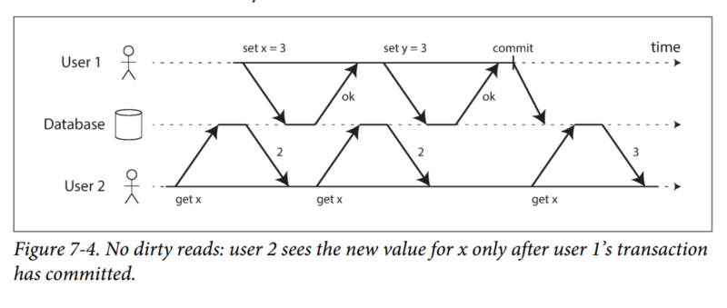

Why is it useful to prevent dirty reads?
1. If a transaction needs to update several objects, a dirty read means that another transaction may see some of the updates, but not others. Seeing the database in a partially updated state is confusing to users and may cause other transactions to take incorrect decisions.

2. If a transaction aborts, any writes it has made need to be rolled back (like in Figure 7-3). If the database allows dirty reads, it means a transaction may see data that is later rolled back (never committed to the database).

#### No dirty writes
Transactions running at the read committed isolation level must prevent dirty writes, usually by delaying the second write until the first write's transaction has committed or aborted.

By preventing dirty writes, this isolation level avoids some kinds of concurrency problems:

1. If transactions update multiple objects, dirty writes can lead to a bad outcome. For example, consider Figure 7-5. Alice and Bob are simultaneously trying to buy the same car. Buying a car needs two database writes: the listing on the website needs to be updated, and the sales invoice needs to be sent to the buyer. In this case, the sale is awarded to Bob (because he performs the winning update to the `listings` table), but the invoice is sent to Alice (because she performs the winning update to the `invoices` table).

2. Read committed does *not* prevent the race condition between two counter increments in Figure 7-1. In this case, the second write happens after the first transaction has committed, so it's not a dirty write. It's incorrect, but for a different reason. We will discuss how to make such counter increments safe in "Preventing Lost Updates".

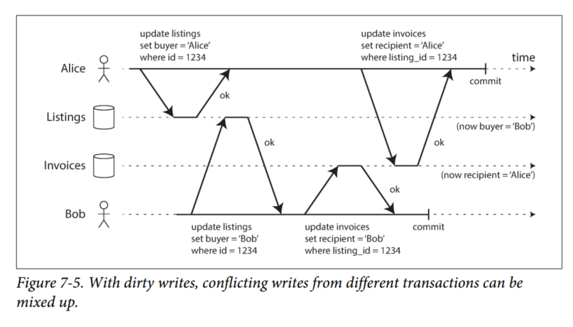

#### Implementing read committed
Read committed is a very popular isolation level. It is the default setting in Oracle 11g, PostgreSQL, SQL Server 2012, MemSQL, and many other databases.

Most commonly, databases prevent dirty writes by using row-level locks: when a transaction wants to modify a particular object (row or document), it must first acquire a lock on that object. It holds the lock until the transaction is committed or aborted. This locking is done automatically by databases in read committed mode (or stronger isolation levels).

How to prevent dirty reads? One option would be to use the same lock, and to require any transaction that wants to read an object to briefly acquire the lock and then release it immediately after reading. This would ensure that a read couldn't happen while an object has a dirty, uncommitted value.

However, this approach does not work well in practice, because one long-running write transaction harms the response time of read-only transactions and is bad for operability.

For that reason, most databases prevent dirty reads using the approach illustrated in Figure 7-4: for every object that is written, the database remembers both the old committed value and the new value set by the transaction that currently holds the write lock.

### Snapshot Isolation and Repeatable Read
Figure 7-6 illustrates a problem that can occur with read committed.

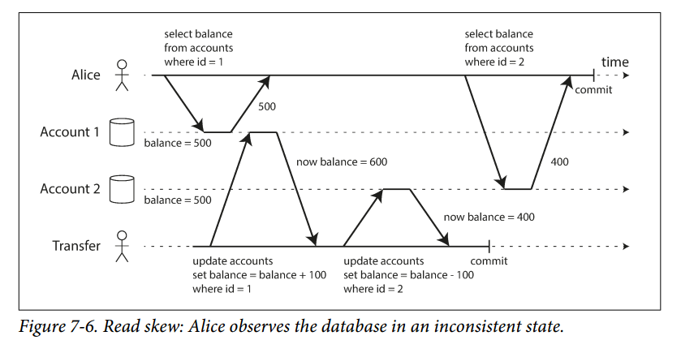

Alice has $1,000 of savings at a bank, split across two account $500 each. A transaction transfers $100 from one of her accounts to the other. If she is unlucky enough to look at her list of account balances in the same moment as that transaction is being processed, she may see one account balance at a time before incoming payment has arrived ($500), and the other account after the outgoing transfer has been made ($400). To Alice it now appears as though she only has $900 total.

This anomaly is called a *nonrepeatable read* or *read skew*: if Alice were to read the balance of account 1 again, she would see $600. (The skew here means timing anomaly).

In Alice's case, this is not a lasting problem, because she will most likely see consistent account balances if she reloads the bank website a few seconds later. However, some situations cannot tolerate such temporary inconsistency:

1. *Backups*  
Taking a backup requires making a copy of the entire database, which may take hours on a large database. During the time that the backup process is running, writes will continue to be made. Thus, you could end up with some parts of the backup containing an older version of the data, and other parts containing a newer version. If you need to restore from such a backup, the inconsistencies become permanent.

2. *Analytic queries and integrity checks*  
These queries are likely to return nonsensical results if they observe parts of the database at different points in time.

*Snapshot isolation* is the most common solution to this problem. The idea is that each transaction reads from a *consistent snapshot* of the database - that is, the transaction sees all the data that was committed in the database at the start of the transaction.

Snapshot isolation is a boon for long-running, read-only queries such as backups and analytics. Snapshot isolation is supported by PostgreSQL, MySQL with the InnoDB storage engine, Oracle, SQL Server, and others.

#### Implementing snapshot isolation
Implementations of snapshot isolation typically use write locks to prevent dirty writes. However, reads do not require any locks. From a performance point of view, a key principle of snapshot isolation is *readers never block writers*, and vice versa.

To implement snapshot isolation, databases use a generalization of the mechanism we saw for preventing dirty reads in Figure 7-4. the database must potentially keep several different committed versions of an object, because various in-progress transactions may need to see the state of the database at different points in time. Because it maintains several versions of an object side by side, this technique is known as *multi-version concurrency control* (MVCC).

If a database only needed to provide read committed isolation, but not snapshot isolation, it would be sufficient to keep two versions of an object: the committed version, and the overwritten-but-not-yet-committed version. Storage engines that support snapshot isolation typically use MVCC for their read committed isolation level. A typical approach is that read committed uses a separate snapshot for each query, while snapshot isolation uses the snapshot for an entire transaction.

Figure 7-7 illustrate how MVCC-based snapshot isolation is implemented in PostgreSQL. When a transaction is started, it is given a unique, always-increasing transaction ID (`txid`). When a transaction writes anything to the database, the data it writes is tagged with the txid of the writer.

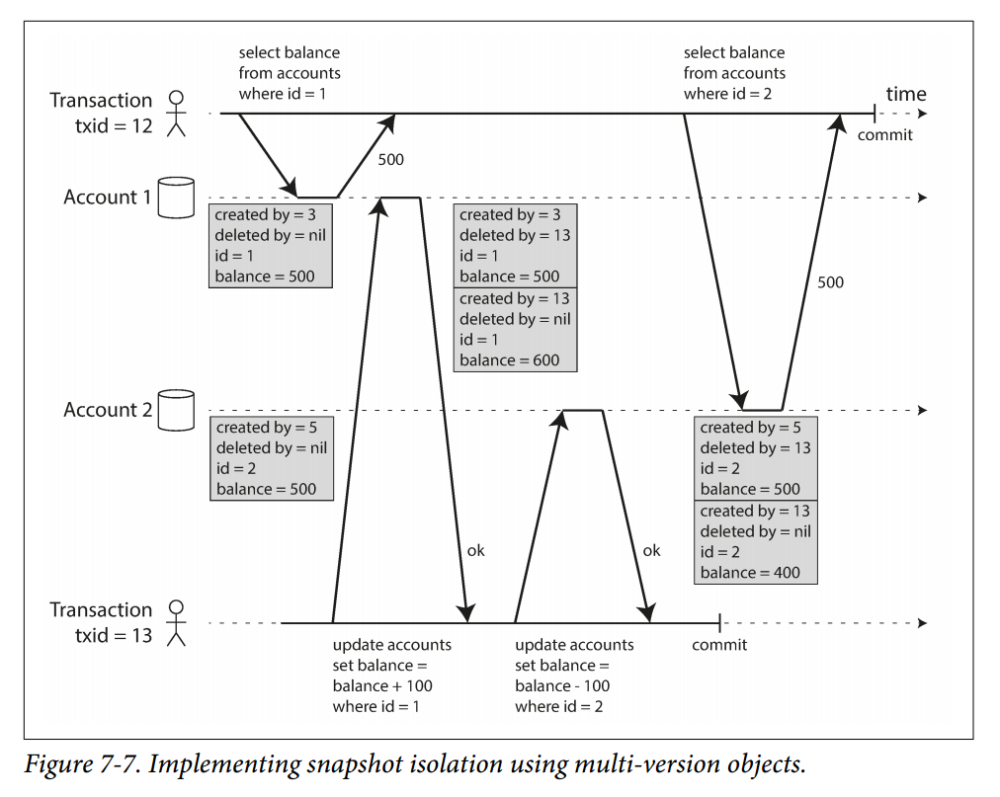

Each row in a table has a `created_by` field, containing the txid of the transaction that inserted this row into the table. Moreover, each row has a `deleted_by` field, which is initially empty. If a transaction deletes a row, the row isn't actually deleted, but is marked for deletion by setting the `deleted_by` field. At some later time, when it is certain that n o transaction can any longer access the deleted data, a garbage collection process in the database removes any rows marked for deletion and frees their space.

An update is internally translated into a delete and a create. For example, in Figure 7-7, transaction 13 deducts $100 from account 2, changing the balance from $500 to $400. The accounts table now actually contains two rows for account 2: a row with a balance of $500 which was marked as deleted by transaction 13, and a row with a balance of $400 which was created by transaction 13.

#### Visibility rules for observing a consistent snapshot
When a transaction reads from the database, transaction IDs are used to decide which objects it can see and which it cannot. By carefully defining visibility rules, the database can present a consistent snapshot of the database to the application. This works as follows:

1. At the start of each transaction, the database makes a list of all the other transactions that are in progress (not yet committed or aborted) at the time. Any writes that those transactions have made are ignored.

2. Any writes made by aborted transactions are ignored.

3. Any writes made by transactions with a later transaction ID are ignored, regardless of whether those transactions have committed.

4. All other writes are visible to the application's queries.

Put another way, an object is visible if both of these are true:

1. At the time when the reader's transaction started, the transaction that created the object had already committed.

2. The object is not marked for deletion, or if it is, the transaction that requested deletion had not yet committed at the time when the reader's transaction started.

A long-running transaction may continue using a snapshot for a long time, continuing to read values that have long been overwritten or deleted. By never updating values in place but instead creating a new version every time a value is changed, the database can provide a consistent snapshot while incurring only a small overhead.

#### Indexes and snapshot isolation
How do indexes work in a multi-version database? One option is to have the index simply point to all versions of an object and require an index query to filter out any object versions that are not visible to the current transaction. When garbage collection removes old object versions that are no longer visible to any transaction, the corresponding index entries can also be removed.

In practice, many implementation details determine the performance of multi-version concurrency control. For example, PostgreSQL has optimizations for avoiding index updates if different versions of the same object can fit on the same page.

Another approach is used in CouchDB, Datomic and LMDB. Although they also use B-trees, they use an *append-only/copy-on-write* variant that does not overwrite pages of the tree when they are updated, but instead creates a new copy of each modified page. Parent pages, up to the root of the tree, are copied and updated to point to the new versions of their child pages. Any pages that are not affected by a write do not need to be copied, and remain immutable.

With append-only B-trees, every write transaction creates a new B-tree root, and a particular root is a *consistent snapshot* of the database at the point in time when it was created. However, this approach also requires a background process for compaction and garbage collection.

#### Repeatable read and naming confusion
Snapshot isolation especially useful for read-only transactions. Many databases that implement it call it by different names: In Oracle it is called *serializable*, in PostgreSQL and MySQL it is called *repeatable read*.

### Preventing Lost Updates
The read committed and snapshot isolation levels we've discussed so far have been primarily about the guarantees of what a read-only transaction can see in the presence of concurrent writes.

We have mostly ignored the issue of two transactions writing concurrently (we have only discussed one issue, dirty writes).

There are several other interesting conflicts that can occur between concurrently writing transactions. The best known of these is the *lost update* problem, illustrated in Figure 7-1 with the example of two concurrent counter increments.

The lost update problem can occur if an application reads some value from the database, modifies it, and writes back the modified value (*read-modify-write* cycle). If two transactions do this concurrently, one modification can be lost, because the second write does not include the first modification. Because this is such a common problem, a variety of solutions have been developed.

#### Atomic write operations
Many databases provide atomic update operations, which remove the need to implement read-modify-write cycles in application code. They are usually the best solution if your code can be expressed in terms of those operations. For example, the following instruction is concurrency-safe in most relational databases:

```
UPDATE counters SET value = value + 1 WHERE key = 'foo';
```

Similarly, document databases like MongoDB provide atomic operations for making local modifications to a part of JSON document, and Redis provides atomic operations for modifying data structures like priority queues. Not all writes can easily be expressed in terms of atomic operations, but in situations where atomic operations can be used, they are usually the best choice.

Atomic operations are usually implemented by taking an exclusive lock on the object when it is read so that no other transaction can read it until the update has been applied. This technique is called *cursor stability*. Another option is to simply to force all atomic operations to be executed on a single thread.

#### Explicit locking
Explicitly lock rows to prevent lost updates, as shown in this Example 7-1:

```
BEGIN TRANSACTION;

SELECT * FROM figures
  WHERE name = 'robot' AND game_id = 222
  FOR UPDATE; (1)

UPDATE figures SET position = 'c4' WHERE id = 1234;

COMMIT;
```

1. The `FOR UPDATE` clause indicates that the database should take a lock on all rows returned by this query.

This works, but be careful since it's easy to forget to add a necessary lock somewhere in the code, and thus introduce a race condition.

#### Automatically detecting lost updates
Another alternative is to allow them to execute in parallel, and if the transaction manager detects a lost update, abort the transaction and force it to retry its read-modify-write cycle.

An advantage of this approach is that databases can perform this check efficiently in conjunction with snapshot isolation.

Lost update detection is a great feature, because it doesn't require application code to use any special database features. You may forget to use a lock or an atomic operation and thus introduce a bug, but lost update detection happens automatically and is thus less error-prone.

**Note**:  
PostgreSQL’s repeatable read, Oracle’s serializable, and SQL Server’s snapshot isolation levels automatically detect when a lost update has occurred and abort the offending transaction. However, MySQL/InnoDB’s repeatable read does not detect lost updates [23]. Some authors argue that a database must prevent lost updates in order to qualify as providing snapshot isolation, so MySQL does not provide snapshot isolation under this definition.

#### Compare-and-set
In databases that don't provide transactions, you sometimes find an atomic compare-and-set operation (previously mentioned in "Single-object writes"). The purpose of this operation is to avoid lost updates by allowing an update to happen only **if the value has not changed since you last read it**. Otherwise, the update has no effect, and the read-modify-write cycle must be retried.

So it's something like this:
```
UPDATE wiki_pages SET content = 'new_content'
  WHERE id = 1234 AND content = 'old_content';
```

If the content has changed and no longer matches 'old content', this update will have no effect, so you need to check whether the update took effect and retry if necessary. However, if the database allows the WHERE clause to read from an old snapshot, this statement may not prevent lost updates, because the condition may be true even though another concurrent write is occurring. Check whether your database’s compare-and-set operation is safe before relying on it.

#### Conflict resolution and replication
In replicated databases, since they have copies of data on multiple nodes, additional care needs to be taken to prevent lost updates.

Locks and compare-and-set operations assume that there is a single up-to-date copy of the data. However, databases with multi-leader or leaderless replication usually allow multiple writes to happen concurrently and replicate them asynchronously. Thus, those techniques cannot be applied here.

Instead, as discussed in "Detecting Concurrent Writes", a common approach in such replicated databases is to allow concurrent writes to create several conflicting versions of a value (*siblings*), and to use application code or special data structures to resolve and merge these versions.

Atomic operations can work well in a replicated context, especially if they are commutative. For example, incrementing a counter or adding an element to a set are commutative operations. That is the idea behind Riak 2.0 datatypes, which prevent lost updates across replicas. When a value is concurrently updated by different clients, Riak automatically merges together the updates in a way that no updates are lost.

*Last write wins* method is prone to lost updates, but it is the default in many replicated databases.

### Write Skew and Phantoms
Imagine you are writing an application for doctors to manage their on-call shifts. The hospital usually tries to have several doctors on call at any one time, but at least one doctor has to be on call. Doctors can give up their shifts, provided that at least one colleague remains on call in that shift. Imagine two on-call doctors both decide to request leave at the same time, as illustrated in Figure 7-8:

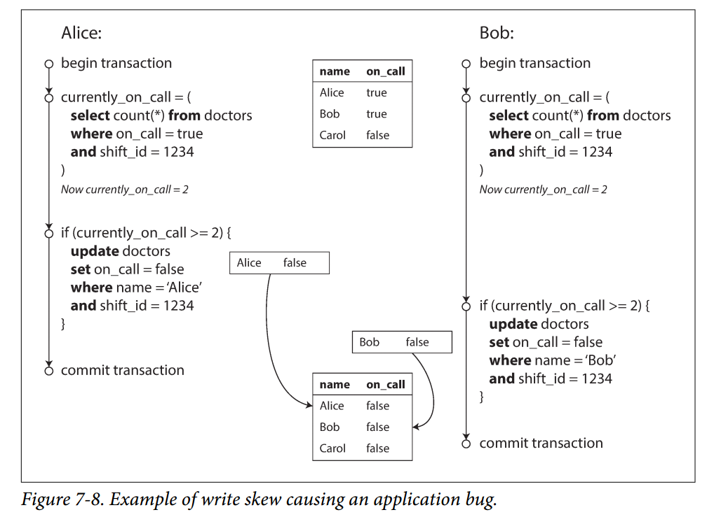

In each transaction, the application first checks that two or more doctors are currently on call. If yes, it assumes it's safe for one doctor to go. Since the database is using snapshot isolation, both checks returns `2`, so both transactions got accepted.

#### Characterizing write skew
This is called *write skew*. It is neither a dirty write nor a lost update, because the two transactions are updating two different objects (the respective call records).

Write skew can be a generalization of the lost update problems. While we have various options to prevent lost updates, with write skew, our options are more restricted:

- Atomic single-object operations don't help, as multiple objects are involved.
- Automatic detection of lost updates in some implementations of snapshot isolation doesn't help either. Write skew is not automatically detected. Automatically preventing write skew requires true serializable isolation.
- Some databases allow you to configure constraints. However, in this case you would need a constraint that involves multiple objects. Most databases do not have built-in support for such constraints, but you can implement them with triggers or materialized views.
- If you can't use serializable isolation level, the second-best option in this case is to explicitly lock the rows that the transaction depends on. For example:
```
BEGIN TRANSACTION;

SELECT * FROM doctors
  WHERE on_call = true
  AND shift_id = 1234 FOR UPDATE; (1)

UPDATE doctors
  SET on_call = false
  WHERE name = 'Alice'
  AND shift_id = 1234;

COMMIT;
```

(1) As before, `FOR UPDATE` tells the database to lock all rows returned by this query.

#### More examples of write skew
1. Meeting room booking system
2. Multiplayer game
3. Claiming a username
4. Preventing double-spending

#### Phantoms causing write skew
1. A `SELECT` query checks whether some requirement is satisfied by searching for rows that match some search condition.
2. Depending on the result of the first query, the application code decides how to continue.
3. If the application decides to proceed, it makes a write (`INSERT`, `UPDATE`, `DELETE`) to the database and commits the transaction.  
The effect of this write changes the precondition of the decision of step 2. In other words, if you were to repeat the `SELECT` query from step 1 after committing the write, you would get a different result, because the write changed the set of rows matching the search condition (there is now 1 less doctor in call).

This effect, where a write in one transaction changes the result of a search query in another transaction is called a *phantom*. Snapshot isolation avoids phantoms in read-only queries, but in read-write transaction examples we have discussed, phantoms can lead to tricky cases of write skew.

#### Materializing conflicts
If the problem of phantoms is that there is no object to which we can attach the locks, what if we artificially introduce a lock object into the database?

For example, in the meeting room booking case you could imagine creating a table of time slots and rooms. Each row in this table corresponds to a particular room for a particular time period (say, 15 minutes). You create rows for all possible combinations of rooms and time periods for the next few months.

Now a transaction that wants to create a booking can lock (`SELECT FOR UPDATE`) the rows in the table that correspond to the desired room and time period. After it has acquired the locks, it can check for overlapping bookings and insert a new booking as before. Note that the additional table is purely a collection of locks which is used to prevent bookings on the same room and time range from being modified concurrently.

This approach is called *materializing conflicts*, because it takes a phantom and turns it into a lock conflict on a concrete set of rows that exist in the database. Unfortunately, it can be error-prone to figure out how to materialize conflicts, and it's ugly to let a concurrency control mechanism leak into the application data model. As such, a serializable isolation level is much preferable.

## Serializability
In this chapter, we have seen several examples of transactions that are prone to race conditions. We encountered some tricky examples with write skew and phantoms:
- Isolation levels are hard to understand, and inconsistently implemented in different databases.
- If you look at your application code, it's difficult to tell whether it is safe to run at a particular isolation level, especially in a large application.
- There are no good tools to help us detect race conditions. In principle, static analysis may help, but research techniques have not yet found their way into practical use.

All along, the answer from researchers have been to use *serializable* isolation.

Serializable isolation is usually regarded as the strongest isolation level. It guarantees that even though transactions may execute in parallel, the end result is the same as if they had executed one at a time, *serially*, without any concurrency. The database prevents *all* possible race conditions.

If it's that good, why isn't everyone using it? To answer this question, we need to look at the options for implementing serializability, and how they perform. Most databases that provide serializability today use one of three techniques:
1. Literally executing transactions in a serial order ("Actual Serial Execution")
2. Two-phase locking
3. Optimistic concurrency control techniques such as serializable snapshot isolation

We will discuss these techniques in the context of single-node databases for now.

### Actual Serial Execution
Execute only one transaction at a time, in serial order, on a single thread. By doing so, we completely sidestep the problem of detecting and preventing conflicts between transactions: the resulting isolation is by definition serializable.

If multi-threaded concurrency was considered essential for getting good performance, what changed to make single-threaded execution possible?

Two developments caused this:

1. RAM became cheap enough that for many use cases is now feasible to keep the entire dataset in memory. When all data that a transaction needs to access is in memory, transactions can execute much faster than if they have to wait for data to be loaded from disk.

2. Database designers realized that OLTP transactions are usually short and only make a small number of reads and writes. By contrast, long-running analytics queries are typically read-only, so they can be run on a consistent snapshot outside of the serial execution loop.

This approach is implemented by VoltDB/H-Store, Redis, and Datomic. However, its throughput is limited to that a of a single CPU core. In order to make the most of that single thread, transactions need to be structured differently.

#### Encapsulating transactions in stored procedures
In the early days of databases, the intention was that a database transaction could encompass an entire flow of user activity. For example, booking an airline ticket is a multi-stage process. Database designers thought that it would be neat if that entire process was one transaction so that it can be committed atomically.

Unfortunately, humans are very slow to make up their minds. If a database transaction needs to wait for input from a user, it needs to support a potentially huge number of concurrent transactions, most of them idle. Most databases cannot do that efficiently, and so almost all OLTP applications keep transactions short by avoiding interactively waiting for a user within a transaction. On the web, this means a new HTTP request starts a new transaction.

Transactions have continued to be executed in an interactive client/server style, one statement at a time. The queries and results are sent back and forth between the application code and the database server. A lot of time is spent in network communication between the app and the database. If you were to disallow concurrency, the throughput would be bad because the database would spend most of its time waiting.

For this reason, systems with single-threaded serial transaction processing don't allow interactive multi-statement transactions. Instead, the application must submit the entire transaction code to the database ahead of time, as a *stored procedure*.

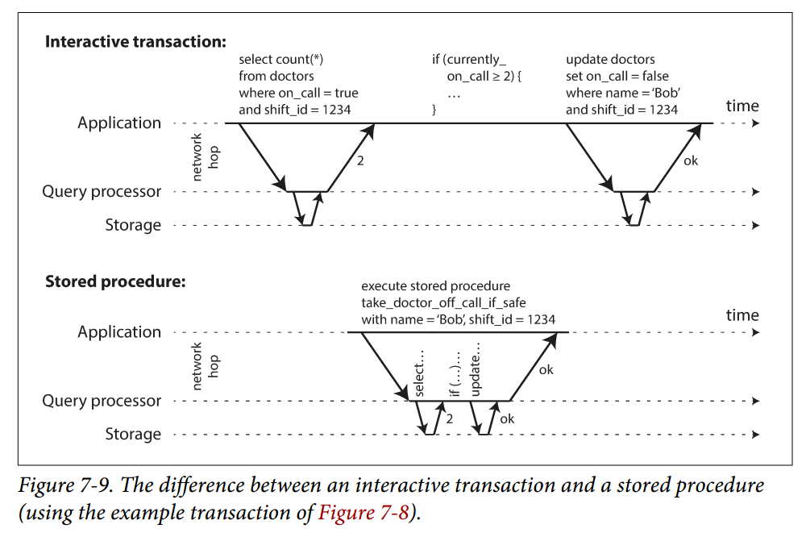

#### Pros and cons of stored procedures
Stored procedures have gained a somewhat bad reputation:
- Each database vendor has its own language for stored procedures (Oracle has PL/SQL, SQL Server has T-SQL, PostgreSQL has PL/pgSQL, etc.). These languages haven't kept up with developments in general-purpose programming languages, so they look ugly and they lack the ecosystem of libraries that you find with most programming languages.

- Code running in a database is difficult to manage. It's harder to debug, harder to keep in version control and deploy, trickier to test, difficult to integrate with a metrics collection system for monitoring.

- A database is often much more performance-sensitive than an application server. A badly written stored procedure in a database can hamper the performance of a database a lot.

However, those issues can be overcome. Nowadays, VoltDB uses Java or Groovy, Datomic uses Java or Clojure, and Redis uses Lua.

With stored procedures and in-memory data, executing all transactions on a single thread becomes feasible. As they don't need to wait for I/O and they avoid the overhead of other concurrency control mechanisms, they can achieve quite good throughput on a single thread.

VoltDB also uses stored procedures for replication: instead of copying a transaction's writes from one node to another, it executes the same stored procedure on each replica.

#### Partitioning
Executing transactions serially limits the throughput of the database. Read-only transactions may execute elsewhere, using snapshot isolation, but for applications with high throughput, single-threaded transaction process can become serious bottleneck.

In order to scale to multiple CPU cores, and multiple nodes, you can potentially partition your data (which is supported in VoltDB). If you can find a way of partitioning your dataset so that each transaction only needs to read and write data within a single partition, then each partition can have its own transaction processing thread running independently from the others. In this case, you can give each CPU core its own partition, which allows transaction throughput to scale linearly with the number of CPU cores.

For any transaction that needs to access multiple partitions, the database must coordinate the transaction across all the partitions that it touches. Cross-partitions transactions have additional coordination overhead, so they are slower than single-partition transactions.

Whether transactions can be single-partition depends very much on the structure of the data used by the application. Simple key-value data can often be partitioned very easily, but data with multiple secondary indexes is likely to require a lot of cross-partition coordination.

#### Summary of serial execution
Serial execution of transactions has become a viable way of achieving serializable isolation within certain constraints:

- Every transaction must be small and fast, because it takes only one slow transaction to stall all transaction processing.

- It is limited to use cases where the active dataset can fit in memory. Rarely accessed data could potentially be moved to disk, but if it needed to be accessed in a single-threaded transaction, the system would get very slow

- Write throughput must be low enough to be handled on a single CPU core, or else transactions need to be partitioned without requiring cross-partition coordination.

- Cross-partition transactions are possible, but there is a hard limit to the extent to which they can be used.

### Two-Phase Locking (2PL)
For around 30 years, there was only one widely used algorithm for serializability in databases: *two-phase locking* (2PL). **Note**: 2PL is not two-phase commit (2PC)

Two-phase locking is similar to the locks that are used to prevent dirty writes, but makes the lock requirements much stronger. Several transactions are allowed to concurrently read the same object as long as nobody is writing to it. But as soon as anyone wants to write an object, exclusive access is required:

- If transaction A has read an object and transaction B wants to write to that object, B must wait until A commits or aborts before it can continue. (This ensures that B can’t change the object unexpectedly behind A’s back.)

- If transaction A has written an object and transaction B wants to read that object, B must wait until A commits or aborts before it can continue. (Reading an old version of the object, like in Figure 7-1, is not acceptable under 2PL.)

In snapshot isolation, *readers never block writers, and writers never block readers*.
In 2PL, *writers block both readers and writers, readers also block both readers and writers*.

2PL provides serializability, it protects against all the race conditions discussed earlier, including lost updates and write skew.

#### Implementation of two-phase locking
2PL is used by the serializable isolation level in MySQL (InnoDB) and SQL Server, and the repeatable read isolation in DB2.

The blocking of readers and writers is implemented by having a lock on each object in the database. The lock can either be in *shared mode* or *exclusive mode*. The lock is used as follows:

- If a transaction wants to **read** an object, it must first acquire the lock in **shared mode**. Several transactions are allowed to hold the lock in shared mode simultaneously, but if another transaction already has an exclusive lock on the object, these transactions must wait.

- If a transaction wants to **write** to an object, it must first acquire the lock in **exclusive mode**. No other transaction may hold the lock at the same time (in either modes).

- If a transaction first reads and then writes an object, it may **upgrade** its shared lock to an exclusive lock. The upgrade works the same as getting an exclusive lock directly.

- After a transaction has acquired the lock, it will continue to hold it until the end of transaction (commit/abort).

In the case of a deadlock, the database automatically detects it and aborts one of them so the others can make progress.

#### Performance of 2PL
The big downside is performance.

This is partly due to the overhead of acquiring and releasing locks, but more importantly due to reduced concurrency. For this reason, databases running 2PL can have unstable latencies, and they can be very slow at high percentiles. It may just take one slow transaction to cause the rest of the system to grind to a halt.

Deadlock is also more frequent under 2PL serializable isolation. When a transaction is aborted due to a deadlock and is retried, it needs to do its work all over again.

#### Predicate locks
In the meeting room booking example, if one transaction has searched for existing bookings for a room within a certain time window, another transaction is not allowed to concurrently insert or update another booking for the same room and time range.

How to implement this? We need a *predicate lock*. It works similarly to the shared/exclusive lock described earlier, but rather than belonging to a particular object (e.g., one row in a table), it belongs to *all* objects that match some search condition, such as:

```
SELECT * FROM bookings
  WHERE room_id = 123 AND
    end_time > ... AND
    start_time < ...;
```

A predicate lock restricts access as follows:
- If transaction A wants to read objects matching some condition, it must acquire a shared-mode predicate lock on the conditions of the query. If another transaction B has an exclusive lock on any object matching those conditions, A must wait until B releases its lock before it is allowed to make its query.

- If transaction A wants to insert, update, or delete any object, it must first check whether either the old or the new value matches any existing predicate lock. If there is a matching predicate lock held by transaction B, then A must wait until B has committed or aborted before it can continue.

The key idea here is that a predicate lock applies even to objects that do not yet exist in the database, but might be added in the future (phantoms). If two-phase locking includes predicate locks, the database prevents all forms of write skew and other race conditions, and so its isolation becomes serializable.

#### Index-range locks
Unfortunately, predicate locks do not perform well. If there are many locks by active transactions, checking for matching locks becomes time consuming. For that reason, most databases with 2PL actually implement *index-range locking* (a.k.a. *next key locking*).

It's safe to simplify a predicate by making it match a greater set of objects. For example, if you have a predicate lock for bookings of room 123 between noon and 1 p.m., you can approximate it by locking bookings for room 123 at any time, or you can approximate it by locking all rooms (not just room 123) between noon and 1 p.m. This is safe, because any write that matches the original predicate will definitely also match the approximations.

In the room bookings database you would probably have an index on the `room_id` column and/or indexes on `start_time` and `end_time`.

If your index is on `room_id`, and the database uses this index to find existing bookings for room 123, then it can simply attach a shared lock to this index entry.

Alternatively, it can attach a shared lock to a range of values in the time-based index.

If a transaction wants to insert, update, or delete a booking for the same room and/or overlapping time period, it will have to update the same part of the index. It will encounter the shared lock and will be forced to wait until the lock is released.

Index-range locks are not as precise as predicate locks, but since they have much lower overheads, they are a good compromise. If there is no suitable index where a range lock can be attached, the database can fall back to a shared lock on the entire table. This will not be good for performance, but it's a safe fallback position.

### Serializable Snapshot Isolation (SSI)
We have implementations of serializability that don't perform well (2PL) or don't scale well (serial execution). On the other hand, we have weak isolation levels that have good performance, but are prone to various race conditions (lost updates, write skew, phantoms, etc).

An algorithm called *serializable snapshot isolation* provides full serializability, but only has a small performance penalty compared to snapshot isolation. Today SSI is used both in single-node databases and distributed databases.

#### Pessimistic vs. optimistic concurrency control
2PL is a so-called *pessimistic* concurrency control mechanism: it is based on the principle that if anything might possibly go wrong, it's better to wait until the situation is safe again before doing anything. It's like *mutual exclusion*, which is used to protect data structures in multi-threaded programming.

Serial execution is, in a sense, pessimistic to the extreme. We compensate for the pessimism by making each transaction very fast to execute.

In contrast, serializable snapshot isolation is an *optimistic* concurrency control technique. Optimistic means that instead of blocking if something potentially dangerous happens, transaction continues anyway. When a transaction wants to commit, the database checks whether anything bad happened (i.e., whether isolation was violated); if so, the transaction is aborted. Only transactions that executed serializably are allowed to commit.

Optimistic concurrency performs badly if there are many transactions trying to access the same objects, as this leads to a high proportion of transactions needing to abort. Retried transactions can hamper performance too.

However, if there is enough spare capacity, and if contention between transactions is not too high, optimistic concurrency control techniques tend to perform better than pessimistic ones. Contention can be reduced with commutative atomic operations.

SSI is based on snapshot isolation. On top of snapshot isolation, SSI adds an algorithm for detecting serialization conflicts among writes and determining which transactions to abort.

#### Decisions based on an outdated premise
When we previously discussed write skew in snapshot isolation, we observed a recurring pattern: a transaction reads some data, examines the result, and decides to take some action based on the result it saw. However, under snapshot isolation, the result from the original query may no longer be up-to-date by the time the transaction commits, as the data may have been modified in the meantime.

In another word, the transaction is taking an action based on a *premise* (a fact that was true at the beginning of the transaction), but later when the transaction wants to commit, the premise may no longer be true. To be safe, the database needs to assume that any change in the query result (the premise) means that writes in that transaction may be invalid.

In other words, there may be a causal dependency between the queries and the writes in the transaction. In order to provide serializable isolation, the database must detect situations in which a transaction may have acted on an outdated premise and abort the transaction.

How does the database know if a query result might have changed? Two cases:
- Detecting reads of a stale MVCC object version (uncommitted write occurred before read)
- Detecting writes that affect prior reads (the write occurs after the read)

##### Detecting stale MVCC reads
Remember that snapshot isolation is usually implemented by MVCC. When a transaction reads from a consistent snapshot in an MVCC database, it ignores writes that were made by any other transactions that hadn't yet committed at the time when the snapshot was taken.

In Figure 7-10, transaction 43 sees Alice as having `on_call` = true, because transaction 42 (which modified Alice’s on-call status) is uncommitted. However, by the time transaction 43 wants to commit, transaction 42 has already committed. This means that the write that was ignored when reading from the consistent snapshot has now taken effect, and transaction 43’s premise is no longer true.

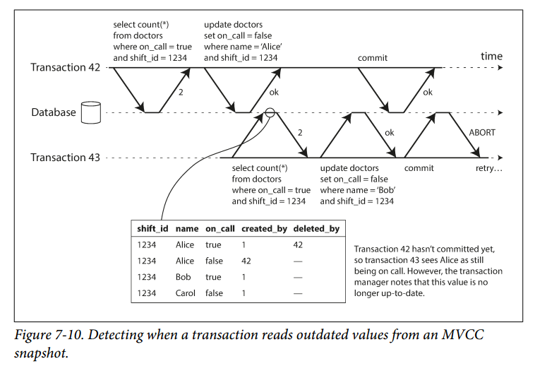

In order to prevent this anomaly, the database needs to track when a transaction ignores another transaction’s writes due to MVCC visibility rules. When the transaction wants to commit, the database checks whether any of the ignored writes have now been committed. If so, the transaction must be aborted.

Why wait until committing? Why not abort transaction 43 immediately when the stale read is detected? Well, if transaction 43 was a read-only transaction, it wouldn’t need to be aborted, because there is no risk of write skew. At the time when transaction 43 makes its read, the database doesn’t yet know whether that transaction is going to later perform a write. Moreover, transaction 42 may yet abort or may still be uncommitted at the time when transaction 43 is committed, and so the read may turn out not to have been stale after all. By avoiding unnecessary aborts, SSI preserves snapshot isolation’s support for long-running reads from a consistent snapshot.

##### Detecting writes that affect prior reads

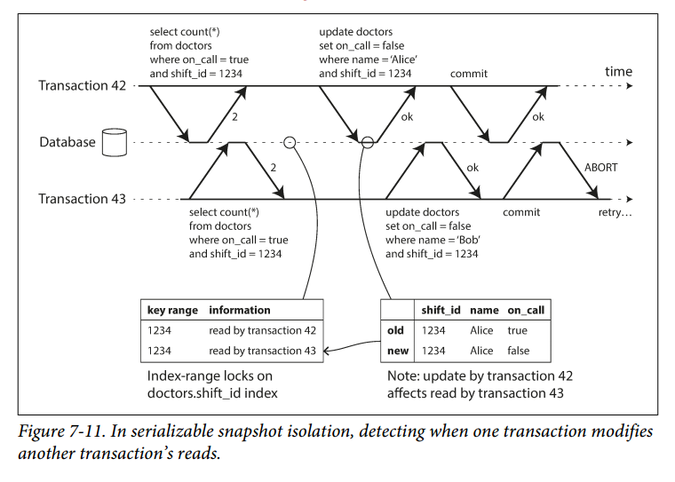
We use a similar technique as index-range locks, except that SSI locks don't block other transactions.

In Figure 7-11, transactions 42 and 43 both search for on-`call` doctors during shift 1234. If there is an index on shift_id, the database can use the index entry 1234 to record the fact that transactions 42 and 43 read this data. (If there is no index, this information can be tracked at the table level.) This information only needs to be kept for a while: after a transaction has finished (committed or aborted), and all concurrent transactions have finished, the database can forget what data it read.

When a transaction writes to the database, it must look in the indexes for any other transactions that have recently read the affected data. This process is similar to acquiring a write lock on the affected key range, but rather than blocking until the readers have committed, the lock acts as a tripwire: it simply notifies the transactions that the data they read may no longer be up to date.

In Figure 7-11, transaction 43 notifies transaction 42 that its prior read is outdated, and vice versa. Transaction 42 is first to commit, and it is successful: although transaction 43’s write affected 42, 43 hasn’t yet committed, so the write has not yet taken effect. However, when transaction 43 wants to commit, the conflicting write from 42 has already been committed, so 43 must abort.

##### SSI performance
Compared to 2PL, the big advantage of SSI is that one transaction doesn't need to block waiting for locks held by another transaction. This makes query latency much more predictable and less variable. Read-only queries can run on a consistent snapshot without requiring any locks, which is good for read-heavy workloads.

SSI is not limited to the throughput of a single CPU core. Even though data may be partitioned across multiple machines, transactions can read and write data in multiple partitions while ensuring serializable isolation.

The rate of aborts significantly affects the overall performance of SSI. For example, a transaction that reads and writes data over a long period of time is likely to run into conflicts and abort, so SSI requires that read-write transactions be fairly short (long running read-only transactions may be okay). However, SSI is probably less sensitive to slow transactions than two-phase locking or serial execution.

## Summary
Transactions are an abstraction layer that allows an application to pretend that certain concurrency problems and certain kinds of hardware and software faults don’t exist. A large class of errors is reduced down to a simple transaction abort, and the application just needs to try again.

In this chapter we saw many examples of problems that transactions help prevent.
Not all applications are susceptible to all those problems: an application with very simple access patterns, such as reading and writing only a single record, can probably manage without transactions. However, for more complex access patterns, transactions can hugely reduce the number of potential error cases you need to think about.

Without transactions, various error scenarios (processes crashing, network interruptions, power outages, disk full, unexpected concurrency, etc.) mean that data can become inconsistent in various ways. For example, denormalized data can easily go out of sync with the source data. Without transactions, it becomes very difficult to reason about the effects that complex interacting accesses can have on the database.

In this chapter, we went particularly deep into the topic of concurrency control. We discussed several widely used isolation levels, in particular *read committed*, *snapshot isolation* (sometimes called repeatable read), and *serializable*. We characterized those isolation levels by discussing various examples of race conditions:

1. *Dirty reads*  
One client reads another client’s writes before they have been committed. The read committed isolation level and stronger levels prevent dirty reads.

2. *Dirty writes*  
One client overwrites data that another client has written, but not yet committed.
Almost all transaction implementations prevent dirty writes.

3. *Read skew* (nonrepeatable reads)  
A client sees different parts of the database at different points in time. This issue is most commonly prevented with snapshot isolation, which allows a transaction to read from a consistent snapshot at one point in time. It is usually implemented with multi-version concurrency control (MVCC).

4. *Lost updates*  
Two clients concurrently perform a read-modify-write cycle. One overwrites the other’s write without incorporating its changes, so data is lost. Some implementations of snapshot isolation prevent this anomaly automatically, while others require a manual lock (`SELECT FOR UPDATE`).

5. *Write skew*  
A transaction reads something, makes a decision based on the value it saw, and writes the decision to the database. However, by the time the write is made, the premise of the decision is no longer true. Only serializable isolation prevents this anomaly.

6. *Phantom reads*  
A transaction reads objects that match some search condition. Another client makes a write that affects the results of that search. Snapshot isolation prevents straightforward phantom reads, but phantoms in the context of write skew require special treatment, such as index-range locks.

Weak isolation levels protect against some of those anomalies but leave you, the application developer, to handle others manually (e.g., using explicit locking). Only serializable isolation protects against all of these issues. We discussed three different approaches to implementing serializable transactions:

1. *Literally executing transactions in a serial order*  
If you can make each transaction very fast to execute, and the transaction throughput is low enough to process on a single CPU core, this is a simple and effective option.

2. *Two-phase locking*  
For decades this has been the standard way of implementing serializability, but many applications avoid using it because of its performance characteristics.

3. *Serializable snapshot isolation (SSI)*
A fairly new algorithm that avoids most of the downsides of the previous approaches. It uses an optimistic approach, allowing transactions to proceed without blocking. When a transaction wants to commit, it is checked, and it is aborted if the execution was not serializable.

In this chapter, we explored ideas and algorithms mostly in the context of a database running on a single machine. Transactions in distributed databases open a new set of difficult challenges, which we’ll discuss in the next two chapters.

---
