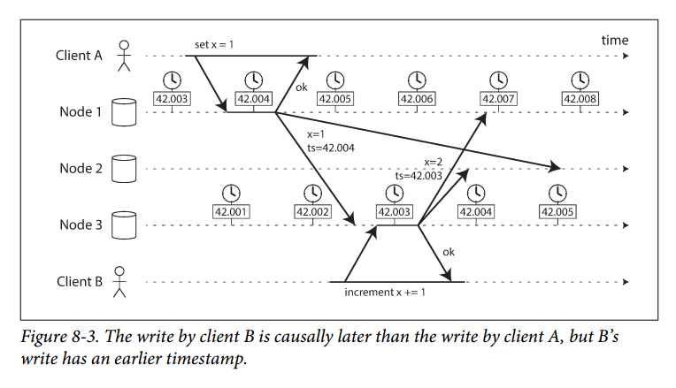
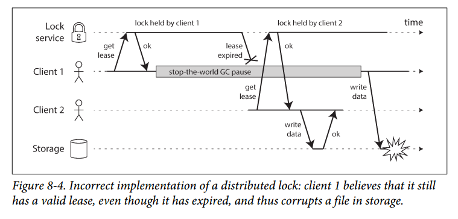
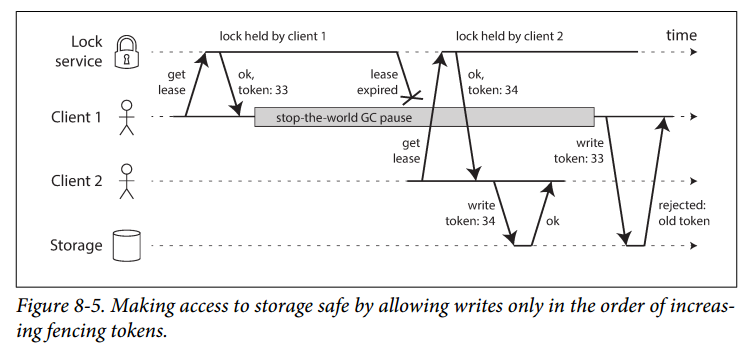

# Chapter 8 - The Trouble with Distributed Systems
Working with distributed systems is fundamentally different from writing software on a single computer. In this chapter, we will understand what challenges we are up against.

We will look into problems with:
1. Networks
2. Clock and timing issues
3. To what degree they are avoidable

## Faults and Partial Failures
Software on a single computer is *deterministic*. It is either fully functional or entirely broken.

In a distributed system, there may well be some parts of the system that are broken in some unpredictable way, even though other parts are working fine. This is known as a *partial failure* and partial failures are *nondeterministic* - it may sometimes work and sometimes fail. You may not even *know* whether something succeeded, as the time it takes for a message to travel is also nondeterministic.

### Cloud Computing and Supercomputing
There is a spectrum of philosophies on how to build large-scale computing systems:

- At one end of the scale is the field of *high-performance computing* (HPC). Supercomputers with thousands of CPUs are used for computationally intensive scientific computing tasks .

- At the other end is *cloud computing*, often associated with multi-tenant datacenters, commodity computers connected with an IP network, elastic/on-demand resource allocation, and metered billing.

- Traditional enterprise datacenters lie somewhere in between these two.

There are different approaches to handling faults. In a supercomputer, a job typically checkpoints the state of its computation to durable storage from time to time. If a node fails, simply stop the entire cluster, fix the node, and restart from the last checkpoint. Thus, a supercomputer is more like a single-node computer than a distributed system: it deals with partial failure by letting it escalate into total failure.

In this book we focus on systems for implementing internet services, which usually look very different from supercomputers:

- Many internet-related applications are *online*, in the sense that they need to be able to serve users with low latency at any time. Making the service unavailable is not acceptable. IN contrast, offline (batch) jobs can be stopped and restarted with fairly low impact.

- Supercomputers are typically built from specialized hardware. On the other hand, nodes in cloud services are built from commodity machines.

- Large datacenter networks are often based on IP and Ethernet, arranged in Clos topologies to provide high bisection bandwidth. Supercomputers often use specialized network topologies, which yield better performance for HPC workloads with known communication patterns.

- The bigger a system gets, the more likely it is that one of its components is broken. If the strategy for error handling consists of simply giving up, a large system will spend a lot of time recovering from faults instead of doing work.

- If the system can tolerate failed nodes and still keep working as a whole, that is a very useful feature for operations and maintenance: You can perform rolling upgrade. In cloud environments, if one virtual machine is not performing well, you can just kill it at request a new one.

- In a geographically distributed deployment, communication will go over the internet, which is slow and unreliable. Supercomputers generally assume that all of their nodes are close together.

If we want to make distributed systems work, we must accept the possibility of partial failure and build fault-tolerance mechanisms into the software.

## Unreliable Networks
The distributed systems we focus on in this book are *shared-nothing systems*. The network is the only way those machines can communicate.

Shared-nothing has become the dominant approach for building internet services, for several reasons: it's comparatively cheap because it requires no special hardware, it can make use of commoditized cloud computing services, and it can achieve high reliability through redundancy across multiple geographically distributed datacenters.

The internet and most internal networks in datacenters are *asynchronous packet networks*. In this kind of network, one can send a massage (a packet) to another node, but the network gives no guarantees as to when it will arrive, or whether it will arrive at all. If you send a request and expect a response, many things could go wrong:

1. Your request may have been lost (may be due to network interruption)
2. Your request may be waiting in a queue and will be delivered later (may be the network or recipient is overloaded)
3. The remote node may have failed (perhaps it crashed or shut down)
4. The remote node may have temporarily stopped responding (perhaps it's experiencing a long garbage collection pause)
5. The remote node may have processed your request, but the response has been lost on the network
6. The remote node may have processed your request, but the response has been delayed and will be delivered later (perhaps the network or your own machine is overloaded)

The sender can't even tell whether the packet was delivered: the only option is for the recipient to send a response message, which may in turn be lost or delayed. These issues are indistinguishable in an asynchronous network: the only information you have is that you haven't received a response yet.

The usual way of handling this issue is a *timeout*. However, even when a timeout occurs, you still don't know whether the remote node got your request or not.

### Network Faults in Practice
Public cloud services such as EC2 are notorious for having frequent transient network glitches, and well-managed private datacenter networks can be more stable environments. Even if network faults are rare in your environment, error handling of network faults still have to be well defined and tested. Otherwise, bad things could happen: for example, the cluster could become deadlocked and permanently unable to serve requests, or it could permanently delete your data.

You need to know how your software reacts to network problems and ensure that the system can recover from them.

### Detecting Faults
Many systems need to automatically detect faulty nodes. For example:
- A load balancer needs to stop sending requests to a dead node.
- In a distributed database with single-leader replication, if the leader fails, one of the followers need to be automatically promoted.

Unfortunately, a node may take some time to respond just because of network delays, and not because it's dead. In some specific circumstances you might get some feedback to explicitly tell you that something is not working:
- If you can reach the machine on which the node should be running, but no process is listening on the destination port (e.g., because the process crashed), the operating system will helpfully close or refuse TCP connections by sending a `RST` or `FIN` packet in reply.

- If a node process crashed but the node's OS is still running, a script can notify other nodes about the crash so that another node can take over quickly. HBase does this.

- If you have access to the management interface of the network switches in your datacenter, you can query them to detect link failures at a hardware level.

- If a router is sure that the IP address you're trying to connect is unreachable, it may reply you with an ICMP Destination Unreachable packet.

If you want to be sure that a request was successful, you need a positive response from the application itself. Conversely, if something has gone wrong, you may get an error response at some level of the stack, but in general you have to assume that you will get no response at all.

### Timeouts and Unbounded Delays
If a timeout is the only sure way to detect a fault, then how long should the timeout be? Unfortunately, there is no simple answer.

A long timeout means a long wait until a node is declared dead. A short timeout carries a higher risk of incorrectly declaring a node dead when in fact it has only suffered a temporary slowdown.

Prematurely declaring a node dead is problematic: if the node is actually alive and in the middle of performing some action, and another node takes over, the action may end up being performed twice.

When a node is declared dead, its responsibilities need to be transferred to other nodes, which places additional load on other nodes and the network. If the system is already struggling with high load, declaring nodes dead prematurely can make the problem worse; transferring load to other nodes can cause a cascading failure.

Asynchronous networks have *unbounded delays* (that is, they try to deliver packets as quickly as possible, but there is no upper limit on the time it may take for a packet to arrive), and most server implementations cannot guarantee that they can handle requests within some maximum time.

For failure detection, it's not sufficient for the system to be fast most of the time: if your timeout is low, it only takes a transient spike in round-trip times to throw the system off balance.

#### Network congestion and queuing
The variability of packet delays on computer networks is most often due to queuing:
- If several nodes simultaneously try to send packets to the same destination, the network switch must queue them up and feed them into the destination network link one by one. If there is so much data that the switch queue fills up, the packet is dropped, so it needs to be re-sent.

- When a packet reaches the destination machine, if all CPU cores are currently busy, the incoming request is queued by the OS until the application is ready.

- In virtualized environments, a running OS is often paused for tens of milliseconds while another virtual machine uses a CPU core. During this time, the VM cannot consume any data from the network, so the incoming data is queued by the VM monitor, further increasing the variability of network delays.

- TCP performs *flow control* (also known as *congestion avoidance* or *backpressure*), in which a node limits its own rate of sending in order to avoid overloading a network link or the receiving node. This means additional queuing.

Moreover, TCP considers a packet to be lost if it is not acknowledged within some timeout, and lost packets are automatically re-transmitted. Although the application does not see the packet lost and retransmission, it does see the resulting delay.

In public clouds and multi-tenant datacenters, resources are shared among many customers: the network links and switches, and even each machine's network interfaces and CPUs are shared. Batch workloads such as MapReduce can easily saturate network links. Network delays can be highly variable is someone near you is using a lot of resources.

In such environments, you can only choose timeouts experimentally. Even better, rather than using configured constant timeouts, systems can continually measure response times and their variability (*jitter*), and automatically adjust timeouts according to the observed response time distribution.

### Synchronous Vs. Asynchronous Networks
Distributed systems would be a lot simpler if we could rely on the network to deliver packets with some fixed maximum delay, and not to drop packets. What if we can solve this at the hardware level and make the network reliable?

To answer this question, it's interesting to compare datacenter networks to the traditional fixed-line telephone network (non-cellular, non-VoIP), which is extremely reliable.

When you make a call over the telephone network, it establishes a *circuit*, a fixed, guaranteed amount of bandwidth is allocated for the call, along the entire route between the two callers. This circuit remains in place until the call ends.

This kind of network is *synchronous*: even as data passes through several routers, it does not suffer from queuing. And because there is no queuing, the maximum end-to-end latency of the network is fixed. We call this a *bounded delay*.

#### Can we not simply make network delays predictable?
Note that a circuit in a telephone network is very different from a TCP connection: a circuit is a fixed amount of reserved bandwidth which nobody else can use while the circuit is established, whereas the packets of a TCP connection opportunistically use whatever network bandwidth is available. You can give TCP a variable-sized block of data, and it will try to transfer it in the shortest time possible. While a TCP connection is idle, it doesn't use any bandwidth.

Ethernet and IP are not circuit-switched networks, they are packet-switched protocols, which suffer from queuing and thus unbounded delays in the network. Why do they use packet switching? It's because they are optimized for *bursty traffic*. A circuit is good for an audio/video call, which needs to be consistent.

If you wanted to transfer a file over a circuit, you would have to guess a bandwidth allocation. If you guess too low, the transfer is slow, leaving network capacity unused. If you guess too high, the circuit cannot be set up (because the network cannot allow a circuit to be created if its bandwidth allocation cannot be guaranteed). Thus, using circuits for bursty data transfers wastes network capacity and makes transfers unnecessarily slow. By contrast, TCP adapts the rate of data transfer.

## Unreliable Clocks
Clocks and time are important. Applications depend on clocks in various ways to measure *durations*  or to describe different *points in time* (events).

In a distributed system, time is a tricky business, because communication is not instantaneous. This makes it difficult to determine the order in which things happened when multiple machines are involved.

Moreover, each machine on the network has its own clock, which is usually a quartz crystal oscillator. It is possible to synchronize clocks to some degree: the most commonly used mechanism is the Network Time Protocol (NTP), which allows the computer clock to be adjusted according to the time reported by a group of servers. The servers get their time from a more accurate time source, like a GPS receiver.

### Monotonic Vs Time-of-Day Clocks
Modern computer have at least two different kinds of clocks: a *time-of-day* clock and a *monotonic* clock.

#### Time-of-day clocks
A time-of-day clock returns the current date and time according to some calendar (a.k.a. a *wall-clock time*). Time-of-day clocks are usually synchronized with NTP, which means that timestamps from different machines should ideally be the same. However, time-of-day clocks also have some oddities. In particular, if the local clock is too far ahead of the NTP server, it may be forcibly reset and appear to jump to a previous point in time. These jumps, as well as the fact that they often ignore leap seconds, make time-of-day clocks unsuitable for measuring elapsed time.

For example, System.currentTimeMillis() return the number of milliseconds since the *epoch*.

#### Monotonic clocks
A monotonic clock is suitable for measuring a duration, such as a timeout. The name comes from the fact that they are guaranteed to always move forward (time-of-day clocks may jump back in time). While the absolute value of the clock is meaningless, you can use the difference between the two values to measure time elapsed between the two checks. Comparing monotonic clock values from two different computers have no significant meaning.

System.nanoTime() is a monotonic clock.

NTP may adjust the frequency at which the monotonic clock moves forward (slewing the clock) if it detects that the computer's local quartz is moving faster or slower than the NTP server.

### Clock Synchronization and Accuracy
Our methods for getting a clock to tell the correct time aren't reliable or accurate. To give a few examples:

- The quartz clock *drifts* (moves faster or slower than it should).

- If a computer's clock differs too much from an NTP server, it may refuse to synchronize, or the local clock will be forcibly reset. This causes the jumps in different points of time.

- If a node is firewalled off from NTP servers, the misconfiguration may go unnoticed for some time.

- There is a limit to NTP synchronization's accuracy when you're on a congested network with variable packet delays.

- Some NTP servers are wrong.

- Leap seconds mess up timing assumptions in systems that are not designed with leap seconds in mind.

- In virtual machines, the hardware clock is virtualized, which raises additional challenges for applications that need accurate timekeeping. When a CPU core is shared between virtual machines, each VM is paused for tens of milliseconds while another VM is running. From an application’s point of view, this pause manifests itself as the clock suddenly jumping forward.

It is possible to achieve very good clock accuracy. Such accuracy can be achieved using GPS receivers, the Precision Time Protocol (PTP). However, it requires significant effort and expertise. If your NTP daemon is misconfigured, or a firewall is blocking NTP traffic, the clock error due to drift can become large.

### Relying on Synchronized Clocks
Robust software needs to be prepared to deal with incorrect clocks. Part of the problem is that incorrect clocks easily go unnoticed. Thus, if you use software that requires synchronized clocks, it is essential that you monitor the clock offsets between all the machines. Any node whose clock drifts too far should be declared dead and removed from the cluster.

#### Timestamps for ordering events
Let's consider the ordering of events across multiple nodes. For example, if two clients write to a distributed database, who got there first?

Figure 8-3 illustrates a dangerous use of time-of-day clocks in a database with multi-leader replication. Client A writes `x = 1` on node 1; the write id replicated to node 3; client B increments `x` on node 3 (now we have `x=2`); and finally, both writes are replicated to node 2.



In Figure 8-3, when a write is replicated to other nodes, it is tagged with a timestamp according to the time-of-day clock on the node where the write originated. The timestamps fail to order the events correctly: the write x = 1 has a timestamp of 42.004 seconds, but the write x = 2 has a timestamp of 42.003 seconds, even though x = 2 occurred unambiguously later. In effect, client B's increment operation will be lost (due to LWW).

Some implementations generate timestamps on the client rather than the server, but this doesn't change the fundamental problems with LWW:

- Database writes can mysteriously disappear: a node with a lagging clock is unable to overwrite values previously written by a node with a fast clock. This can cause data to be silently dropped without any error reported.

- LWW cannot distinguish between writes that occurred sequentially in quick succession and writes that were truly concurrent.

- It is possible for two nodes to independently generate writes with the same timestamp.

Thus, even though it is tempting to resolve conflicts by keeping the most "recent" value, it's important to be aware that the definition of "recent" depends on a local time-of-day clock, even with tightly NTP-synchronized clocks, the different recipients' clocks can still cause discrepancies.

NTP synchronization accuracy is itself limited by the network round-trip time, in addition to other sources of error such as quartz drift. *Logical clocks*, which are based on incrementing counters rather than an oscillating quartz crystal, are a safer alternative for ordering events. Logical clocks do not measure the time of day or the number of seconds elapsed, only the relative ordering of events. In contrast, time-of-day and monotonic clocks are known as *physical clocks*.

#### Clock readings have a confidence interval
Most clocks can give you a precise reading, but it may not be accurate, as previously mentioned. If we know the time is +/- 100ms, the microsecond digits in the timestamp are essentially meaningless.

Unfortunately, most systems don't expose this uncertainty. Google's TrueTime API in Spanner explicitly reports the confidence interval on the local clock. When you ask it for current time, it gives you two values: [`earliest`, `latest`]. The width of the interval depends, among other things, on how long it has been since the local quartz clock was last synchronized with a more accurate clock source.

#### Synchronized clocks for global snapshots
Previously, we discussed snapshot isolation feature for databases. The most common implementation of snapshot isolation requires a monotonically increasing transaction ID. If a write happened later than the snapshot, that write is invisible to the snapshot transaction.

When a database is distributed across many machines, a global monotonically increasing transaction ID is difficult to generate, because it requires coordination. With lots of small, rapid transactions, creating transaction IDs in a distributed system becomes an untenable bottleneck.

Can we use the timestamps from synchronized time-of-day clocks as transaction IDs? The problem is the uncertainty about clock accuracy.

Spanner implements snapshot isolation across datacenters in this way. If A = [A1, A2] and B = [B1, B2], and A1 < A2 < B1 < B2, then B definitely happened after A. Only if the intervals overlap, then we are unsure in which order A and B happened.

In order to ensure that transaction timestamps reflect causality, Spanner deliberately waits for the length of the confidence interval before committing a read-write transaction. By doing so, it ensures that any transaction that may read the data is at a sufficiently later time, so their confidence intervals do not overlap. n order to keep the wait time as short as possible, Spanner needs to keep the clock uncertainty as small as possible; for this purpose, Google deploys a GPS receiver or atomic clock in each datacenter, allowing clocks to be synchronized to within about 7 ms.

### Process Pauses
Say you have a database with a single leader per partition. Only the leader is allowed to accept writes. How does a node know that it is still leader?

One option is for the leader to obtain a *lease* from other nodes, which is similar to a lock with a timeout. Only one node can hold the lease at any one time. When a node obtains a lease, it knows that it is the leader until the lease expires. In order to remain leader, the node must periodically renew the lease before it expires. If the node fails, it stops renewing the lease, so another node can take over when it expires.

A request-handling loop can look like this:

```
while (true) {
  request = getIncomingRequest();

  if (lease.expiryTimeMillis - System.currentTimeMillis() < 10000) {
    lease = lease.renew();
  }

  if (lease.isValid()){
    process(request);
  }
}
```
Firstly, this code relies on synchronized clocks: the expiry time on the lease is set by a different machine, and it's being compared to the local system clock.

Secondly, even if we change the protocol to only use the local monotonic clock, the code assumes that very little time passes between the point that it checks the time (`System.currentTimeMillis()`) and the time when the request is processed (`process(request)`).

What if there is an unexpected pause in the execution of the program? For example, imagine the thread stops for 15 seconds around the line `lease.isValid()` before continuing. In that case, it's likely that the least will have expired by the time the process is processed, and another node has already taken over as leader.

There are various reasons why a 15-second pause might happen:

- Many programming language runtimes (e.g., JVM) have a garbage collector (GC) that occasionally needs to stop all running threads. These GC pauses can last very long.

- In virtualized environments, a virtual machine can be *suspended* and *resumed*. This pause can occur at any time in a process's execution and can last for an arbitrary length of time. This feature is sometimes used for *live migration* of virtual machines from one host to another without a reboot.

- Executions may be suspended and resumed arbitrarily, e.g., when the user closes their laptop lid.

- When the OS context-switches to another thread, or when the hypervisor switches to a different VM, the currently running thread can be paused at any point in the code.

- If the application performs synchronous disk access, a thread may be paused waiting for a slow disk I/O operation to complete, and many others.

#### Response time guarantees
Some software runs in environments where a failure to respond within a specified time can cause serious damage. In these systems, there is a specified deadline by which the software must respond. These are so-called *hard real-time* systems.

For example, if your car’s onboard sensors detect that you are currently experiencing a crash, you wouldn’t want the release of the airbag to be delayed due to an inopportune GC pause in the airbag release system.

Providing real-time guarantees in a system requires support from all levels of the software stack: a *real-time operating system* (RTOS) that allows processes to be scheduled with a guaranteed allocation of CPU time in specified intervals is needed; library functions must document their worst-case execution times; dynamic memory allocation may be restricted or disallowed entirely; and a lot of testing must be done.

#### Limiting the impact of garbage collection  
The negative effects of process pauses can be mitigated without resorting to expensive real-time scheduling guarantees.

An emerging idea is to treat GC pauses like brief planned outages of a node, and to let other nodes handle requests from clients while one node is collecting its garbage. This trick hides GC pauses from clients and reduces the high percentiles of response time. Some latency-sensitive financial trading systems use this approach.

Alternatively, use the GC only for short-lived objects (which are fast to collect) and to restart processes periodically, before they accumulate enough long-lived objects to require a full GC of long-lived objects.

## Knowledge, Truth and Lies
A node cannot *know* anything for sure, it can only make guesses based on the messages it receives (or doesn't receive) via the network. A node can only find out what state another node is in by exchanging messages with it. If a remote node doesn't respond, there is no way of knowing what state it is in, because problems in the network cannot reliably be distinguished from problems at a node.

In a distributed system, we can state the assumptions we are making about the behaviour (the *system model*) and design the actual system in such a way that it meets those assumptions.

### The Truth Is Defined by the Majority
Imagine a network with an asymmetric fault: a node is able to receive all messages sent to it, but any outgoing messages from it are dropped. After some timeout, other nodes will declare it dead, because they haven't heard from it.

In a less nightmarish scenario, the semi-disconnected node may notice that the messages it is sending are not being acknowledged by other nodes, so realize that there must be a fault in the network.

As a third scenario, imagine a node that experiences a long stop-the-world garbage collection pause. The other nodes wait, retry, and eventually declare the node dead. Finally, the GC finishes and the node's threads continue. At first, the GCing node doesn't even realize that time has passed and that it was declared dead.

The moral of these stories is that a node cannot necessarily trust its own judgment of a situation.
A distributed system cannot exclusively rely on a single node, because a node may fail at any time, potentially leaving the system stuck and unable to recover. Instead, many distributed algorithm rely on a *quorum*, that is voting among the nodes: decisions require some minimum number of votes from several nodes in order to reduce the dependence on any one particular node.

That includes decisions about declaring nodes dead. If a quorum of nodes declares another node dead, then it must be considered dead. Most commonly, the quorum is an absolute majority of more than half the nodes.

#### The leader and the lock
Frequently, a system requires there to be only of some thing. For example:
- Only one node is allowed to be the leader for a database partition, to avoid split brain.
- Only one transaction or client is allowed to hold the lock for a particular resource or object, to prevent concurrently writing to it.
- Only one user is allowed to register a particular username, because a username must uniquely identify a user.

Implementing this in a distributed system requires care: even if a node believes that it is "the chosen one" (the leader of the partition, the lock holder), that doesn't necessarily mean a quorum of nodes agrees. A node may have formerly been the leader, but if the other nodes declared it dead, it will be demoted and another leader may have been elected.

If a node continues to act as the chosen one, even though the majority of nodes have declared it dead, such a node could send messages to other nodes in its self-appointed capacity, and if other nodes believe it, the system as a whole may do something incorrect.

For example, Figure 8-4 shows a data corruption bug due to an incorrect implementation of locking.
Say you want to ensure that a file in a storage service can only be accessed by one client at a time, because if multiple clients tried to write to it, the file would become corrupted. You try to implement this by requiring a client to obtain a lease from a lock service before accessing the file.



The problem here is if the client holding the lease is paused for too long, its lease expires (Process Pauses). Another client can obtain a lease for the same file, and start writing to the file. When the paused client comes back, it believes (incorrectly) that it still has a valid lease, and proceeds to also write to the file. As a result, the clients' writes clash and corrupt the file.

#### Fencing tokens
When using a lock or lease to protect access to some resource, such as the file storage in Figure 8-4, we need to ensure that a node that is under a false belief of being "the chosen one" cannot interrupt the rest of the system. A simple technique is called *fencing*, illustrated below.



Let's assume that every time the lock server grants a lock or lease, it also returns a *fencing token*, which is a number that increases every time a lock is granted. We can then require that every time a client sends a write request to the storage service, it must include its current fencing token.

In Figure 8-5, client 1 acquires the lease with a token of 33, but then it goes into a long pause and the lease expires. Client 2 acquires the lease with a token of 34 (the number always increases) and then sends its write request to the storage service, including the token of 34. Later, client 1 comes back to life and sends its write to the storage service, including its token value 33. However, the storage server remembers that it has already processed a write with a higher token number (34), and so it rejects the request with token 33.

If ZooKeeper is used as a lock service, the transaction id `zxid` or the node version `cversion` can be used as a fencing token. Since they are guaranteed to be monotonically increasing, they have the required properties.

This mechanism requires the resource itself to take an active role in checking tokens by rejecting any writes with an older token than one that has already been processed.

Checking a token on the server side is a good thing: because sometimes clients do not check the token.

## Byzantine Faults
Fencing tokens can detect and block a node that is *inadvertently* acting in error (e.g., because it hasn't yet found out that its lease has expired). We assume that nodes are unreliable, but doesn't send a fake fencing token (honest).

Distributed systems problems become much harder if there is a risk that nodes may "lie" (send arbitrarily faulty or corrupted responses). Such behaviour is known as a *Byzantine fault*, and the problem of reaching consensus in this untrusting environment is known as the *Byzantine Generals Problem*.

A system is *Byzantine fault-tolerant* if it continues to operate correctly even if some of the nodes are malfunctioning and not obeying the protocol, or if malicious attackers are interfering with the network. This concern is relevant in certain specific circumstances, like:

- In aerospace environments, the data in a computer's memory or CPU register could be corrupted by radiation, leading it to respond to other nodes in unpredictable ways.

- In a system with multiple participating organizations, some participants attempt to cheat. In such circumstances, it is not safe for a node to simply trust another node's messages, since they may be sent with malicious intent.

However, in your datacenter, all the nodes are controlled by your organization, so it is not a major problem. In most server-side data systems, the cost of deploying Byzantine fault-tolerant solutions makes them impractical.

Web applications do need to expect arbitrary and malicious behaviour of clients that are under end-user control, like a web browser. This is why input validation, sanitization, and output escaping are important: to prevent SQL injection and XSS, for example.

A bug in the software could be regarded as a Byzantine fault, but if you deploy the same software to all nodes, then a Byzantine fault-tolerant algorithm cannot save you. Most Byzantine fault-tolerant algorithms require a supermajority of more than two-thirds of the nodes to be functioning correctly.

#### Weak forms of lying
Although we assume that nodes are generally honest, it can be worth adding mechanism to software that guard against weak forms of "lying" (due to hardware issues, software bugs, and misconfiguration). While these do not prevent the Byzantine fault completely, these should help our system to have better reliability.

- Network packets do sometimes get corrupted due to hardware issues or bugs. Simple measures are usually sufficient against such corruptions, such as checksums in the application-level protocol.

- A publicly accessible application must sanitize any inputs from users.

- NTP clients can be configured with multiple server addresses. When synchronizing, the client contacts all of them, estimates their errors, and checks that a majority of servers agree on some time range. As long as most of the servers are okay, a misconfigured NTP server that is reporting an incorrect time is detected as an outlier and is excluded from synchronization.

### System Model and Reality
Many algorithms have been designed to solve distributed systems problems. Algorithms need to be written in a way that does not depend too heavily on the details of the hardware and software configuration on which they are run.

This in turn requires that we somehow formalize the kinds of faults that we expect to happen in a system. We do this by defining a *system model*, which is an abstraction that describes what things an algorithm may assume.

With regard to timing assumptions, three system models are in common use:

1. *Synchronous model*  
This model assumes bounded network delay, bounded process pauses, and bounded clock error. The synchronous model is not a realistic model of most practical systems have unbounded delays and pauses.

2. *Partially synchronous model*  
A systems behaves like a synchronous system most of the time, but it sometimes exceeds the bounds for network delay, process pauses and clock drift. This is a realistic model of many systems.

3. *Asynchronous model*  
In this model, an algorithm is not allowed to make any timing assumptions (it doesn't even have a clock)

Moreover, besides timing issues, we have to consider node failures. Three most common system models for nodes are:

1. *Crash-stop faults*  
In the crash-stop model, an algorithm may assume that a node can fail only by crashing. This means that when a node is gone, it is gone forever.

2. *Crash-recovery faults*  
We assume that nodes may crash at any moment, and perhaps start responding again after some unknown time. In this model, nodes are assumed to have stable storage that is preserved across crashes. The in-memory state is assumed to be lost.

3. *Byzantine (arbitrary) faults*  
Nodes may do absolutely anything, including trying to lie to other nodes, as described previously.

For modelling real systems, the partially synchronous model with crash-recovery faults is generally the most useful model, but how do distributed algorithms cope with that model?

#### Correctness of an algorithm
To define what it means for an algorithm to be *correct*, we can describe its *properties*. Similarly, we can write down the properties we want of a distributed algorithm to define what it means to be correct.

For example, if we are generating fencing tokens for a lock, we may require the algorithm to have
the following properties:
1. *Uniqueness*  
No two requests for a fencing token return the same value.
2. *Monotonic sequence*  
If request x returned token tx, and request y returned token ty, and x completed before y began, then tx < ty.
3. *Availability*  
A node that requests a fencing token and does not crash eventually receives a response

An algorithm is correct in some system model if it always satisfies its properties in all situations that we assume may occur in that system model. But if all nodes crash, then no algorithm will be able to get anything done.

#### Safety and liveness
To clarify the situation, let's distinguish between two different kinds of properties: *safety* and *liveness* properties. In the example just now, *uniqueness* and *monotonic sequence* are safety properties, but *availability* is a liveness property.

Liveness properties often include the word "eventually" in their definition. *Safety* is often informally defined as *nothing bad happens*, and *liveness* as *something good eventually happens*. Or formally:

- If a safety property is violated, we can point a particular point in time at which it was broken. After a safety property has been violated, the violation cannot be undone - the damage is already done.

- A liveness property works the other way round: it may not hold at some point time, but there is always hope that it may be satisfied in the future.

For distributed algorithms, it is common to require that safety properties *always* hold, in all possible situations of a system model. This means that even if all nodes crash, the algorithm must ensure that it does not return a wrong result.

#### Mapping system models to the real world
Safety and liveness properties and system models are very useful for reasoning about the correctness of a distributed algorithm. However, in reality, algorithms in the crash-recovery model generally assume that data in stable storage survive crashes.

However, the data on disk might be wiped due to corruption or hardware error, or other causes. Quorum algorithms rely on a node remembering the data that it claims to have stored. If a node forget previously stored data, that breaks the quorum condition, and thus breaks the correctness of the algorithm.

The theoretical description of an algorithm can declare that certain things are simply assumed not to happen—and in non-Byzantine systems, we do have to make some assumptions about faults that can and cannot happen. However, a real implementation may still have to include code to handle the case where something happens that was assumed to be impossible.

That is not to say that theoretical, abstract system models are worthless. Actually, they are incredibly helpful for distilling down the complexity of real systems to a manageable set of faults that we can reason about, so that we can understand the problem and try to solve it systematically. We can prove algorithms correct by showing that their properties always hold in some system model.

Proving an algorithm correct does not mean its implementation on a real system will necessarily always behave correctly. But it’s a very good first step, because the theoretical analysis can uncover problems in an algorithm that might remain hidden for a long time in a real system, and that only come to bite you when your assumptions (e.g., about timing) are defeated due to unusual circumstances. Theoretical analysis and empirical testing are equally important.

# Summary
In this chapter, we have discussed a wide range of problems that can occur in distributed systems, including:
- A packet sent over the network might be lost or arbitrarily delayed. Likewise, the reply may also be lost or delayed.

- A node's clock may be significantly out of sync with other nodes (despite using NTP), and therefore relying on it is dangerous and discouraged.

- A process may pause for a substantial amount of time at any point in its execution, be declared dead by other nodes, and then come back to life again without realizing that it was paused.

The fact that such *partial failures* can occur is the defining characteristic of distributed systems. Whenever software tries to do anything involving other nodes, there is possibility that it may occasionally fail, randomly go slow, or not respond at all (and eventually time out). In distributed systems, we try to build tolerance of partial failures into software, so that the system as a whole may continue functioning even when some of its parts are broken.

To tolerate faults, first, we have to *detect* them. Most systems don't have an accurate mechanism of detecting whether a node has failed, so most distributed algorithms rely on timeouts. However, timeouts can't distinguish between network and node failures, and variable network delay sometimes causes a node to get falsely pronounced dead.

Once a fault is detected, making a system tolerate it is not easy either: there is no global variable, no shared memory, no common knowledge, or any other kind of shared state between the machines. Major decisions require protocols that enlist help from other nodes and try to get a quorum to agree.

Scalability is not the only reason for wanting to use a distributed system. Fault tolerance and low latency (by placing data geographically close to users) are equally important goals.

We also went to explore whether the unreliability of networks, clocks, and processes is inevitable. It isn't: it is possible to give hard real-time response guarantees and bounded delays in networks, but doing so is very expensive and results in lower utilization of hardware resources. Most non-safety-critical systems choose cheap and unreliable over expensive and reliable.

We also touched on supercomputers, which assume reliable components and thus have to be stopped and restarted entirely when a component does fail. By contrast, distributed systems can run forever without being interrupted at the service level, because all faults and maintenance can be handled at the node level (at least in theory).

In the next chapter we will move on to solutions, and discuss some algorithms that have been designed to cope with all the problems in distributed systems.

---
