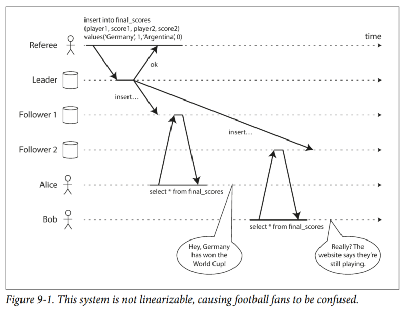
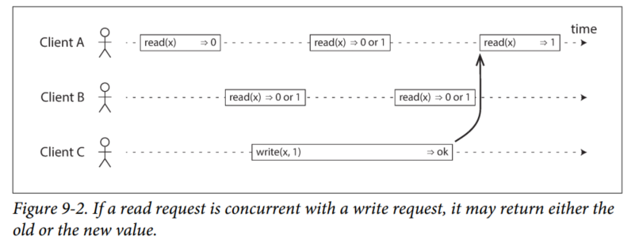
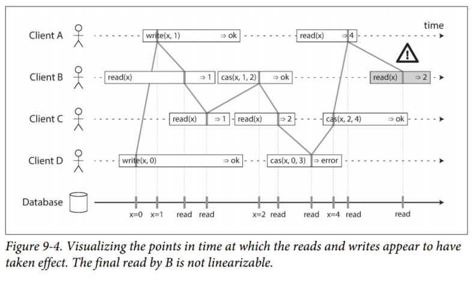
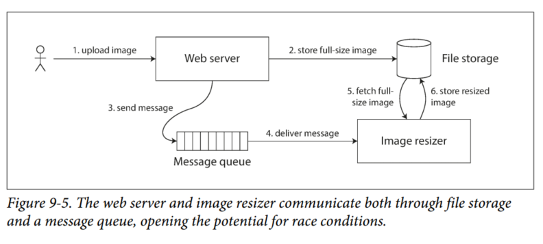
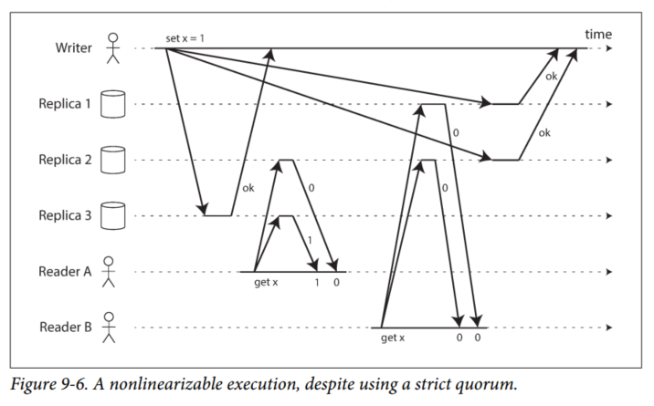
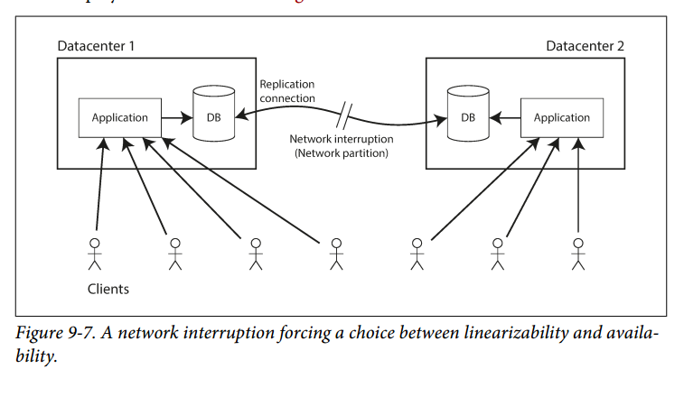
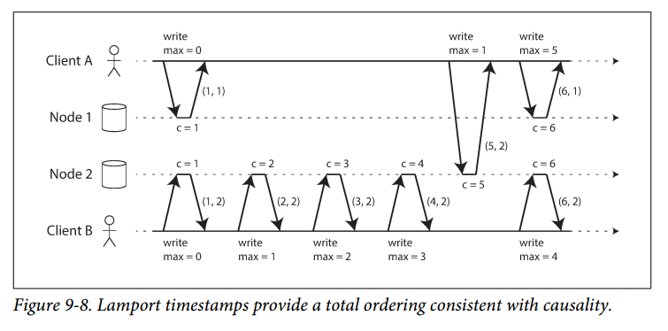
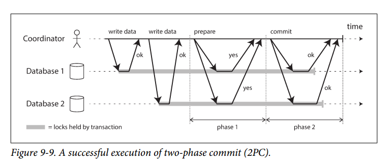
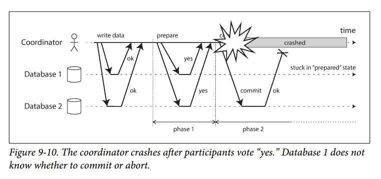

# Chapter 9 - Consistency and Consensus
In this chapter, we will talk about some examples of algorithms and protocols for building fault-tolerant distributed systems.

The best way of building fault-tolerant systems is to find some general-purpose abstractions with useful guarantees, implement them once, and then let applications rely on those guarantees.
This is the same approach as we used with transactions in Chapter 7.

We need to understand the scope of what can and cannot be done. The limits of what is and isn’t possible have been explored in depth, both in theoretical proofs and in practical implementations. We will get an overview of those fundamental limits in this chapter.

## Consistency Guarantees
In "Problems with Replication Lag" (Chapter 5), we looked at some timing issues that occur in a replicated database. Most replicated databases provide at least *eventual consistency*, which means that if you stop writing to the database and wait for some unspecified length of time, eventually all read requests will return the same value.

However, this is a very weak guarantee as we don't know *when* the replicas will converge. Until the time of convergence, reads could return anything or nothing. Eventual consistency is hard for application developers because it is so different from the behavior of variables in a normal single-threaded program.

When working with a database that provides only weak guarantees, you need to be constantly aware of its limitations and not accidentally assume too much. In this chapter we will explore stronger consistency models that data systems may choose to provide. Systems with stronger guarantees may have worse performance or be less fault-tolerant, however. Nevertheless, stronger guarantees may appeal more because they are easier to use correctly.

There is some similarity between distributed consistency models and the hierarchy of transaction isolation levels we discussed previously. While there is some overlap, they are mostly independent concerns: transaction isolation is primarily about avoiding race conditions due to concurrency executing transactions, whereas distributed consistency is mostly about coordinating the state of replicas in the face of delays and faults.

- We will start by looking at one of the strongest consistency models in common use, *linearizability*.
- We'll then examine the issue of ordering events in a distributed system, particularly around causality and total ordering.
- We will then explore how to atomically commit a distributed transaction, which will finally lead us toward solutions for the consensus problem.

## Linearizability
In an eventually consistent database, you might get two different data from two different replicas. Wouldn't it be a lot simpler if the database could give the illusion that there is one replica (one copy of the data)? Then every client would have the same view of the data.

This is the idea behind *linearizability* (a.k.a. *atomic consistency*, *strong consistency*, *immediate consistency*, or *external consistency*). The basic idea is to make a system appear as if there were only one copy of the data. In a linearizable system, as soon as one client successfully completes a write, all clients reading from the database must be able to see the value ust written. Maintaining the illusion of a single copy of the data means guaranteeing that the value read is the most recent, up-to-date value, and doesn’t come from a stale cache or replica. Linearizability is a *recency guarantee*.

Here is an example of a system that is not linearizable:

Alice and Bob are sitting in the same room, both checking their phones to see the outcome of the 2014 FIFA World Cup final. Just after the final score is announced, Alice refreshes the page, sees the winner announced, and excitedly tells Bob about it. Bob incredulously hits reload on his own phone, but his request goes to a database replica that is lagging, and so his phone shows that the game is still ongoing.

### What Makes a System Linearizable ?
The idea behind linearizability is to make a system appear as if there is only a single copy of the data.

The figure below shows 3 clients concurrently reading and writing the same key *x* in a linearizable database. In the distributed systems literature, *x* is called a *register* - in practice, it could be one key in a key-value store, one row in a relational database, or one document in a document database, for example.

Each bar is a request made by a client, where the start of a bar is the time when the request was sent, and the end of a bar is when the response was received by the client. Due to variable network delays, a client doesn't know exactly when the database processed its request - it only knows that it must have happened sometime between the client sending the request and receiving the response.

In Figure 9-2, the value of x is initially 0, and client C performs a write request to set it to 1. While this is happening, clients A and B are repeatedly polling the database to
read the latest value. What are the possible responses that A and B might get for their read requests?

- The first read operation by client A completes before the write begins, so it must definitely return the old value 0.
- The last read by client A begins after the write has completed, so it must definitely return the new value 1 if the database is linearizable: we know that the write must have been processed sometime between the start and end of the write operation, and the read must have been processed sometime between the start and end of the read operation. If the read started after the write ended, then the read must have been processed after the write, and therefore it must see the new value that was written.
- Any read operations that overlap in time with the write operation might return either 0 or 1, because we don’t know whether or not the write has taken effect at the time when the read operation is processed. These operations are concurrent with the write.

However, that is not yet sufficient to fully describe linearizability: if reads that are concurrent with a write can return either the old or the new value, then readers could see a value flip back and forth between the old and the new value several times while a write is going on. That is not what we expect of a system that emulates a “single copy of the data.

To make the system linearizable, we need to add another constraint: "After any one read has returned the new value, all following reads must also return the new value"

We can further refine this timing diagram to visualize each operation taking effect atomically at some point in time. A more complex example is shown in Figure 9-4.

In Figure 9-4 we add a third type of operation:
`cas(x, vold, vnew) ⇒ r` means the client requested an atomic compare-and-set operation (see “Compare-and-set” on page 245). If the current value of the register x equals vold, it should be atomically set to vnew. If x ≠ vold then the operation should leave the register unchanged and return an error. r is the database’s response (ok or error).

Each operation in Figure 9-4 is marked with a vertical line at the time when we think the operation was executed. Those markers are joined up in a sequential order, and the result must be a valid sequence of reads and writes for a register.

The requirement of linearizability is that the lines joining up the operation markers always move forward in time. This ensures the recency guarantee we discussed earlier.

A few interesting details in Figure 9-4:
1. First client B sent a request to read x, then client D sent a request to set x to 0, and then client A sent a request to set x to 1. Nevertheless, the value returned to B’s read is 1 (the value written by A). This is okay: it means that the database first processed D’s write, then A’s write, and finally B’s read. Although this is not the order in which the requests were sent, it’s an acceptable order, because the three requests are concurrent. Perhaps B’s read request was slightly delayed in the network, so it only reached the database after the two writes.

2. Client B’s read returned 1 before client A received its response from the database, saying that the write of the value 1 was successful. This is also okay: it doesn’t mean the value was read before it was written, it just means the ok response from the database to client A was slightly delayed in the network.

3. This model doesn’t assume any transaction isolation: another client may change a value at any time. For example, C first reads 1 and then reads 2, because the value was changed by B between the two reads. An atomic compare-and-set (cas) operation can be used to check the value hasn’t been concurrently changed by another client: B and C’s cas requests succeed, but D’s cas request fails (by the time the database processes it, the value of x is no longer 0).

4. The final read by client B (in a shaded bar) is not linearizable. The operation is concurrent with C’s cas write, which updates x from 2 to 4. In the absence of other requests, it would be okay for B’s read to return 2. However, client A has already read the new value 4 before B’s read started, so B is not allowed to read an older value than A. Again, it’s the same situation as with Alice and Bob in Figure 9-1.

It is possible (but computationally expensive) to test whether a system's behavior is linearizable by recording the timings of all requests and responses and checking whether they can be arranged into a valid sequential order.

#### Linearizability vs Serializability
**Serializability** is an isolation property of *transactions*. It guarantees that transactions behave the same as if they had executed in *some* serial order.

**Linearizability** is a recency guarantee on reads and writes of a register (an individual object). It doesn't group operations together into transactions, so it does not prevent problems such as write skew, unless you take additional measures such as materializing conflicts.

A database may provide both Serializability and Linearizability, and this combination is known as *strict serializability* or *strong one-copy serializability*.

### Relying on Linearizability
#### Locking and leader election
A system that uses single-leader replication needs to ensure that there is indeed only one leader, not several (split-brain). One way of electing a leader is to use a lock: every node that starts up tries to acquire the lock, and the node the succeeds becomes the leader. All nodes must agree which node owns the lock (linearizable).

Coordination services like Apache ZooKeeper and etcd are often used to implement distributed locks and leader election. They use consensus algorithms to implement linearizable operations in a fault-tolerant way.

#### Constraints and uniqueness guarantees
Uniqueness constraints are common in databases (like a primary key). If you want to enforce this constraint as the data is written, you need linearizability. This situation is actually similar to a lock: when a user registers for your service, they "acquire a lock" on their chosen username. The operation is also similar to an atomic compare-and-set, setting the username to the ID of the user who claimed it, provided that the username is available. This require that there is a single up-to-date value that all nodes agree on.

Other constraints such as foreign key or attribute constraints can be implemented without requiring linearizability.

#### Cross-channel timing dependencies
In Figure 9-1, if Alice didn't exclaim the score, Bob wouldn't have known that his query result was stale. The linearizability violation was only noticed because there was an additional communication channel in the system (Alive -> Bob).

Below is another example (Figure 9-5), say you have a website where users can upload a photo, and a background process resizes the photos to lower resolution for faster download (thumbnails):

If the file storage service is linearizable, then this system should work fine. Otherwise, there is a risk of a race condition: The message queue (Steps 3 and 4) might be faster than the internal replication inside the storage service. In this case, when the resizer fetches the image (step 5), it might see an old version of the image, or nothing at all. If it processes and old version of the image, the full-size and resized images in the file storage become inconsistent.

This problem arises because there are two different communication channels between the web server and the resizer: the file storage and the message queue. Without he recency guarantee of linearizability, race conditions between these two channels are possible.

Linearizability is not the only way of avoiding this race condition, but it's the simplest to understand. If you control the additional communication channel, you can use alternative approaches similar to what we discussed in "Reading Your Own Writes" (Chapter 5) at the cost of additional complexity.

### Implementing Linearizable Systems

The most common approach to making a system fault-tolerant is to use replication.
1. Single leader replication (potentially linearizable)  
  In a system with single-leader replication, the leader has the primary copy of the data that is used for writes, and the followers maintain backup copies of the data on other nodes. If you make reads from the leader or from synchronously updated followers, they have the potential to be linearizable. However, not every single-leader database is actually linearizable, either by design (because it uses snapshot isolation) or due to concurrency bugs.

  It is also possible for a node to incorrectly assumes that it is the leader. If the delusional leader continues to serve requests, it will violate linearizability, and with asynchronous replication, failover may even lose committed writes, which violates both durability and linearizability.

2. Consensus algorithms (linearizable)
  Some consensus algorithms (discussed later) bear a resemblance to single-leader replication. However, consensus protocols contain measures to prevent split brain and stale replicas, and hence consensus algorithms can implement linearizable storage safely. This is how ZooKeeper and etcd work.

3. Multi-leader replication (not linearizable)
  Systems with multi-leader replication are generally not linearizable because they concurrently process writes on multiple nodes and asynchronously replicate them to other nodes. For this reason, they can product conflicting writes that require resolution.

4. Leaderless replication (probably not linearizable)
  For systems with leaderless replication, people sometimes claim that you can obtain "strong consistency" by requiring quorum reads and writes (w + r > n). However, this depends largely on your configuration of the quorums and how you define strong consistency, so this is not 100% true.

  "Last write wins" conflict resolution methods based on time-of-day clocks (e.g. in Cassandra) are almost certainly nonlinearizable, because clock timestamps cannot be guaranteed to be consistent with actual event ordering due to clock skew.

#### Linearizability and quorums
Intuitively, strict quorum reads and writes should be linearizable in a Dynamo-style model. However, when we have variable network delays, it is possible to have race conditions, as shown below:

In Figure 9-6, the initial value of x is 0, and a writer client is updating x to 1 by sending the write to all three replicas (n = 3, w = 3). Concurrently, client A reads from a quorum of two nodes (r = 2) and sees the new value 1 on one of the nodes. Also concurrently with the write, client B reads from a different quorum of two nodes, and gets back the old value 0 from both.

The quorum condition is met (w + r > n), but this execution is nevertheless not linearizable: B’s request begins after A’s request completes, but B returns the old value while A returns the new value.

It is possible to make Dynamo-style quorums linearizable at the cost of reduced performance: a reader must perform read repair synchronously before returning results to the application, and a writer must read the latest state of a quorum of nodes before sending its writes.

Riak does not perform synchronous read repair due to performance penalty. Cassandra *does* wait for read repair to complete on quorum reads, but it loses linearizability if there are multiple concurrent writes to the same key, due to its use of last-write-wins conflict resolution.

Only linearizable read and write operations can be implemented in this way. A linearizable compare-and-set operation cannot, because it requires a consensus algorithm.

### The Cost of Linearizability
As discussed in Chapter 5, multi-leader replication is often a good choice for multi-datacenter replication. Below is an example of such a deployment:

Imagine a network interruption between the two datacenters. Assume that clients can reach the datacenters, but the datacenters cannot connect to each other.

With a multi-leader database, each datacenter can continue operating normally: since writes from one datacenter are asynchronously replicated to the other, the writes are simply queued up and exchanged when the network connectivity is back up.

On the other hand, if single-leader replication is used, then the leader must be in one of the datacenters. Any writes and any linearizable reads must be sent to the leader. Thus, for any clients connected to a follower datacenter, those read and write requests must be sent synchronously over the network to the leader datacenter.

If the network between datacenters is interrupted in a single-leader setup, clients connected to follower datacenters cannot contact the leader, so they cannot make any writes to the database, nor any linearizable reads.

They can still make reads from the follower, but they might be stale (nonlinearizable). If the application requires linearizable reads and writes, the network interruption causes the application to become unavailable in the datacenters that cannot contact the leader.

If clients can connect directly to the leader datacenter, this is not a problem, since the application continues to work normally there. But clients that can only reach a follower datacenter will experience an outage until the network link is repaired.

#### The CAP Theorem
This issue is not just a consequence of a single-leader and multi-leader replication: any linearizable database has this problem. The issue also isn't specific to multi-datacenter deployments, but can occur on any unreliable network, even within one datacenter. The trade-off is as follows:

- If your application *requires* linearizability, and some replicas are **disconnected** from other replicas (due to a network problem), then some replicas cannot process requests (become unavailable) while they are disconnected.

- If your application *does not* require linearizability, then it can be written in a way that each replica can process requests independently, even if it is disconnected from other replicas (e.g. multi-leader). The application can remain available in the face of a network problem, but its behaviour is **not linearizable**.

Thus, applications that don't require linearizability can be more tolerant of network problems. This insight is popularly known as the *CAP Theorem* (Consistency, Availability, Partition tolerance: pick 2 out of 3).

The CAP theorem only considers one consistency model (linearizability) and one kind of fault (network problems). It doesn't say anything about network delays, dead nodes, or other trade-offs. Thus, it has little practical value for designing systems.

#### Linearizability and network delays
Although linearizability is a useful guarantee, surprisingly few systems are actually linearizable in practice. Many distributed databases choose not to provide linearizability guarantees to increase performance. Linearizability is slow.

Can’t we maybe find a more efficient implementation of linearizable storage? It seems the answer is no: Attiya and Welch [47] prove that if you want linearizability, the response time of read and write requests is at least proportional to the uncertainty of delays in the network.

## Ordering Guarantees
We said previously that a linearizable register behaves as if there is only a single copy of the data, and that every operation appears to take effect atomically at one point in time. This definition implies that operations are executed in some well-defined order.

There are deep connections between ordering, linearizability and consensus.

### Ordering and Causality
Ordering preserves causality. Causality imposes an ordering on events: cause comes before effect. If a system obeys the ordering imposed by causality, we say that it is *causally consistent*.

#### The causal order is not a total order
A *total order* allows any two elements to be compared, and you can always say which one is greater and which one is smaller. A *partial order* is when in some cases one set is greater than other, but in other cases they are incomparable.

The difference between these two orders is reflected in different database consistency models:

1. Linearizability  
In a linearizable system, we have a *total order* of operations: if the system behaves as if there is a single copy of data, and every operation is atomic, this means that for any two operations we can always say which one happened first.

2. Causality  
We said that two operations are concurrent if neither happened before the other, i.e. they are incomparable. Causality defines a *partial order*, not a total order: some operations are ordered with respect to each other, but some are incomparable.  

Therefore, according to this definition, there are no concurrent operations in a linearizable datastore: there must be a single timeline along which all operations are totally ordered. There might be several requests waiting to be handled, but the datastore ensures that every request is handled atomically at a single point in time, acting on a single copy of the data, along a single timeline, without any concurrency.

#### Linearizability is stronger than causal consistency
Linearizability implies causality: any system that is linearizable will preserve causality correctly. Linearizability ensures that causality is automatically preserved without the system having to do anything special (like passing around timestamps between different components).

However, we did mention that making a system linearizable can harm its performance and availability. Fortunately, a middle ground is possible, since linearizability is not the only way of preserving causality. Causal consistency is the strongest possible consistency model that does not slow down due to network delays and remains available in the face of network failures.

However, this search is quite recent, so not much of it has yet made its way into production systems.

#### Capturing causal dependencies
To maintain causality, you need to know which operation *happened before* which operation.
This is a partial order: concurrent operations may be processed in any order, but the order must be the same in every replica.

To determine causal dependencies, we need some way of describing the "knowledge" of a node in the system. The techniques for determining which operation happened before which other operation are similar to what we discussed in "Detecting Concurrent Writes" (Chapter 5). That section discussed causality in a leaderless datastore, where we need to detect concurrent writes to the same key in order to prevent lost updates. Causal consistency goes further: it needs to track causal dependencies across the entire database, not just for a single key. Version vectors can be generalized to do this.

In order to determine the causal ordering, the database needs to know which version of the data was read by the application. This is why, in Figure 5-13, the version number from the prior operation is passed back to the database on a write. A similar idea appears in the conflict detection of SSI, as discussed in “Serializable Snapshot Isolation (SSI)” on page 261: when a transaction wants to commit, the database checks whether the version of the data that it read is still up to date. To this end, the database keeps track of which data has been read by which transaction.

### Sequence Number Ordering
In many applications, clients read lots of data before writing something, and then it is not clear whether the write is causally dependent on all or only some of those prior reads. Explicitly tracking all the data that has been read would mean a large overhead.

There is a better way: we can use *sequence numbers* or *timestamps* to order events. It need not come from a time-of-day clock, but instead from a *logical clock*, which is an algorithm to generate a sequence of numbers to identify operations, typically using incremental counters.

Such sequence numbers are compact and they provide a *total order*. In particular, we can create sequence numbers in a total order that is *consistent with causality*.

In a database with single-leader replication, the replication log defines a total order of write operations that is consistent with causality. The leader can simply increment a counter for each operation. If a follower applies the writes in the order they appear in the replication log, the state of the follower will always be causally consistent.

#### Non-causal sequence number generators
If there is not a single leader, it is less clear how to generate sequence numbers for operations. There are various methods:

- Each node can generate its own independent set of sequence numbers. For example, one node generates even numbers and the other odd numbers.
- You can attach a timestamp from a time-of-day clock (physical clock) to each operation. Although such timestamps are not sequential, but if they have sufficiently high resolution, they might be sufficient.
- You can pre-allocate block of sequence numbers.

These options all perform better and are more scalable than pushing all operations through a single leader that increments a counter. The causality problems occur because these sequence number generators do not correctly capture the ordering of operations across different nodes.

- Each node may process a different number of operations per second. Thus, if one node generates even numbers and the other generates odd numbers, the counter for even numbers may lag behind the counter for odd numbers, or vice versa. If you have an odd-numbered operation and an even-numbered operation, you cannot accurately tell which one causally happened first.
- Timestamps from physical clocks are subject to clock skew, which can make them inconsistent with causality.
- In the case of the block allocator, one operation may be given a sequence number in the range from 1,001 to 2,000, and a causally later operation may be given a number in the range from 1 to 1,000. Here, again, the sequence number is inconsistent with causality.

#### Lamport timestamps
Although the three sequence number generators just described are inconsistent with causality, there is a method for generating sequence numbers that *is* consistent with causality.

The use of Lamport timestamps is illustrated below.

Each node has a unique identifier, and each node keeps a counter of the number of operations it has processed. The Lamport timestamp is a pair of (counter, node ID). Two nodes may sometimes have the same counter value, but by including the node ID in the timestamp, each timestamp is made unique.

Lamport timestamp provides total ordering: if you have two timestamps, the one with a greater counter value is the greater timestamp; if the counter values are the same, the one with the greater node ID is the greater timestamp.

The key idea about Lamport timestamps, which makes them consistent with causality, is the following: every node and every client keeps track of the maximum counter value it has seen so far, and includes that maximum on every request. When a node receives a request or response with a maximum counter value greater than its own counter value, it immediately increases its own counter to that maximum.

This is shown in Figure 9-8, where client A receives a counter value of 5 from node 2, and then sends that maximum of 5 to node 1. At that time, node 1’s counter was only 1, but it was immediately moved forward to 5, so the next operation had an incremented counter value of 6.

As long as the maximum counter value is carried along with every operation, this scheme ensures that the ordering from the Lamport timestamps is consistent with causality, because every causal dependency results in an increased timestamp.

#### Timestamp ordering is not sufficient
Although Lamport timestamps define a total order of operations that is consistent with causality, they are not sufficient to solve many common problems in distributed systems.

This approach is not sufficient when a node has just received a request and has to decide *right now* whether the request should succeed or fail. At that moment, the node does not know whether another node is concurrently in the process of creating an account with the same username, and what timestamp that other node may assign to the operation.

To conclude: in order to implement something like a uniqueness constraint for usernames, it’s not sufficient to have a total ordering of operations — you also need to know when that order is finalized.

### Total Order Broadcast
Total Order Broadcast is usually described as a protocol for exchanging messages between nodes. Informally, it requires that two safety properties always be satisfied:
1. Reliable delivery  
No messages are lost: if a message is delivered to one node, it is delivered to all nodes.

2. Totally ordered delivery  
Messages are delivered to every node in the same order.

A correct algorithm for total order broadcast must ensure that the reliability and ordering properties are always satisfied, even if a node or the network is faulty.

#### Using Total Order Broadcast
Consensus services such as ZooKeeper and etcd actually implement total order broadcast.

Total order broadcast is exactly what you need for database replication: if every message represents a write to the database, and every replica processes the same writes in the same order, then the replicas will remain consistent with each other.

Total order broadcast can be used to implement serializable transactions: if every message represents a deterministic transaction to be executed as a stored procedure, and if every node processes those messages in the same order, then the partitions and replicas of the database are kept consistent with each other.

## Distributed Transactions and Consensus
Consensus is simply to get several nodes to agree on something. There are a number of situations in which it is important for nodes to agree, such as leader election and atomic commit (either they all abort or commit a particular transaction).

### Atomic Commit and Two-Phase Commit (2PC)
Atomicity prevents failed transactions from littering the database with half-finished results and half-updated state. This is especially important for multi-object transactions and databases that maintain secondary indexes. Each secondary index is a separate data structure from the primary data - thus, if you modify some data, the corresponding change needs to also be made in the secondary index. Atomicity ensures that the secondary index stays consistent with the primary data.

#### From single-node to distributed atomic commit
In a single database node, atomicity is commonly implemented by the storage engine. Transaction commitment crucially depends on the *order* in which data is durably written to disk: first the data, then the commit record.

But what about multiple nodes? Perhaps you have a multi-object transaction in a partitioned database, or a term-partitioned secondary index. Most "NoSQL" distributed datastores do not support such distributed transactions, but various clustered relational systems do.

In these cases, it is not sufficient to simply send a commit request to all of the nodes and independently commit the transaction on each one. In doing so, it could easily happen that the commit succeeds on some nodes and fails on others, which would violate the atomicity guarantee.

In this case, the nodes become inconsistent with each other, and once a transaction has been committed, it becomes visible to other transactions, and thus other clients may start relying on that data. This principle forms the basis of *read committed* isolation.

#### Introduction to two-phase commit
Two-phase commit is an algorithm for achieving atomic transaction commit across multiple nodes. 2PC is used internally in some databases and also made available to applications in the form of *XA transactions* or via WS-AtomicTransaction for SOAP web services.

The basic flow of 2PC is illustrated below. Instead of a single commit request, the commit/abort process in 2PC is split into 2 phases.

**2PC and 2PL**  
2PC provides atomic commit in a distributed database, whereas 2PL provides serializable isolation.

2PC uses a new component that does not normally appear in single-node transactions: a *coordinator* (aka a *transaction manager*). The coordinator is often implemented as a library within the same application process that is requesting the transaction (e.g., embedded in a Java EE container), but it can also be a separate process or service. Examples of such coordinators include Narayana, JOTM, BTM, or MSDTC.

a 2PC transaction begins with the application reading and writing data on multiple database nodes (known as *participants*). When the application is ready to commit, the coordinator begins phase 1: it sends a *prepare* request to each of the nodes, asking them whether they are able to commit.

- If all participants reply "yes", then the coordinator sends out a *commit* request in phase 2.
- Else, the coordinator sends an *abort* request to all nodes in phase 2.

#### A system of promises
Surely the prepare and commit requests can just as easily be lost in the 2PC. What makes it different? Let's break down the process in more details:

1. When the application wants to begin a distributed transaction, it requests a globally unique transaction ID from the coordinator.

2. The application begins a single-node transaction on each of the participants and attaches the transaction ID to the single-node transaction. If anything goes wrong at this stage, the coordinator or any of the participants can abort.

3. When the application is ready to commit, the coordinator sends a *prepare* request to all participants, tagged with the global transaction ID.

4. When a participant receives the prepare request, it makes sure that it can definitely commit the transaction under all circumstances. By replying “yes” to the coordinator, the node promises to commit the transaction without error if requested.

5. When the coordinator has received the responses, it makes a decision on whether to commit or abort. This decision is written to its transaction log on disk so that it knows which way it decided in case it crashes. This is called the *commit point*.

6. After that, the commit or abort request is sent to all participants. If this request fails/times out, the coordinator must retry forever until it succeeds.

Thus, the protocol contains two crucial “points of no return”: when a participant votes “yes,” it promises that it will definitely be able to commit later (although the coordinator may still choose to abort); and once the coordinator decides, that decision is irrevocable. Those promises ensure the atomicity of 2PC.

#### Coordinator failure
If the coordinator fails before sending the *prepare* requests, a participant can safely abort the transaction. But once the participant has received a *prepare* request and voted "yes", it must wait to hear back from the coordinator for the *commit* or *abort* request.  If the coordinator crashes or the network fails at this point, the participant can do nothing but wait.

#### Three-phase commit
2PC is called a *blocking* atomic commit protocol because 2PC can become stuck waiting for the coordinator to recover. It is possible to make an atomic commit protocol *non-blocking*.

3PC assumes a network with bounded delay and nodes with bounded response times. In practical systems with unbounded network delay and process pauses, it cannot guarantee atomicity. This is why 2PC continues to be used instead of a 3PC.

### Distributed Transactions in Practice
Many cloud services choose not to implement distributed transactions due to the operational problems they engender (killing performance and over-promising and under-delivering). Some implementations of distributed transactions carry a heavy performance penalty. Much of the performance cost inherent in 2PC is due to additional disk forcing (fsync) that is required for crash recovery, and additional network round-trips.

There are two types of distributed transactions:

1. Database-internal distributed transactions  
Some distributed databases support internal transactions among the nodes of that database. For example, VoltDB and MySQL Cluster's NDB. In this case, all the nodes participating in the transaction are running the same database software.

2. Heterogeneous distributed transactions  
In this case, the participants are 2 or more different technologies. A distributed transaction across these systems must ensure atomic commit.

Database-internal transactions do not have to be compatible with any other system. For this reason, they can often work quite well.

#### Exactly-once message processing
Heterogeneous distributed transactions allow diverse systems to be integrated in powerful ways. For example, a message from a message queue can be acknowledged as processed if and only if the database transaction for processing the message was successfully committed. This is implemented by atomically committing the message acknowledgment and the database writes in a single transaction. With distributed transaction support, this is possible, even if the message broker and the database are two unrelated technologies running on different machines.

If either the message delivery or the database transaction fails, both are aborted, and so the message broker may safely redeliver the message later. Thus, by atomically committing the message and the side effects of its processing, we can ensure that the message is effectively processed exactly once, even if it required a few retries before it succeeded.

#### XA transactions  
*X/Open XA* (eXtended Architecture) is a standard for implementing 2PC across heterogeneous technologies. XA is not a network protocol - it is a C API for interfacing with a transaction coordinator. Bindings for this API exist in other languages; for example, in the world of Java EE applications, XA transactions are implemented using the Java Transaction API (JTA), which in turn is supported by many drivers for databases using Java Database Connectivity (JDBC) and drivers for message brokers using the Java Message Service (JMS) APIs.

XA assumes that your application uses a network driver or client library to communicate with the participant databases or messaging services. The driver also exposes callbacks through which the coordinator can ask the participant to prepare, commit, or abort.

The transaction coordinator implements the XA API. The standard does not specify how it should be implemented, but in practice the coordinator is often simply a library that is loaded into the same process as the application issuing the transaction (not a separate service). It keeps track of the participants in a transaction, collects partipants’ responses after asking them to prepare (via a callback into the driver), and uses a log on the local disk to keep track of the commit/abort decision for each transaction.

If the application process crashes, or the machine on which the application is running dies, the coordinator goes with it. Any participants with prepared but uncommitted transactions are then stuck in doubt.

#### Holding locks while in doubt
As previously discussed, database transactions usually take a row-level exclusive lock on any rows they modify. In addition, a database using 2PL also would have to take a shared lock on any rows read by the transaction.

The database cannot release those locks until the transaction commits or aborts. Therefore, when using 2PC, a transaction must hold onto the locks throughout the time it is in doubt. In the meantime, no other transaction can modify those rows. This can cause large parts of your application to become unavailable until the in-doubt transaction is resolved.

#### Recovering from coordination failure
Transactions that cannot be recovered from the transaction log will sit forever in the database, holding locks and blocking other transactions. The only way out is for an admin to manually decide whether to commit or roll back the transactions, which is a lot of manual effort.

Many XA implementations have an emergency escape hatch called *heuristic decisions*, allowing a participant to unilaterally decide to abort/commit an in-doubt transaction without a definitive decision from the coordinator. To be clear, *heuristic* here is a euphemism for *probably breaking atomicity*, since it violates the system of promises in 2PC.

#### Limitations of distributed transactions
XA transactions solve the real and important problem of keeping several participant data systems consistent with each other, but as have seen, they also introduce major operational problems. We realize that the transaction coordinator itself is a kind of database and so it needs to be approached with the same care as any other database:

- If the coordinator runs only on a single machine, it is a single point of failure for the entire system.

- Many server-side applications are developed in a stateless model (as favored by HTTP), with all persistent state stored in a database, which has the advantage that application servers can be added and removed at will. However, when the coordinator is part of the application server, it changes the nature of the deployment. The coordinator's logs become a crucial part of the durable system state. Such application servers are no longer stateless.

- Since XA needs to be compatible with a wide range of data systems, it is necessarily a lowest common denominator. For example, it cannot detec deadlocks across different systems, and it does not work with SSI (Serializable Snapshot Isolation) since that would require a protocol for identifying conflicts across different systems.

- For database-internal distributed transactions (not XA), the limitations are not so strict - for example, a distributed version of SSI is possible.

### Fault-Tolerant Consensus
The consensus problem is normally formalized as follows: one or more nodes may *propose* values, and the consensus algorithm *decides* on one of those values.

A consensus algorithm must satisfy the following properties:
1. Uniform agreement  
No two nodes decide differently

2. Integrity  
No node decides twice

3. Validity  
If a node decides value *v*, then *v* was proposed by some node

4. Termination  
Every node that does not crash eventually decides on some value

The termination property formalizes the idea of fault tolerance. It essentially says that a consensus algorithm must reach a decision. (Termination is a liveness property, and the other 3 are safety properties (Chapter 8)).

The system model of consensus assumes that when a node "crashes", it never comes back. In this system model, any algorithm that has to wait for a node to recover is not going to satisfy the termination property. In particular, 2PC does not meet the requirements for termination.

Any consensus algorithm requires at least a majority of nodes to be functioning correctly to assure termination. That majority can safely form a quorum.

Most consensus algorithms assume that there are no Byzantine faults.

#### Consensus algorithms and total order broadcast
The best-known fault-tolerant consensus algorithms are Viewstamped Replication (VSR), Paxos, Raft, and Zab. Most of these algorithms decide on a *sequence* of values, which makes them *total order broadcast* algorithms.

Remember that total order broadcast requires messages to be delivered exactly once, in the same order, to all nodes. If you think about it, this is equivalent to performing several rounds of consensus: in each round, nodes propose the message that they want to send next, and then decide on the next message to be delivered in the total order.

So, total order broadcast is equivalent to repeated rounds of consensus (each consensus decision corresponding to one message delivery):
- Due to the agreement property of consensus, all nodes decide to deliver the same messages in the same order.
- Due to integrity property, messages are not duplicated.
- Due to the Validity property, messages are not corrupted and not fabricated out of thin air.
- Due to the termination property, messages are not lost.

#### Single-leader replication and consensus
In Chapter 5 we discussed single-leader replication. Isn't this essentially total order broadcast?

The answer comes down to how the leader is chosen. If the leader is manually chosen, you essentially have a consensus algorithm of the dictatorial variety: only one node is allowed to accept writes, and if that node goes down, the system becomes unavailable for writes until the operators manually configure a different node to be the leader.

Such system can work in practice, but it does not satisfy the termination property of consensus because it requires human intervention to make progress. Some databases perform automatic leader election and failover, which brings us closer to fault-tolerant total order broadcast.

However, we need consensus to elect a leader, but if the consensus algorithms described here are actually total order broadcast algorithms, and total order broadcast is like single-leader replication, and single-leader replication requires a leader, then... To elect a leader, we need a leader.

#### Epoch numbering and quorums
All of the consensus protocols discussed so far internally use a leader in some form, but they don't guarantee that the leader is unique. Instead, they can make a weaker guarantee: the protocols define an *epoch number* (called the ballot number in Paxos, view number in VSR, and term number in Raft) and guarantee that within each epoch, the leader is unique.

Every time the current leader is thought to be dead, a vote is started among the nodes to elect a new leader. This election is given an incremented epoch number, and thus epoch numbers are totally ordered and monotonically increasing.

Before a leader is allowed to decide anything, it must first check that there isn't some other leader with a higher epoch number which might take a conflicting decision. A node cannot necessarily trust its own judgment, even when it thinks that itself is the leader (because this might not be true).

Instead, it must collect votes from a *quorum* of nodes. For every decision that a leader wants to make, it must send the proposed value to the other nodes and wait for a quorum of nodes to respond in favor of the proposal.

Thus, we have 2 rounds of voting: once to choose a leader, and a second time to vote on a leader's proposal. The key insight is that the quorums for those two votes must overlap: if a vote on a proposal succeeds, at least one of the nodes that voted for it must have also participated in the most recent leader election.

Thus, if the vote on a proposal does not reveal any higher-numbered epoch, the current leader can conclude that no leader election with a higher epoch number has happened, and therefore be sure that it still holds the leadership. It can then safely decide the proposed value.

There are some differences between this and a 2PC. In 2PC, the coordinator is not elected. 2PC requires a "yes" from *every* participant, whereas fault-tolerant consensus algorithms only require votes from *majority* of nodes. Moreover, consensus algorithms define a recovery process by which nodes can get into a consistent state after a new leader is elected, ensuring that the safety properties are always met.

#### Limitations of consensus
The process by which nodes vote on proposals before they are decided is a kind of synchronous replication. Consensus systems always require a strict majority to operate. This means you need a minimum of 3 nodes to tolerate 1 failure, or 5 nodes to tolerate 2 failures.

Most consensus algorithms assume a fixed set of nodes to participate in voting, which means you can't just add or remove nodes in the cluster.

Consensus systems generally rely on timeouts to detect failed nodes. In environments with highly variable network delays, it often happens that a node falsely believes the leader to have failed due to a transient network issue. Frequent leader elections result in terrible performance because the system can end up spending more time choosing a leader than doing any useful work.

### Membership and Coordination Services
ZooKeeper and etcd are designed to hold small amounts of data that can fit entirely in memory, so you wouldn't want to store all of your application's data here. That data is replicated across all the nodes using a fault-tolerant total order broadcast algorithm.

ZooKeeper is modeled after Google's Chubby lock service, implementing not only total order broadcast (and hence consensus), but also an interesting set of other features:

1. Linearizable atomic operations  
Using an atomic compare-and-set operation, you can implement a lock: if several nodes concurrently try to perform the same operation, only one of them will succeed.  
The consensus protocol guarantees that the operation will be atomic and linearizable. A distributed lock is usually implemented as a lease, which has expiry time.

2. Total ordering of operations  
When some resource is protected by a lock or lease, you need a fencing token to prevent clients from conflicting with each other in the case of a process pause. ZooKeeper provides this by totally ordering all operations and giving each operation a monotonically increasing transaction ID (zxid) and version number (cversion).

3. Failure Detection  
Clients maintain a long-lived session on ZooKeeper servers, and the client and server periodically exchange heartbeats to check that the other node is still alive. The session remains active even when the connection is temporarily interrupted or a ZooKeeper node fails. Any locks held by a session can be configured to be automatically released when the session times out.

4. Change notifications  
Not only can one client read locks and values that were created by another client, but it can also watch them for changes. By subscribing to notifications, a client avoids having to frequently poll to find out about changes.

#### Allocating work to nodes
One example in which the ZooKeeper model works well is if you have several instances of a process or service, and one of them needs to be chosen as leader / primary.

Another example arises when you have some partitioned resource(database, message streams, file storage, distributed actor system, etc.) and need to decide which partition to assign to which node. As new nodes join the cluster, some of the partitions need to be moved from existing nodes to the new nodes to rebalance the load. Conversely, when nodes fail, other nodes need to take over the failed nodes' work.

These tasks can be achieved by judicious use of atomic operations, ephemeral nodes, and notifications in ZooKeeper. If done correctly, this approach allows the application to automatically recover from faults.

ZooKeeper runs on a fixed number of nodes and performs its majority votes among those nodes while supporting a potentially large number of clients. Normally, the kind of data managed by ZooKeeper is quite slow changing, which may change on a timescale of minutes or hours.

#### Service discovery
ZooKeeper, etcd, and Consul are also often used for *service discovery*, that is, to find out which IP address you need to connect to in order to reach a particular service. In cloud datacenter environments, where it is common for VMs to come and go, you often don't know the IP addresses of your services ahead of time. Instead, you can configure your services such that when they start up they register their network endpoints in a service registry.

DNS is the traditional way of looking up the IP address for a service name, and it uses multiple layers of caching. Reads from DNS are not linearizable and is usually not considered problematic if the results from a DNS query are a little stale. It is more important that DNS is reliably available and robust to network interruptions.

#### Membership services
ZooKeeper can be seen as part of a long history of research into *Membership services* and has been important for building highly reliable systems.

A membership service determines which nodes are currently active and live members of a cluster. Due to unbounded network delays, it's not possible to reliably detect whether another node has failed. However, if you couple failure detection with consensus, noeds can come to an agreement about which nodes should be considered alive or not.

## Summary
We examined the topics of consistency and consensus from several angles. We looked in depth at linearizability, a popular consistency model: its goal is to make replicated data appear as though there were only a single copy, and to make all operations act on it atomically. Although linearizability is appealing because it is easy to understand, it has the downside of being slow, especially in environments with large network delays.  

We also explored causality, which imposes an ordering on events in a system. Unlike linearizability, which puts all operations in a single, totally ordered timeline, causality provides us with a weaker consistency model: some things can be concurrent, so the version history is like a timeline with branching and merging. Causal consistency does not have the coordination overhead of linearizability and is much less sensitive to network problems.

However, even if we capture the causal ordering, we saw that some things cannot be implemented in this way. In the example of username registration, if one node is going to accept a registration, it needs to somehow know that another node isn't concurrently in the process of registering the same name. This problem led us toward *consensus*.

We saw that achieving consensus means deciding something in such a way that all nodes agree on what was decided, and such decision is irrevocable. It turns out that a wide range of problems are actually reducible to consensus and are equivalent to each other. Such equivalent problems include:

1. Linearizable compare-and-set registers  
The register needs to atomically *decide* whether to set its value, based on whether its current value equals the parameter given in the operation.

2. Atomic transaction commit  
A database must *decide* whether to commit or abort a distributed transaction.

3. Total order broadcast  
The messaging system must *decide* on the order in which to deliver the messages.

4. Locks and leases  
When several clients are racing to grab a lock or lease, the lock *decides* which one successfully acquired it.

5. Membership/coordination service  
Given a failure detector (e.g. timeouts), the system must *decide* which nodes are alive, and which should be considered dead because their sessions timed out.

6. Uniqueness constraint  
When several transactions concurrently try to create conflicting records with the same key, the constraint must decide which one to allow and which should fail with a constraint violation.

All of these are straightforward if you only have a single node. This is what happens in a single-leader database: all the power to make decisions is vested in the leader, which is why such databases are able to provide linearizable operations, uniqueness constraints, a totally ordered replication log, and more.

If that single leader fails, or if a network interruption makes the leader unreachable, such a system cannot make progress. There are 3 ways of handling that situation:

1. Wait for the leader to recover, and accept that the system will be blocked in the meantime. Many XA/JTA transaction coordinators choose this option. If the leader does not recover, the system can be blocked forever.

2. Manually fail over by getting humans to choose a new leader node and reconfigure the system to use it. 

## ---
