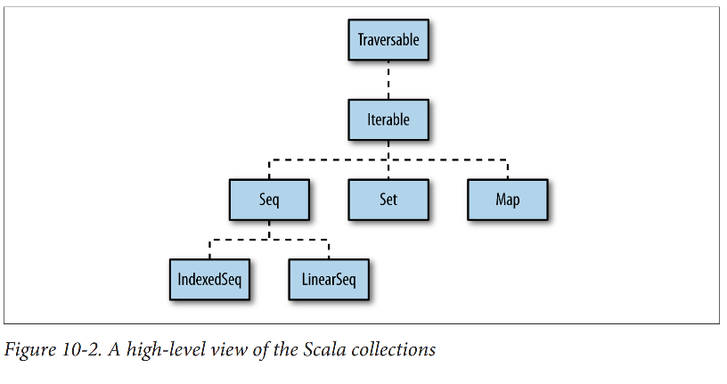

# Chapter 10 - Collections

A goal of this chapter is to help you through this plethora of options to find the solutions you need. Recipes will help you decide which collections to use in different situations, and also choose a method to solve a problem.

The methods that are common to all collections are shown in this chapter, and methods specific to collections like `List, Array, Map`, and `Set` are shown in Chapter 11.

There are a few important concepts to know when working with the methods of the Scala collection classes:
- What a predicate is
- What an anonymous function is (Recipe 9.1)
- Implied loops

A *predicate* is a method, function, or anonymous function that takes one or more parameters and **returns a Boolean value**. For instance, this is a predicate:
```
def isEven(i: Int) = if (i % 2 == 0) true else false
```

Anonymous function was described in depth in Recipe 9.1, but here is an example of the long form for an anonymous function:
```
(i: Int) => i % 2 == 0
```
Here's the short form:
```
_ % 2 == 0
```
You can combine it with the `filter` method on a collection, and it makes for a lot of power in just a bit of code:
```
scala> val list = List.range(1, 10)
list: List[Int] = List(1, 2, 3, 4, 5, 6, 7, 8, 9)

scala> val events = list.filter(_ % 2 == 0)
events: List[Int] = List(2, 4, 6, 8)
```
Lastly, *implied loops*. As you can see from the example above, the `filter` method contains a loop that applies your function to every element in the collection and returns a new collection.

Collection methods like `filter, foreach, map, reduceLeft`, and many more have loops built into their algorithms.

## 10.1 Understanding the Collections Hierarchy
Since Scala classes can inherit from traits, and well-designed traits are granular, a class hierarchy can look very complex.

At a high level, Scala's collection classes begin with the `Traversable` and `Iterable` traits, and extend into the three main categories of sequences (`Seq`), sets (`Set`) and maps (`Map`). Sequences further branch off into *indexed* and *linear* sequences, as shown below:


